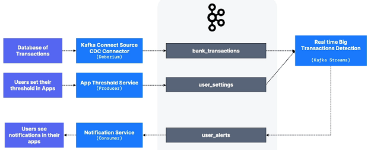
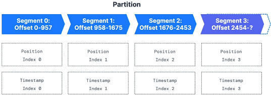
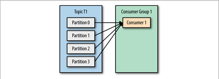
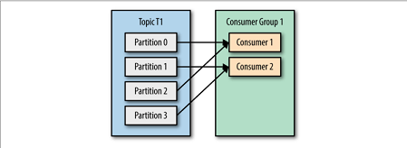
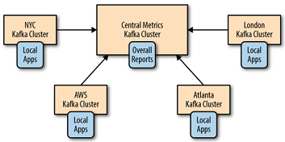

---
runme:
  id: 01HJ6TCRGK65SKDF92EWQ594T0
  version: v2.0
---

# Concepts

## Defaults

- By default, the producer does not care what partition a specific message is
   written to and will balance messages over all partitions of a topic evenly.

## Why Apache Kafka ?

- Created by LinkedIn, now Open-Source Project mainly maintained by Confluent,
   IBM, Cloudera
- Distributed, resilient architecture, fault tolerant
- Horizontal scalability:

   - Can scale to 100s of broker
   - Can scale to millions of messages per second

- High performance (latency of less than 10ms) - real time
- Used by the 2000+ firms, 80% of the Fortune 100

## Apache Kafka: Use Cases

- Messaging System
- Activity Tracking
- Gather metrics from many different locations
- Application Logs gathering
- Stream processing (with the Kafka Streams API for example)
- De-coupling of system dependencies
- Integration with Spark, Flink, Storm, Hadoop, and many other Big Data
   technologies
- Micro services pub/sub

## Real-life Examples

- **Netflix** used Kafka to apply recommendations in real-time while you're
   watching TV shows
- **Uber** uses Kafka to gather user, taxi and trip data in real-time to compute
   and forecast demand, and compute surge pricing in real-time
- **LinkedIn** uses Kafka to prevent spam, collect user interactions to make
   better connection recommendations in real-time

## Kafka Ecosystem

- **Kafka Connect API:** Understand how to import/export data to/from Kafka
- **Kafka Stream API:** Learn how to process and transform data within Kafka
- **ksqlDB:** Write Kafka Streams applications using SQL
- **Confluent Components:** REST Proxy and Schema Registry
- **Kafka Security:** Setup Kafka security in a Cluster and Integrate your
   applications with Kafka Security
- **Kafka Monitoring and Operations:** use Prometheus and Grafana to monitor
   Kafka
- **Kafka Cluster Setup & Administration:** how Kafka & Zookeeper works, how to
   Setup Kafka and various administration tasks

## Kafka Topics

- Like a table in database (without all the constraints)
- A topic is identified by its *name*
- The sequence of message is called a *data stream*

## Partitions & Offsets

- Topics are split in *partitions*

   - Messages within each partition are ordered
   - Each message within a partition gets an incremental id, called *offset*

- Kafka topics are **immutable:** once data is written to a partition, it cannot
   be changed

## Topics, Partitions & Offsets - important notes

- Once data is written to a partition, *it cannot be changed* (immutability)
- Data is kept only for a limited time (default is one week - configurable)
- Offset only have a meaning for a specific partition.

   - E.g. offset 3 is partition 0 doesn't represent the same data as offset 3 in
      partition 1
   - Offsets are not re-used even if previous messages have been deleted

- Order is guaranteed only within a partition (not across partitions)
- Data is assigned randomly to a partition unless a key is provided

## Producers

- Producers write data to topics (which are made of partitions)
- Producers know to which partition to write to (and which Kafka broker has it)
- In case of Kafka broker failures, Producers will automatically recover
- The load is balanced to many brokers thanks to the number of partitions

## Producers: Message Keys

- Producers can choose to send a **key** with the message (string, number,
   binary, etc..)
- if key=*null*, data is sent round robin (partition 0, then 1, then 2...)
- if key!=*null*, then all messages for that key will always go to the same
   partition (hashing)
- A key are typically sent if you need message ordering for a specific field
   (ex: _truck_id_)

## Kafka Messages Anatomy


## Kafka Message Serializer

- Kafka only accepts bytes as input from producers and send bytes out as output
   to consumers
- Message Serialization means transforming objects/data into bytes
- They are used on the value and the key
- Common Serializers

   - String (incl. JSON)
   - Int, Float
   - Avro
   - Protobuf


## Kafka Message Key Hashing

- A Kafka partitioner is a code logic that takes a record and determines to
   which partition to send it into.
- **Key Hashing** is the process of determining the mapping of a key to a
   partition
- In the default Kafka partitioner, the keys are hashed using the **murmur2**
   **algorithm,** with the formula:

`targetPartition = Math.abs(Utils.murmur2(keyBytes)) % (numPartition - 1)`

## Consumers

- Consumers read data from a topic (identified by name) - pull model
- Consumers automatically know which broker to read from
- In case of broken failures, consumers know how to recover
- Data is read in order from low to high offset **within each partitions**

## Consumer Deserializer

- Deserializer indicates how to transform bytes into objects/data
- They are used on the value and the key of the message
- Common Deserializers

   - String (incl. JSON)
   - Int, Float
   - Avro
   - Protobuf

- The serialization/deserialization type must not change during a topic
   lifecycle (create a new topic instead)


## Consumer Groups

- All the consumers in an application read data as a consumer groups
- Each consumer within a group reads from exclusive partitions


## Consumer Groups - What if too many consumers ?

If you have more consumers than partitions, some consumers will be inactive

## Multiple Consumers on one topic

- In Apache Kafka it is acceptable to have multiple consumer groups on the same
   topic
- To create distinct consumer groups, use the consumer property **group.id**


## Consumer Offsets

- **Kafka** stores the offsets at which a consumer group has been reading
- The offsets commited are in Kafka _topic_ named ___consumer_offsets_
- When a consumer in a group has processed data received from Kafka, it should
   be __periodically__ committing the offsets (the Kafka broker will write to
   ___consumer_offsets_, not the group itself)
- If a consumer dies, it will be able to read back from where it left off thanks
   to the committed consumer offsets!


## Delivery semantics for consumers

- By default, Java Consumers will automatically commit offsets (at least once)
- There are 3 delivery semantics if you choose to commit manually
- **At least once** (usually preferred)

   - Offsets are committed after the message is processed
   - If the processing goes wrong, the message will be read again
   - This can result in duplicate processing of messages. Make sure your
      processing is *idempotent* (i.e. processing the messages again won't impact
      your systems)

- **At most once**

   - Offsets are committed as soon as messages are received
   - If the processing goes wrong, some messages will be lost (they won't be
      read again)

- **Exactly once**

   - For Kafka => Kafka workflows: use the Transactional API (easy with Kafka
      Streams API)
   - For Kafka => External System workflows: use an *idempotent* consumer

## Kafka Brokers

- A Kafka cluster is composed of multiple brokers (servers)
- Each server is identified with its ID (integer)
- Each broker contains certain topic partitions
- After connecting to any broker (called a bootstrap broker), you will be
   connected to the entire cluster (Kafka clients have smart mechanics for that)
- A good number to get started is 3 brokers, but some big clusters have over
   100 brokers

## Brokers and Topics

- Data is distributed among the brokers
- A broker doesn't have all the data, but just the data that it should have
- The more brokers you add, the more the data will be distributed

## Kafka Broker Discovery

- Every Kafka broker is also called a "bootstrap server"
- That means that **you only need to connect to one broker**, and the Kafka
   clients will know how to be connected to the entire cluster (smart clients)
- Each broker knows about all brokers, topics and partitions (metadata)


## Topic Replication Factor

- Topics should have a replication factor > 1 (usually between 2 and 3)
- This way if a broker is down, another broker can serve the data
- Example: Topic-A with 2 partitions and replication factor of 2


## Concept of Leader for a Partition

- **At any time only ONE broker can be a leader for a given partition**
- **Producers can only send data to the broker that is leader of a partition**
- The other brokers will replicate the data
- Therefore, each partition has one leader and multiple ISR (in-sync replica)


## Default producer & consumer behaviour with leaders

- Kafka Producers can only write to the leader broker for a partition
- Kafka Consumers by default will read from the leader broker for a partition

## Kafka Consumer Replica Fetching (Kafka v2.4+)

- Since Kafka 2.4, it is possible to configure consumers to read from the
   closest replica
- This may help improve latency, and also decrease network costs if using the
   cloud

## Producer Acknowledgements

- Producer can choose to receive acknowledgement of data writes:

   - `acks=0`: Producer won't wait for acknowledgement (possible data loss)
   - `acks=1`: Producer will wait for leader acknowledgement (limited data loss)
   - `acks=all|-1`: Leader + replicas acknowledgement (no data loss)

- `acks=all` goes with `min.insync.replicas`

   - The leader replica for a partition checks to see if there are enough in-sync
      replicas for safely writing the message (controlled by the broker setting
      `min.insync.replicas`)

      - `min.insync.replicas=1`: only the broker leader needs to successfully ack
      - `min.insync.replicas=2`: at least the broker leader and one replica need
         to ack

- Sensible values should be a replication factor of 3, and min.insync.replicas
   of 2

## Kafka Topic Durability

- For a topic replication factor of 3, topic data durability can withstand 2
   brokers loss
- As a rule, for a replication factor of N, you can permanently lose up to N - 1
   brokers and still recover your data

## Kafka Topic Availability

- **Availability: (considering `RF=3`)**

   - `acks=0` & `acks=1`: if one partition is up and considered an ISR, the topic
      will be available for writes
   - `acks=all`:

      - `min.insync.replicas=1` (default): the topic must have at least 1
         partition up as an ISR (that includes the leader) and so we can tolerate
         two brokers going down
      - `min.insync.replicas=2`: the topic must have at least 2 ISR up, and
         therefore we can tolerate at most one broker being down (in the case of
         replication factor of 3), and we have the guarantee that for every write,
         the data will be at least written twice
      - `min.insync.replicas=3`: this wouldn't make much sense for a corresponding
         replication factor of 3 and we couldn't tolerate any broker going down
      - in summary, when `acks=all` with a `replication.factor=N` and
         `min.insync.replicas=M` we can tolerate N-M brokers going down for topic
         availability purposes

- `acks=all` and `min.insync.replicas=2` is the most popular option for data
   durability and availability and allows you to withstand at most the loss of
   **one** Kafka broker

## Zookeeper

- Zookeeper manages brokers (keeps a list of them)
- Zookeeper helps in performing leader election for partitions
- Zookeeper sends notifications to Kafka in case of changes (e.g. new topic,
   broker dies, broker comes up, delete topics, etc...)
- **Kafka 2.x can't work without Zookeeper**
- **Kafka 3.x can work without Zookeeper (KIP-500) - using Kafka Raft instead**
- **Kafka 4.x will not have Zookeeper**
- Zookeeper by design operates with an odd number of servers (1, 3, 5, 7)
- Zookeeper has a leader (writes) the rest of the servers are followers (reads)
- (Zookeeper does NOT store consumer offsets with Kafka > 0.10)

## Zookeeper Cluster


## Should YOU use Zookeeper ?

- **With Kafka Brokers?**

   - Yes, until Kafka 4.0 is out while waiting for Kafka without Zookeeper to be
      production-ready

- **With Kafka Clients?**

   - Over time, the Kafka clients and CLI have been migrated to leverage the
      brokers as a connection endpoint instead of Zookeeper
   - Since Kafka 0.10, consumers store offset in Kafka and Zookeeper and must not
      connect to Zookeeper as it is deprecated
   - Since Kafka 2.2, the `kafka-topics.sh` CLI command references Kafka brokers
      and not Zookeeper for topic management (creation, deletion, etc...) and the
      Zookeeper CLI argument is deprecated
   - All the APIs and commands that were previously leveraging Zookeeper are
      migrated to use Kafka instead, so that when clusters are migrated to be
      without Zookeeper, the change is invisible to clients
   - Zookeeper is also less secure than Kafka, and therefore Zookeeper ports
      should be opened to allow traffic from Kafka brokers, and not Kafka clients
   - Therefore, to be a great modern-day Kafka developer, never ever use
      Zookeeper as a configuration in your Kafka clients, and other programs that
      connect to Kafka

## About Kafka KRaft

- In 2020, the Apache Kafka project started to work to remove the Zookeeper
   dependency from it (KIP-500)
- Zookeeper shows scaling issues when Kafka clusters have > 100000 partitions
- By removing Zookeeper, Apache Kafka can

   - Scale to millions of partitions, and becomes easier to maintain and set-up
   - Improve stability, makes it easier to monitor, support and administer
   - Single security model for the whole system
   - Single process to start with Kafka
   - Faster controller shutdown and recovery time

- Kafka 3.X now implements the Raft protocol (KRaft) in order to replace
   Zookeeper

   - Production ready since Kafka 3.3.1 (KIP-833)
   - Kafka 4.0 will be released only with KRaft (no Zookeeper)

## Kafka KRaft Architecture


## KRaft Performance Improvements


## Consumer Groups and Partition Rebalance

When a new Consumer join a Group, how does the Partitions change ?

- **Eager Rebalancing**

   - All consumers stop, give up their membership of partitions
   - They rejoin the consumer group and get a new partition assignment
   - During a short period of time, the entire consumer group stops processings
   - Consumers don't necessarily "get back" the same partitions they used to

- **Cooperative Rebalance (Incremental Rebalance)**

   - Reassigning a small subset of the partitions from one consumer to another
   - Other consumers that don't have reassigned partitions can still process
      uninterrupted
   - Can go through several iteration to find a "stable" assignment (hence
      "incremental")
   - Avoids "stop-the-world" events where all consumers stop processing data

## Cooperative Rebalance

Note: the first 3 in Kafka Consumer are "stop-the-world".

- **Kafka Consumer:** `partition.assignment.strategy`

   - **RangeAssignor:** assign partitions on a per-topic basis (can lead to
      imbalance)
   - **RoundRobin:** assign partitions across all topics in round-robin fashion,
      optimal balance
   - **StickyAssignor:** balanced like RoundRobin, then minimizes partition
      movements when consumer join/leave the group in order to minimize movements
   - **CoperativeStickyAssignor:** rebalance strategy is identical to
      StickyAssignor but supports cooperative rebalances and therefore consumers
      can keep on consuming from the topic
   - **The default assignor is [RangeAssignor, CoperativeStickyAssignor]**, which
      will use the RangeAssignor by default, but allows upgrading to the
      CooperativeStickyAssignor with just a single rolling bounce that removes
      the RangeAssignor from the list.

- **Kafka Connect:** already implemented (enabled by default)
- **Kafka Streams:** turned on by default using StreamsPartitionAssignor

## Static Group Membership

- By default, when a Consumer leaves a Group, its partitions are revoked and
   reassigned
- If it joins back, it will have a new "member ID" and new partitions assigned
- If you specify `group.instance.id` it makes the consumer a **static member**
- Upon leaving, the consumer has up to `session.timeout.ms` to join back and get
   back its partitions (else they'll be reassigned), without triggering a
   rebalance
- This is helpful when consumers maintain a local state and cache (to avoid
   re-building the cache)

## Kafka Consumer - Auto Offset Commit Behaviour

- In Java Consumer API, offsets are regularly committed
- Enable at-least once reading scenario by default (under conditions)
- Offsets are committed when you call `.poll()` and `auto.commit.interval.ms`
   has elapsed
- Example: `auto.commit.interval.ms=5000` and `enable.auto.commit=true` will
   commit
- Make sure messages are all successfully processed before you call `poll()`
   again
- If you don't, you won't be in the at-least-once reading scenario
- In that (rare) case, you must disable `enable.auto.commit`, and most likely
   move processing to a separate thread, and then from time-to-time call
   `.commitSync()` or `.commitAsync()` with the correct offsets manually
   (advanced)

## Advance Kafka Consumer With Java

[Rebalance, seek and assign, consumer in thread](https://www.conduktor.io/kafka/advanced-kafka-consumer-with-java/)

## Anti Kafka

[reddit](https://www.reddit.com/r/devops/comments/x53x7v/ui_for_apache_kafka_an_opensource_tool_for/)

## Producer Retries

- In case of transient failures, developers are expected to handle exceptions,
   otherwise data will be lost
- Example of transient failure:

   - `NOT_ENOUGH_REPLICAS` (due to `min.insync.replicas` setting)

- There is a `retries` setting

   - defaults to 0 for Kafka <= 2.0
   - defaults to 2147483647 for Kafka >= 2.1

- The `retry.backoff.ms` setting is by default 100 ms

## Producer Timeout

- If `retries>0`, for example `retries=2147483647`, retries bounded by a timeout
- Since Kafka 2.1, you can set: `delivery.timeout.ms=120000==2min`
- Records will be failed if they can't be acknowledged within
   `delivery.timeout.ms`

## Producer Retries: Warning for old version of Kafka

- If you are not using an idempotent producer (not recommended - old Kafka):

   - In case of `retries`, there is a chance that messages will be sent out of
      order (if a batch has failed to be sent)
   - If you rely on key-based ordering, that can be issue

- For this, you can set the setting that controls how many produce requests can
   be made in parallel: `max.in.flight.requests.per.connection`

   - Default: 5
   - Set it to 1 if you need to ensure ordering (may impact throughput)

- In Kafka >= 1.0.0, there's a better solution with idempotent producers!

## Idempotent Producer

The Producer can introduce duplicate messages in Kafka due to network errors


In Kafka >= 0.11, you can define a "idempotent producer" which won't introduce
duplicates on network error


- Idempotent producers are great to guarantee a safe and stable pipeline!
- They are the default since Kafka 3.0, recommended to use them
- They come with:

   - retries=Integer.MAX_VALUE(2^31-1=2147483647)
   - `max.in.flight.requests=1` (Kafka == 0.11) or
   - `max.in.flight.requests=5` (Kafka >= 1.0 - higher performance & keep
      ordering - KAFKA-5494)
   - `acks=all`

- These settings are applied automatically after your producer has started if
   not manually set
- Just set:
   `producerProps.put("enable.idempotence", true)`

## Kafka Producer Defaults

- Since Kafka 3.0, the producer is "safe" by default:

   - `acks=all` (-1)
   - `enable.idempotence=true`

- With Kafka 2.8 and lower, the producer by default comes with:

   - `acks=1`
   - `enable.idempotence=false`

- I would recommend using a safe producer whenever possible!
- Super important: always use upgraded Kafka Clients

## Safe Kafka Producer - Summary

Since Kafka 3.0, the producer is "safe" by default, otherwise, upgrade your
client or set the following settings

- `acks=all`

   - Ensures data is properly replicated before an `ack` is received

- `min.insync.replicas=2` (broker/topic level)

   - Ensures 2 brokers in ISR at least have the data after an `ack`

- `enable.idempotence=true`

   - Duplicates are not introduced due to network retries

- `retries=MAX_INT` (producer level)

   - Retry until `delivery.timeout.ms` is reached

- `delivery.timeout.ms=120000`

   - Fail after retrying for 2 minutes

- `max.in.flight.requests.per.connection=5`

   - Ensure maximum performance while keeping message ordering

## Message Compression at the Producer level

- Producer usually sends data that is text-based, for example with JSON data
- In this case, it is important to apply compression to the producer
- Compression can be enabled at the Producer level and doesn't require any
   configuration change in the Brokers or the Consumers
- `compression.type` can be `none` (default), `gzip`, `lz4`, `snappy`, `zstd`
   (Kafka 2.1)
- Compression is more effective the bigger the batch of message being sent to
   Kafka!
- [Benchmark](https://blog.cloudflare.com/squeezing-the-firehose)


## Message Compression

- The compressed batch has the following advantages:

   - Much smaller producer request size (compression ratio up to 4x!)
   - Faster to transfer data over the network => less latency
   - Better throughput
   - Better disk utilization in Kafka (stored messages on disk are smaller)

- Disadvantages (very minor):

   - Producers must commit some CPU cycles to compression
   - Consumers must commit some CPU cycles to decompression

- Overall:

   - Consider testing `snappy` or `lz4` for optimal speed / compression ratio
      (test others too)
   - Consider tweaking `linger.ms` and `batch.size` to have bigger batches, and
      therefore more compression and higher throughput
   - Use compression in production

## Message Compression at the Broker / Topic level

- There is also a setting you can set at the broker level (all topics) or
   topic-level
- `compression.type=producer` (default), the broker takes the compressed batch
   from the producer client and writes it directly to the topic's log file
   without recompressing the data
- `compression.type=none`: all batches are decompressed by the broker
- `compression.type=lz4`: (for example)

   - If it's matching the producer setting, data is stored on disk as is
   - If it's a different compression setting, batches are decompressed by the
      broker and then re-compressed using the compression algorithm specified

- Warning: if you enable broker-side compression, it will consume extra CPU
   cycles

## `linger.ms` & `batch.size`

- By default, Kafka producers try to send records as soon as possible

   - It will have up to `max.in.flight.requests.per.connection=5`, meaning up to
      5 message batches being in flight (being sent between the producer & the
      broker) at most
   - After this, if more messages must be sent while others are in flight, Kafka
      is smart enough to start batching them before the next batch is sent

- This smart batching helps in improving throughput while maintaining very low
   latency

   - Added benefit: batches have higher compression ratio so better efficiency

- Two settings to influence the batching mechanism

   - `linger.ms`: (default 0) how long to wait until we send a batch. Adding a
      smaller number, for example, 5 ms, helps add more messages in the batch at
      the expense of latency
   - `batch.size`: if a batch is filled before `linger.ms`, increase the batch
      size

## `batch.size` (default 16KB)

- Maximum number of bytes that will be included in a batch
- Increasing a batch size to something like 32KB or 64KB can help increase the
   compression, throughput and efficiency of requests
- Any message that is bigger than the batch size will not be batched
- A batch is allocated per partition, so make sure that you don't set it to a
   number that's too high, otherwise you'll run waste memory.
- (Note: You can monitor the average batch size metric using Kafka Producer
   Metrics)

## High Throughput Producer

- Increase `linger.ms` and the producer will wait a few milliseconds for the
   batches to fill them up before sending them
- If you are sending full batches and have memory to spare, you can increase
   `batch.size` and send larger batches
- Introduce some producer-level compression for more efficiency in sends

```java {"id":"01HJFWE66K1PD3X47C40C4W6J1"}
// high throughput producer (at the expense of a bit of latency and CPU usage)
properties.setProperty(ProducerConfig.COMPRESSION_TYPE_CONFIG, "snappy");
properties.setProperty(ProducerConfig.LINGER_MS_CONFIG, "20");
properties.setProperty(ProducerConfig.BATCH_SIZE_CONFIG, Integer.toString(32*1024));
```

## Producer Default Partitioner when `key != null`

- **Key Hashing** is the process of determining the mapping of a key to a
   partition
- In the default Kafka partitioner, the keys are hashed using the **murmur2**
   **algorithm**
   `targetPartition = Math.abs(Utils.murmur2(keyBytes)) % (numPartitions - 1)`
- This means that same key will go to the same partition (we already know this),
   and adding partitions to a topic will completely alter the formula
- It is most likely preferred to not override the behaviour of the partitioner,
   but it is possible to do so using `partition.class`

## Producer Default Partitioner when `key == null`

- When `key=null`, the producer has a `default partitioner` that varies:

   - Round Robin: for Kafka 2.3 and below
   - Sticky Partitioner: for Kafka 2.4 and above

- Sticky Partitioner improves the performance of the producer especially when
   high throughput when the key is null

## Producer Default Paritioner Kafka <= 2.3 Round Robin Partitioner

- With Kafka <= 2.3, when there's no partition and no key specified, the default
   partitioner sends data in a round-robin fashion
- This results in more batches (one batch per partition) and smaller batches
   (imagine with 100 partitions)
- Smaller batches lead to more requests as well as high latency


## Producer Default Paritioner Kafka >= 2.4 Sticky Partitioner

- It would be better to have all the records sent to a single partition and not
   multiple partitions to improve batching
- The producer `sticky partitioner`:

   - We "stick" to a partition until the batch is full or `linger.ms` has elapsed
   - After sending the batch, the partition that is sticky changes

- Larger batches and reduced latency (because larger requests, and `batch.size`
   more likely to be reached)
- Over time, records are still spread evenly across partitions


## Sticky Partitioner - Performance Improvement


## `max.block.ms` & `buffer.memory`

- If the producer produces faster than the broker can take, the records will be
   buffered in memory
- `buffer.memory=33554432` **(32MB):** the size of the send buffer
- The buffer will fill up over time and empty back down when the throughput to
   the broker increases
- If that buffer is full (all 32MB), then the `.send()` method will start to
   block (won't right away)
- `max.block.ms=60000`: the time the `.send()` will block until throwing an
   exception.
   Exceptions are thrown when:

   - The producer has filled up its buffer
   - The broker is not accepting any new data
   - 60 seconds has elapsed

- If you hit an exception hit that usually means your brokers are down or
   overloaded as they can't respond to requests

## Free Cloud Stuff

- [opensearch_cluster](https://bonsai.io/)
- [kafka_cluster](https://upstash.com/)
- [connect_kafka_to_conduktor](https://www.conduktor.io/)

## Delivery Semantics for Consumers - Summary

- **At most once:** offsets are committed as soon as the message is received. If
   the processing goes wrong, the message will be lost (it won't be read again).
- **At least once (preferred):** offsets are committed after the message is
   processed. If the processing goes wrong, the message will be read again. This
   can result in duplicate processing of messages. Make sure processing is
   **idempotent** (i.e. processing again the messages won't impact your system)
- **Exactly once:** Can be achieved for Kafka => Kafka workflows using the
   Transactional API (easy with Kafka Stream API). For Kafka => Sink workflows,
   use an idempotent consumer.

**Bottom line:** for most applications you should use **at least once**
**processing** and ensure your transformations / processing are idempotent

## At least once Strategies

```java {"id":"01HJG69WFBTSNEE2NRRFGDRN00"}
// Strategy 1
// Define an ID using Kafka Record coordinates
String id = record.topic() + "_" + record.partition() + "_" + record.offset();

// Strategy 2
// Extract the ID from the content (if it provides one)
String id = extractId(record.value());

IndexRequest indexRequest = new IndexRequest("wikimedia")
  .source(record.value(), XContentType.JSON)
  .id(id);
```

## Consumer Offset Commit Strategies

- There are two most common patterns for committing offsets in a consumer
   application.
- **2 strategies:**

   - (easy) `enable.auto.commit=true` & synchronous processing of batches
   - (medium) `enable.auto.commit=false` & manual commit of offsets

## Kafka Consumer - Auto Offset Commit Behaviour

- In the Java Consumer API, offsets are regularly committed
- Enable at-least once reading scenario by default (under conditions)
- Offsets are committed when you call `.poll()` and `auto.commit.interval.ms`
   has elapsed
- Example: `auto.commit.interval.ms=5000` and `enable.auto.commit=true` will
   commit
- Make sure messages are all successfully processed before you can `poll()`
   again

   - If you don't, you will not be in an at-least-once reading scenario
   - In that (rare) case, you must disable `enable.auto.commit`, and most likely
      move processing to a separate thread, and then from time-to-time call
      `.commitSync()` or `.commitAsync()` with the correct offsets manually
      (advanced)

- Example for `enable.auto.commit=true` & synchronously process batches

   - Accumulating records into a buffer and then flushing the buffer to a
      database + committing offsets asynchronously then

- `enable.auto.commit=true` & storing offsets externally

   - **This is advanced:**

      - You need to assign partitions to your consumers at launch manually using
         `.seek()` API
      - You need to model and store your offsets in a database table for example
      - You need to handle cases where rebalances happen
         (`ConsumerRebalanceListener` interface)

   - *Example:* if you need exactly once processing and can't find any way to do
      idempotent processing, then you "process data" + "commit offsets" as part of
      a single transaction.
   - *Note:* I don't recommend using this strategy unless you exactly know what
      and why you're doing it

## Consumer Offset Reset Behaviour

- A consumer is expected to read from a log continuously
- But if your application has a bug, your consumer can be down
- If Kafka has a retention of 7 days, and your consumer is down for more than
   7 days, the offsets are "invalid"
- The behaviour of the consumer is to then use:

   - `auto.offset.reset=latest`: will read from the end of the log
   - `auto.offset.reset=earliest`: will read from the start of the log
   - `auto.offset.reset=none`: will throw exception if no offset is found

- Additionally, consumer offsets can be lost:

   - If a consumer hasn't read new data in 1 day (Kafka < 2.0)
   - If a consumer hasn't read new data in 7 days (Kafka >= 2.0)

- This can be controlled by the broker setting `offset.retention.minutes`

## Replaying data for Consumers

- To replay data for a Consumer Group:

   - Take all the Consumers from a specific Group down
   - Use `kafka-consumer-groups` command to set offset to what you want
   - Restart consumers

- **Bottom line:**

   - Set proper data retention period & offset retention period
   - Ensure the auto offset reset behaviour is the one you expect / want
   - Use replay capability in case of unexpected behaviour

## Controlling Consumer Liveliness

- Consumers in a Group talk to a Consumer Groups Coordinator
- To detect consumers that are "down", there is a "heartbeat" mechanism and a
   "poll" mechanism
- To avoid issues, consumers are encouraged to process data fast and poll often


## Consumer Heartbeat Thread

- `hearbeat.interval.ms` **(default 3 seconds):**

   - How often to send hearbeats
   - Usually set to 1/3rd of `session.timeout.ms`

- `session.timeout.ms` **(default 45 seconds Kafka 3.0+, before 10 seconds):**

   - Heartbeats are sent periodically to the broker
   - If no heartbeat is sent during that period, the consumer is considered dead
   - Set even lower to faster consumer rebalances

- Take-away: This mechanism is used to detect a consumer application being down

## Consumer Poll Thread

- `max.poll.interval.ms` **(default 5 minutes):**

   - Maximum amount of time between two `.poll()` calls before declaring the
      consumer dead
   - This is relevant for Big Data frameworks like Spark in case the processing
      takes time

- Take-away: This mechanism is used to detect a data processing issue with the
   consumer (consumer is "stuck")
- `max.poll.records` **(default 500):**

   - Controls how many records to retrieve per poll request
   - Increase if your messages are very small and have a lot of available RAM
   - Good to monitor how many records are polled per request
   - Lower if it takes you too much time to process records

## Consumer Poll Behaviour

- `fetch.min.bytes` **(defaults 1):**

   - Controls how much data you want to pull at least on each request
   - Helps improving throughput and decreasing request number
   - At the cost of latency

- `fetch.max.wait.ms` **(default 500):**

   - The maximum amount of time the Kafka broker will block before answering the
      fetch request if there isn't sufficient data to immediately satisfy the
      requirement given by fetch.min.bytes
   - This means that until the requirement of fetch.min.bytes to be satisfied,
      you will have up to 500 ms of latency before the fetch returns data to the
      consumer (e.g. introducing a potential delay to be more efficient in
      requests)

- `max.partition.fetch.bytes` **(default 1MB):**

   - The maximum amount of data per partition the server will return
   - If you read from 100 partitions, you'll need a lot of memory (RAM)

- `fetch.max.bytes` **(default 55MB):**

   - Maximum data returned for each fetch request
   - If you have available memory, try increasing fetch.max.bytes to allow the
      consumer to read more data in each request.

- Advanced: Change these settings only if your consumer maxes out on throughput
   already

## Default Consumer Behaviour with partition leaders

- Kafka Consumers by default will read from the leader broker for a partition
- Possibly higher latency (multiple data centre), + high network charges ($$$)
- Example: Data Centre === Availability Zone (AZ) in AWS, you pay Cross AZ
   network charges

## Kafka Consumers Replica Fetching (Kafka v2.4+)

- Since Kafka 2.4, it is possible to configure consumers to read from **the**
   **closest replica**
- This may help improve latency, and also decrease network costs if using the
   cloud (you pay for the replication though)

## Consumer Rack Awareness (v2.4+) - How to Setup

- *Broker setting:*

   - Must be version Kafka v2.4+
   - `rack.id` config must be set to the data centre ID (ex: AZ ID in AWS)
   - Example for AWS: AZ ID `rack.id=usw2-az1`
   - `replica.selector.class` must be set to
      `org.apache.kafka.common.replica.RackAwareReplicaSelector`

- *Consumer client setting:*

   - Set `client.rack` to the data centre ID the consumer is launched on

## Kafka Ecosystem (Higher Level APIs)

- **Kafka Connect** solves External Source => Kafka and Kafka => External Sink
- **Kafka Streams** solves transformations Kafka => Kafka
- **Schema Registry** helps using Schema in Kafka


## Kafka Connect - High level

- **Source Connectors** to get data from Common Data Sources
- **Sink Connectors** to publish data in Common Data Stores
- Make it easy for non-experienced dev to quickly get their data reliably into
   Kafka
- Part of your ETL (Extract, Transform, Load) pipeline
- Scaling made easy from small pipelines to company-wide pipelines
- Other programmers may already have done a very good job: re-usable code!
- Connectors achieve fault tolerance, idempotence, distribution, ordering

## Kafka Streams Introduction

- You want to do the following from the *wikimedia.recentchange* topic:

   - Count the number of times a change was created by a bot versus a human
   - Analyze number of changes per website (ru.wikipedia.org vs en.wikipedia.org)
   - Number of edits per 10-seconds as a time series

- With the Kafka Producer and Consumer, you can achieve that but it's very low
   level and not developer friendly


## What is Kafka Streams ?

- Easy **data processing and transformation library** within Kafka
- Standard Java Application
- No need to create a separate cluster
- Highly elastic, scalable and fault tolerant
- Exactly-Once Capabilities
- One record at a time processing (no batching)
- Works for any application size


## Schema Registry - Purpose

- Store and retrieve schemas for Producers / Consumers
- Enforce Backward / Forward / Full compatibility on topics
- Decrease the size of the payload of data sent to Kafka


## Schema Registry - gotchas

- Utilizing a schema registry has a lot of benefits
- BUT it implies you need to

   - Set it up well
   - Make sure it's highly available
   - Partially change the producer and consumer code

- *Apache Avro* as a format is awesome but has a learning curve
- Other formats include *Protobuf* and *JSON Schema*
- The Confluent Schema Registry is free and source-available
- Other open-source alternatives may exist

## Which Kafka API to use ?


## Partition Count & Replication Factor

- The two most important parameters when creating a topic
- They may impact performance and durability of the system overall
- It is best to get the parameters right the first time!

   - If the partitions count increases during a topic lifecycle, you will break
      your keys ordering guarantees
   - If the replication factor increases during a topic lifecycle, you put more
      pressure on your cluster, which can lead to unexpected performance decrease

## Choosing the Partitions Count

- Each partitions can handle a throughput of a few MB/s (measure it in your
   setup!)
- More partitions implies:

   - Better parallelism, better throughput
   - Ability to run more consumers in a group to scale (max as many consumers
      per group as partitions)
   - Ability to leverage more brokers if you have a large cluster
   - BUT more elections to perform for Zookeeper (if using)
   - BUT more files opened on Kafka

- *Guidelines:*

   - **Partitions per topic = MILLION DOLLAR QUESTION**

      - (Intuition) Small cluster (<6 brokers): 3x # brokers
      - (Intuition) Big cluster (>12 brokers): 2x # brokers
      - Adjust for number of consumers you need to run in parallel at peak
         throughput
      - Adjust for producer throughput (increase if super-high throughput or
         projected increase in the next 2 years)

   - **TEST!** Every Kafka cluster will have different performance.
   - Don't systematically create topics with 1000 partitions!

## Choosing the Replication Factor

- Should be at least 2, usually 3, maximum 4
- The higher the replication factor (N):

   - Better durability of your system (N - 1 brokers can fail)
   - Better availability of your system (N - min.insync.replicas if producer
      acks=all)
   - BUT more replication (higher latency if acks=all)
   - BUT more disk space on your system (50% more RF is 3 instead of 2)

- *Guidelines:*

   - **Set it to 3 to get started** (you must have at least 3 brokers for that)
   - If replication performance is an issue, get a better broker instead of less
      RF
   - **Never set it to 1 in production**

## Cluster guidelines

- Total number of partitions in the cluster:

   - Kafka with Zookeeper: max 200,000 partitions (Nov 2018) - Zookeeper Scaling
      limit

      - Still recommends a maximum of 4,000 partitions per broker (soft limit)

   - Kafka with KRaft: potentially millions of partitions

- If you need more partitions in your cluster, add brokers instead
- If you need more than 200,000 partitions in your cluster (it will take time
   to get there!), follow the Netflix model and create more Kafka clusters
- Overall, you don't need a topic with 1000 partitions to achieve high
   throughput. *Start at a reasonable number* and test the performance

## Topic Naming Conventions

- [FROM](https://cnr.sh/essays/how-paint-bike-shed-kafka-topic-naming-conventions)
- Really helpful for Security as it needs some hierarchy & pattern recognition
- `<message type>.<dataset name>.<data name>.<data format>`
- *Message Type:*

   - **logging:** For logging data (slf4j, syslog, etc)
   - **queuing:** For classical queuing use cases
   - **tracking:** For tracking events such as user clicks, page views, ad views,
      etc
   - **etl/db:** For ETL and CDC use cases such as database feeds
   - **streaming:** For intermediate topics created by stream processing
      pipelines
   - **push:** For data that's being pushed from offline (batch computation)
      environments into online environments
   - **user:** For user-specific data such as scratch and test topics

- The *dataset name* is analogous to a database name in traditional RDBMS
   systems. It's used as a category to group topics together.
- The *data name* field is analogous to a table name in traditional RDBMS
   systems, though it's fine to include further dotted notation if developers
   wish to impose their own hierarchy within the dataset namespace
- The *data format* for example .avro, .json, .text, .protobuf, .csv, .log
- Use snake_case

## Case Study - MovieFlix


- show_position topic:

   - is a topic that can have multiple producers
   - Should be highly distributed if high volume > 30 partitions
   - If I were to choose a key, I would choose "user_id"

- recommendations topic:

   - The kafka streams recommendation engine may source data from the analytical
      store for historical training
   - May be a low volume topic
   - If I were to choose a key, I would choose "user_id"

## Case Study - GetTaxi


- taxi_position, user_position topics:

   - Are topics that can have multiple producers
   - Should be highly distributed if high volume > 30 partitions
   - If I were to choose a key, I would choose "user_id", "taxi_id"
   - Data is ephemeral and probably doesn't need to be kept for a long time

- surge_pricing topic:

   - The computation of Surge pricing comes from the Kafka Streams application
   - Surge pricing may be regional and therefore that topic may be high volume
   - Other topics such as "weather" or "events" etc can be included in the Kafka
      Streams application

## Case Study - MySocialMedia - CQRS


- Responsibilities are "segregated" hence we can call the model CQRS (Command
   Query Responsibility Segregation)
- Posts

   - Are topics that can have multiple producers
   - Should be highly distributed if high volume > 30 partitions
   - If I were to choose a key, I would choose "user_id"
   - We probably want a high retention period of data for this topic

- Likes, Comments

   - Are topics with multiple producers
   - Should be highly distributed as the volume of data is expected to be much
      greater
   - If I were to choose a key, I would choose "post_id"

- The data itself in Kafka should be formatted as "events":

   - User_123 created a post_id 456 at 2 pm
   - User_234 created a post_id 456 at 3 pm
   - User_123 deleted a post_id 456 at 6 pm

## Case Study - MyBank - Finance Application



- Bank Transaction topics:

   - Kafka Connect Source is a great way to expose data from existing databases!
   - There are tons of CDC (change data capture) connectors for technologies such
      as PostgreSQL, Oracle, MySQL, SQLServer, MongoDB etc...

- Kafka Streams application:

   - When a user changes their settings, alerts won't be triggered for past
      transactions

- User thresholds topics:

   - It is better to send *events* to the topic (User 123 enabled threshold at
      $1000 at 12pm on July 12th 2018) than sending the state of the user:
      (User 123: threshold $1000)

## Case Study - Big Data Ingestion


- It is common to have "generic" connector or solutions to offload data from
   Kafka to HDFS, Amazon S3, and Elastic Search for example
- It is also very common to have Kafka serve a "speed layer" for real time
   applications, while having a "slow layer" which helps with data ingestions
   into stores for later analytics
- Kafka as a front to Big Data Ingestion is a common pattern in Big Data to
   provide an "ingestion buffer" in front of some stores

## Case Study - Logging & Metrics Aggregation


- One of the first use case of Kafka was to ingest logs and metrics from various
   applications
- This kind of deployment usually wants high throughout, has less restriction
   regarding data loss, replication of data, etc.
- Applications logs can end up in your favourite logging solution such as Splunk
   , CloudWatch, ELK, etc...

## Kafka Cluster Setup - High Level Architecture

- You want multiple brokers in different data centers (rack) to distribute your
   load. You also want a cluster of at least 3 Zookeeper (if using)
- In AWS:

   - 

## Kafka Cluster Setup Gotchas

- It's not easy to setup a cluster
- You want to isolate each Zookeeper & Broker on separate servers
- Monitoring needs to be implemented
- Operations must be mastered
- You need an excellent Kafka Admin
- *Alternative:* managed "Kafka as a Service" offerings from various companies

   - Amazon MSK, Confluent Cloud, Aiven, CloudKarafka, Instraclustr, Upstash,
      etc...
   - No operational burdens (updates, monitoring, setup, etc...)

- How many brokers ?

   - Compute your throughput, data retention, and replication factor
   - Then test for your use case

## Other components to properly setup Kafka Cluster

- Kafka Connect Clusters
- Kafka Schema Registry: make sure to run two for high availability
- UI tools for ease of administration
- Admin Tools for automated workflows
- Automate as much as you can your infrastructure when you've understood how
   processes work!

## Kafka Monitoring and Operations

- Kafka exposes metrics through JMX
- These metrics are highly important for monitoring Kafka, and ensuring the
   systems are behaving correctly under load
- Common places to host the Kafka metrics:

   - ELK (ElasticSearch + Kibana)
   - Datadog
   - NewRelic
   - Confluent Control Centre
   - Promotheus
   - Many others...!

- Some of the most important metrics are:

   - *Under Replicated Partitions:* Number of partitions have problems with ISR
      (in-sync replicas). May indicate a high load on the system
   - *Request Handlers:* utilization of threads for IO, network, etc... overall
      utilization of an Apache Kafka broker
   - *Request Timing:* how long it takes to reply to requests. Lower is better,
      as latency will be improved

- References

   - [apache](https://kafka.apache.org/documentation/#monitoring)
   - [confluent](https://docs.confluent.io/current/kafka/monitoring.html)
   - [datadoghq](https://www.datadoghq.com/blog/monitoring-kafka-performance-metrics/)

## Kafka Operations

- Kafka Operations team must be able to perform the following tasks:

   - Rolling Restart of Brokers
   - Updating Configurations
   - Rebalancing Partitions
   - Increasing replication factor
   - Adding a Broker
   - Replacing a Broker
   - Removing a Broker
   - Upgrading a Kafka Cluster with zero downtime

- It is important to remember that managing your own cluster comes will all
   these responsibilities and more

## Kafka Security

- Currently, any client can access your Kafka Cluster **(authentication)**
- The clients can publish / consume any topic data **(authorization)**
- All the data being sent is fully visible on the network **(encryption)**
- Someone could *intercept data being sent*
- Someone could *publish bad data / steal data*
- Someone could *delete topics*
- All these reasons push for more security and an authentication model

## In-flight encryption in Kafka

- Encryption in Kafka ensures that the data exchanged between clients and
   brokers is secret to routers on the way
- This is similar concept to an https website
- Performance impact is negligible in JDK 11


## Authentication (SSL & SASL) in Kafka

- Authentication in Kafka ensures that only *clients that can prove their*
   *identity* can connect to our Kafka Cluster
- This is similar concept to a login (username / password)


- **SSL Authentication:** clients authenticate to Kafka using SSL certificates
- **SASL/PLAINTEXT**

   - clients authenticate using username / password (weak - easy to setup)
   - Must enable SSL encryption broker-side as well
   - Changes in passwords require brokers reboot (good for dev only)

- **SASL/SCRAM**

   - Username/password with a challenge (salt), more secure
   - Must enable SSL encryption broker-side as well
   - Authentication data is in Zookeeper (until removed) - add without restarting
      brokers

- **SASL/GSSAPI (Kerberos)**

   - Kerberos: such as Microsoft Active Directory (strong - hard to setup)
   - Very secure and enterprise friendly

- **SASL/OAUTHBEARER**

   - Leverage OAUTH2 tokens for authentication

## Authorization in Kafka

- Once a client is authenticated, Kafka can verify its identity
- It still needs to be combined with authorization, so that Kafka knows that
- ACL (Access Control Lists) must be maintained by administrators to onboard
   new users

## Kafka Security - Putting it all together

- It's hard to setup security in Kafka and requires significant understanding
   of security
- Best support for Kafka Security is with the Java clients although other
   clients based on librdkafka have good support for security now

## Kafka Multi Cluster & Replication

- Kafka can only operate will in a single region
- Therefore, it is very common for enterprises to have Kafka clusters across
   the world, with some level of replication between them
- A replication application at its core is just a consumer + a producer
- There are different tools to perform it:

   - **Mirror Maker 2** - open-source Kafka Connector connector ships with Kafka
   - **Netflix uses Flink** - they wrote their own application
   - **Uber uses uReplicator** - addresses performance and operations issues with
      MM
   - Comcast has their own open-source Kafka Connect Source
   - Confluent has their own Kafka Connect Source (paid)

- Overall, try these and see if it works for your case before writing your own
- Replicating doesn't preserve offsets, just data! Data at an offset in one
   cluster is not the same as the data at same offset in another cluster.

## Kafka Multi Cluster & Replication - Active / Active

- **Advantages**

   - Ability to server users from a nearby data center, which typically has
      performance benefits
   - Redundancy and resilience. Since every data center has all the functionality
      , if one data center is unavailable you can direct users to a remaining
      data center

- **Disadvantages**

   - The main drawback of this architecture is the challenges in avoiding
      conflicts when data is read and updated asynchronously in mulitple locations

## Kafka Multi Cluster & Replication - Active / Passive

- **Advantages**

   - Simplicity in setup and the fact that it can be used in pretty much any use
      case
   - No need to worry about access to data, handling conflicts, and other
      architectural complexities.
   - Good for cloud migrations as well

- **Disadvantages**

   - Waste of a good cluster
   - The fact that it is currently not possible to perform cluster failover in
      Kafka without either losing data or having duplicate events

## Kafka Multi Cluster & Replication - Resources

- [Confluent Replicator](https://docs.confluent.io/platform/current/multi-dc-deployments/replicator/replicator-tuning.html#improving-network-utilization-of-a-connect-task)
- [Kafka Mirror Maker Best Practices](https://community.cloudera.com/t5/Community-Articles/Kafka-Mirror-Maker-Best-Practices/ta-p/249269)
- [Netflix](https://www.confluent.io/kafka-summit-sf17/multitenant-multicluster-and-hieracrchical-kafka-messaging-service/)
- [Blog on Multi DC](https://www.altoros.com/blog/multi-cluster-deployment-options-for-apache-kafka-pros-and-cons/)
- [Comcast](https://github.com/Comcast/MirrorTool-for-Kafka-Connect)
- [Mirror Maker 2](https://cwiki.apache.org/confluence/display/KAFKA/KIP-382%3A+MirrorMaker+2.0)

## Understanding communications between Client and with Kafka

Advertised listeners is *the most important* setting of Kafka


What if I put localhost ?


What if I use the public IP ?


But remember, Public IP changes on reboot.

So what do I set for `advertised.listeners` ?

- If your clients are on your private network, set either:

   - the internal private IP
   - the internal private DNS hostname

- Your clients should be able to resolve the internal IP or hostname
- If your clients are on a public network, set either:

   - The external public IP
   - The external public hostname pointing to the public IP

- Your clients must be able to resolve the public hostname

## Partitions and Segments

- Topics are made of partitions
- Paritions are made of ...segments (files)!
- Only one segment is ACTIVE (the one data is being written to)
- Two segment settings:

   - *log.segment.bytes:* the max size of a single segment in bytes (default 1
      GB)
   - *log.segment.ms:* the time Kafka will wait before committing the segment if
      not full (1 week)

## Segments and Indexes

- Segments come with two indexes (files):

   - *An offset to position index:* helps Kafka find where to read from to find
      a message
   - *A timestamp to offset index:* helps Kafka find messages with a specific
      timestamp



## Segments: Why should I care ?

- A smaller **log.segment.bytes** (size, default: 1GB) means:

   - More segments per partitions
   - Log Compaction happens more often
   - BUT Kafka must keep more files opened (Error: Too many open files)

- *Ask yourself:* how fast will I have segments based on throughput ?
- A smaller **log.segment.ms** (time, default 1 week) means:

   - You set a max frequency for log compaction (more frequent triggers)
   - Maybe you want daily compaction instead of weekly ?

- *Ask yourself:* how often do I need log compaction to happen ?

## Log Cleanup Policies

- Many Kafka clusters make data expire, according to a policy
- That concept is called log cleanup

**Policy1:** `log.cleanup.policy=delete` (Kafka default for all user topics)

- Delete based on age of data (default is a week)
- Delete based on max size of log (default -1 == infinite)

__Policy2:__ `log.cleanup.policy=compact` (Kafka default for topic
__consumer_offsets)

- Delete based on keys of your messages
- Will delete old duplicate keys **after** the active segment is committed
- Infinite time and space retention

## How often does log cleanup happen ?

- Log cleanup happens on your partition segments!
- Smaller / More segments means that log cleanup will happen more often!
- Log cleanup shouldn't happen too often => takes CPU and RAM resources
- The cleaner checks for work every 15 seconds (`log.cleaner.backoff.ms`)

## Log Cleanup Policy: Delete

- `log.retention.hours`:

   - number of hours to keep data for (default is 168 - one week)
   - Higher number means more disk space
   - Lower number means that less data is retained (if your consumers are down
      for too long, they can miss data)
   - Other parameters allowed: `log.retention.ms`, `log.retention.minutes`
      (smaller unit has precedence)

- `log.retention.bytes`:

   - Max size in Bytes for each partition (default is -1 - infinite)
   - Useful to keep the size of a log under a threshold

Use cases - two common pair of options:

- *One week of retention:*

   - `log.retention.hours=168` and `log.retention.bytes=-1`

- *Infinite retention bounded by 500MB:*

   - `log.retention.ms=-1` and `log.retention.bytes=524288000`

## Log Cleanup Policy: Compact

- Log compaction ensures that your log contains at least the last known value
   for a specific key within a partition
- Very useful if we just require a SNAPSHOT instead of full history (such as
   for a data table in a database)
- The idea is that we only keep the latest "update" for a key in our log


## Log Compaction Guarantees

- Any consumer that is reading from the tail of a log (most current data) will
   still see all the messages sent to the topic
- Ordering of messages is kept, log compaction only removes some messages, but
   does not re-order them
- The offset of a message is immutable (it never changes). Offsets are just
   skipped if a message is missing
- Deleted records can still be seen by consumers for a period of
   `delete.retention.ms` (default is 24 hours).

## Log Compaction Myth Busting

- It doesn't prevent you from pushing duplicate data to Kafka

   - De-duplication is done after a segment is committed
   - Your consumers will still read from tail as soon as the data arrives

- It doesn't prevent you from reading duplicate data from Kafka

   - Same points as above

- Log Compaction can fail from time to time

   - It is an optimization and it the compaction thread might crash
   - Make sure you assign enough memory to it and that it gets triggered
   - Restart Kafka if log compaction is broken

- You can't trigger Log Compaction using an API call (for now...)

## Log Compaction - How it works


Log compaction `log.cleanup.policy=compact` is impacted by:

- `segment.ms` (default 7 days): Max amount of time to wait to close active
   segment
- `segment.bytes` (default 1G): Max size of a segment
- `min.compaction.lag.ms` (default 0): how long to wait before a message can be
   compacted
- `delete.retention.ms` (default 24 hours): wait before deleting data marked
   for compaction
- `min.cleanable.dirty.ratio` (default 0.5): higher => less, more efficient
   cleaning. Lower => opposite

## `unclean.leader.election.enable`

- If all your In Sync Replicas go offline (but you still have out of sync
   replicas up), you have the following option:

   - Wait for an ISR to come back online (default)
   - Enable `unclean.leader.election.enable=true` and start producing to non-ISR
      partitions

- If you enable `unclean.leader.election.enable=true`, you improve availability,
   but you will lose data because other messages on ISR will be discarded when
   they come back online and replicate data from the new leader.
- Overall, this is very dangerous setting, and its implications must be
   understood fully before enabling it.
- Use cases include metrics collection, log collection, and other cases where
   data loss is somewhat acceptable, at the trade-off of availability.

## Large Messages In Apache Kafka

- Kafka has a default of 1 MB per message in topics, as large messages are
   considered inefficient and an anti-pattern.
- Two approaches for sending large messages:

   - Use an external store: store messages in HDFS, Amazon S3, Google Cloud
      Storage, etc... and send a reference of that message to Apache Kafka
   - Modifying Kafka parameters: must change broker, producer and consumer
      settings

__Option 1:__


**Option 2: Sending large messages in Kafka (ex: 10MB)**

- **Topic-wise, Kafka-side**, set max message size to 10MB:

   - Broker side: modify `message.max.bytes`
   - Topic side: modify `max.message.bytes`
   - Warning: the settings have similar but different name; this is not a typo!

- **Broker-wise**, set max replication fetch size to 10MB

   - `replica.fetch.max.bytes=10485880` (in server.properties)

- **Consumer-side**, must increase fetch size or the consumer will crash:

   - `max.partition.fetch.bytes=10485880`

- **Producer-side**, must increase the max request size

   - `max.request.size=10485880`

## Brokers & Clusters

Depending on the specific hardware and its performance characteristics, a single
broker can easily handle thousands of partitions and millions of messages per
second.

Kafka brokers are designed to operate as part of a *cluster*.
Within a cluster of brokers, one broker will also function as the cluster
*controller* (elected automatically from the live members of the cluster).

All consumers and producers operating on that partition must connect to the
*leader*.

Kafka brokers are configured with a default retention setting for topics, either
retaining messages for some period of time (e.g., 7 days) or until the topic
reaches a certain size in bytes (e.g., 1 GB).
Individual topics can also be configured with their own retention settings so
that messages are stored for only as long as they are useful.
Topics can also be configured as *log compacted*, which means that Kafka will
retain only the last message produced with a specific key. This can be useful
for changelog-type data, where only the last update is interesting.

The replication mechanisms within the Kafka clusters are designed only to work
within a single cluster, not between multiple clusters.

The Kafka project includes a tool called *MirrorMaker*, used for this purpose.
At its core, MirrorMaker is simply a Kafka consumer and producer, linked
together with a queue. Messages are consumed from one Kafka cluster and produced
for another.


## Big Data Ecosystem


## Log Compaction

Log-compacted topics can be used to provide longer retention by only retaining a
single change per key.

## Installing Zookeeper

Apache Kafka uses Zookeeper to store metadata about the Kafka cluster, as well
as consumer client details. While it is possible to run a Zookeeper server using
scripts contained in the Kafka distribution, it is trivial to install a full
version of Zookeeper from the distribution.


Kafka has been tested extensively with the stable 3.4.6 release of Zookeeper,
which can be downloaded from apache.org at http://bit.ly/2sDWSgJ.

## Installing Standalone Zookeeper

```sh {"id":"01HJP1KH3JH2JVEYYCHNBDXB4V"}
wget https://dlcdn.apache.org/zookeeper/zookeeper-3.9.1/apache-zookeeper-3.9.1-bin.tar.gz
# The following example installs Zookeeper with a basic configuration in
# /usr/local/zookeeper, storing its data in /var/lib/zookeeper:
tar -zxf apache-zookeeper-3.9.1-bin.tar.gz
sudo mv apache-zookeeper-3.9.1-bin.tar.gz /usr/local/zookeeper
sudo mkdir -p /var/lib/zookeeper

# You can also see /usr/local/zookeeper/conf/zoo_sample.cfg
cat > /usr/local/zookeeper/conf/zoo.cfg << EOF
tickTime=2000
dataDir=/var/lib/zookeeper
clientPort=2181
EOF

# export JAVA_HOME=/usr/java/jdk1.8.0_5
cd /usr/local/zookeeper/bin/
./zkServer.sh start
# JMX enabled by default
# Using config: /usr/local/zookeeper/bin/../conf/zoo.cfg
# Starting zookeeper ... STARTED

# You can now validate that Zookeeper is running correctly in standalone mode by
# connecting to the client port and sending the four-letter command srvr:
telnet localhost 2181
# Trying ::1...
# Connected to localhost.
# Escape character is '^]'.
srvr
# Zookeeper version: 3.4.6-1569965, built on 02/20/2014 09:09 GMT
# Latency min/avg/max: 0/0/0
# Received: 1
# Sent: 0
# Connections: 1
# Outstanding: 0
# Zxid: 0x0
# Mode: standalone
# Node count: 4
# Connection closed by foreign host.
```

## Zookeeper ensemble

A Zookeeper cluster is called an *ensemble*. Due to the algorithm used, it is
recommended that ensembles contain an odd number of servers (e.g., 3, 5, etc.)
as a majority of ensemble members (a quorum) must be working in order for
Zookeeper to respond to requests. This means that in a three-node ensemble, you
can run with one node missing. With a five-node ensemble, you can run with two
nodes missing.

To configure Zookeeper servers in an ensemble, they must have a common
configuration that lists all servers, and each server needs a `myid` file in the
data directory that specifies the ID number of the server. If the hostnames of
the servers in the ensemble are `zoo1.example.com`, `zoo2.example.com`, and
`zoo3.example.com`, the configuration file might look like this:

```dotenv {"id":"01HJP3HZ8S1Z2WVRSNZKEYA4D3"}
tickTime=2000
dataDir=/var/lib/zookeeper
clientPort=2181
initLimit=20
syncLimit=5
server.1=zoo1.example.com:2888:3888
server.2=zoo2.example.com:2888:3888
server.3=zoo3.example.com:2888:3888
```

In this configuration, the `initLimit` is the amount of time to allow followers
to connect with a leader. The `syncLimit` value limits how out-of-sync followers
can be with the leader. Both values are a number of `tickTime` units, which
makes the `initLimit` 20 * 2000 ms, or 40 seconds. The configuration also lists
each server in the ensemble. The servers are specified in the format
`server.X=hostname:peerPort:leaderPort`, with the following parameters:

- `X`: The ID number of the server. This must be an integer, but it does not
   need to be zero-based or sequential.
- `hostname`: The hostname or IP address of the server.
- `peerPort`: The TCP port over which servers in the ensemble communicate with
   each other.
- `leaderPort`: The TCP port over which leader election is performed.

Clients only need to be able to connect to the ensemble over the clientPort, but
the members of the ensemble must be able to communicate with each other over all
three ports.

In addition to the shared configuration file, each server must have a file in
the `data Dir` directory with the name `myid`. This file must contain the ID
number of the server, which must match the configuration file. Once these steps
are complete, the servers will start up and communicate with each other in an
ensemble.

## Sizing Your Zookeeper Ensemble

Consider running Zookeeper in a five-node ensemble. In order to make
configuration changes to the ensemble, including swapping a node, you will need
to reload nodes one at a time. If your ensemble cannot tolerate more than one
node being down, doing maintenance work introduces additional risk. It is also
not recommended to run more than seven nodes, as performance can start to
degrade due to the nature of the consensus protocol.

## Installing a Kafka Broker

Install after Zookeeper.

The following example installs Kafka in `/usr/local/kafka`, configured to use
the Zookeeper server started previously and to store the message log segments
stored in `/tmp/kafka-logs`:

```sh {"id":"01HJP475T7F6E31QW99K3S7FME"}
wget https://downloads.apache.org/kafka/3.6.1/kafka_2.13-3.6.1.tgz
tar -zxf kafka_2.13-3.6.1.tgz
sudo mv kafka_2.13-3.6.1 /usr/local/kafka
sudo mkdir /tmp/kafka-logs
# export JAVA_HOME=/usr/java/jdk1.8.0_51
cd /usr/local/kafka/bin
./kafka-server-start.sh -daemon
# /usr/local/kafka/config/server.properties
```

Once the Kafka broker is started, we can verify that it is working by performing
some simple operations against the cluster creating a test topic, producing some
messages, and consuming the same messages.

```sh {"id":"01HJP4B3SYN5NKBNX22YJZNJEB"}
## Create and verify a topic:
kafka-topics.sh \
  --create \
  --bootstrap-server localhost:9092 \
  --replication-factor 1 \
  --partitions 1 \
  --topic test
# Created topic "test".
kafka-topics.sh \
  --bootstrap-server localhost:9092 \
  --describe \
  --topic test
# Topic:test PartitionCount:1 ReplicationFactor:1 Configs:
# Topic: test Partition: 0 Leader: 0 Replicas: 0 Isr: 0

## Produce messages to a test topic:
kafka-console-producer.sh \
  --broker-list localhost:9092 \
  --topic test
# Test Message 1
# Test Message 2
# ^D

## Consume messages from a test topic:
kafka-console-consumer.sh \
  --bootstrap-server localhost:9092 \
  --topic test \
  --from-beginning
# Test Message 1
# Test Message 2
# ^C
# Consumed 2 messages
```

## Run Kafka with Zookeeper

```sh {"id":"01HJP7SQHE7VHPR227QKK7G2DF"}
wget https://downloads.apache.org/kafka/3.6.1/kafka_2.13-3.6.1.tgz
tar -zxf kafka_2.13-3.6.1.tgz
sudo mv kafka_2.13-3.6.1 /usr/local/kafka

# Add to ~/.bashrc & re-open shell
PATH="$PATH:~/kafka_2.13-3.0.0/bin"

cd /usr/local/kafka

# Start the ZooKeeper service
bin/zookeeper-server-start.sh config/zookeeper.properties

# Open another terminal session and run:
# Start the Kafka broker service
bin/kafka-server-start.sh config/server.properties
```

## Start Kafka with KRaft

```sh {"id":"01HJP98T776DDQ8TT0VKEV0RCT"}
cd /usr/local/kafka

# Generate a Cluster UUID
KAFKA_CLUSTER_ID="$(bin/kafka-storage.sh random-uuid)"

# Format Log Directories
bin/kafka-storage.sh format \
  -t $KAFKA_CLUSTER_ID \
  -c config/kraft/server.properties

# Start the Kafka Server
bin/kafka-server-start.sh config/kraft/server.properties
```

## Broker Configurations

- **broker.id:** Every Kafka broker must have an integer identifier, which is
   set using the **broker.id** configuration. By default, this integer is set to
   0, but it can be any value. The most important thing is that the integer must
   be unique within a single Kafka cluster. The selection of this number is
   arbitrary, and it can be moved between brokers if necessary for maintenance
   tasks. A good guideline is to set this value to something intrinsic to the
   host so that when performing maintenance it is not onerous to map broker ID
   numbers to hosts. For example, if your hostnames contain a unique number (such
   as **host1.example.com**, **host2.example.com**, etc.), that is a good choice
   for the **broker.id** value.
- **port:** The example configuration file starts Kafka with a listener on TCP
   port 9092. This can be set to any available port by changing the port
   configuration parameter. Keep in mind that if a port lower than 1024 is
   chosen, Kafka must be started as root. Running Kafka as root is not a
   recommended configuration.
- **zookeeper.connect:** The location of the Zookeeper used for storing the
   broker metadata is set using the `zookeeper.connect` configuration parameter.
   The example configuration uses a Zookeeper running on port 2181 on the local
   host, which is specified as `localhost:2181`. The format for this parameter is
   a semicolon-separated list of `hostname:port/path` strings, which include:

   - `hostname`, the hostname or IP address of the Zookeeper server.
   - `port`, the client port number for the server.
   - `/path`, an optional Zookeeper path to use as a chroot environment for the
      Kafka cluster. If it is omitted, the root path is used.
   - **Why Use a Chroot Path:** It is generally considered to be good practice to
      use a chroot path for the Kafka cluster. This allows the Zookeeper ensemble
      to be shared with other applications, including other Kafka clusters,
      without a conflict. It is also best to specify multiple Zookeeper servers
      (which are all part of the same ensemble) in this configuration. This allows
      the Kafka broker to connect to another member of the Zookeeper ensemble in
      the event of server failure.

- **log.dirs:** Kafka persists all messages to disk, and these log segments are
   stored in the directories specified in the *log.dirs* configuration. This is a
   comma-separated list of paths on the local system. If more than one path is
   specified, the broker will store partitions on them in a least-used fashion
   with one partitions log segments stored within the same path. Note that the
   broker will place a new partition in the path that has the least number of
   partitions currently stored in it, not the least amount of disk space used in
   the following situations:
- **num.recovery.threads.per.data.dir:** Kafka uses a configurable pool of
   threads for handling log segments. Currently, this thread pool is used:

   - When starting normally, to open each partitions log segment
   - When starting after a failure, to check and truncate each partitions log
      segments
   - When shutting down, to cleanly close log segments

   By default, only one thread per log directory is used. As these threads are
   only used during startup and shutdown, it is reasonable to set a larger number
   of threads in order to parallelize operations. Specifically, when recovering
   from an unclean shutdown, this can mean the difference of several hours when
   restarting a broker with a large number of partitions! When setting this
   parameter, remember that the number configured is per log directory specified
   with *log.dirs*. This means that if `num.recovery.threads.per.data.dir` is set
   to 8, and there are 3 paths specified in `log.dirs`, this is a total of 24
   threads.

- **auto.create.topics.enable:** The default Kafka configuration specifies that
   the broker should automatically create a topic under the following
   circumstances:

   - When a producer starts writing messages to the topic
   - When a consumer starts reading messages from the topic
   - When any client requests metadata for the topic

   In many situations, this can be undesirable behavior, especially as there is
   no way to validate the existence of a topic through the Kafka protocol without
   causing it to be created. If you are managing topic creation explicitly,
   whether manually or through a provisioning system, you can set the
   `auto.create.topics.enable` configuration to false.

## Topic Configurations

**Using Per-Topic Overrides**
In previous versions of Kafka, it was possible to specify per-topic overrides
for these configurations in the broker configuration using the parameters
`log.retention.hours.per.topic`, `log.retention.bytes.per.topic`, and
`log.segment.bytes.per.topic`. These parameters are no longer supported, and
overrides must be specified using the administrative tools.

- **num.partitions:** The `num.partitions` parameter determines how many
   partitions a new topic is created with, primarily when automatic topic
   creation is enabled (which is the default setting). This parameter defaults to
   one partition. Keep in mind that the number of partitions for a topic can only
   be increased, never decreased. This means that if a topic needs to have fewer
   partitions than `num.partitions`, care will need to be taken to manually
   create the topic.

   Partitions are the way a topic is scaled within a Kafka cluster, which makes
   it important to use partition counts that will balance the message load across
   the entire cluster as brokers are added. Many users will have the partition
   count for a topic be equal to, or a multiple of, the number of brokers in the
   cluster. This allows the partitions to be evenly distributed to the brokers,
   which will evenly distribute the message load. This is not a requirement,
   however, as you can also bal ance message load by having multiple topics.

- **log.retention.ms:** The most common configuration for how long Kafka will
   retain messages is by time. The default is specified in the configuration file
   using the `log.retention.hours` parameter, and it is set to 168 hours, or one
   week. However, there are two other parameters allowed, `log.retention.minutes`
   and `log.retention.ms`. All three of these specify the same configurationthe
   amount of time after which messages may be deletedbut the recommended
   parameter to use is `log.retention.ms`, as the smaller unit size will take
   precedence if more than one is specified. This will make sure that the value
   set for `log.retention.ms` is always the one used. If more than one is
   specified, the smaller unit size will take precedence.

   **Retention By Time and Last Modified Times** Retention by time is performed
   by examining the last modified time (mtime) on each log segment file on disk.
   Under normal cluster operations, this is the time that the log segment was
   closed, and represents the timestamp of the last message in the file. However,
   when using administrative tools to move partitions between brokers, this time
   is not accurate and will result in excess retention for these partitions.

- **log.retention.bytes:** Another way to expire messages is based on the total
   number of bytes of messages retained. This value is set using the
   `log.retention.bytes` parameter, and it is applied per-partition. This means
   that if you have a topic with 8 partitions, and `log.retention.bytes` is set
   to 1 GB, the amount of data retained for the topic will be 8 GB at most. Note
   that all retention is performed for individual partitions, not the topic. This
   means that should the number of partitions for a topic be expanded, the
   retention will also increase if `log.retention.bytes` is used.
- **log.segment.bytes:** The log-retention settings previously mentioned operate
   on log segments, not individual messages. As messages are produced to the
   Kafka broker, they are appended to the current log segment for the partition.
   Once the log segment has reached the size specified by the `log.segment.bytes`
   parameter, which defaults to 1 GB, the log segment is closed and a new one
   is opened. Once a log segment has been closed, it can be considered for
   expiration. A smaller log-segment size means that files must be closed and
   allocated more often, which reduces the overall efficiency of disk writes.

   Adjusting the size of the log segments can be important if topics have a low
   produce rate. For example, if a topic receives only 100 megabytes per day of
   messages, and log.segment.bytes is set to the default, it will take 10 days
   to fill one segment. As messages cannot be expired until the log segment is
   closed, if log.retention.ms is set to 604800000 (1 week), there will actually
   be up to 17 days of messages retained until the closed log segment expires.
   This is because once the log segment is closed with the current 10 days of
   messages, that log segment must be retained for 7 days before it expires
   based on the time policy (as the segment cannot be removed until the last
   message in the segment can be expired).

- **log.segment.ms:** Another way to control when log segments are closed is by
   using the `log.segment.ms` parameter, which specifies the amount of time after
   which a log segment should be closed. As with the `log.retention.bytes` and
   `log.retention.ms` parameters, `log.segment.bytes` and `log.segment.ms` are
   not mutually exclusive properties. Kafka will close a log segment either when
   the size limit is reached or when the time limit is reached, whichever comes
   first. By default, there is no setting for `log.segment.ms`, which results in
   only closing log segments by size.
- **message.max.bytes:** The Kafka broker limits the maximum size of a message
   that can be produced, configured by the `message.max.bytes` parameter, which
   defaults to 1000000, or 1 MB. A producer that tries to send a message larger
   than this will receive an error back from the broker, and the message will not
   be accepted. As with all byte sizes specified on the broker, this
   configuration deals with compressed message size, which means that producers
   can send messages that are much larger than this value uncompressed, provided
   they compress to under the configured `message.max.bytes` size.

   There are noticeable performance impacts from increasing the allowable message
   size. Larger messages will mean that the broker threads that deal with
   processing network connections and requests will be working longer on each
   request. Larger mes sages also increase the size of disk writes, which will
   impact I/O throughput.

## How to Choose the Number of Partitions

There are several factors to consider when choosing the number of partitions:

- What is the throughput you expect to achieve for the topic? For example, do
   you expect to write 100 KB per second or 1 GB per second?
- What is the maximum throughput you expect to achieve when consuming from a
   single partition? You will always have, at most, one consumer reading from a
   partition, so if you know that your slower consumer writes the data to a
   database and this database never handles more than 50 MB per second from each
   thread writing to it, then you know you are limited to 60MB throughput when
   consuming from a partition.
- You can go through the same exercise to estimate the maximum throughput per
   producer for a single partition, but since producers are typically much faster
   than consumers, it is usually safe to skip this.
- If you are sending messages to partitions based on keys, adding partitions
   later can be very challenging, so calculate throughput based on your expected
   future usage, not the current usage.
- Consider the number of partitions you will place on each broker and available
   diskspace and network bandwidth per broker.
- Avoid overestimating, as each partition uses memory and other resources on the
   broker and will increase the time for leader elections.

With all this in mind, its clear that you want many partitions but not too
many. If you have some estimate regarding the target throughput of the topic and
the expected throughput of the con sumers, you can divide the target throughput
by the expected con sumer throughput and derive the number of partitions this
way. So if I want to be able to write and read 1 GB/sec from a topic, and I know
each consumer can only process 50 MB/s, then I know I need at least 20
partitions. This way, I can have 20 consumers reading from the topic and achieve
1 GB/sec.

If you dont have this detailed information, our experience suggests that
limiting the size of the partition on the disk to less than 6 GB per day of
retention often gives satisfactory results.

## Configuring Retention by Size and Time

If you have specified a value for both `log.retention.bytes` and
`log.retention.ms` (or another parameter for retention by time), messages may be
removed when either criteria is met. For example, if `log.retention.ms` is set
to 86400000 (1 day) and `log.retention.bytes` is set to 1000000000 (1 GB), it is
possible for messages that are less than 1 day old to get deleted if the total
volume of messages over the course of the day is greater than 1 GB. Conversely,
if the volume is less than 1 GB, messages can be deleted after 1 day even if the
total size of the partition is less than 1 GB.

## Retrieving Offsets by Timestamp

The size of the log segment also affects the behavior of fetching offsets by
timestamp. When requesting offsets for a partition at a specific timestamp,
Kafka finds the log segment file that was being written at that time. It does
this by using the creation and last modified time of the file, and looking for a
file that was created before the timestamp specified and last modified after the
timestamp. The offset at the beginning of that log segment (which is also the
filename) is returned in the response.

## Disk Performance When Using Time-Based Segments

When using a time-based log segment limit, it is important to consider the
impact on disk performance when multiple log segments are closed simultaneously.
This can happen when there are many partitions that never reach the size limit
for log segments, as the clock for the time limit will start when the broker
starts and will always execute at the same time for these low-volume partitions.

## Coordinating Message Size Configurations

The message size configured on the Kafka broker must be coordinated with the
`fetch.message.max.bytes` configuration on consumer clients. If this value is
smaller than `message.max.bytes`, then consumers that encounter larger messages
will fail to fetch those messages, resulting in a situation where the consumer
gets stuck and cannot proceed. The same rule applies to the
`replica.fetch.max.bytes` configuration on the brokers when configured in a
cluster.

## Hardware Selection

Selecting an appropriate hardware configuration for a Kafka broker can be more
art than science. Kafka itself has no strict requirement on a specific hardware
configuration, and will run without issue on any system. Once performance
becomes a concern, however, there are several factors that will contribute to
the overall performance: disk throughput and capacity, memory, networking, and
CPU. Once you have determined which types of performance are the most critical
for your environment, you will be able to select an optimized hardware
configuration that fits within your budget.

- **Disk Throughput:** The performance of producer clients will be most directly
   influenced by the through put of the broker disk that is used for storing log
   segments. Kafka messages must be committed to local storage when they are
   produced, and most clients will wait until at least one broker has confirmed
   that messages have been committed before consider ing the send successful.
   This means that faster disk writes will equal lower produce latency.

   The obvious decision when it comes to disk throughput is whether to use
   traditional spinning hard drives (HDD) or solid-state disks (SSD). SSDs have
   drastically lower seek and access times and will provide the best performance.
   HDDs, on the other hand, are more economical and provide more capacity per
   unit. You can also improve the performance of HDDs by using more of them in a
   broker, whether by having multiple data directories or by setting up the
   drives in a redundant array of independ ent disks (RAID) configuration. Other
   factors, such as the specific drive technology (e.g., serial attached storage
   or serial ATA), as well as the quality of the drive control ler, will affect
   throughput.

- **Disk Capacity:** Capacity is the other side of the storage discussion. The
   amount of disk capacity that is needed is determined by how many messages need
   to be retained at any time. If the broker is expected to receive 1 TB of
   traffic each day, with 7 days of retention, then the broker will need a
   minimum of 7 TB of useable storage for log segments. You should also factor in
   at least 10% overhead for other files, in addition to any buffer that you wish
   to maintain for fluctuations in traffic or growth over time. Storage capacity
   is one of the factors to consider when sizing a Kafka cluster and determining
   when to expand it. The total traffic for a cluster can be balanced across it
   by having multiple partitions per topic, which will allow additional brokers
   to aug ment the available capacity if the density on a single broker will not
   suffice. The deci sion on how much disk capacity is needed will also be
   informed by the replication strategy chosen for the cluster.
- **Memory:** The normal mode of operation for a Kafka consumer is reading from
   the end of the partitions, where the consumer is caught up and lagging behind
   the producers very little, if at all. In this situation, the messages the
   consumer is reading are optimally stored in the systems page cache, resulting
   in faster reads than if the broker has to reread the messages from disk.
   Therefore, having more memory available to the sys tem for page cache will
   improve the performance of consumer clients.

   Kafka itself does not need much heap memory configured for the Java Virtual
   Machine (JVM). Even a broker that is handling X messages per second and a data rate
   of X megabits per second can run with a 5 GB heap. The rest of the system memory
   will be used by the page cache and will benefit Kafka by allowing the system to cache
   log segments in use. This is the main reason it is not recommended to have Kafka
   collocated on a system with any other significant application, as they will have to
   share the use of the page cache. This will decrease the consumer performance for
   Kafka.

- **Networking:** The available network throughput will specify the maximum
   amount of traffic that Kafka can handle. This is often the governing factor,
   combined with disk storage, for cluster sizing. This is complicated by the
   inherent imbalance between inbound and outbound network usage that is created
   by Kafkas support for multiple consumers. A producer may write 1 MB per
   second for a given topic, but there could be any number of consumers that
   create a multiplier on the outbound network usage. Other operations such as
   cluster replication and mirroring will also increase requirements. Should the
   network interface become saturated, it is not uncommon for cluster replication
   to fall behind, which can leave the cluster in a vulnerable state.
- **CPU:** Processing power is not as important as disk and memory, but it will
   affect overall performance of the broker to some extent. Ideally, clients
   should compress messages to optimize network and disk usage. The Kafka broker
   must decompress all message batches, however, in order to validate the
   `checksum` of the individual messages and assign offsets. It then needs to
   recompress the message batch in order to store it on disk. This is where the
   majority of Kafkas requirement for processing power comes from. This should
   not be the primary factor in selecting hardware, however.
- **Kafka in the Cloud:** A common installation for Kafka is within cloud
   computing environments, such as Amazon Web Services (AWS). AWS provides many
   compute instances, each with a different combination of CPU, memory, and disk,
   and so the various performance characteristics of Kafka must be prioritized in
   order to select the correct instance configuration to use. A good place to
   start is with the amount of data retention required, followed by the
   performance needed from the producers. If very low latency is necessary, I/O
   optimized instances that have local SSD storage might be required. Otherwise,
   ephemeral storage (such as the AWS Elastic Block Store) might be sufficient.
   Once these decisions are made, the CPU and memory options available will be
   appropriate for the performance.

   In real terms, this will mean that for AWS either the m4 or r3 instance types
   are a common choice. The m4 instance will allow for greater retention periods,
   but the throughput to the disk will be less because it is on elastic block
   storage. The r3 instance will have much better throughput with local SSD
   drives, but those drives will limit the amount of data that can be retained.
   For the best of both worlds, it is neces sary to move up to either the i2 or
   d2 instance types, which are significantly more expensive.

## How many Brokers in a Cluster ?

The appropriate size for a Kafka cluster is determined by several factors. The
first factor to consider is how much disk capacity is required for retaining
messages and how much storage is available on a single broker. If the cluster is
required to retain 10 TB of data and a single broker can store 2 TB, then the
minimum cluster size is five brokers. In addition, using replication will
increase the storage requirements by at least 100%, depending on the replication
factor chosen. This means that this same cluster, configured with replication,
now needs to contain at least 10 brokers.

The other factor to consider is the capacity of the cluster to handle requests.
For example, what is the capacity of the network interfaces, and can they handle
the client traffic if there are multiple consumers of the data or if the traffic
is not consistent over the retention period of the data (e.g., bursts of traffic
during peak times). If the network interface on a single broker is used to 80%
capacity at peak, and there are two consumers of that data, the consumers will
not be able to keep up with peak traffic unless there are two brokers. If
replication is being used in the cluster, this is an additional consumer of the
data that must be taken into account. It may also be desirable to scale out to
more brokers in a cluster in order to handle performance concerns caused by
lesser disk throughput or system memory available.

## Broker Configuration

There are only two requirements in the broker configuration to allow multiple
Kafka brokers to join a single cluster. The first is that all brokers must have
the same configuration for the `zookeeper.connect` parameter. This specifies the
Zookeeper ensemble and path where the cluster stores metadata. The second
requirement is that all brokers in the cluster must have a unique value for the
`broker.id` parameter. If two brokers attempt to join the same cluster with the
same `broker.id`, the second broker will log an error and fail to start. There
are other configuration parameters used when running a clusterspecifically,
parameters that control replication.

## Kafka Broker OS Tuning

While most Linux distributions have an out-of-the-box configuration for the
kernel- tuning parameters that will work fairly well for most applications,
there are a few changes that can be made for a Kafka broker that will improve
performance. These primarily revolve around the virtual memory and networking
subsystems, as well as specific concerns for the disk mount point that is used
for storing log segments. These parameters are typically configured in the
`/etc/sysctl.conf` file.

## Kafka Broker Virtual Memory

In general, the Linux virtual memory system will automatically adjust itself for
the workload of the system. We can make some adjustments to both how swap space
is handled, as well as to dirty memory pages, to tune it for Kafkas workload.

As with most applicationsspecifically ones where throughput is a concernit is
best to avoid swapping at (almost) all costs. The cost incurred by having pages
of memory swapped to disk will show up as a noticeable impact on all aspects of
performance in Kafka. In addition, Kafka makes heavy use of the system page
cache, and if the VM system is swapping to disk, there is not enough memory
being allocated to page cache.

One way to avoid swapping is just to not configure any swap space at all. Having
swap is not a requirement, but it does provide a safety net if something
catastrophic happens on the system. Having swap can prevent the OS from abruptly
killing a process due to an out-of-memory condition. For this reason, the
recommendation is to set the `vm.swappiness` parameter to a very low value, such
as 1. The parameter is a percentage of how likely the VM subsystem is to use
swap space rather than dropping pages from the page cache. It is preferable to
reduce the size of the page cache rather than swap.

There is also a benefit to adjusting how the kernel handles dirty pages that
must be flushed to disk. Kafka relies on disk I/O performance to provide good
response times to producers. This is also the reason that the log segments are
usually put on a fast disk, whether that is an individual disk with a fast
response time (e.g., SSD) or a disk subsystem with significant NVRAM for caching
(e.g., RAID). The result is that the number of dirty pages that are allowed,
before the flush background process starts writing them to disk, can be reduced.
This is accomplished by setting the `=vm.dirty_background_ratio` value lower
than the default of 10. The value is a percentage of the total amount of system
memory, and setting this value to 5 is appropriate in many situations. This
setting should not be set to zero, however, as that would cause the kernel to
continually flush pages, which would then eliminate the ability of the kernel to
buffer disk writes against temporary spikes in the underlying device
performance.

The total number of dirty pages that are allowed before the kernel forces
synchronous operations to flush them to disk can also be increased by changing
the value of `vm.dirty_ratio`, increasing it to above the default of 20 (also a
percentage of total system memory). There is a wide range of possible values for
this setting, but between 60 and 80 is a reasonable number. This setting does
introduce a small amount of risk, both in regards to the amount of unflushed
disk activity as well as the potential for long I/O pauses if synchronous
flushes are forced. If a higher setting for `vm.dirty_ratio` is chosen, it is
highly recommended that replication be used in the Kafka cluster to guard
against system failures.

When choosing values for these parameters, it is wise to review the number of
dirty pages over time while the Kafka cluster is running under load, whether in
production or simulated. The current number of dirty pages can be determined by
checking the `/proc/vmstat` file:

```sh {"id":"01HJVCWT0TJHW4NCGCJGKPM2SC"}
cat /proc/vmstat | egrep "dirty|writeback"
# nr_dirty 3875
# nr_writeback 29
# nr_writeback_temp 0
```

## Why Not Set Swappiness to Zero?

Previously, the recommendation for `vm.swappiness` was always to set it to 0.
This value used to have the meaning do not swap unless there is an
out-of-memory condition. However, the meaning of this value changed as of Linux
kernel version 3.5-rc1, and that change was backported into many distributions,
including Red Hat Enterprise Linux kernels as of version 2.6.32-303. This
changed the meaning of the value 0 to never swap under any circumstances. It
is for this reason that a value of 1 is now recommended.

## Kafka Broker Disk

Outside of selecting the disk device hardware, as well as the configuration of
RAID if it is used, the choice of filesystem used for this disk can have the
next largest impact on performance. There are many different filesystems
available, but the most common choices for local filesystems are either EXT4
(fourth extended file system) or Extents File System (XFS). Recently, XFS has
become the default filesystem for many Linux distributions, and this is for good
reasonit outperforms EXT4 for most workloads with minimal tuning required. EXT4
can perform well, but it requires using tuning parameters that are considered
less safe. This includes setting the com mit interval to a longer time than the
default of five to force less frequent flushes. EXT4 also introduced delayed
allocation of blocks, which brings with it a greater chance of data loss and
filesystem corruption in the case of a system failure. The XFS filesystem also
uses a delayed allocation algorithm, but it is generally safer than the one used
by EXT4. XFS also has better performance for Kafkas workload without requiring
tuning beyond the automatic tuning performed by the filesystem. It is also more
efficient when batching disk writes, all of which combine to give better overall
I/O throughput.

Regardless of which filesystem is chosen for the mount that holds the log
segments, it is advisable to set the noatime mount option for the mount point.
File metadata con tains three timestamps: creation time (`ctime`), last
modified time (`mtime`), and last access time (`atime`). By default, the atime
is updated every time a file is read. This generates a large number of disk
writes. The atime attribute is generally considered to be of little use, unless
an application needs to know if a file has been accessed since it was last
modified (in which case the realtime option can be used). The `atime` is not
used by Kafka at all, so disabling it is safe to do. Setting `noatime` on the
mount will prevent these timestamp updates from happening, but will not affect
the proper han dling of the `ctime` and `mtime` attributes.

## Kafka Broker Networking

Adjusting the default tuning of the Linux networking stack is common for any
appli cation that generates a high amount of network traffic, as the kernel is
not tuned by default for large, high-speed data transfers. In fact, the
recommended changes for Kafka are the same as those suggested for most web
servers and other networking applications. The first adjustment is to change the
default and maximum amount of memory allocated for the send and receive buffers
for each socket. This will signifi cantly increase performance for large
transfers. The relevant parameters for the send and receive buffer default size
per socket are `net.core.wmem_default` and `net.core.rmem_default`, and a
reasonable setting for these parameters is 131072, or 128 KiB. The parameters
for the send and receive buffer maximum sizes are `net.core.wmem_max` and
`net.core.rmem_max`, and a reasonable setting is 2097152, or 2 MiB. Keep in mind
that the maximum size does not indicate that every socket will have this much
buffer space allocated; it only allows up to that much if needed.

In addition to the socket settings, the send and receive buffer sizes for TCP
sockets must be set separately using the `net.ipv4.tcp_wmem` and
`net.ipv4.tcp_rmem` parameters. These are set using three space-separated
integers that specify the minimum, default, and maximum sizes, respectively. The
maximum size cannot be larger than the values specified for all sockets using
`net.core.wmem_max` and `net.core.rmem_max`. An example setting for each of
these parameters is 4096 65536 2048000, which is a 4 KiB minimum, 64 KiB
default, and 2 MiB maximum buffer. Based on the actual workload of your Kafka
brokers, you may want to increase the maximum sizes to allow for greater
buffering of the network connections.

There are several other network tuning parameters that are useful to set.
Enabling TCP window scaling by setting `net.ipv4.tcp_window_scaling` to 1 will
allow clients to transfer data more efficiently, and allow that data to be
buffered on the broker side. Increasing the value of
`net.ipv4.tcp_max_syn_backlog` above the default of 1024 will allow a greater
number of simultaneous connections to be accepted. Increasing the value of
`net.core.netdev_max_backlog` to greater than the default of 1000 can assist
with bursts of network traffic, specifically when using multigigabit network
connection speeds, by allowing more packets to be queued for the kernel to
process them.

## Production Concerns - Garbage Collection

Tuning the Java garbage-collection options for an application has always been
something of an art, requiring detailed information about how the application
uses memory and a significant amount of observation and trial and error.
Thankfully, this has changed with Java 7 and the introduction of the Garbage
First (or G1) garbage collector. G1 is designed to automatically adjust to
different workloads and provide consistent pause times for garbage collection
over the lifetime of the application. It also handles large heap sizes with ease
by segmenting the heap into smaller zones and not collecting over the entire
heap in each pause.

G1 does all of this with a minimal amount of configuration in normal operation.
There are two configuration options for G1 used to adjust its performance:

- `MaxGCPauseMillis`: This option specifies the preferred pause time for each
   garbage-collection cycle. It is not a fixed maximumG1 can and will exceed
   this time if it is required. This value defaults to 200 milliseconds. This
   means that G1 will attempt to schedule the frequency of GC cycles, as well as
   the number of zones that are collected in each cycle, such that each cycle
   will take approximately 200ms.
- `InitiatingHeapOccupancyPercent`: This option specifies the percentage of the
   total heap that may be in use before G1 will start a collection cycle. The
   default value is 45. This means that G1 will not start a collection cycle
   until after 45% of the heap is in use. This includes both the new (Eden) and
   old zone usage in total.

The Kafka broker is fairly efficient with the way it utilizes heap memory and
creates garbage objects, so it is possible to set these options lower. The GC
tuning options provided in this section have been found to be appropriate for a
server with 64 GB of memory, running Kafka in a 5GB heap. For
`MaxGCPauseMillis`, this broker can be configured with a value of 20 ms. The
value for `InitiatingHeapOccupancyPercent` is set to 35, which causes garbage
collection to run slightly earlier than with the default value.

The start script for Kafka does not use the G1 collector, instead defaulting to
using parallel new and concurrent mark and sweep garbage collection. The change
is easy to make via environment variables. Using the start command from earlier
in the chapter, modify it as follows:

```sh {"id":"01HJWST72AQXJWDVMZ528QEA8V"}
export JAVA_HOME=/usr/java/jdk1.8.0_51
export KAFKA_JVM_PERFORMANCE_OPTS="-server -XX:+UseG1GC
-XX:MaxGCPauseMillis=20 -XX:InitiatingHeapOccupancyPercent=35
-XX:+DisableExplicitGC -Djava.awt.headless=true"
/usr/local/kafka/bin/kafka-server-start.sh -daemon
# /usr/local/kafka/config/server.properties
```

## Datacenter Layout

The best practice is to have each Kafka broker in a cluster installed in a
different rack, or at the very least not share single points of failure for
infrastructure services such as power and network. This typically means at least
deploying the servers that will run brokers with dual power connections (to two
different circuits) and dual network switches (with a bonded interface on the
servers themselves to failover seamlessly). Even with dual connections, there is
a benefit to having brokers in completely sepa rate racks. From time to time,
it may be neccessary to perform physical maintenance on a rack or cabinet that
requires it to be offline (such as moving servers around, or rewiring power
connections).

## Colocating Applications on Zookeeper

Kafka utilizes Zookeeper for storing metadata information about the brokers,
topics, and partitions. Writes to Zookeeper are only performed on changes to the
member ship of consumer groups or on changes to the Kafka cluster itself. This
amount of traffic is minimal, and it does not justify the use of a dedicated
Zookeeper ensemble for a single Kafka cluster. In fact, many deployments will
use a single Zookeeper ensemble for multiple Kafka clusters (using a chroot
Zookeeper path for each cluster, as described earlier in this chapter).

However, there is a concern with consumers and Zookeeper under certain
configura tions. Consumers have a configurable choice to use either Zookeeper
or Kafka for committing offsets, and they can also configure the interval
between commits. If the consumer uses Zookeeper for offsets, each consumer will
perform a Zookeeper write at every interval for every partition it consumes. A
reasonable interval for offset com mits is 1 minute, as this is the period of
time over which a consumer group will read duplicate messages in the case of a
consumer failure. These commits can be a signifi cant amount of Zookeeper
traffic, especially in a cluster with many consumers, and will need to be taken
into account. It may be neccessary to use a longer commit inter val if the
Zookeeper ensemble is not able to handle the traffic. However, it is recom
mended that consumers using the latest Kafka libraries use Kafka for committing
offsets, removing the dependency on Zookeeper.

Outside of using a single ensemble for multiple Kafka clusters, it is not
recommended to share the ensemble with other applications, if it can be avoided.
Kafka is sensitive to Zookeeper latency and timeouts, and an interruption in
communications with the ensemble will cause the brokers to behave unpredictably.
This can easily cause multi ple brokers to go offline at the same time, should
they lose Zookeeper connections, which will result in offline partitions. It
also puts stress on the cluster controller, which can show up as subtle errors
long after the interruption has passed, such as when trying to perform a
controlled shutdown of a broker. Other applications that can put stress on the
Zookeeper ensemble, either through heavy usage or improper operations, should be
segregated to their own ensemble.

## Kafka Consumers and Zookeeper

Prior to Apache Kafka 0.9.0.0, consumers, in addition to the brok ers, utilized
Zookeeper to directly store information about the composition of the consumer
group, what topics it was consuming, and to periodically commit offsets for each
partition being con sumed (to enable failover between consumers in the group).
With version 0.9.0.0, a new consumer interface was introduced which allows this
to be managed directly with the Kafka brokers.

## Kafka Flow Examples

For example, in a credit card transaction processing system, there will be a
client application, perhaps an online store, responsible for sending each
transaction to Kafka immediately when a payment is made. Another application is
responsible for immediately checking this transaction against a rules engine and
determining whether the transaction is approved or denied. The approve/deny
response can then be written back to Kafka and the response can propagate back
to the online store where the transaction was initiated. A third application can
read both transactions and the approval status from Kafka and store them in a
database where analysts can later review the decisions and perhaps improve the
rules engine.

## Non-Java Clients - Wire Protocol

In addition to the built-in clients, Kafka has a binary wire protocol. This
means that it is possible for applications to read messages from Kafka or write
messages to Kafka simply by sending the cor rect byte sequences to Kafkas
network port. There are multiple cli ents that implement Kafkas wire protocol
in different programming languages, giving simple ways to use Kafka not just in
Java applications but also in languages like C++, Python, Go, and many more.
Those clients are not part of Apache Kafka project, but a list of non-Java
clients is maintained in the [project
wiki](https://cwiki.apache.org/confluence/display/KAFKA/Clients).

## Kafka Producer High-Level Overview


## Constructing a Kafka Producer

The first step in writing messages to Kafka is to create a producer object with
the properties you want to pass to the producer. A Kafka producer has three
mandatory properties:

- `bootstrap.servers`: List of host:port pairs of brokers that the producer will
   use to establish initial connection to the Kafka cluster. This list doesnt
   need to include all brokers, since the producer will get more information
   after the initial connection. But it is rec ommended to include at least two,
   so in case one broker goes down, the producer will still be able to connect to
   the cluster.
- `key.serializer`: Name of a class that will be used to serialize the keys of
   the records we will pro duce to Kafka. Kafka brokers expect byte arrays as
   keys and values of messages. However, the producer interface allows, using
   parameterized types, any Java object to be sent as a key and value. This makes
   for very readable code, but it also means that the producer has to know how to
   convert these objects to byte arrays. `key.serializer` should be set to a name
   of a class that implements the
   `org.apache.kafka.common.serialization.Serializer` interface. The producer
   will use this class to serialize the key object to a byte array. The Kafka
   client pack age includes `ByteArraySerializer` (which doesnt do much),
   `StringSerializer`, and `IntegerSerializer`, so if you use common types, there
   is no need to implement your own serializers. Setting `key.serializer` is
   required even if you intend to send only values.
- `value.serializer`: Name of a class that will be used to serialize the values
   of the records we will pro duce to Kafka. The same way you set
   `key.serializer` to a name of a class that will serialize the message key
   object to a byte array, you set `value.serializer` to a class that will
   serialize the message value object.

```java {"id":"01HJXA57N83HY11PCV4QDG416T"}
// The following code snippet shows how to create a new producer by setting just
// the mandatory parameters and using defaults for everything else:

private Properties kafkaProps = new Properties();
kafkaProps.put("bootstrap.servers", "broker1:9092,broker2:9092");
kafkaProps.put("key.serializer",
  "org.apache.kafka.common.serialization.StringSerializer");
kafkaProps.put("value.serializer",
  "org.apache.kafka.common.serialization.StringSerializer");
producer = new KafkaProducer<String, String>(kafkaProps);

// Other producer configs
// https://kafka.apache.org/documentation.html#producerconfigs
```

Once we instantiate a producer, it is time to start sending messages. There are
three primary methods of sending messages:

- `Fire-and-forget`: We send a message to the server and dont really care if it
   arrives succesfully or not. Most of the time, it will arrive successfully,
   since Kafka is highly available and the producer will retry sending messages
   automatically. However, some mes sages will get lost using this method.
- `Synchronous send`: We send a message, the send() method returns a Future
   object, and we use get() to wait on the future and see if the send() was
   successful or not.
- `Asynchronous send`: We call the send() method with a callback function, which
   gets triggered when it receives a response from the Kafka broker.

While all the examples in this chapter are single threaded, a producer object
can be used by multiple threads to send messages. You will probably want to
start with one producer and one thread. If you need better throughput, you can
add more threads that use the same producer. Once this ceases to increase
throughput, you can add more producers to the application to achieve even higher
throughput.

## Sending a Message to Kafka

```java {"id":"01HJXAQ4EFNTACH4FCTC6GT2CY"}
// The simplest way to send a message is as follows:

ProducerRecord<String, String> record =
  new ProducerRecord<>("CustomerCountry", "Precision Products", "France");

try {
  producer.send(record);
  /*
  We use the producer object send() method to send the ProducerRecord. The
  message will be placed in a buffer and will be sent to the broker in a
  separate thread. The send() method returns a `Java Future object` with
  RecordMetadata, but since we simply ignore the returned value, we have no way
  of knowing whether the mes sage was sent successfully or not. This method of
  sending messages can be used when dropping a message silently is acceptable.
  This is not typically the case in production applications.
  */
} catch (Exception e) {
  e.printStackTrace();
  /*
  While we ignore errors that may occur while sending messages to Kafka brokers
  or in the brokers themselves, we may still get an exception if the producer
  encountered errors before sending the message to Kafka. Those can be a
  `SerializationException` when it fails to serialize the message, a
  `BufferExhaustedException` or `TimeoutException` if the buffer is full, or an
  `InterruptException` if the sending thread was interrupted.
  */
}
```

## Sending a Message Synchronously

```java {"id":"01HJXB3GW08WV905F3Y68A2W35"}
// The simplest way to send a message synchronously is as follows:

ProducerRecord<String, String> record =
  new ProducerRecord<>("CustomerCountry", "Precision Products", "France");

try {
  producer.send(record).get();
  /*
  Here, we are using `Future.get()` to wait for a reply from Kafka. This method
  will throw an exception if the record is not sent successfully to Kafka. If
  there were no errors, we will get a `RecordMetadata` object that we can use to
  retrieve the offset the message was written to.
  */
} catch (Exception e) {
  e.printStackTrace();
  /*
  If there were any errors before sending data to Kafka, while sending, if the
  Kafka brokers returned a nonretriable exceptions or if we exhausted the
  available retries, we will encounter an exception. In this case, we just print
  any exception we ran into.
  */
}
```

`KafkaProducer` has two types of errors. *Retriable* errors are those that can
be resolved by sending the message again. For example, a connection error can be
resolved because the connection may get reestablished. A no leader error can
be resolved when a new leader is elected for the partition. `KafkaProducer` can
be configured to retry those errors automatically, so the application code will
get retriable exceptions only when the number of retries was exhausted and the
error was not resolved. Some errors will not be resolved by retrying. For
example, message size too large. In those cases, `KafkaProducer` will not
attempt a retry and will return the exception immedi ately.

## Sending a Message Asynchronously

```java {"id":"01HJXBE44E5F6H8S8ZYV6E20PC"}
// In order to send messages asynchronously and still handle error scenarios,
// the pro ducer supports adding a callback when sending a record. Here is an
// example of how we use a callback:

private class DemoProducerCallback implements Callback {
  /*
  To use callbacks, you need a class that implements the
  `org.apache.kafka.clients.producer.Callback` interface, which has a single
  function`onCompletion()`.
  */
  @Override
  public void onCompletion(RecordMetadata recordMetadata, Exception e) {
    if (e != null) {
      e.printStackTrace();
      /*
      If Kafka returned an error, `onCompletion()` will have a nonnull
      exception. Here we handle it by printing, but production code will
      probably have more robust error handling functions.
      */
    }
  }
}

ProducerRecord<String, String> record =
  new ProducerRecord<>("CustomerCountry", "Biomedical Materials", "USA");

producer.send(record, new DemoProducerCallback())
```

## Configuring Producers

Some of the parameters have a significant impact on memory use, performance, and
reliability of the producers.

- `acks`: The acks parameter controls how many partition replicas must receive
   the record before the producer can consider the write successful. This option
   has a significant impact on how likely messages are to be lost. There are
   three allowed values for the `acks` parameter:

   - If `acks=0`, the producer will not wait for a reply from the broker before
      assuming the message was sent successfully. This means that if something
      went wrong and the broker did not receive the message, the producer will
      not know about it and the message will be lost. However, because the
      producer is not waiting for any response from the server, it can send
      messages as fast as the network will support, so this setting can be used
      to achieve very high throughput.
   - If `acks=1`, the producer will receive a success response from the broker
      the moment the leader replica received the message. If the message cant
      be written to the leader (e.g., if the leader crashed and a new leader was
      not elected yet), the producer will receive an error response and can
      retry sending the message, avoiding potential loss of data. The message
      can still get lost if the leader crashes and a replica without this
      message gets elected as the new leader (via unclean leader election). In
      this case, throughput depends on whether we send messages synchronously or
      asynchronously. If our client code waits for a reply from the server (by
      calling the get() method of the Future object returned when sending a
      message) it will obviously increase latency significantly (at least by a
      network roundtrip). If the client uses callbacks, latency will be hidden,
      but throughput will be limited by the number of in-flight messages (i.e.,
      how many messages the pro ducer will send before receiving replies from
      the server).
   - If `acks=all`, the producer will receive a success response from the broker
      once all in-sync replicas received the message. This is the safest mode
      since you can make sure more than one broker has the message and that the
      message will survive even in the case of crash. However, the latency we
      discussed in the `acks=1` case will be even higher, since we will be wait
      ing for more than just one broker to receive the message.

- `buffer.memory`: This sets the amount of memory the producer will use to
   buffer messages waiting to be sent to brokers. If messages are sent by the
   application faster than they can be delivered to the server, the producer may
   run out of space and additional `send()` calls will either block or throw an
   exception, based on the `block.on.buffer.full` param eter (replaced with
   `max.block.ms` in release 0.9.0.0, which allows blocking for a cer tain time
   and then throwing an exception).
- `compression.type`: By default, messages are sent uncompressed. This parameter
   can be set to `snappy`, `gzip`, or `lz4`, in which case the corresponding
   compression algorithms will be used to compress the data before sending it to
   the brokers. Snappy compression was invented by Google to provide decent
   compression ratios with low CPU overhead and good performance, so it is
   recommended in cases where both performance and bandwidth are a concern. Gzip
   compression will typically use more CPU and time but result in better
   compression ratios, so it recommended in cases where network bandwidth is
   more restricted. By enabling compression, you reduce network utilization and
   stor age, which is often a bottleneck when sending messages to Kafka.
- `retries`: When the producer receives an error message from the server, the
   error could be transient (e.g., a lack of leader for a partition). In this
   case, the value of the retries parameter will control how many times the
   producer will retry sending the message before giving up and notifying the
   client of an issue. By default, the producer will wait 100ms between retries,
   but you can control this using the `retry.backoff.ms` parame ter. We
   recommend testing how long it takes to recover from a crashed broker (i.e.,
   how long until all partitions get new leaders) and setting the number of
   retries and delay between them such that the total amount of time spent
   retrying will be longer than the time it takes the Kafka cluster to recover
   from the crashotherwise, the pro ducer will give up too soon. Not all
   errors will be retried by the producer. Some errors are not transient and
   will not cause retries (e.g., message too large error). In general, because
   the producer handles retries for you, there is no point in handling retries
   within your own application logic. You will want to focus your efforts on
   handling nonretriable errors or cases where retry attempts were exhausted.
- `batch.size`: When multiple records are sent to the same partition, the
   producer will batch them together. This parameter controls the amount of
   memory in bytes (not messages!) that will be used for each batch. When the
   batch is full, all the messages in the batch will be sent. However, this does
   not mean that the producer will wait for the batch to become full. The
   producer will send half-full batches and even batches with just a sin gle
   message in them. Therefore, setting the batch size too large will not cause
   delays in sending messages; it will just use more memory for the batches.
   Setting the batch size too small will add some overhead because the producer
   will need to send mes sages more frequently.
- `linger.ms`: `linger.ms` controls the amount of time to wait for additional
   messages before send ing the current batch. `KafkaProducer` sends a batch of
   messages either when the cur rent batch is full or when the linger.ms limit
   is reached. By default, the producer will send messages as soon as there is a
   sender thread available to send them, even if theres just one message in the
   batch. By setting `linger.ms` higher than 0, we instruct the producer to wait
   a few milliseconds to add additional messages to the batch before sending it
   to the brokers. This increases latency but also increases throughput (because
   we send more messages at once, there is less overhead per message).
- `client.id`: This can be any string, and will be used by the brokers to
   identify messages sent from the client. It is used in logging and metrics, and
   for quotas.
- `max.in.flight.requests.per.connection`: This controls how many messages the
   producer will send to the server without receiving responses. Setting this
   high can increase memory usage while improving throughput, but setting it too
   high can reduce throughput as batching becomes less efficient. Setting this to
   1 will guarantee that messages will be written to the broker in the order in
   which they were sent, even when retries occur.
- `timeout.ms, request.timeout.ms, and metadata.fetch.timeout.ms`: These
   parameters control how long the producer will wait for a reply from the server
   when sending data (`request.timeout.ms`) and when requesting metadata such as
   the current leaders for the partitions we are writing to
   (`metadata.fetch.timeout.ms`). If the timeout is reached without reply, the
   producer will either retry sending or respond with an error (either through
   exception or the send callback). `timeout.ms` controls the time the broker
   will wait for in-sync replicas to acknowledge the message in order to meet the
   `acks` configurationthe broker will return an error if the time elapses
   without the necessary acknowledgments.
- `max.block.ms`: This parameter controls how long the producer will block when
   calling `send()` and when explicitly requesting metadata via
   `partitionsFor()`. Those methods block when the producers send buffer is full
   or when metadata is not available. When `max.block.ms` is reached, a timeout
   exception is thrown.
- `max.request.size`: This setting controls the size of a produce request sent
   by the producer. It caps both the size of the largest message that can be sent
   and the number of messages that the producer can send in one request. For
   example, with a default maximum request size of 1 MB, the largest message you
   can send is 1 MB or the producer can batch 1,000 messages of size 1 K each
   into one request. In addition, the broker has its own limit on the size of the
   largest message it will accept (`message.max.bytes`). It is usually a good
   idea to have these configurations match, so the producer will not attempt to
   send messages of a size that will be rejected by the broker.
- `receive.buffer.bytes and send.buffer.bytes`: These are the sizes of the TCP
   send and receive buffers used by the sockets when writing and reading data. If
   these are set to -1, the OS defaults will be used. It is a good idea to
   increase those when producers or consumers communicate with brokers in a
   different datacenter because those network links typically have higher latency
   and lower bandwidth.

## Kafka Ordering Guarantees

Apache Kafka preserves the order of messages within a partition. This means that
if messages were sent from the producer in a spe cific order, the broker will
write them to a partition in that order and all consumers will read them in that
order. For some use cases, order is very important. There is a big difference
between deposit ing $100 in an account and later withdrawing it, and the other
way around! However, some use cases are less sensitive.

Setting the retries parameter to nonzero and the
`max.in.flights.requests.per.session` to more than one means that it is possible
that the broker will fail to write the first batch of messages, succeed to write
the second (which was already in- flight), and then retry the first batch and
succeed, thereby reversing the order.

Usually, setting the number of retries to zero is not an option in a reliable
system, so if guaranteeing order is critical, we recommend setting
`in.flight.requests.per.session=1` to make sure that while a batch of messages
is retrying, additional messages will not be sent (because this has the
potential to reverse the correct order). This will severely limit the throughput
of the producer, so only use this when order is important.

## Kafka Serializers

Kafka also includes serializers for integers and ByteArrays, but this does not
cover most use cases. Eventually, you will want to be able to serialize more
generic records. We will start by showing how to write your own serializer and
then introduce the Avro serializer as a recommended alternative.

## Kafka Custom Serializers

When the object you need to send to Kafka is not a simple string or integer, you
have a choice of either using a generic serialization library like Avro, Thrift,
or Protobuf to create records, or creating a custom serialization for objects
you are already using. We highly recommend using a generic serialization
library. In order to understand how the serializers work and why it is a good
idea to use a serialization library, lets see what it takes to write your own
custom serializer.

```java {"id":"01HJXMPQ6NAXW5W7S9FNNPYT8Z"}
// Suppose that instead of recording just the customer name, you create a simple
// class to represent customers:

public class Customer {
  private int customerID;
  private String customerName;

  public Customer(int ID, String name) {
    this.customerID = ID;
    this.customerName = name;
  }

  public int getID() {
    return customerID;
  }

  public String getName() {
    return customerName;
  }
}

// Now suppose we want to create a custom serializer for this class. It will
// look some thing like this:

import org.apache.kafka.common.errors.SerializationException;
import java.nio.ByteBuffer;
import java.util.Map;

public class CustomerSerializer implements Serializer<Customer> {
  @Override
  public void configure(Map configs, boolean isKey) {
    // nothing to configure
  }

  @Override
  /**
  We are serializing Customer as:
  4 byte int representing customerId
  4 byte int representing length of customerName in UTF-8 bytes (0 if name is
  Null)
  N bytes representing customerName in UTF-8
  */
  public byte[] serialize(String topic, Customer data) {
    try {
      byte[] serializedName;
      int stringSize;

      if (data == null) return null;
      else {
        if (data.getName() != null) {
          serializeName = data.getName().getBytes("UTF-8");
          stringSize = serializedName.length;
        } else {
          serializedName = new byte[0];
          stringSize = 0;
        }
      }

      ByteBuffer buffer = ByteBuffer.allocate(4 + 4 + stringSize);
      buffer.putInt(data.getID());
      buffer.putInt(stringSize);
      buffer.put(serializedName);
      return buffer.array();
    } catch (Exception e) {
      throw new SerializationException("Error when serializing Customer to
      byte[] " + e);
    }
  }

  @Override
  public void close() {
    // nothing to close
  }
}
```

Configuring a producer with this `CustomerSerializer` will allow you to define
`ProducerRecord<String, Customer>`, and send Customer data and pass Customer
objects directly to the producer. This example is pretty simple, but you can see
how fragile the code is. If we ever have too many customers, for example, and
need to change `customerID` to `Long`, or if we ever decide to add a `startDate`
field to Cus tomer, we will have a serious issue in maintaining compatibility
between old and new messages. Debugging compatibility issues between different
versions of serializers and deserializers is fairly challengingyou need to
compare arrays of raw bytes. To make matters even worse, if multiple teams in
the same company end up writing Cus tomer data to Kafka, they will all need to
use the same serializers and modify the code at the exact same time.

For these reasons, we recommend using existing serializers and deserializers
such as JSON, Apache Avro, Thrift, or Protobuf. In the following section we will
describe Apache Avro and then show how to serialize Avro records and send them
to Kafka.

## Serializing Using Apache Avro

Apache Avro is a language-neutral data serialization format. The project was
created by Doug Cutting to provide a way to share data files with a large
audience.

Avro data is described in a language-independent schema. The schema is usually
described in JSON and the serialization is usually to binary files, although
serializing to JSON is also supported. Avro assumes that the schema is present
when reading and writing files, usually by embedding the schema in the files
themselves.

One of the most interesting features of Avro, and what makes it a good fit for
use in a messaging system like Kafka, is that when the application that is
writing messages switches to a new schema, the applications reading the data can
continue processing messages without requiring any change or update.

```json {"id":"01HJXQXHVJW04S5Y4TWFETFG10"}
// Suppose the original schema was:

{
  "namespace": "customerManagement.avro",
  "type": "record",
  "name": "Customer",
  "fields": [
    {"name": "id", "type": "int"},
    {"name": "name", "type": "string"},
    {"name": "faxNumber", "type": ["null", "string"], "default": "null"}
  ]
}
```

We used this schema for a few months and generated a few terabytes of data in
this format. Now suppose that we decide that in the new version, we will upgrade
to the twenty-first century and will no longer include a fax number field and
will instead use an email field.

```json {"id":"01HJXRFH56RXFM4WZC8AM8KVJE"}
// The new schema would be:

{
  "namespace": "customerManagement.avro",
  "type": "record",
  "name": "Customer",
  "fields": [
    {"name": "id", "type": "int"},
    {"name": "name", "type": "string"},
    {"name": "email", "type": ["null", "string"], "default": "null"}
  ]
}
```

Now, after upgrading to the new version, old records will contain faxNumber
and new records will contain email. In many organizations, upgrades are done
slowly and over many months. So we need to consider how preupgrade applications
that still use the fax numbers and postupgrade applications that use email will
be able to han dle all the events in Kafka.

The reading application will contain calls to methods similar to `getName()`,
`getId()`, and `getFaxNumber`. If it encounters a message written with the new
schema, `getName()` and `getId()` will continue working with no modification,
but `getFaxNumber()` will return null because the message will not contain a fax
number.

Now suppose we upgrade our reading application and it no longer has the
`getFaxNumber()` method but rather `getEmail()`. If it encounters a message
written with the old schema, `getEmail()` will return null because the older
messages do not contain an email address.

This example illustrates the benefit of using Avro: even though we changed the
schema in the messages without changing all the applications reading the data,
there will be no exceptions or breaking errors and no need for expensive updates
of exist ing data.

However, there are two caveats to this scenario:

- The schema used for writing the data and the schema expected by the reading
   application must be compatible. The Avro documentation includes [compatibility
   rules](https://avro.apache.org/docs/1.7.7/spec.html#Schema+Resolution).
- The deserializer will need access to the schema that was used when writing the
   data, even when it is different than the schema expected by the application
   that accesses the data. In Avro files, the writing schema is included in the
   file itself, but there is a better way to handle this for Kafka messages. We
   will look at that next.

## Using Avro Records with Kafka

Unlike Avro files, where storing the entire schema in the data file is
associated with a fairly reasonable overhead, storing the entire schema in each
record will usually more than double the record size. However, Avro still
requires the entire schema to be present when reading the record, so we need to
locate the schema elsewhere. To ach ieve this, we follow a common architecture
pattern and use a *Schema Registry*. The Schema Registry is not part of Apache
Kafka but there are several open source options to choose from. Well use the
Confluent Schema Registry for this example. You can find the Schema Registry
code on [GitHub](https://github.com/confluentinc/schema-registry/tree/master),
or you can install it as part of the [Confluent
Platform](https://docs.confluent.io/platform/current/installation/overview.html).
If you decide to use the Schema Registry, then we recommend checking the
[documentation](https://docs.confluent.io/platform/current/schema-registry/index.html).

The idea is to store all the schemas used to write data to Kafka in the registry. Then
we simply store the identifier for the schema in the record we produce to Kafka. The
consumers can then use the identifier to pull the record out of the schema registry
and deserialize the data. The key is that all this workstoring the schema in the reg
istry and pulling it up when requiredis done in the serializers and deserializers. The
code that produces data to Kafka simply uses the Avro serializer just like it would any
other serializer.


Here is an example of how to produce generated Avro objects to Kafka (see the
[Avro Documentation](https://avro.apache.org/docs/current/) for how to use code
generation with Avro):

```java {"id":"01HJXTDNAANQ0A3B7KGVWHQXXX"}
Properties props = new Properties();

props.put("bootstrap.servers", "localhost:9092");
props.put("key.serializer",
  "io.confluent.kafka.serializers.KafkaAvroSerializer");
props.put("value.serializer",
  "io.confluent.kafka.serializers.KafkaAvroSerializer");
props.put("schema.registry.url", schemaUrl);

String topic = "customerContacts";
int wait = 500;

// Avro Object Type is Customer
Producer<String, Customer> producer =
  new KafkaProducer<String, Customer>(props);

// We keep producing new events until someone ctrl-c
while (true) {
  Customer customer = CustomerGenerator.getNext();
  System.out.println("Generated customer " + customer.toString());

  // Value of the ProducerRecord is Customer.
  // Avro Schema registry already know about this
  ProducerRecord<String, Customer> record =
    new ProducerRecord<>(topic, customer.getId(), customer);
  producer.send(record);
}
```

```java {"id":"01HJXV89P8AR1RVJMGCXA5955Z"}
// What if you prefer to use generic Avro objects rather than the generated Avro
// objects? No worries. In this case, you just need to provide the schema:

Properties props = new Properties();
props.put("bootstrap.servers", "localhost:9092");
props.put("key.serializer",
  "io.confluent.kafka.serializers.KafkaAvroSerializer");
props.put("value.serializer",
  "io.confluent.kafka.serializers.KafkaAvroSerializer");
props.put("schema.registry.url", url);

String schemaString = "{\"namespace\": \"customerManagement.avro\",
\"type\": \"record\", " +
"\"name\": \"Customer\"," +
"\"fields\": [" +
"{\"name\": \"id\", \"type\": \"int\"}," +
"{\"name\": \"name\", \"type\": \"string\"}," +
"{\"name\": \"email\", \"type\": [\"null\",\"string
\"], \"default\":\"null\" }" +
"]}";

// Avro Object Type is Generic, means you must provide a Schema
Producer<String, GenericRecord> producer =
  new KafkaProducer<String, GenericRecord>(props);

Schema.Parser parser = new Schema.Parser();
Schema schema = parser.parse(schemaString);

for (int nCustomers = 0; nCustomers < customers; nCustomers++) {
  String name = "exampleCustomer" + nCustomers;
  String email = "example " + nCustomers + "@example.com";

  GenericRecord customer = new GenericData.Record(schema);
  customer.put("id", nCustomer);
  customer.put("name", name);
  customer.put("email", email);

  // Value of the ProducerRecord is simply a GenericRecord that countains
  // our schema and data.
  // The serializer will know how to get the schema from this
  // record, store it in the schema registry, and serialize the object data.
  ProducerRecord<String, GenericRecord> data =
    new ProducerRecord<String, GenericRecord>("customerContacts",
    name, customer);
  producer.send(data);
}
```

## Kafka Partitions

In previous examples, the `ProducerRecord` objects we created included a topic
name, key, and value. Kafka messages are key-value pairs and while it is
possible to create a `ProducerRecord` with just a topic and a value, with the
key set to null by default, most applications produce records with keys. Keys
serve two goals: they are addi tional information that gets stored with the
message, and they are also used to decide which one of the topic partitions the
message will be written to. All messages with the same key will go to the same
partition. This means that if a process is reading only a subset of the
partitions in a topic, all the records for a single key will be read by the same
process.

```java {"id":"01HJXW2RQK772E75J90FYAPQSV"}
// To create a key-value record, you simply create a `ProducerRecord` as
// follows:

ProducerRecord<Integer, String> record =
  new ProducerRecord<>("CustomerCountry", "Laboratory Equipment", "USA");

// When creating messages with a null key, you can simply leave the key out:

ProducerRecord<Integer, String> record =
  new ProducerRecord<>("CustomerCountry", "USA"); // key will be null
```

When the key is null and the default partitioner is used, the record will be
sent to one of the available partitions of the topic at random. A round-robin
algorithm will be used to balance the messages among the partitions.

If a key exists and the default partitioner is used, Kafka will hash the key
(using its own hash algorithm, so hash values will not change when Java is
upgraded), and use the result to map the message to a specific partition. Since
it is important that a key is always mapped to the same partition, we use all
the partitions in the topic to calculate the mappingnot just the available
partitions. This means that if a specific partition is unavailable when you
write data to it, you might get an error. This is fairly rare.

The mapping of keys to partitions is consistent only as long as the number of
parti tions in a topic does not change. So as long as the number of partitions
is constant, you can be sure that, for example, records regarding user 045189
will always get writ ten to partition 34. This allows all kinds of optimization
when reading data from par titions. However, the moment you add new partitions
to the topic, this is no longer guaranteedthe old records will stay in
partition 34 while new records will get writ ten to a different partition. When
partitioning keys is important, the easiest solution is to create topics with
sufficient partitions and never add partitions.

## Implementing a custom partitioning strategy

So far, we have discussed the traits of the default partitioner, which is the
one most commonly used. However, Kafka does not limit you to just hash
partitions, and sometimes there are good reasons to partition data differently.
For example, suppose that you are a B2B vendor and your biggest customer is a
company that manufactures handheld devices called Bananas. Suppose that you do
so much business with cus tomer Banana that over 10% of your daily
transactions are with this customer. If you use default hash partitioning, the
Banana records will get allocated to the same partition as other accounts,
resulting in one partition being about twice as large as the rest. This can
cause servers to run out of space, processing to slow down, etc. What we really
want is to give Banana its own partition and then use hash partitioning to map
the rest of the accounts to partitions.

```java {"id":"01HJXXRD7F9TPA7WVTQKAXQDKM"}
// Here is an example of a custom partitioner:

import org.apache.kafka.clients.producer.Partitioner;
import org.apache.kafka.common.Cluster;
import org.apache.kafka.common.PartitionInfo;
import org.apache.kafka.common.record.InvalidRecordException;
import org.apache.kafka.common.utils.Utils;

public class BananaPartitioner implements Partitioner {
  /*
  Partitioner interface includes `configure`, `partition`, and `close` methods.
  Here we only implement partition, although we really should have passed the
  special customer name through configure instead of hard-coding it in
  partition.
  */
  public void configure(Map<String, ?> configs) {}

  public int partition(String topic, Object key, byte[] keyBytes,
    Object value, byte[] valueBytes, Cluster cluster) {
    List<PartitionInfo> partitions = cluster.partitionsForTopic(topic);
    int numPartitions = partitions.size();

    if ((keyBytes == null) || (!(key instanceOf String)))
      throw new InvalidRecordException("We expect all messages
        to have customer name as key")

    if (((String) key).equals("Banana"))
      return numPartitions; // Banana will always go to last partition

    // Other records will get hashed to the rest of the partitions
    return (Math.abs(Utils.murmur2(keyBytes)) % (numPartitions - 1))
  }

  public void close() {}
}
```

## Old Producer APIs

Apache Kafka still has two older cli ents written in Scala that are part of the
`kafka.producer` package and the core Kafka module. These producers are called
`SyncProducers` (which, depending on the value of the `acks` parameter, may wait
for the server to `ack` each message or batch of mes sages before sending
additional messages) and `AsyncProducer` (which batches messages in the
background, sends them in a separate thread, and does not provide feedback
regarding success to the client).

Because the current producer supports both behaviors and provides much more
reli ability and control to the developer, we will not discuss the older APIs.
If you are interested in using them, think twice and then refer to Apache Kafka
documentation to learn more.

## Kafka Consumers and Consumer Groups

Suppose you have an application that needs to read messages from a Kafka topic,
run some validations against them, and write the results to another data store.
In this case your application will create a consumer object, subscribe to the
appropriate topic, and start receiving messages, validating them and writing the
results. This may work well for a while, but what if the rate at which producers
write messages to the topic exceeds the rate at which your application can
validate them? If you are limited to a single consumer reading and processing
the data, your application may fall farther and farther behind, unable to keep
up with the rate of incoming messages. Obviously there is a need to scale
consumption from topics. Just like multiple producers can write to the same
topic, we need to allow multiple consumers to read from the same topic,
splitting the data between them.

Kafka consumers are typically part of a consumer group. When multiple consumers
are subscribed to a topic and belong to the same consumer group, each consumer
in the group will receive messages from a different subset of the partitions in
the topic.

Lets take topic T1 with four partitions. Now suppose we created a new consumer,
C1, which is the only consumer in group G1, and use it to subscribe to topic T1.
Con sumer C1 will get all messages from all four t1 partitions.



If we add another consumer, C2, to group G1, each consumer will only get
messages from two partitions. Perhaps messages from partition 0 and 2 go to C1
and messages from partitions 1 and 3 go to consumer C2.



If G1 has four consumers, then each will read messages from a single partition.


If we add more consumers to a single group with a single topic than we have
parti tions, some of the consumers will be idle and get no messages at all.


The main way we scale data consumption from a Kafka topic is by adding more con
sumers to a consumer group. It is common for Kafka consumers to do high-latency
operations such as write to a database or a time-consuming computation on the
data. In these cases, a single consumer cant possibly keep up with the rate
data flows into a topic, and adding more consumers that share the load by having
each consumer own just a subset of the partitions and messages is our main
method of scaling. This is a good reason to create topics with a large number of
partitionsit allows adding more consumers when the load increases. Keep in mind
that there is no point in adding more consumers than you have partitions in a
topicsome of the consumers will just be idle.

In addition to adding consumers in order to scale a single application, it is
very com mon to have multiple applications that need to read data from the same
topic. In fact, one of the main design goals in Kafka was to make the data
produced to Kafka topics available for many use cases throughout the
organization. In those cases, we want each application to get all of the
messages, rather than just a subset. To make sure an application gets all the
messages in a topic, ensure the application has its own con sumer group. Unlike
many traditional messaging systems, Kafka scales to a large number of consumers
and consumer groups without reducing performance.

In the previous example, if we add a new consumer group G2 with a single
consumer, this consumer will get all the messages in topic T1 independent of
what G1 is doing. G2 can have more than a single consumer, in which case they
will each get a subset of partitions, just like we showed for G1, but G2 as a
whole will still get all the messages regardless of other consumer groups.


To summarize, you create a new consumer group for each application that needs
all the messages from one or more topics. You add consumers to an existing
consumer group to scale the reading and processing of messages from the topics,
so each addi tional consumer in a group will only get a subset of the messages.

## Kafka Consumer Groups and Partition Rebalance

Consumers in a consumer group share ownership of the partitions in the topics
they subscribe to. When we add a new consumer to the group, it starts consuming
messages from partitions previously consumed by another consumer. The same thing
happens when a consumer shuts down or crashes; it leaves the group, and the
partitions it used to consume will be consumed by one of the remaining
consumers. Reassignment of partitions to consumers also happen when the topics
the consumer group is consuming are modified (e.g., if an administrator adds new
partitions).

Moving partition ownership from one consumer to another is called a *rebalance*.
Rebalances are important because they provide the consumer group with high
availa bility and scalability (allowing us to easily and safely add and remove
consumers), but in the normal course of events they are fairly undesirable.
During a rebalance, con sumers cant consume messages, so a rebalance is
basically a short window of unavail ability of the entire consumer group. In
addition, when partitions are moved from one consumer to another, the consumer
loses its current state; if it was caching any data, it will need to refresh its
cachesslowing down the application until the con sumer sets up its state
again.

The way consumers maintain membership in a consumer group and ownership of the
partitions assigned to them is by sending *heartbeats* to a Kafka broker
designated as the *group coordinator* (this broker can be different for
different consumer groups). As long as the consumer is sending heartbeats at
regular intervals, it is assumed to be alive, well, and processing messages from
its partitions. Heartbeats are sent when the consumer polls (i.e., retrieves
records) and when it commits records it has consumed.

If the consumer stops sending heartbeats for long enough, its session will time
out and the group coordinator will consider it dead and trigger a rebalance. If
a consumer crashed and stopped processing messages, it will take the group
coordinator a few seconds without heartbeats to decide it is dead and trigger
the rebalance. During those seconds, no messages will be processed from the
partitions owned by the dead consumer. When closing a consumer cleanly, the
consumer will notify the group coordinator that it is leaving, and the group
coordinator will trigger a rebalance immediately, reducing the gap in
processing.

## Changes to Heartbeat Behavior in Recent Kafka Versions

In release 0.10.1, the Kafka community introduced a separate heartbeat thread
that will send heartbeats in between polls as well. This allows you to separate
the heartbeat frequency (and therefore how long it takes for the consumer group
to detect that a consumer crashed and is no longer sending heartbeats) from the
frequency of polling (which is determined by the time it takes to process the
data returned from the brok ers). With newer versions of Kafka, you can
configure how long the application can go without polling before it will leave
the group and trigger a rebalance. This configuration is used to prevent a
*livelock*, where the application did not crash but fails to make progress for
some reason. This configuration is separate from `session.time out.ms`, which
controls the time it takes to detect a consumer crash and stop sending
heartbeats.

If you are using a new version and need to handle records that take longer to
process, you simply need to tune `max.poll.interval.ms` so it will handle longer
delays between polling for new records.

## How Does the Process of Assigning Partitions to Brokers Work?

When a consumer wants to join a group, it sends a `JoinGroup` request to the
group coordinator. The first consumer to join the group becomes the group
*leader*. The leader receives a list of all consumers in the group from the
group coordinator (this will include all consumers that sent a heartbeat
recently and which are therefore considered alive) and is responsible for
assigning a subset of partitions to each consumer. It uses an implementation of
`PartitionAssignor` to decide which partitions should be handled by which
consumer.

Kafka has two built-in partition assignment policies. After deciding on the
partition assignment, the consumer leader sends the list of assignments to the
`GroupCoordinator`, which sends this informa tion to all the consumers. Each
consumer only sees his own assign mentthe leader is the only client process
that has the full list of consumers in the group and their assignments. This
process repeats every time a rebalance happens.

## Creating a Kafka Consumer

The first step to start consuming records is to create a `KafkaConsumer`
instance. Cre ating a `KafkaConsumer` is very similar to creating a
`KafkaProducer`you create a Java `Properties` instance with the properties you
want to pass to the consumer. To start we just need to use the three mandatory
properties: `bootstrap.servers`, `key.deserializer`, and `value.deserializer`.

The first property, `bootstrap.servers`, is the connection string to a Kafka
cluster. It is used the exact same way as in `KafkaProducer`. The other two
properties, `key.deserializer` and `value.deserializer`, are similar to the
serializers defined for the producer, but rather than specifying classes that
turn Java objects to byte arrays, you need to specify classes that can take a
byte array and turn it into a Java object.

There is a fourth property, which is not strictly mandatory, but for now we will
pre tend it is. The property is group.id and it specifies the consumer group
the `KafkaConsumer` instance belongs to. While it is possible to create
consumers that do not belong to any consumer group, this is uncommon.

```java {"id":"01HJYYX550X6NEPAGF2QFSQZPX"}
// The following code snippet shows how to create a KafkaConsumer:

Properties props = new Properties();
props.put("bootstrap.servers", "broker1:9092,broker2:9092");
props.put("group.id", "CountryCounter");
props.put("key.deserializer",
  "org.apache.kafka.common.serialization.StringDeserializer");
props.put("value.deserializer",
  "org.apache.kafka.common.serialization.StringDeserializer");

KafkaConsumer<String, String> consumer =
  new KafkaConsumer<String, String>(props);
```

## Subscribing to Topics

```java {"id":"01HJZPCK94W0NA37SN057ZBN8X"}
consumer.subscribe(Collections.singletonList("customerCountries"));
```

It is also possible to call subscribe with a regular expression. The expression
can match multiple topic names, and if someone creates a new topic with a name
that matches, a rebalance will happen almost immediately and the consumers will
start consuming from the new topic. This is useful for applications that need to
consume from multiple topics and can handle the different types of data the
topics will contain. Subscribing to multiple topics using a regular expression
is most commonly used in applications that replicate data between Kafka and
another system.

```java {"id":"01HJZPENRMYPFHG915AS88XC84"}
consumer.subscribe("test.*");
```

## The Poll Loop

At the heart of the consumer API is a simple loop for polling the server for
more data. Once the consumer subscribes to topics, the poll loop handles all
details of coordina tion, partition rebalances, heartbeats, and data fetching,
leaving the developer with a clean API that simply returns available data from
the assigned partitions.

```java {"id":"01HK02BKP58WTG7E4XVSTR13XX"}
try {
  while (true) {
    ConsumerRecords<String, String> records = consumer.poll(100);
    /*
    The same way that sharks must keep moving or they die, consumers must keep
    polling Kafka or they will be con sidered dead and the partitions they are
    consuming will be handed to another consumer in the group to continue
    consuming. The parameter we pass, poll(), is a timeout interval and controls
    how long poll() will block if data is not avail able in the consumer
    buffer. If this is set to 0, poll() will return immediately; otherwise, it
    will wait for the specified number of milliseconds for data to arrive from
    the broker.
    */

    for (ConsumerRecord<String, String> record : records) {
      /*
      poll() returns a list of records. Each record contains the topic and
      partition the record came from, the offset of the record within the
      partition, and of course the key and the value of the record. Typically we
      want to iterate over the list and pro cess the records individually. The
      poll() method takes a timeout parameter. This specifies how long it will
      take poll to return, with or without data. The value is typically driven
      by application needs for quick responseshow fast do you want to return
      control to the thread that does the polling?
      */
      log.debug("topic = %s, partition = %s, offset = %d,
        customer = %s, country = %s\n",
        record.topic(), record.partition(), record.offset(),
        record.key(), record.value());

      int updatedCount = 1;
      if (custCountryMap.countainsValue(record.value())) {
        updatedCount = custCountryMap.get(record.value()) + 1;
      }

      custCountryMap.put(record.value(), updatedCount)
      JSONObject json = new JSONObject(custCountryMap);
      System.out.println(json.toString(4))
    }
  }
} finally {
  consumer.close();
  /*
  Always close() the consumer before exiting. This will close the network
  connec tions and sockets. It will also trigger a rebalance immediately rather
  than wait for the group coordinator to discover that the consumer stopped
  sending heartbeats and is likely dead, which will take longer and therefore
  result in a longer period of time in which consumers cant consume messages
  from a subset of the parti tions.
  */
}
```

The poll loop does a lot more than just get data. The first time you call poll()
with a new consumer, it is responsible for finding the GroupCoordinator, joining
the con sumer group, and receiving a partition assignment. If a rebalance is
triggered, it will be handled inside the poll loop as well. And of course the
heartbeats that keep con sumers alive are sent from within the poll loop. For
this reason, we try to make sure that whatever processing we do between
iterations is fast and efficient.

## Thread Safety

You cant have multiple consumers that belong to the same group in one thread
and you cant have multiple threads safely use the same consumer. One consumer
per thread is the rule. To run mul tiple consumers in the same group in one
application, you will need to run each in its own thread. It is useful to wrap
the con sumer logic in its own object and then use Javas ExecutorService to
start multiple threads each with its own consumer. The Conflu ent blog has a
[tutorial](https://www.confluent.io/blog/tutorial-getting-started-with-the-new-apache-kafka-0-9-consumer-client/)
that shows how to do just that.

## Configuring Consumers

All the consumer configuration is documented in Apache Kafka
[documentation](https://kafka.apache.org/documentation.html#newconsumerconfigs).
Most of the parameters have reason able defaults and do not require
modification, but some have implications on the per formance and availability
of the consumers.

- `fetch.min.bytes`: This property allows a consumer to specify the minimum
   amount of data that it wants to receive from the broker when fetching records.
   If a broker receives a request for records from a consumer but the new records
   amount to fewer bytes than min.fetch.bytes, the broker will wait until more
   messages are available before send ing the records back to the consumer. This
   reduces the load on both the consumer and the broker as they have to handle
   fewer back-and-forth messages in cases where the topics dont have much new
   activity (or for lower activity hours of the day). You will want to set this
   parameter higher than the default if the consumer is using too much CPU when
   there isnt much data available, or reduce load on the brokers when you have
   large number of consumers.
- `fetch.max.wait.ms`: By setting fetch.min.bytes, you tell Kafka to wait until
   it has enough data to send before responding to the consumer.
   fetch.max.wait.ms lets you control how long to wait. By default, Kafka will
   wait up to 500 ms. This results in up to 500 ms of extra latency in case there
   is not enough data flowing to the Kafka topic to satisfy the mini mum amount
   of data to return. If you want to limit the potential latency (usually due to
   SLAs controlling the maximum latency of the application), you can set
   fetch.max.wait.ms to a lower value. If you set fetch.max.wait.ms to 100 ms and
   fetch.min.bytes to 1 MB, Kafka will recieve a fetch request from the consumer
   and will respond with data either when it has 1 MB of data to return or after
   100 ms, whichever happens first.
- `max.partition.fetch.bytes`: This property controls the maximum number of
   bytes the server will return per parti tion. The default is 1 MB, which means
   that when KafkaConsumer.poll() returns ConsumerRecords, the record object will
   use at most max.partition.fetch.bytes per partition assigned to the consumer.
   So if a topic has 20 partitions, and you have 5 consumers, each consumer will
   need to have 4 MB of memory available for ConsumerRecords. In practice, you
   will want to allocate more memory as each consumer will need to handle more
   partitions if other consumers in the group fail. max. partition.fetch.bytes
   must be larger than the largest message a broker will accept (determined by
   the max.message.size property in the broker configuration), or the broker may
   have messages that the consumer will be unable to consume, in which case the
   consumer will hang trying to read them. Another important consideration when
   setting max.partition.fetch.bytes is the amount of time it takes the con
   sumer to process data. As you recall, the consumer must call poll() frequently
   enough to avoid session timeout and subsequent rebalance. If the amount of
   data a single poll() returns is very large, it may take the consumer longer to
   process, which means it will not get to the next iteration of the poll loop in
   time to avoid a session timeout. If this occurs, the two options are either to
   lower max. partition.fetch.bytes or to increase the session timeout.
- `session.timeout.ms`: The amount of time a consumer can be out of contact with
   the brokers while still considered alive defaults to 3 seconds. If more than
   session.timeout.ms passes without the consumer sending a heartbeat to the
   group coordinator, it is considered dead and the group coordinator will
   trigger a rebalance of the consumer group to allocate partitions from the dead
   consumer to the other consumers in the group. This property is closely related
   to heartbeat.interval.ms. heartbeat.interval.ms con trols how frequently the
   KafkaConsumer poll() method will send a heartbeat to the group coordinator,
   whereas session.timeout.ms controls how long a consumer can go without sending
   a heartbeat. Therefore, those two properties are typically modi fied
   togetherheatbeat.interval.ms must be lower than session.timeout.ms, and is
   usually set to one-third of the timeout value. So if session.timeout.ms is 3
   sec onds, heartbeat.interval.ms should be 1 second. Setting
   session.timeout.ms lower than the default will allow consumer groups to detect
   and recover from failure sooner, but may also cause unwanted rebalances as a
   result of consumers taking longer to complete the poll loop or garbage
   collection. Setting session.timeout.ms higher will reduce the chance of
   accidental rebalance, but also means it will take longer to detect a real
   failure.
- `auto.offset.reset`: This property controls the behavior of the consumer when
   it starts reading a partition for which it doesnt have a committed offset or
   if the committed offset it has is invalid (usually because the consumer was
   down for so long that the record with that offset was already aged out of the
   broker). The default is latest, which means that lacking a valid offset, the
   consumer will start reading from the newest records (records that were written
   after the consumer started running). The alternative is earliest, which
   means that lacking a valid offset, the consumer will read all the data in the
   partition, starting from the very beginning.
- `enable.auto.commit`: This parameter controls whether the consumer will commit
   offsets automatically, and defaults to true. Set it to false if you prefer to
   control when offsets are committed, which is necessary to minimize duplicates
   and avoid missing data. If you set enable.auto.commit to true, then you might
   also want to control how frequently offsets will be committed using
   auto.commit.interval.ms.
- `partition.assignment.strategy`: A PartitionAssignor is a class that, given
   consumers and topics they subscribed to, decides which partitions will be
   assigned to which consumer. By default, Kafka has two assignment strategies:

   - *Range*: Assigns to each consumer a consecutive subset of partitions from
      each topic it subscribes to. So if consumers C1 and C2 are subscribed to two
      topics, T1 and T2, and each of the topics has three partitions, then C1 will
      be assigned partitions 0 and 1 from topics T1 and T2, while C2 will be
      assigned partition 2 from those topics. Because each topic has an uneven
      number of partitions and the assign ment is done for each topic
      independently, the first consumer ends up with more partitions than the
      second. This happens whenever Range assignment is used and the number of
      consumers does not divide the number of partitions in each topic neatly.
   - *RoundRobin*: Takes all the partitions from all subscribed topics and
      assigns them to consumers sequentially, one by one. If C1 and C2 described
      previously used RoundRobin assignment, C1 would have partitions 0 and 2 from
      topic T1 and partition 1 from topic T2. C2 would have partition 1 from topic
      T1 and partitions 0 and 2 from topic T2. In general, if all consumers are
      subscribed to the same topics (a very common scenario), RoundRobin
      assignment will end up with all consumers hav ing the same number of
      partitions (or at most 1 partition difference).

   The partition.assignment.strategy allows you to choose a partition-assignment
   strategy. The default is org.apache.kafka.clients.consumer.RangeAssignor,
   which implements the Range strategy described above. You can replace it with
   org.apache.kafka.clients.consumer.RoundRobinAssignor. A more advanced option
   is to implement your own assignment strategy, in which case
   partition.assignment.strategy should point to the name of your class.

- `client.id`: This can be any string, and will be used by the brokers to
   identify messages sent from the client. It is used in logging and metrics, and
   for quotas.
- `max.poll.records`: This controls the maximum number of records that a single
   call to poll() will return. This is useful to help control the amount of data
   your application will need to process in the polling loop.
- `receive.buffer.bytes and send.buffer.bytes`: These are the sizes of the TCP
   send and receive buffers used by the sockets when writing and reading data. If
   these are set to -1, the OS defaults will be used. It can be a good idea to
   increase those when producers or consumers communicate with brokers in a
   different datacenter, because those network links typically have higher
   latency and lower bandwidth.

## Commits and Offsets

How does a consumer commit an offset? It produces a message to Kafka, to a
special __consumer_offsets topic, with the committed offset for each partition.
As long as all your consumers are up, running, and churning away, this will have
no impact. How ever, if a consumer crashes or a new consumer joins the consumer
group, this will trigger a rebalance. After a rebalance, each consumer may be
assigned a new set of partitions than the one it processed before. In order to
know where to pick up the work, the consumer will read the latest committed
offset of each partition and con tinue from there.

If the committed offset is smaller than the offset of the last message the client pro
cessed, the messages between the last processed offset and the committed offset will
be processed twice.


If the committed offset is larger than the offset of the last message the client actually
processed, all messages between the last processed offset and the committed offset
will be missed by the consumer group.


## Automatic Commit

The easiest way to commit offsets is to allow the consumer to do it for you. If
you configure enable.auto.commit=true, then every five seconds the consumer will
commit the largest offset your client received from poll(). The five-second
interval is the default and is controlled by setting auto.commit.interval.ms.
Just like every thing else in the consumer, the automatic commits are driven by
the poll loop. When ever you poll, the consumer checks if it is time to commit,
and if it is, it will commit the offsets it returned in the last poll.

With autocommit enabled, a call to poll will always commit the last offset
returned by the previous poll. It doesnt know which events were actually
processed, so it is critical to always process all the events returned by poll()
before calling poll() again. (Just like poll(), close() also commits offsets
automatically.) This is usually not an issue, but pay attention when you handle
exceptions or exit the poll loop prematurely.

Automatic commits are convenient, but they dont give developers enough control
to avoid duplicate messages.

## Commit Current Offset

Most developers exercise more control over the time at which offsets are
committed both to eliminate the possibility of missing messages and to reduce
the number of messages duplicated during rebalancing. The consumer API has the
option of com mitting the current offset at a point that makes sense to the
application developer rather than based on a timer.

By setting auto.commit.offset=false, offsets will only be committed when the
application explicitly chooses to do so. The simplest and most reliable of the
commit APIs is commitSync(). This API will commit the latest offset returned by
poll() and return once the offset is committed, throwing an exception if commit
fails for some reason.

It is important to remember that commitSync() will commit the latest offset
returned by poll(), so make sure you call commitSync() after you are done
processing all the records in the collection, or you risk missing messages as
described previously. When rebalance is triggered, all the messages from the
beginning of the most recent batch until the time of the rebalance will be
processed twice.

```java {"id":"01HJZTCTFSQ56MR665P1NZQCAP"}
while (true) {
  ConsumerRecords<String, String> records = consumer.poll(100);

  for (ConsumerRecord<String, String> record : records) {
    System.out.printf("topic = %s, partition = %s, offset =
      %d, customer = %s, country = %s\n",
      record.topic(), record.partition(),
      record.offset(), record.key(), record.value());
  }

  try {
    consumer.commitSync();
  } catch (CommitFailedException e) {
    log.error("commit failed", e)
  }
}
```

## Asynchronous Commit

One drawback of manual commit is that the application is blocked until the
broker responds to the commit request. This will limit the throughput of the
application. Throughput can be improved by committing less frequently, but then
we are increas ing the number of potential duplicates that a rebalance will
create.

Another option is the asynchronous commit API. Instead of waiting for the broker
to respond to a commit, we just send the request and continue on:

```java {"id":"01HJZTS163KD6X2M73WEWRFVMP"}
while (true) {
  ConsumerRecords<String, String> records = consumer.poll(100);

  for (ConsumerRecord<String, String> record : records) {
    System.out.printf("topic = %s, partition = %s,
      offset = %d, customer = %s, country = %s\n",
      record.topic(), record.partition(), record.offset(),
      record.key(), record.value());
  }

  consumer.commitAsync();
}
```

The drawback is that while commitSync() will retry the commit until it either suc
ceeds or encounters a nonretriable failure, commitAsync() will not retry. The reason
it does not retry is that by the time commitAsync() receives a response from the
server, there may have been a later commit that was already successful. Imagine that
we sent a request to commit offset 2000. There is a temporary communication prob
lem, so the broker never gets the request and therefore never responds. Meanwhile,
we processed another batch and successfully committed offset 3000. If commitA
sync() now retries the previously failed commit, it might succeed in committing off
set 2000 after offset 3000 was already processed and committed. In the case of a
rebalance, this will cause more duplicates.

We mention this complication and the importance of correct order of commits,
because commitAsync() also gives you an option to pass in a callback that will be trig
gered when the broker responds. It is common to use the callback to log commit
errors or to count them in a metric, but if you want to use the callback for retries, you
need to be aware of the problem with commit order:

```java {"id":"01HJZTXJPN4JS2MZXHJDSW5CA0"}
while (true) {
  ConsumerRecords<String, String> records = consumer.poll(100);

  for (ConsumerRecord<String, String> record : records) {
    System.out.printf("topic = %s, partition = %s,
      offset = %d, customer = %s, country = %s\n",
      record.topic(), record.partition(), record.offset(),
      record.key(), record.value());
  }

  consumer.commitAsync(new OffsetCommitCallback() {
    public void onComplete(Map<TopicPartition,
      OffsetAndMetadata> offsets, Exception exception) {
      if (e != null)
      log.error("Commit failed for offsets {}", offsets, e);
    }
  });
}
```

## Retrying Async Commits

A simple pattern to get commit order right for asynchronous retries is to use a
monotonically increasing sequence number. Increase the sequence number every
time you commit and add the sequence number at the time of the commit to the
commitAsync callback. When youre getting ready to send a retry, check if the
commit sequence number the callback got is equal to the instance variable; if it
is, there was no newer commit and it is safe to retry. If the instance sequence
number is higher, dont retry because a newer commit was already sent.

## Combining Synchronous and Asynchronous Commits

Normally, occasional failures to commit without retrying are not a huge problem
because if the problem is temporary, the following commit will be successful.
But if we know that this is the last commit before we close the consumer, or
before a reba lance, we want to make extra sure that the commit succeeds.

Therefore, a common pattern is to combine commitAsync() with commitSync() just
before shutdown.

```java {"id":"01HJZWX7B2B3RSR62R7JV8GFJ0"}
try {
  while (true) {
    ConsumerRecords<String, String> records = consumer.poll(100);

    for (ConsumerRecord<String, String> record : records) {
      System.out.printf("topic = %s, partition = %s, offset = %d,
        customer = %s, country = %s\n",
        record.topic(), record.partition(),
        record.offset(), record.key(), record.value());
    }

    consumer.commitAsync();
    /*
    While everything is fine, we use commitAsync. It is faster, and if one
    commit fails, the next commit will serve as a retry.
    */
  }
} catch (Exception e) {
  log.error("Unexpected error", e);
} finally {
  try {
    consumer.commitSync();
    /*
    But if we are closing, there is no next commit. We call commitSync(),
    because it will retry until it succeeds or suffers unrecoverable failure.
    */
  } finally {
    consumer.close();
  }
}
```

## Commit Specified Offset

Committing the latest offset only allows you to commit as often as you finish
process ing batches. But what if you want to commit more frequently than that?
What if poll() returns a huge batch and you want to commit offsets in the middle
of the batch to avoid having to process all those rows again if a rebalance
occurs? You cant just call commitSync() or commitAsync()this will commit the
last offset returned, which you didnt get to process yet.

Fortunately, the consumer API allows you to call commitSync() and commitAsync()
and pass a map of partitions and offsets that you wish to commit. If you are in
the middle of processing a batch of records, and the last message you got from
partition 3 in topic customers has offset 5000, you can call commitSync() to
commit offset 5000 for partition 3 in topic customers. Since your consumer may
be consuming more than a single partition, you will need to track offsets on all
of them, which adds complexity to your code.

```java {"id":"01HJZXK5B2F2RX9G1JNWT1HDNB"}
private Map<TopicPartition, OffsetAndMetadata> currentOffsets = new HashMap<>();
// This is the map we will use to manually track offsets.

int count = 0;
....
while (true) {
  ConsumerRecords<String, String> records = consumer.poll(100);

  for (ConsumerRecord<String, String> record : records) {
    System.out.printf("topic = %s, partition = %s, offset = %d,
      customer = %s, country = %s\n",
      record.topic(), record.partition(), record.offset(),
      record.key(), record.value());

    currentOffsets.put(new TopicPartition(record.topic(), record.partition()),
      new OffsetAndMetadata(record.offset()+1, "no metadata"));

    if (count % 1000 == 0) consumer.commitAsync(currentOffsets, null);
    /*
    I chose to call commitAsync(), but commitSync() is also completely valid
    here. Of course, when committing specific offsets you still need to perform
    all the error handling
    */

    count++;
  }
}
```

## Rebalance Listeners

The consumer API allows you to run your own code when partitions are added or
removed from the consumer. You do this by passing a ConsumerRebalanceListener
when calling the subscribe() method we discussed previously. ConsumerRebalance
Listener has two methods you can implement:

`public void onPartitionsRevoked(Collection<TopicPartition> partitions)`: Called
before the rebalancing starts and after the consumer stopped consuming messages.
This is where you want to commit offsets, so whoever gets this parti tion next
will know where to start.

`public void onPartitionsAssigned(Collection<TopicPartition> partitions)`:
Called after partitions have been reassigned to the broker, but before the con
sumer starts consuming messages.

```java {"id":"01HK01X8MQEJ92HJBB45B3XVS5"}
private Map<TopicPartition, OffsetAndMetadata> currentOffsets = new HashMap<>();

private class HandleRebalance implements ConsumerRebalanceListener {
  public void onPartitionsAssigned(Collection<TopicPartition> partitions) {}

  public void onPartitionsRevoked(Collection<TopicPartition> partitions) {
    System.out.println("Lost partitions in rebalance. Committing current
      offsets:" + currentOffsets);

    consumer.commitSync(currentOffsets);
    /*
    However, when we are about to lose a partition due to rebalancing, we need
    to commit offsets. Note that we are committing the latest offsets weve
    processed, not the latest offsets in the batch we are still processing. This
    is because a parti tion could get revoked while we are still in the middle
    of a batch. We are commit ting offsets for all partitions, not just the
    partitions we are about to losebecause the offsets are for events that were
    already processed, there is no harm in that. And we are using commitSync()
    to make sure the offsets are committed before the rebalance proceeds.
    */
  }
}

try {
  consumer.subscribe(topics, new HandleRebalance());

  while (true) {
    ConsumerRecords<String, String> records = consumer.poll(100);

    for (ConsumerRecord<String, String> record : records) {
      System.out.printf("topic = %s, partition = %s, offset = %d,
        customer = %s, country = %s\n",
        record.topic(), record.partition(), record.offset(),
        record.key(), record.value());

      currentOffsets.put(new TopicPartition(record.topic(), record.partition()),
        new OffsetAndMetadata(record.offset()+1, "no metadata"));
    }

    consumer.commitAsync(currentOffsets, null);
  }
} catch (WakeupException e) {
  // ignore, we're closing
} catch (Exception e) {
  log.error("Unexpected error", e);
} finally {
  try {
    consumer.commitSync(currentOffsets);
  } finally {
    consumer.close();
    System.out.println("Closed consumer and we are done");
  }
}
```

## Consuming Records with Specific Offsets

If you want to start reading all messages from the beginning of the partition,
or you want to skip all the way to the end of the partition and start consuming
only new messages, there are APIs specifically for that:
seekToBeginning(TopicPartition tp) and seekToEnd(TopicPartition tp).

Think about this common scenario: Your application is reading events from Kafka
(perhaps a clickstream of users in a website), processes the data (perhaps
remove records that indicate clicks from automated programs rather than users),
and then stores the results in a database, NoSQL store, or Hadoop. Suppose that
we really dont want to lose any data, nor do we want to store the same results
in the database twice

```java {"id":"01HK03TFCM31EN5TJWXK62TT1R"}
while (true) {
  ConsumerRecords<String, String> records = consumer.poll(100);

  for (ConsumerRecord<String, String> record : records) {
    currentOffsets.put(new TopicPartition(record.topic(), record.partition()),
      record.offset());
    processRecord(record);
    storeRecordInDB(record);
    consumer.commitAsync(currentOffsets);
  }
}
```

In this example, we are very paranoid, so we commit offsets after processing
each record. However, there is still a chance that our application will crash
after the record was stored in the database but before we committed offsets,
causing the record to be processed again and the database to contain duplicates.

This could be avoided if there was a way to store both the record and the offset
in one atomic action. Either both the record and the offset are committed, or
neither of them are committed. As long as the records are written to a database
and the offsets to Kafka, this is impossible.

But what if we wrote both the record and the offset to the database, in one
transac tion? Then well know that either we are done with the record and the
offset is com mitted or we are not and the record will be reprocessed.

Now the only problem is if the record is stored in a database and not in Kafka,
how will our consumer know where to start reading when it is assigned a
partition? This is exactly what seek() can be used for. When the consumer starts
or when new parti tions are assigned, it can look up the offset in the database
and seek() to that loca tion.

```java {"id":"01HK040HAR2A1X84044JR2Q2ES"}
public class SaveOffsetsOnRebalance implements ConsumerRebalanceListener {
  public void onPartitionsRevoked(Collection<TopicPartition> partitions) {
    commitDBTransaction();
  }

  public void onPartitionsAssigned(Collection<TopicPartition> partitions) {
    for(TopicPartition partition: partitions)
      consumer.seek(partition, getOffsetFromDB(partition));
  }
}

consumer.subscribe(topics, new SaveOffsetOnRebalance(consumer));
consumer.poll(0);

for (TopicPartition partition: consumer.assignment())
  consumer.seek(partition, getOffsetFromDB(partition));
/*
When the consumer first starts, after we subscribe to topics, we call poll()
once to make sure we join a consumer group and get assigned partitions, and then
we immediately seek() to the correct offset in the partitions we are assigned
to. Keep in mind that seek() only updates the position we are consuming from, so
the next poll() will fetch the right messages. If there was an error in seek()
(e.g., the offset does not exist), the exception will be thrown by poll().
*/

while (true) {
  ConsumerRecords<String, String> records = consumer.poll(100);

  for (ConsumerRecord<String, String> record : records) {
    processRecord(record);
    storeRecordInDB(record);

    storeOffsetInDB(record.topic(), record.partition(), record.offset());
    /*
    Here we assume that updating records is fast, so we do an update on every
    record, but commits are slow, so we only commit at the end of the batch.
    However, this can be optimized in different ways.
    */
  }

  commitDBTransaction();
}
```

There are many different ways to implement exactly-once semantics by storing
offsets and data in an external store, but all of them will need to use the
ConsumerRebalance Listener and seek() to make sure offsets are stored in time
and that the consumer starts reading messages from the correct location.

## Exit Poll Loop Cleanly

When you decide to exit the poll loop, you will need another thread to call
consumer.wakeup(). If you are running the consumer loop in the main thread, this
can be done from ShutdownHook. Note that consumer.wakeup() is the only consumer
method that is safe to call from a different thread. Calling wakeup will cause
poll() to exit with WakeupException, or if consumer.wakeup() was called while
the thread was not waiting on poll, the exception will be thrown on the next
iteration when poll() is called. The WakeupException doesnt need to be handled,
but before exiting the thread, you must call consumer.close(). Closing the
consumer will commit off sets if needed and will send the group coordinator a
message that the consumer is leaving the group. The consumer coordinator will
trigger rebalancing immediately and you wont need to wait for the session to
time out before partitions from the con sumer you are closing will be assigned
to another consumer in the group.

```java {"id":"01HK072EF1VVTDGEFT0PK895J7"}
Runtime.getRuntime().addShutdownHook(new Thread() {
  public void run() {
    System.out.println("Starting exit...");
    consumer.wakeup();

    try {
      mainThread.join();
    } catch (InterruptedException e) {
      e.printStackTrace();
    }
  }
});

...

try {
  // looping until ctrl-c, the shutdown hook will cleanup on exit
  while (true) {
    ConsumerRecords<String, String> records = movingAvg.consumer.poll(1000);
    System.out.println(System.currentTimeMillis() + "-- waiting for data...");

    for (ConsumerRecord<String, String> record : records) {
      System.out.printf("offset = %d, key = %s,
        value = %s\n",
        record.offset(), record.key(),
        record.value());
    }

    for (TopicPartition tp: consumer.assignment())
      System.out.println("Committing offset at
        position:" +
        consumer.position(tp));

    movingAvg.consumer.commitSync();
  }
} catch (WakeupException e) {
  // ignore for shutdown
} finally {
  consumer.close();
  System.out.println("Closed consumer and we are done");
}
```

```java {"id":"01HK06XM15HDFQ9G5JAZE48JZR"}
// Full example:
// https://github.com/gwenshap/kafka-examples/blob/master/SimpleMovingAvg/src/main/java/com/shapira/examples/newconsumer/simplemovingavg/SimpleMovingAvgNewConsumer.java

package com.shapira.examples.newconsumer.simplemovingavg;

import org.apache.commons.collections.buffer.CircularFifoBuffer;
import org.apache.kafka.clients.consumer.*;
import org.apache.kafka.common.TopicPartition;
import org.apache.kafka.common.errors.WakeupException;

import java.util.Collections;
import java.util.Properties;

public class SimpleMovingAvgNewConsumer {

    private Properties kafkaProps = new Properties();
    private String waitTime;
    private KafkaConsumer<String, String> consumer;

    public static void main(String[] args) {
        if (args.length == 0) {
            System.out.println("SimpleMovingAvgZkConsumer {brokers} {group.id} {topic} {window-size}");
            return;
        }

        final SimpleMovingAvgNewConsumer movingAvg = new SimpleMovingAvgNewConsumer();
        String brokers = args[0];
        String groupId = args[1];
        String topic = args[2];
        int window = Integer.parseInt(args[3]);

        CircularFifoBuffer buffer = new CircularFifoBuffer(window);
        movingAvg.configure(brokers, groupId);

        final Thread mainThread = Thread.currentThread();

        // Registering a shutdown hook so we can exit cleanly
        Runtime.getRuntime().addShutdownHook(new Thread() {
            public void run() {
                System.out.println("Starting exit...");
                // Note that shutdownhook runs in a separate thread, so the only thing we can safely do to a consumer is wake it up
                movingAvg.consumer.wakeup();
                try {
                    mainThread.join();
                } catch (InterruptedException e) {
                    e.printStackTrace();
                }
            }
        });


        try {
            movingAvg.consumer.subscribe(Collections.singletonList(topic));

            // looping until ctrl-c, the shutdown hook will cleanup on exit
            while (true) {
                ConsumerRecords<String, String> records = movingAvg.consumer.poll(1000);
                System.out.println(System.currentTimeMillis() + "  --  waiting for data...");
                for (ConsumerRecord<String, String> record : records) {
                    System.out.printf("offset = %d, key = %s, value = %s\n", record.offset(), record.key(), record.value());

                    int sum = 0;

                    try {
                        int num = Integer.parseInt(record.value());
                        buffer.add(num);
                    } catch (NumberFormatException e) {
                        // just ignore strings
                    }

                    for (Object o : buffer) {
                        sum += (Integer) o;
                    }

                    if (buffer.size() > 0) {
                        System.out.println("Moving avg is: " + (sum / buffer.size()));
                    }
                }
                for (TopicPartition tp: movingAvg.consumer.assignment())
                    System.out.println("Committing offset at position:" + movingAvg.consumer.position(tp));
                movingAvg.consumer.commitSync();
            }
        } catch (WakeupException e) {
            // ignore for shutdown
        } finally {
            movingAvg.consumer.close();
            System.out.println("Closed consumer and we are done");
        }
    }

    private void configure(String servers, String groupId) {
        kafkaProps.put("group.id",groupId);
        kafkaProps.put("bootstrap.servers",servers);
        kafkaProps.put("auto.offset.reset","earliest");         // when in doubt, read everything
        kafkaProps.put("key.deserializer","org.apache.kafka.common.serialization.StringDeserializer");
        kafkaProps.put("value.deserializer","org.apache.kafka.common.serialization.StringDeserializer");
        consumer = new KafkaConsumer<String, String>(kafkaProps);
    }

}
```

## Deserializers

One of the benefits of using Avro and the Schema Repository for serializing and
deserializingthe AvroSerializer can make sure that all the data written to a
specific topic is compatible with the schema of the topic, which means it can be
deserialized with the matching deserializer and schema. Any errors in compat
ibilityon the producer or the consumer sidewill be caught easily with an
appro priate error message, which means you will not need to try to debug byte
arrays for serialization errors.

## Custom deserializers - Consumers

```java {"id":"01HK07CXGGMGQ72WVCRSXJV182"}
// Custom Object

public class Customer {
  private int customerID;
  private String customerName;

  public Customer(int ID, String name) {
    this.customerID = ID;
    this.customerName = name;
  }

  public int getID() {
    return customerID;
  }

  public String getName() {
    return customerName;
  }
}
```

```java {"id":"01HK07G6KMPVZQ2CFPYKGT6NFP"}
// Custom Deserializer

import org.apache.kafka.common.errors.SerializationException;
import java.nio.ByteBuffer;
import java.util.Map;

public class CustomerDeserializer implements Deserializer<Customer> {
  /*
  The consumer also needs the implementation of the Customer class, and both the
  class and the serializer need to match on the producing and consuming applica
  tions. In a large organization with many consumers and producers sharing
  access to the data, this can become challenging
  */

  @Override
  public void configure(Map configs, boolean isKey) {
  // nothing to configure
  }

  @Override
  public Customer deserialize(String topic, byte[] data) {
    int id;
    int nameSize;
    String name;

    try {
      if (data == null) return null;
      if (data.length < 8)
        throw new SerializationException("Size of data received by
        IntegerDeserializer is shorter than expected");

      ByteBuffer buffer = ByteBuffer.wrap(data);
      id = buffer.getInt();

      String nameSize = buffer.getInt();

      byte[] nameBytes = new Array[Byte](nameSize);
      buffer.get(nameBytes);
      name = new String(nameBytes, 'UTF-8');

      return new Customer(id, name);
      /*
      We are just reversing the logic of the serializer herewe get the customer
      ID and name out of the byte array and use them to construct the object we
      need.
      */
    } catch (Exception e) {
    throw new SerializationException("Error when serializing
    Customer
    to byte[] " + e);
    }
  }

  @Override
  public void close() {
  // nothing to close
  }
}
```

```java {"id":"01HK07V7DBV4BE1S50FGVY3NN3"}
// Consumer Code

Properties props = new Properties();
props.put("bootstrap.servers", "broker1:9092,broker2:9092");
props.put("group.id", "CountryCounter");
props.put("key.deserializer",
  "org.apache.kafka.common.serialization.StringDeserializer");
props.put("value.deserializer",
  "org.apache.kafka.common.serialization.CustomerDeserializer");

KafkaConsumer<String, Customer> consumer = new KafkaConsumer<>(props);

consumer.subscribe("customerCountries")

while (true) {
  ConsumerRecords<String, Customer> records = consumer.poll(100);

  for (ConsumerRecord<String, Customer> record : records) {
    System.out.println("current customer Id: " +
      record.value().getId() + " and
      current customer name: " + record.value().getName());
  }
}
```

Again, it is important to note that implementing a custom serializer and
deserializer is not recommended. It tightly couples producers and consumers and
is fragile and error-prone. A better solution would be to use a standard message
format such as JSON, Thrift, Protobuf, or Avro.

## Using Avro deserialization with Kafka consumer

```java {"id":"01HK080EQQDR1SJ5B1MB00M56Y"}
Properties props = new Properties();
props.put("bootstrap.servers", "broker1:9092,broker2:9092");
props.put("group.id", "CountryCounter");
props.put("key.serializer",
  "org.apache.kafka.common.serialization.StringDeserializer");
props.put("value.serializer",
  "io.confluent.kafka.serializers.KafkaAvroDeserializer");
props.put("schema.registry.url", schemaUrl);

String topic = "customerContacts"

KafkaConsumer consumer = new KafkaConsumer(createConsumerConfig(brokers, groupId, url));
consumer.subscribe(Collections.singletonList(topic));

System.out.println("Reading topic:" + topic);

while (true) {
  ConsumerRecords<String, Customer> records = consumer.poll(1000);

  for (ConsumerRecord<String, Customer> record: records) {
    System.out.println("Current customer name is: " + record.value().getName());
  }

  consumer.commitSync();
}
```

## Standalone Consumer: Why and How to Use a Consumer Without a Group

So far, we have discussed consumer groups, which are where partitions are
assigned automatically to consumers and are rebalanced automatically when
consumers are added or removed from the group. Typically, this behavior is just
what you want, but in some cases you want something much simpler. Sometimes you
know you have a single consumer that always needs to read data from all the
partitions in a topic, or from a specific partition in a topic. In this case,
there is no reason for groups or reba lancesjust assign the consumer-specific
topic and/or partitions, consume messages, and commit offsets on occasion.

When you know exactly which partitions the consumer should read, you dont sub
scribe to a topicinstead, you assign yourself a few partitions. A consumer can
either subscribe to topics (and be part of a consumer group), or assign itself
partitions, but not both at the same time.

```java {"id":"01HK08E3Q95HDVSXX0ZT0MHD6W"}
// Here is an example of how a consumer can assign itself all partitions of a
// specific topic and consume from them:

List<PartitionInfo> partitionInfos = null;
partitionInfos = consumer.partitionsFor("topic");
/*
We start by asking the cluster for the partitions available in the topic. If you
only plan on consuming a specific partition, you can skip this part.
*/

if (partitionInfos != null) {
  for (PartitionInfo partition : partitionInfos)
    partitions.add(new TopicPartition(partition.topic(), partition.partition()));
  consumer.assign(partitions);

  while (true) {
    ConsumerRecords<String, String> records = consumer.poll(1000);

    for (ConsumerRecord<String, String> record: records) {
      System.out.printf("topic = %s, partition = %s, offset = %d, customer = %s,
        country = %s\n", record.topic(), record.partition(), record.offset(),
        record.key(), record.value());
    }

    consumer.commitSync();
  }
}
```

Other than the lack of rebalances and the need to manually find the partitions, every
thing else is business as usual. Keep in mind that if someone adds new partitions to
the topic, the consumer will not be notified. You will need to handle this by checking
consumer.partitionsFor() periodically or simply by bouncing the application
whenever partitions are added.

## Older Consumer APIs

At the time of writing, Apache Kafka still has two older clients written in
Scala that are part of the kafka.consumer package, which is part of the core
Kafka module. These consumers are called SimpleConsumer (which is not very
simple). SimpleConsumer is a thin wrapper around the Kafka APIs that allows you
to consume from specific partitions and offsets. The other old API is called
high-level consumer or ZookeeperConsumerConnector. The high-level con sumer is
somewhat similar to the current consumer in that it has consumer groups and it
rebalances partitions, but it uses Zookeeper to manage consumer groups and does
not give you the same control over commits and rebalances as we have now.

Because the current consumer supports both behaviors and provides much more
reli ability and control to the developer, we will not discuss the older APIs.
If you are interested in using them, please think twice and then refer to Apache
Kafka docu mentation to learn more

## Cluster Membership

Kafka uses Apache Zookeeper to maintain the list of brokers that are currently
mem bers of a cluster. Every broker has a unique identifier that is either set
in the broker configuration file or automatically generated. Every time a broker
process starts, it registers itself with its ID in Zookeeper by creating an
[ephemeral
node](https://zookeeper.apache.org/doc/r3.4.8/zookeeperProgrammers.html#Ephemeral+Nodes).
Different Kafka components subscribe to the /brokers/ids path in Zookeeper where
brokers are registered so they get notified when brokers are added or removed.

If you try to start another broker with the same ID, you will get an errorthe
new broker will try to register, but fail because we already have a Zookeeper
node for the same broker ID.

When a broker loses connectivity to Zookeeper (usually as a result of the broker
stop ping, but this can also happen as a result of network partition or a long
garbage- collection pause), the ephemeral node that the broker created when
starting will be automatically removed from Zookeeper. Kafka components that are
watching the list of brokers will be notified that the broker is gone.

Even though the node representing the broker is gone when the broker is stopped,
the broker ID still exists in other data structures. For example, the list of
replicas of each topic contains the broker IDs for the replica. This way, if you
completely lose a broker and start a brand new broker with the ID of the old
one, it will immediately join the cluster in place of the missing broker with
the same partitions and topics assigned to it.

## The Controller

The controller is one of the Kafka brokers that, in addition to the usual broker
func tionality, is responsible for electing partition leaders (well discuss
partition leaders and what they do in the next section). The first broker that
starts in the cluster becomes the controller by creating an ephemeral node in
ZooKeeper called /control ler. When other brokers start, they also try to create
this node, but receive a node already exists exception, which causes them to
realize that the controller node already exists and that the cluster already
has a controller. The brokers create a [Zookeeper
watch](https://zookeeper.apache.org/doc/r3.4.8/zookeeperProgrammers.html#ch_zkWatches)
on the controller node so they get notified of changes to this node. This way,
we guarantee that the cluster will only have one controller at a time.

When the controller broker is stopped or loses connectivity to Zookeeper, the
ephem eral node will disappear. Other brokers in the cluster will be notified
through the Zookeeper watch that the controller is gone and will attempt to
create the controller node in Zookeeper themselves. The first node to create the
new controller in Zoo keeper is the new controller, while the other nodes will
receive a node already exists exception and re-create the watch on the new
controller node. Each time a controller is elected, it receives a new, higher
controller epoch number through a Zookeeper con ditional increment operation.
The brokers know the current controller epoch and if they receive a message from
a controller with an older number, they know to ignore it.

When the controller notices that a broker left the cluster (by watching the
relevant Zookeeper path), it knows that all the partitions that had a leader on
that broker will need a new leader. It goes over all the partitions that need a
new leader, determines who the new leader should be (simply the next replica in
the replica list of that parti tion), and sends a request to all the brokers
that contain either the new leaders or the existing followers for those
partitions. The request contains information on the new leader and the followers
for the partitions. Each new leader knows that it needs to start serving
producer and consumer requests from clients while the followers know that they
need to start replicating messages from the new leader.

When the controller notices that a broker joined the cluster, it uses the broker
ID to check if there are replicas that exist on this broker. If there are, the
controller notifies both new and existing brokers of the change, and the
replicas on the new broker start replicating messages from the existing leaders.

To summarize, Kafka uses Zookeepers ephemeral node feature to elect a
controller and to notify the controller when nodes join and leave the cluster.
The controller is responsible for electing leaders among the partitions and
replicas whenever it notices nodes join and leave the cluster. The controller
uses the epoch number to prevent a split brain scenario where two nodes
believe each is the current controller.

## Replication

There are two types of replicas:

- `Leader replica`: Each partition has a single replica designated as the
   leader. All produce and consume requests go through the leader, in order to
   guarantee consistency.
- `Follower replica`: All replicas for a partition that are not leaders are
   called followers. Followers dont serve client requests; their only job is to
   replicate messages from the leader and stay up-to-date with the most recent
   messages the leader has. In the event that a leader replica for a partition
   crashes, one of the follower replicas will be promoted to become the new
   leader for the partition.

In order to stay in sync with the leader, the replicas send the leader Fetch
requests, the exact same type of requests that consumers send in order to
consume messages. In response to those requests, the leader sends the messages
to the replicas. Those Fetch requests contain the offset of the message that the
replica wants to receive next, and will always be in order.

A replica will request message 1, then message 2, and then message 3, and it
will not request message 4 before it gets all the previous messages. This means
that the leader can know that a replica got all messages up to message 3 when
the replica requests message 4. By looking at the last offset requested by each
replica, the leader can tell how far behind each replica is. If a replica hasnt
requested a message in more than 10 seconds or if it has requested messages but
hasnt caught up to the most recent mes sage in more than 10 seconds, the
replica is considered out of sync. If a replica fails to keep up with the
leader, it can no longer become the new leader in the event of failure after
all, it does not contain all the messages.

The inverse of this, replicas that are consistently asking for the latest
messages, is called in-sync replicas. Only in-sync replicas are eligible to be
elected as partition lead ers in case the existing leader fails.

The amount of time a follower can be inactive or behind before it is considered
out of sync is controlled by the replica.lag.time.max.ms configuration
parameter. This allowed lag has implications on client behavior and data
retention during leader elec tion.

In addition to the current leader, each partition has a preferred leaderthe
replica that was the leader when the topic was originally created. It is
preferred because when partitions are first created, the leaders are balanced
between brokers. As a result, we expect that when the preferred leader is indeed
the leader for all parti tions in the cluster, load will be evenly balanced
between brokers. By default, Kafka is configured with
auto.leader.rebalance.enable=true, which will check if the pre ferred leader
replica is not the current leader but is in-sync and trigger leader election to
make the preferred leader the current leader.

## Finding the Preferred Leaders

The best way to identify the current preferred leader is by looking at the list
of replicas for a partition (You can see details of partitions and replicas in
the output of the kafka-topics.sh tool.) The first replica in the list is always
the preferred leader. This is true no matter who is the current leader and even
if the replicas were reassigned to differ ent brokers using the replica
reassignment tool. In fact, if you man ually reassign replicas, it is important
to remember that the replica you specify first will be the preferred replica, so
make sure you spread those around different brokers to avoid overloading some
brokers with leaders while other brokers are not handling their fair share of
the work.

## Request Processing

Most of what a Kafka broker does is process requests sent to the partition
leaders from clients, partition replicas, and the controller. Kafka has a binary
protocol (over TCP) that specifies the format of the requests and how brokers
respond to them both when the request is processed successfully or when the
broker encounters errors while processing the request. Clients always initiate
connections and send requests, and the broker processes the requests and
responds to them. All requests sent to the broker from a specific client will be
processed in the order in which they were receivedthis guarantee is what allows
Kafka to behave as a message queue and pro vide ordering guarantees on the
messages it stores.

All requests have a standard header that includes:

- Request type (also called API key)
- Request version (so the brokers can handle clients of different versions and
   respond accordingly)
- Correlation ID: a number that uniquely identifies the request and also appears
   in the response and in the error logs (the ID is used for troubleshooting)
- Client ID: used to identify the application that sent the request

[The protocol](https://kafka.apache.org/protocol.html)

For each port the broker listens on, the broker runs an acceptor thread that
creates a connection and hands it over to a processor thread for handling. The
number of processor threads (also called network threads) is configurable. The
network threads are responsible for taking requests from client connections,
placing them in a request queue, and picking up responses from a response queue
and sending them back to cli ents.

Once requests are placed on the request queue, IO threads are responsible for
picking them up and processing them. The most common types of requests are:

- `Produce requests`: Sent by producers and contain messages the clients write
   to Kafka brokers.
- `Fetch requests`: Sent by consumers and follower replicas when they read
   messages from Kafka brokers.


Both produce requests and fetch requests have to be sent to the leader replica
of a partition. If a broker receives a produce request for a specific partition
and the leader for this partition is on a different broker, the client that sent
the produce request will get an error response of Not a Leader for Partition.
The same error will occur if a fetch request for a specific partition arrives at
a broker that does not have the leader for that partition. Kafkas clients are
responsible for sending produce and fetch requests to the broker that contains
the leader for the relevant partition for the request.

How do the clients know where to send the requests? Kafka clients use another
request type called a metadata request, which includes a list of topics the
client is interested in. The server response specifies which partitions exist in
the topics, the replicas for each partition, and which replica is the leader.
Metadata requests can be sent to any broker because all brokers have a metadata
cache that contains this infor mation.

Clients typically cache this information and use it to direct produce and fetch
requests to the correct broker for each partition. They also need to
occasionally refresh this information (refresh intervals are controlled by the
meta data.max.age.ms configuration parameter) by sending another metadata
request so they know if the topic metadata changedfor example, if a new broker
was added or some replicas were moved to a new broker. In addition, if a client
receives the Not a Leader error to one of its requests, it will refresh its
metadata before trying to send the request again, since the error indicates that
the client is using outdated information and is sending requests to the wrong
broker.


## Produce Requests

A configuration parameter called acks is the number of brok ers who need to
acknowledge receiving the message before it is considered a success ful write.
Producers can be configured to consider messages as written successfully when
the message was accepted by just the leader (acks=1), all in-sync replicas
(acks=all), or the moment the message was sent without waiting for the broker to
accept it at all (acks=0).

When the broker that contains the lead replica for a partition receives a
produce request for this partition, it will start by running a few validations:

- Does the user sending the data have write privileges on the topic?
- Is the number of acks specified in the request valid (only 0, 1, and all are
   allowed)?
- If acks is set to all, are there enough in-sync replicas for safely writing
   the mes sage? (Brokers can be configured to refuse new messages if the number
   of in-sync replicas falls below a configurable number)

Then it will write the new messages to local disk. On Linux, the messages are
written to the filesystem cache and there is no guarantee about when they will
be written to disk. Kafka does not wait for the data to get persisted to diskit
relies on replication for message durability.

Once the message is written to the leader of the partition, the broker examines
the acks configurationif acks is set to 0 or 1, the broker will respond
immediately; if acks is set to all, the request will be stored in a buffer
called purgatory until the leader observes that the follower replicas replicated
the message, at which point a response is sent to the client.

## Fetch Requests

Brokers process fetch requests in a way that is very similar to the way produce
requests are handled. The client sends a request, asking the broker to send
messages from a list of topics, partitions, and offsetssomething like Please
send me messages starting at offset 53 in partition 0 of topic Test and messages
starting at offset 64 in partition 3 of topic Test. Clients also specify a
limit to how much data the broker can return for each partition. The limit is
important because clients need to allocate memory that will hold the response
sent back from the broker. Without this limit, brokers could send back replies
large enough to cause clients to run out of memory.

As weve discussed earlier, the request has to arrive to the leaders of the
partitions specified in the request and the client will make the necessary
metadata requests to make sure it is routing the fetch requests correctly. When
the leader receives the request, it first checks if the request is validdoes
this offset even exist for this partic ular partition? If the client is asking
for a message that is so old that it got deleted from the partition or an offset
that does not exist yet, the broker will respond with an error.

If the offset exists, the broker will read messages from the partition, up to
the limit set by the client in the request, and send the messages to the client.
Kafka famously uses a zero-copy method to send the messages to the clientsthis
means that Kafka sends messages from the file (or more likely, the Linux
filesystem cache) directly to the net work channel without any intermediate
buffers. This is different than most databases where data is stored in a local
cache before being sent to clients. This technique removes the overhead of
copying bytes and managing buffers in memory, and results in much improved
performance.

In addition to setting an upper boundary on the amount of data the broker can
return, clients can also set a lower boundary on the amount of data returned.
Setting the lower boundary to 10K, for example, is the clients way of telling
the broker Only return results once you have at least 10K bytes to send me.
This is a great way to reduce CPU and network utilization when clients are
reading from topics that are not seeing much traffic. Instead of the clients
sending requests to the brokers every few milliseconds asking for data and
getting very few or no messages in return, the clients send a request, the
broker waits until there is a decent amount of data and returns the data, and
only then will the client ask for more. The same amount of data is read overall
but with much less back and forth and therefore less overhead.


Of course, we wouldnt want clients to wait forever for the broker to have
enough data. After a while, it makes sense to just take the data that exists and
process that instead of waiting for more. Therefore, clients can also define a
timeout to tell the broker If you didnt satisfy the minimum amount of data to
send within x milli seconds, just send what you got.

It is also interesting to note that not all the data that exists on the leader
of the parti tion is available for clients to read. Most clients can only read
messages that were written to all in-sync replicas (follower replicas, even
though they are consumers, are exempt from thisotherwise replication would not
work). We already discussed that the leader of the partition knows which
messages were replicated to which replica, and until a message was written to
all in-sync replicas, it will not be sent to consum ersattempts to fetch those
messages will result in an empty response rather than an error.

The reason for this behavior is that messages not replicated to enough replicas
yet are considered unsafeif the leader crashes and another replica takes its
place, these messages will no longer exist in Kafka. If we allowed clients to
read messages that only exist on the leader, we could see inconsistent behavior.
For example, if a con sumer reads a message and the leader crashed and no other
broker contained this message, the message is gone. No other consumer will be
able to read this message, which can cause inconsistency with the consumer who
did read it. Instead, we wait until all the in-sync replicas get the message and
only then allow consumers to read it (Figure 5-4). This behavior also means that
if replication between brokers is slow for some reason, it will take longer for
new messages to arrive to consumers (since we wait for the messages to replicate
first). This delay is limited to replica.lag.time.max.msthe amount of time a
replica can be delayed in replicat ing new messages while still being
considered in-sync.


## Kafka Other Requests

We just discussed the most common types of requests used by Kafka clients: Meta
data, Produce, and Fetch. It is important to remember that we are talking about
a generic binary protocol used by clients over the network. Whereas Kafka
includes Java clients that were implemented and maintained by contributors to
the Apache Kafka project, there are also clients in other languages such as C,
Python, Go, and many others. [You can see the full list on the Apache Kafka
website](https://cwiki.apache.org/confluence/display/KAFKA/Clients) and they all
com municate with Kafka brokers using this protocol.

In addition, the same protocol is used to communicate between the Kafka brokers
themselves. Those requests are internal and should not be used by clients. For
exam ple, when the controller announces that a partition has a new leader, it
sends a Leader AndIsr request to the new leader (so it will know to start
accepting client requests) and to the followers (so they will know to follow the
new leader).

The Kafka protocol currently handles 20 different request types, and more will
be added. The protocol is ever-evolvingas we add more client capabilities, we
need to grow the protocol to match. For example, in the past, Kafka Consumers
used Apache Zookeeper to keep track of the offsets they receive from Kafka. So
when a consumer is started, it can check Zookeeper for the last offset that was
read from its partitions and know where to start processing. For various
reasons, we decided to stop using Zookeeper for this, and instead store those
offsets in a special Kafka topic. In order to do this, we had to add several
requests to the protocol: OffsetCommitRequest, Offset FetchRequest, and
ListOffsetsRequest. Now when an application calls the commitOffset() client API,
the client no longer writes to Zookeeper; instead, it sends OffsetCommitRequest
to Kafka.

Topic creation is still done by command-line tools that update the list of
topics in Zookeeper directly, and brokers watch the topic list in Zookeeper to
know when new topics are added. We are working on improving Kafka and adding a
Create TopicRequest that will allow all clients (even in languages that dont
have a Zoo keeper library) to create topics by asking Kafka brokers directly.

In addition to evolving the protocol by adding new request types, we sometimes
choose to modify existing requests to add some capabilities. For example,
between Kafka 0.9.0 and Kafka 0.10.0, we decided to let clients know who the
current control ler is by adding the information to the Metadata response. As a
result, we added a new version to the Metadata request and response. Now, 0.9.0
clients send Metadata requests of version 0 (because version 1 did not exist in
0.9.0 clients) and the brokers, whether they are 0.9.0 or 0.10.0 know to respond
with a version 0 response, which does not have the controller information. This
is fine, because 0.9.0 clients dont expect the controller information and
wouldnt know how to parse it anyway. If you have the 0.10.0 client, it will
send a version 1 Metadata request and 0.10.0 brokers will respond with a version
1 response that contains the controller information, which the 0.10.0 clients
can use. If a 0.10.0 client sends a version 1 Metadata request to a 0.9.0
broker, the broker will not know how to handle the newer version of the request
and will respond with an error. This is the reason we recommend upgrading the
brokers before upgrading any of the clientsnew brokers know how to handle old
requests, but not vice versa.

In release 0.10.0 we added ApiVersionRequest, which allows clients to ask the
broker which versions of each request is supported and to use the correct
version accord ingly. Clients that use this new capability correctly will be
able to talk to older brokers by using a version of the protocol that is
supported by the broker they are connecting to.

## Physical Storage

The basic storage unit of Kafka is a partition replica. Partitions cannot be split
between multiple brokers and not even between multiple disks on the same broker.
So the size of a partition is limited by the space available on a single mount point. (A
mount point will consist of either a single disk, if JBOD configuration is used, or mul
tiple disks, if RAID is configured.)

When configuring Kafka, the administrator defines a list of directories in which the
partitions will be storedthis is the log.dirs parameter (not to be confused with the
location in which Kafka stores its error log, which is configured in the log4j.properties
file). The usual configuration includes a directory for each mount point that Kafka
will use.

## Kafka Partition Allocation

When you create a topic, Kafka first decides how to allocate the partitions
between brokers. Suppose you have 6 brokers and you decide to create a topic
with 10 parti tions and a replication factor of 3. Kafka now has 30 partition
replicas to allocate to 6 brokers. When doing the allocations, the goals are:

- To spread replicas evenly among brokersin our example, to make sure we allo
   cate 5 replicas per broker.
- To make sure that for each partition, each replica is on a different broker.
   If parti tion 0 has the leader on broker 2, we can place the followers on
   brokers 3 and 4, but not on 2 and not both on 3.
- If the brokers have rack information (available in Kafka release 0.10.0 and
   higher), then assign the replicas for each partition to different racks if
   possible. This ensures that an event that causes downtime for an entire rack
   does not cause complete unavailability for partitions.

To do this, we start with a random broker (lets say, 4) and start assigning
partitions to each broker in round-robin manner to determine the location for
the leaders. So par tition leader 0 will be on broker 4, partition 1 leader
will be on broker 5, partition 2 will be on broker 0 (because we only have 6
brokers), and so on. Then, for each parti tion, we place the replicas at
increasing offsets from the leader. If the leader for parti tion 0 is on broker
4, the first follower will be on broker 5 and the second on broker
0. The leader for partition 1 is on broker 5, so the first replica is on broker
0 and the second on broker 1.

When rack awareness is taken into account, instead of picking brokers in
numerical order, we prepare a rack-alternating broker list. Suppose that we know
that brokers 0, 1, and 2 are on the same rack, and brokers 3, 4, and 5 are on a
separate rack. Instead of picking brokers in the order of 0 to 5, we order them
as 0, 3, 1, 4, 2, 5each broker is followed by a broker from a different rack
(Figure 5-5). In this case, if the leader for partition 0 is on broker 4, the
first replica will be on broker 2, which is on a com pletely different rack.
This is great, because if the first rack goes offline, we know that we still
have a surviving replica and therefore the partition is still available. This
will be true for all our replicas, so we have guaranteed availability in the
case of rack fail ure.


Once we choose the correct brokers for each partition and replica, it is time to
decide which directory to use for the new partitions. We do this independently
for each par tition, and the rule is very simple: we count the number of
partitions on each direc tory and add the new partition to the directory with
the fewest partitions. This means that if you add a new disk, all the new
partitions will be created on that disk. This is because, until things balance
out, the new disk will always have the fewest partitions.

## Mind the Disk Space

Note that the allocation of partitions to brokers does not take avail able
space or existing load into account, and that allocation of par titions to
disks takes the number of partitions into account, but not the size of the
partitions. This means that if some brokers have more disk space than others
(perhaps because the cluster is a mix of older and newer servers), some
partitions are abnormally large, or you have disks of different sizes on the
same broker, you need to be careful with the partition allocation.

## Kafka File Management

Retention is an important concept in KafkaKafka does not keep data forever, nor
does it wait for all consumers to read a message before deleting it. Instead,
the Kafka administrator configures a retention period for each topiceither the
amount of time to store messages before deleting them or how much data to store
before older mes sages are purged.

Because finding the messages that need purging in a large file and then deleting
a portion of the file is both time-consuming and error-prone, we instead split
each par tition into segments. By default, each segment contains either 1 GB of
data or a week of data, whichever is smaller. As a Kafka broker is writing to a
partition, if the seg ment limit is reached, we close the file and start a new
one.

The segment we are currently writing to is called an active segment. The active
seg ment is never deleted, so if you set log retention to only store a day of
data but each segment contains five days of data, you will really keep data for
five days because we cant delete the data before the segment is closed. If you
choose to store data for a week and roll a new segment every day, you will see
that every day we will roll a new segment while deleting the oldest segmentso
most of the time the partition will have seven segments.

A Kafka broker will keep an open file handle to every segment in every
partitioneven inactive segments. This leads to an usually high number of open
file handles, and the OS must be tuned accordingly

## File Format

Each segment is stored in a single data file. Inside the file, we store Kafka
messages and their offsets. The format of the data on the disk is identical to
the format of the messages that we send from the producer to the broker and
later from the broker to the consumers. Using the same message format on disk
and over the wire is what allows Kafka to use zero-copy optimization when
sending messages to consumers and also avoid decompressing and recompressing
messages that the producer already compressed.

Each message containsin addition to its key, value, and offsetthings like the
mes sage size, checksum code that allows us to detect corruption, magic byte
that indicates the version of the message format, compression codec (Snappy,
GZip, or LZ4), and a timestamp (added in release 0.10.0). The timestamp is given
either by the producer when the message was sent or by the broker when the
message arriveddepending on configuration.

If the producer is sending compressed messages, all the messages in a single
producer batch are compressed together and sent as the value of a wrapper
message (Figure 5-6). So the broker receives a single message, which it sends
to the consumer. But when the consumer decompresses the message value, it will
see all the messages that were contained in the batch, with their own timestamps
and offsets.

This means that if you are using compression on the producer (recommended!),
sending larger batches means better compression both over the network and on the
broker disks. This also means that if we decide to change the message format
that consumers use (e.g., add a timestamp to the message), both the wire
protocol and the on-disk format need to change, and Kafka brokers need to know
how to handle cases in which files contain messages of two formats due to
upgrades.


Kafka brokers ship with the DumpLogSegment tool, which allows you to look at a
parti tion segment in the filesystem and examine its contents. It will show you
the offset, checksum, magic byte, size, and compression codec for each message.
You can run the tool using:

```shell {"id":"01HK4B7E1ZP00RSQY6S87ZF6AC"}
bin/kafka-run-class.sh kafka.tools.DumpLogSegments

```

If you choose the --deep-iteration parameter, it will show you information about
messages compressed inside the wrapper messages.

## Indexes

Kafka allows consumers to start fetching messages from any available offset.
This means that if a consumer asks for 1 MB messages starting at offset 100, the
broker must be able to quickly locate the message for offset 100 (which can be
in any of the segments for the partition) and start reading the messages from
that offset on. In order to help brokers quickly locate the message for a given
offset, Kafka maintains an index for each partition. The index maps offsets to
segment files and positions within the file.

Indexes are also broken into segments, so we can delete old index entries when
the messages are purged. Kafka does not attempt to maintain checksums of the
index. If the index becomes corrupted, it will get regenerated from the matching
log segment simply by rereading the messages and recording the offsets and
locations. It is also completely safe for an administrator to delete index
segments if neededthey will be regenerated automatically.

## Compaction

Normally, Kafka will store messages for a set amount of time and purge messages
older than the retention period. However, imagine a case where you use Kafka to
store shipping addresses for your customers. In that case, it makes more sense
to store the last address for each customer rather than data for just the last
week or year. This way, you dont have to worry about old addresses and you
still retain the address for customers who havent moved in a while. Another use
case can be an application that uses Kafka to store its current state. Every
time the state changes, the application writes the new state into Kafka. When
recovering from a crash, the application reads those messages from Kafka to
recover its latest state. In this case, it only cares about the latest state
before the crash, not all the changes that occurred while it was run ning.

Kafka supports such use cases by allowing the retention policy on a topic to be
delete, which deletes events older than retention time, to compact, which only
stores the most recent value for each key in the topic. Obviously, setting the
policy to compact only makes sense on topics for which applications produce
events that contain both a key and a value. If the topic contains null keys,
compaction will fail.

## How Compaction Works

Each log is viewed as split into two portions:

- `Clean`: Messages that have been compacted before. This section contains only
   one value for each key, which is the latest value at the time of the pervious
   compaction
- `Dirty`: Messages that were written after the last compaction.


If compaction is enabled when Kafka starts (using the awkwardly named
log.cleaner.enabled configuration), each broker will start a compaction manager
thread and a number of compaction threads. These are responsible for performing
the compaction tasks. Each of these threads chooses the partition with the
highest ratio of dirty messages to total partition size and cleans this
partition.

To compact a partition, the cleaner thread reads the dirty section of the
partition and creates an in-memory map. Each map entry is comprised of a 16-byte
hash of a mes sage key and the 8-byte offset of the previous message that had
this same key. This means each map entry only uses 24 bytes. If we look at a 1
GB segment and assume that each message in the segment takes up 1 KB, the
segment will contain 1 million such messages and we will only need a 24 MB map
to compact the segment (we may need a lot lessif the keys repeat themselves, we
will reuse the same hash entries often and use less memory). This is quite
efficient!

When configuring Kafka, the administrator configures how much memory compac
tion threads can use for this offset map. Even though each thread has its own
map, the configuration is for total memory across all threads. If you configured
1 GB for the compaction offset map and you have five cleaner threads, each
thread will get 200 MB for its own offset map. Kafka doesnt require the entire
dirty section of the parti tion to fit into the size allocated for this map,
but at least one full segment has to fit. If it doesnt, Kafka will log an error
and the administrator will need to either allocate more memory for the offset
maps or use fewer cleaner threads. If only a few segments fit, Kafka will start
by compacting the oldest segments that fit into the map. The rest will remain
dirty and wait for the next compaction.

Once the cleaner thread builds the offset map, it will start reading off the
clean seg ments, starting with the oldest, and check their contents against the
offset map. For each message it checks, if the key of the message exists in the
offset map. If the key does not exist in the map, the value of the message weve
just read is still the latest and we copy over the message to a replacement
segment. If the key does exist in the map, we omit the message because there is
a message with an identical key but newer value later in the partition. Once
weve copied over all the messages that still contain the latest value for their
key, we swap the replacement segment for the original and move on to the next
segment. At the end of the process, we are left with one message per keythe one
with the latest value.


## Deleted Events

If we always keep the latest message for each key, what do we do when we really
want to delete all messages for a specific key, such as if a user left our
service and we are legally obligated to remove all traces of that user from our
system?

In order to delete a key from the system completely, not even saving the last
message, the application must produce a message that contains that key and a
null value. When the cleaner thread finds such a message, it will first do a
normal compaction and retain only the message with the null value. It will keep
this special message (known as a tombstone) around for a configurable amount of
time. During this time, consum ers will be able to see this message and know
that the value is deleted. So if a con sumer copies data from Kafka to a
relational database, it will see the tombstone message and know to delete the
user from the database. After this set amount of time, the cleaner thread will
remove the tombstone message, and the key will be gone from the partition in
Kafka. It is important to give consumers enough time to see the tombstone
message, because if our consumer was down for a few hours and missed the
tombstone message, it will simply not see the key when consuming and therefore
not know that it was deleted from Kafka or to delete it from the database.

## When Are Topics Compacted?

In the same way that the delete policy never deletes the current active
segments, the compact policy never compacts the current segment. Messages are
eligble for compac tion only on inactive segments.

In version 0.10.0 and older, Kafka will start compacting when 50% of the topic
con tains dirty records. The goal is not to compact too often (since compaction
can impact the read/write performance on a topic), but also not leave too many
dirty records around (since they consume disk space). Wasting 50% of the disk
space used by a topic on dirty records and then compacting them in one go seems
like a reason able trade-off, and it can be tuned by the administrator.

In future versions, we are planning to add a grace period during which we
guarantee that messages will remain uncompacted. This will allow applications
that need to see every message that was written to the topic enough time to be
sure they indeed saw those messages even if they are lagging a bit.

## Reliable Data Delivery

Reliable data delivery is one of the attributes of a system that cannot be left
as an afterthought. Like performance, it has to be designed into a system from
its very first whiteboard diagram. You cannot bolt on reliability after the
fact. More so, reliability is a property of a systemnot of a single
componentso even when we are talking about the reliability guarantees of Apache
Kafka, you will need to keep the entire sys tem and its use cases in mind. When
it comes to reliability, the systems that integrate with Kafka are as important
as Kafka itself. And because reliability is a system con cern, it cannot be the
responsibility of just one person. EveryoneKafka administra tors, Linux
administrators, network and storage administrators, and the application
developersmust work together to build a reliable system.

Apache Kafka is very flexible about reliable data delivery. We understand that
Kafka has many use cases, from tracking clicks in a website to credit card
payments. Some of the use cases require utmost reliability while others
prioritize speed and simplicity over reliability. Kafka was written to be
configurable enough and its client API flexi ble enough to allow all kinds of
reliability trade-offs.

Because of its flexibility, it is also easy to accidentally shoot yourself in
the foot when using Kafkabelieving that your system is reliable when in fact it
is not.

## Reliability Guarantees

Probably the best known reliability guarantee is ACID, which is the standard
reliabil ity guarantee that relational databases universally support. ACID
stands for atomicity, consistency, isolation, and durability. When a vendor
explains that their database is ACID-compliant, it means the database guarantees
certain behaviors regarding trans action behavior.

Those guarantees are the reason people trust relational databases with their
most crit ical applicationsthey know exactly what the system promises and how
it will behave in different conditions. They understand the guarantees and can
write safe applica tions by relying on those guarantees.

Understanding the guarantees Kafka provides is critical for those seeking to
build reliable applications. This understanding allows the developers of the
system to figure out how it will behave under different failure conditions. So,
what does Apache Kafka guarantee?

- Kafka provides order guarantee of messages in a partition. If message B was
   writ ten after message A, using the same producer in the same partition, then
   Kafka guarantees that the offset of message B will be higher than message A,
   and that consumers will read message B after message A.
- Produced messages are considered committed when they were written to the
   partition on all its in-sync replicas (but not necessarily flushed to disk).
   Produc ers can choose to receive acknowledgments of sent messages when the
   message was fully committed, when it was written to the leader, or when it was
   sent over the network.
- Messages that are committed will not be lost as long as at least one replica
   remains alive.
- Consumers can only read messages that are committed.

These basic guarantees can be used while building a reliable system, but in
them selves, dont make the system fully reliable. There are trade-offs
involved in building a reliable system, and Kafka was built to allow
administrators and developers to decide how much reliability they need by
providing configuration parameters that allow controlling these trade-offs. The
trade-offs usually involve how important it is to reli ably and consistently
store messages versus other important considerations such as availability, high
throughput, low latency, and hardware costs. We next review Kafkas replication
mechanism, introduce terminology, and discuss how reliability is built into
Kafka. After that, we go over the configuration parameters we just mentioned.

## Replication

Kafkas replication mechanism, with its multiple replicas per partition, is at
the core of all of Kafkas reliability guarantees. Having a message written in
multiple replicas is how Kafka provides durability of messages in the event of a
crash.

Each Kafka topic is broken down into partitions, which are the basic data
building blocks. A partition is stored on a single disk. Kafka guarantees order
of events within a partition and a partition can be either online (available) or
offline (unavailable). Each partition can have multiple replicas, one of which
is a designated leader. All events are produced to and consumed from the leader
replica. Other replicas just need to stay in sync with the leader and replicate
all the recent events on time. If the leader becomes unavailable, one of the
in-sync replicas becomes the new leader.

A replica is considered in-sync if it is the leader for a partition, or if it is
a follower that:

- Has an active session with Zookeepermeaning, it sent a heartbeat to Zookeeper
   in the last 6 seconds (configurable).
- Fetched messages from the leader in the last 10 seconds (configurable).
- Fetched the most recent messages from the leader in the last 10 seconds. That
   is, it isnt enough that the follower is still getting messages from the
   leader; it must have almost no lag.

If a replica loses connection to Zookeeper, stops fetching new messages, or
falls behind and cant catch up within 10 seconds, the replica is considered
out-of-sync. An out-of-sync replica gets back into sync when it connects to
Zookeeper again and catches up to the most recent message written to the leader.
This usually happens quickly after a temporary network glitch is healed but can
take a while if the broker the replica is stored on was down for a longer period
of time.

An in-sync replica that is slightly behind can slow down producers and
consumers since they wait for all the in-sync replicas to get the message
before it is committed. Once a replica falls out of sync, we no longer wait for
it to get messages. It is still behind, but now there is no performance impact.
The catch is that with fewer in-sync replicas, the effective replication factor
of the partition is lower and therefore there is a higher risk for downtime or
data loss.

## Out-of-Sync Replicas

Seeing one or more replicas rapidly flip between in-sync and out- of-sync status
is a sure sign that something is wrong with the clus ter. The cause is often a
misconfiguration of Javas garbage collection on a broker. Misconfigured garbage
collection can cause the broker to pause for a few seconds, during which it will
lose con nectivity to Zookeeper. When a broker loses connectivity to Zoo
keeper, it is considered out-of-sync with the cluster, which causes the flipping
behavior.

## Broker Configuration

There are three configuration parameters in the broker that change Kafkas
behavior regarding reliable message storage. Like many broker configuration
variables, these can apply at the broker level, controlling configuration for
all topics in the system, and at the topic level, controlling behavior for a
specific topic.

Being able to control reliability trade-offs at the topic level means that the
same Kafka cluster can be used to host reliable and nonreliable topics. For
example, at a bank, the administrator will probably want to set very reliable
defaults for the entire cluster but make an exception to the topic that stores
customer complaints where some data loss is acceptable.

## Kafka Replication Factor

The topic-level configuration is replication.factor. At the broker level, you
control the default.replication.factor for automatically created topics.

A replication factor of N allows you to lose N-1 brokers while still being able
to read and write data to the topic reliably. So a higher replication factor
leads to higher avail ability, higher reliability, and fewer disasters. On the
flip side, for a replication factor of N, you will need at least N brokers and
you will store N copies of the data, meaning you will need N times as much disk
space. We are basically trading availability for hardware.

If you are totally OK with a specific topic being unavailable when a single
broker is restarted (which is part of the normal operations of a cluster), then
a replication fac tor of 1 may be enough. Dont forget to make sure your
management and users are also OK with this trade-offyou are saving on disks or
servers, but losing high avail ability. A replication factor of 2 means you can
lose one broker and still be OK, which sounds like enough, but keep in mind that
losing one broker can sometimes (mostly on older versions of Kafka) send the
cluster into an unstable state, forcing you to restart another brokerthe Kafka
Controller. This means that with a replication fac tor of 2, you may be forced
to go into unavailability in order to recover from an operational issue. This
can be a tough choice.

For those reasons, we recommend a replication factor of 3 for any topic where
availa bility is an issue. In rare cases, this is considered not safe
enoughweve seen banks run critical topics with five replicas, just in case.

Placement of replicas is also very important. By default, Kafka will make sure
each replica for a partition is on a separate broker. However, in some cases,
this is not safe enough. If all replicas for a partition are placed on brokers
that are on the same rack and the top-of-rack switch misbehaves, you will lose
availability of the partition regardless of the replication factor. To protect
against rack-level misfortune, we rec ommend placing brokers in multiple racks
and using the broker.rack broker config uration parameter to configure the rack
name for each broker. If rack names are configured, Kafka will make sure
replicas for a partition are spread across multiple racks in order to guarantee
even higher availability.

## Unclean Leader Election

This configuration is only available at the broker (and in practice,
cluster-wide) level. The parameter name is unclean.leader.election.enable and by
default it is set to true.

When the leader for a partition is no longer available, one of the in-sync
replicas will be chosen as the new leader. This leader election is clean in
the sense that it guarantees no loss of committed databy definition, committed
data exists on all in-sync replicas.

But what do we do when no in-sync replica exists except for the leader that just
became unavailable?

This situation can happen in one of two scenarios:

- The partition had three replicas, and the two followers became unavailable
   (lets say two brokers crashed). In this situation, as producers continue
   writing to the leader, all the messages are acknowledged and committed (since
   the leader is the one and only in-sync replica). Now lets say that the leader
   becomes unavailable (oops, another broker crash). In this scenario, if one of
   the out-of-sync followers starts first, we have an out-of-sync replica as the
   only available replica for the partition.
- The partition had three replicas and, due to network issues, the two followers
   fell behind so that even though they are up and replicating, they are no
   longer in sync. The leader keeps accepting messages as the only in-sync
   replica. Now if the leader becomes unavailable, the two available replicas are
   no longer in-sync.

In both these scenarios, we need to make a difficult decision:

- If we dont allow the out-of-sync replica to become the new leader, the
   partition will remain offline until we bring the old leader (and the last
   in-sync replica) back online. In some cases (e.g., memory chip needs
   replacement), this can take many hours.
- If we do allow the out-of-sync replica to become the new leader, we are going
   to lose all messages that were written to the old leader while that replica
   was out of sync and also cause some inconsistencies in consumers. Why? Imagine
   that while replicas 0 and 1 were not available, we wrote messages with offsets
   100-200 to replica 2 (then the leader). Now replica 3 is unavailable and
   replica 0 is back online. Replica 0 only has messages 0-100 but not 100-200.
   If we allow replica 0 to become the new leader, it will allow producers to
   write new messages and allow consumers to read them. So, now the new leader
   has completely new mes sages 100-200. First, lets note that some consumers
   may have read the old mes sages 100-200, some consumers got the new 100-200,
   and some got a mix of both. This can lead to pretty bad consequences when
   looking at things like downstream reports. In addition, replica 2 will come
   back online and become a follower of the new leader. At that point, it will
   delete any messages it got that are ahead of the current leader. Those
   messages will not be available to any consumer in the future.

In summary, if we allow out-of-sync replicas to become leaders, we risk data
loss and data inconsistencies. If we dont allow them to become leaders, we face
lower availa bility as we must wait for the original leader to become available
before the partition is back online.

Setting unclean.leader.election.enable to true means we allow out-of-sync repli
cas to become leaders (knowns as unclean election), knowing that we will lose
mes sages when this occurs. If we set it to false, we choose to wait for the
original leader to come back online, resulting in lower availability. We
typically see unclean leader elec tion disabled (configuration set to false) in
systems where data quality and consis tency are criticalbanking systems are a
good example (most banks would rather be unable to process credit card payments
for few minutes or even hours than risk pro cessing a payment incorrectly). In
systems where availability is more important, such as real-time clickstream
analysis, unclean leader election is often enabled.

## Minimum In-Sync Replicas

Both the topic and the broker-level configuration are called
min.insync.replicas.

There are cases where even though we configured a topic to have three replicas,
we may be left with a single in-sync replica. If this replica becomes unavail
able, we may have to choose between availability and consistency. This is never
an easy choice. Note that part of the problem is that, per Kafka reliability
guarantees, data is considered committed when it is written to all in-sync
replicas, even when all means just one replica and the data could be lost if
that replica is unavailable.

If you would like to be sure that committed data is written to more than one
replica, you need to set the minimum number of in-sync replicas to a higher
value. If a topic has three replicas and you set min.insync.replicas to 2, then
you can only write to a partition in the topic if at least two out of the three
replicas are in-sync.

When all three replicas are in-sync, everything proceeds normally. This is also
true if one of the replicas becomes unavailable. However, if two out of three
replicas are not available, the brokers will no longer accept produce requests.
Instead, producers that attempt to send data will receive
NotEnoughReplicasException. Consumers can con tinue reading existing data. In
effect, with this configuation, a single in-sync replica becomes read-only. This
prevents the undesirable situation where data is produced and consumed, only to
disappear when unclean election occurs. In order to recover from this read-only
situation, we must make one of the two unavailable partitions available again
(maybe restart the broker) and wait for it to catch up and get in-sync.

## Using Producers in a Reliable System

Even if we configure the brokers in the most reliable configuration possible,
the sys tem as a whole can still accidentally lose data if we dont configure
the producers to be reliable as well.

Here are two example scenarios to demonstrate this:

- We configured the brokers with three replicas, and unclean leader election is
   dis abled. So we should never lose a single message that was committed to the
   Kafka cluster. However, we configured the producer to send messages with
   acks=1. We send a message from the producer and it was written to the leader,
   but not yet to the in-sync replicas. The leader sent back a response to the
   producer saying Message was written successfully and immediately crashes
   before the data was replicated to the other replicas. The other replicas are
   still considered in-sync (remember that it takes a while before we declare a
   replica out of sync) and one of them will become the leader. Since the message
   was not written to the replicas, it will be lost. But the producing
   application thinks it was written successfully. The system is consistent
   because no consumer saw the message (it was never committed because the
   replicas never got it), but from the producer perspective, a message was lost.
- We configured the brokers with three replicas, and unclean leader election is
   dis abled. We learned from our mistakes and started producing messages with
   acks=all. Suppose that we are attempting to write a message to Kafka, but the
   leader for the partition we are writing to just crashed and a new one is still
   get ting elected. Kafka will respond with Leader not Available. At this
   point, if the producer doesnt handle the error correctly and doesnt retry
   until the write is successful, the message may be lost. Once again, this is
   not a broker reliability issue because the broker never got the message; and
   it is not a consistency issue because the consumers never got the message
   either. But if producers dont han dle errors correctly, they may cause
   message loss.

So how do we avoid these tragic results? As the examples show, there are two
impor tant things that everyone who writes applications that produce to Kafka
must pay attention to:

- Use the correct acks configuration to match reliability requirements
- Handle errors correctly both in configuration and in code

## Send Acknowledgments

Producers can choose between three different acknowledgment modes:

- acks=0 means that a message is considered to be written successfully to Kafka
   if the producer managed to send it over the network. You will still get errors
   if the object you are sending cannot be serialized or if the network card
   failed, but you wont get any error if the partition is offline or if the
   entire Kafka cluster decided to take a long vacation. This means that even in
   the expected case of a clean leader election, your producer will lose messages
   because it wont know that the leader is unavailable while a new leader is
   being elected. Running with acks=0 is very fast (which is why you see a lot of
   benchmarks with this configuration). You can get amazing throughput and
   utilize most of your bandwidth, but you are guaranteed to lose some messages
   if you choose this route.
- acks=1 means that the leader will send either an acknowledgment or an error
   the moment it got the message and wrote it to the partition data file (but not
   neces sarily synced to disk). This means that under normal circumstances of
   leader election, your producer will get LeaderNotAvailableException while a
   leader is getting elected, and if the producer handles this error correctly
   (see next section), it will retry sending the message and the message will
   arrive safely to the new leader. You can lose data if the leader crashes and
   some messages that were suc cessfully written to the leader and acknowledged
   were not replicated to the fol lowers before the crash.
- acks=all means that the leader will wait until all in-sync replicas got the
   message before sending back an acknowledgment or an error. In conjunction with
   the min.insync.replica configuration on the broker, this lets you control how
   many replicas get the message before it is acknowledged. This is the safest
   option the producer wont stop trying to send the message before it is fully
   committed. This is also the slowest optionthe producer waits for all replicas
   to get all the messages before it can mark the message batch as done and
   carry on. The effects can be mitigated by using async mode for the producer
   and by sending larger batches, but this option will typically get you lower
   throughput.

## Configuring Producer Retries

There are two parts to handling errors in the producer: the errors that the
producers handle automatically for you and the errors that you as the developer
using the pro ducer library must handle.

The producer can handle retriable errors that are returned by the broker for
you. When the producer sends messages to a broker, the broker can return either
a success or an error code. Those error codes belong to two categorieserrors
that can be resolved after retrying and errors that wont be resolved. For
example, if the broker returns the error code LEADER_NOT_AVAILABLE, the producer
can try sending the error againmaybe a new broker was elected and the second
attempt will succeed. This means that LEADER_NOT_AVAILABLE is a retriable error.
On the other hand, if a broker returns an INVALID_CONFIG exception, trying the
same message again will not change the configuration. This is an example of a
nonretriable error.

In general, if your goal is to never lose a message, your best approach is to
configure the producer to keep trying to send the messages when it encounters a
retriable error. Why? Because things like lack of leader or network connectivity
issues often take a few seconds to resolveand if you just let the producer keep
trying until it succeeds, you dont need to handle these issues yourself. I
frequently get asked how many times should I configure the producer to retry?
and the answer really depends on what you are planning on doing after the
producer throws an exception that it retried N times and gave up. If your answer
is Ill catch the exception and retry some more, then you definitely need to
set the number of retries higher and let the producer con tinue trying. You
want to stop retrying when the answer is either Ill just drop the message;
theres no point to continue retrying or Ill just write it somewhere else and
handle it later. Note that Kafkas cross-DC replication tool (MirrorMaker) is
configured by default to retry endlessly (i.e., retries = MAX_INT)because as a
highly reliable replication tool, it should never just drop mes sages.

Note that retrying to send a failed message often includes a small risk that
both mes sages were successfully written to the broker, leading to duplicates.
For example, if network issues prevented the broker acknowledgment from reaching
the producer, but the message was successfully written and replicated, the
producer will treat the lack of acknowledgment as a temporary network issue and
will retry sending the message (since it cant know that it was received). In
that case, the broker will end up having the same message twice. Retries and
careful error handling can guarantee that each message will be stored at least
once, but in the current version of Apache Kafka (0.10.0), we cant guarantee it
will be stored exactly once. Many real-world applica tions add a unique
identifier to each message to allow detecting duplicates and clean ing them
when consuming the messages. Other applications make the messages
idempotentmeaning that even if the same message is sent twice, it has no
negative impact on correctness. For example, the message Account value is 110$
is idempo tent, since sending it several times doesnt change the result. The
message Add $10 to the account is not idempotent, since it changes the result
every time you send it.

## Additional Error Handling

Using the built-in producer retries is an easy way to correctly handle a large
variety of errors without loss of messages, but as a developer, you must still
be able to handle other types of errors. These include:

- Nonretriable broker errors such as errors regarding message size,
   authorization errors, etc.
- Errors that occur before the message was sent to the brokerfor example,
   seriali zation errors
- Errors that occur when the producer exhausted all retry attempts or when the
   available memory used by the producer is filled to the limit due to using all
   of it to store messages while retrying

The content of these error handlers is specific to the appli cation and its
goalsdo you throw away bad messages? Log errors? Store these messages in a
directory on the local disk? Trigger a callback to another application? These
decisions are specific to your architecture. Just note that if all your error
han dler is doing is retrying to send the message, you are better off relying
on the produc ers retry functionality.

## Using Consumers in a Reliable System

Data is only available to consumers after it has been committed to Kafkameaning
it was written to all in-sync replicas. This means that consumers get data that
is guaranteed to be consistent. The only thing consumers are left to do is make
sure they keep track of which messages theyve read and which messages they
havent. This is key to not losing messages while consuming them.

When reading data from a partition, a consumer is fetching a batch of events,
check ing the last offset in the batch, and then requesting another batch of
events starting from the last offset received. This guarantees that a Kafka
consumer will always get new data in correct order without missing any events.

When a consumer stops, another consumer needs to know where to pick up the work
what was the last offset that the previous consumer processed before it
stopped? The other consumer can even be the original one after a restart. It
doesnt really mattersome consumer is going to pick up consuming from that
partition, and it needs to know in which offset to start. This is why consumers
need to commit their offsets. For each partition it is consuming, the consumer
stores its current location, so they or another consumer will know where to
continue after a restart. The main way consumers can lose messages is when
committing offsets for events theyve read but didnt completely process yet.
This way, when another consumer picks up the work, it will skip those events and
they will never get processed. This is why paying careful attention to when and
how offsets get committed is critical.

## Committed Messages Versus Commited Offsets

This is different from a committed message, which, as discussed previously, is a
message that was written to all in-sync replicas and is available to consumers.
Committed offsets are offsets the con sumer sent to Kafka to acknowledge that
it received and processed all the messages in a partition up to this specific
offset.

## Important Consumer Configuration Properties for Reliable Processing

There are four consumer configuration properties that are important to
understand in order to configure your consumer for a desired reliability
behavior.

The first is group.id. The basic idea is that if two consumers have the same
group ID and subscribe to the same topic, each will be assigned a subset of the
partitions in the topic and will therefore only read a subset of the messages
individually (but all the messages will be read by the group as a whole). If you
need a consumer to see, on its own, every single message in the topics it is
sub scribed toit will need a unique group.id.

The second relevant configuration is auto.offset.reset. This parameter controls
what the consumer will do when no offsets were committed (e.g., when the
consumer first starts) or when the consumer asks for offsets that dont exist in
the broker. There are only two options here. If you choose earliest, the
consumer will start from the beginning of the partition whenever it doesnt have
a valid offset. This can lead to the consumer processing a lot of messages
twice, but it guarantees to minimize data loss. If you choose latest, the
consumer will start at the end of the partition. This minimizes duplicate
processing by the con sumer but almost certainly leads to some messages getting
missed by the consumer.

The third relevant configuration is enable.auto.commit. This is a big decision:
are you going to let the consumer commit offsets for you based on schedule, or
are you planning on committing offsets manually in your code? The main benefit
of auto matic offset commits is that its one less thing to worry about when
implementing your consumers. If you do all the processing of consumed records
within the con sumer poll loop, then the automatic offset commit guarantees you
will never commit an offset that you didnt process. The main drawbacks of
automatic offset commits is that you have no control over the number of
duplicate records you may need to process (because your consumer stopped after
processing some records but before the auto mated commit kicked in). If you do
anything fancy like pass records to another thread to process in the background,
the automatic commit may commit offsets for records the consumer has read but
perhaps did not process yet.

The fourth relevant configuration is tied to the third, and is auto.com
mit.interval.ms. If you choose to commit offsets automatically, this
configuration lets you configure how frequently they will be committed. The
default is every five seconds. In general, committing more frequently adds some
overhead but reduces the number of duplicates that can occur when a consumer
stops.

## Explicitly Committing Offsets in Consumers

- Always commit offsets after events were processed: If you do all the
   processing within the poll loop and dont maintain state between poll loops
   (e.g., for aggregation), this should be easy. You can use the auto-commit
   config uration or commit events at the end of the poll loop.
- Commit frequency is a trade-off between performance and number of duplicates
   in the event of a crash: Even in the simplest case where you do all the
   processing within the poll loop and dont maintain state between poll loops,
   you can choose to commit multiple times within a loop (perhaps even after
   every event) or choose to only commit every several loops. Committing has some
   performance overhead (similar to produce with acks=all), so it all depends on
   the trade-offs that work for you.
- Make sure you know exactly what offsets you are committing: A common pitfall
   when committing in the middle of the poll loop is accidentally committing the
   last offset read when polling and not the last offset processed. Remember that
   it is critical to always commit offsets for messages after they were
   processedcommitting offsets for messages read but not processed can lead to
   the consumer missing messages.
- Rebalances: When designing your application, remember that consumer rebalances
   will happen and you need to handle them properly. The bigger picture is that
   this usually involves committing offsets before partitions are revoked and
   cleaning any state you maintain when you are assigned new partitions.
- Consumers may need to retry: In some cases, after calling poll and processing
   records, some records are not fully processed and will need to be processed
   later. For example, you may try to write records from Kafka to a database, but
   find that the database is not available at that moment and you may wish to
   retry later. Note that unlike traditional pub/sub mes saging systems, you
   commit offsets and not ack individual messages. This means that if you failed
   to process record #30 and succeeded in processing record #31, you should not
   commit record #31this would result in committing all the records up to #31
   including #30, which is usually not what you want. Instead, try following one
   of the following two patterns.

   One option, when you encounter a retriable error, is to commit the last record
   you processed successfully. Then store the records that still need to be
   processed in a buffer (so the next poll wont override them) and keep trying
   to process the records. You may need to keep polling while trying to process
   all the records. You can use the consumer pause() method to ensure that
   additional polls wont return additional data to make retrying easier.

   A second option is, when encountering a retriable error, to write it to a
   separate topic and continue. A separate consumer group can be used to handle
   retries from the retry topic, or one consumer can subscribe to both the main
   topic and to the retry topic, but pause the retry topic between retries. This
   pattern is similar to the dead- letter-queue system used in many messaging
   systems.

- Consumers may need to maintain state: In some applications, you need to
   maintain state across multiple calls to poll. For example, if you want to
   calculate moving average, youll want to update the average after every time
   you poll Kafka for new events. If your process is restarted, you will need to
   not just start consuming from the last offset, but youll also need to recover
   the matching moving average. One way to do this is to write the latest
   accumulated value to a results topic at the same time you are committing the
   offset. This means that when a thread is starting up, it can pick up the
   latest accumulated value when it starts and pick up right where it left off.
   However, this doesnt completely solve the problem, as Kafka does not offer
   transactions yet. You could crash after you wrote the latest result and before
   you committed offsets, or vice versa. In general, this is a rather complex
   problem to solve, and rather than solving it on your own, we recommend looking
   at a library like Kafka Streams, which provides high level DSL-like APIs for
   aggregation, joins, windows, and other complex analytics.
- Handling long processing times: Sometimes processing records takes a long
   time. Maybe you are interacting with a service that can block or doing a very
   complex calculation, for example. Remember that in some versions of the Kafka
   consumer, you cant stop polling for more than a few seconds. Even if you
   dont want to process additional records, you must continue polling so the
   client can send heartbeats to the broker. A common pattern in these cases is
   to hand off the data to a thread-pool when possible with multiple threads to
   speed things up a bit by processing in parallel. After handing off the records
   to the worker threads, you can pause the consumer and keep polling without
   actually fetching additional data until the worker threads finish. Once they
   are done, you can resume the consumer. Because the consumer never stops
   polling, the heartbeat will be sent as planned and rebalancing will not be
   triggered.
- Exactly-once delivery: Some applications require not just at-least-once
   semantics (meaning no data loss), but also exactly-once semantics. While Kafka
   does not provide full exactly-once sup port at this time, consumers have few
   tricks available that allow them to guarantee that each message in Kafka will
   be written to an external system exactly once (note that this doesnt handle
   duplications that may have occurred while the data was pro duced into Kafka).

   The easiest and probably most common way to do exactly-once is by writing
   results to a system that has some support for unique keys. This includes all
   key-value stores, all relational databases, Elasticsearch, and probably many
   more data stores. When writing results to a system like a relational database
   or Elastic search, either the record itself contains a unique key (this is
   fairly common), or you can create a unique key using the topic, partition, and
   offset combination, which uniquely identifies a Kafka record. If you write the
   record as a value with a unique key, and later you acci dentally consume the
   same record again, you will just write the exact same key and value. The data
   store will override the existing one, and you will get the same result that
   you would without the accidental duplicate. This pattern is called idempotent
   writes and is very common and useful.

   Another option is available when writing to a system that has transactions.
   Relational databases are the easiest example, but HDFS has atomic renames that
   are often used for the same purpose. The idea is to write the records and
   their offsets in the same transaction so they will be in-sync. When starting
   up, retrieve the offsets of the latest records written to the external store
   and then use consumer.seek() to start consum ing again from those offsets.

## Validating System Reliability

We suggest three layers of validation: validate the configuration, validate the
application, and monitor the application in production.

## Validation Configuration

It is easy to test the broker and client configuration in isolation from the
application logic, and it is recommended to do so for two reasons:

- It helps to test if the configuration youve chosen can meet your
   requirements.
- It is good exercise to reason through the expected behavior of the system.

Kafka includes two important tools to help with this validation. The
org.apache.kafka.tools package includes VerifiableProducer and Verifiable
Consumer classes. These can run as command-line tools, or be embedded in an
auto mated testing framework.

The idea is that the verifiable producer produces a sequence of messages
containing numbers from 1 to a value you choose. You can configure it the same
way you config ure your own producer, setting the right number of acks,
retries, and rate at which the messages will be produced. When you run it, it
will print success or error for each message sent to the broker, based on the
acks received. The verifiable consumer per forms the complementary check. It
consumes events (usually those produced by the verifiable producer) and prints
out the events it consumed in order. It also prints information regarding
commits and rebalances.

You should also consider which tests you want to run. For example:

- Leader election: what happens if I kill the leader? How long does it take the
   pro ducer and consumer to start working as usual again?
- Controller election: how long does it take the system to resume after a
   restart of the controller?
- Rolling restart: can I restart the brokers one by one without losing any
   messages?
- Unclean leader election test: what happens when we kill all the replicas for a
   par tition one by one (to make sure each goes out of sync) and then start a
   broker that was out of sync? What needs to happen in order to resume
   operations? Is this acceptable?

Then you pick a scenario, start the verifiable producer, start the verifiable
consumer, and run through the scenariofor example, kill the leader of the
partition you are producing data into. If you expected a short pause and then
everything to resume normally with no message loss, make sure the number of
messages produced by the producer and the number of messages consumed by the
consumer match.

The Apache Kafka source repository includes an [extensive test
suite](https://github.com/apache/kafka/tree/trunk/tests). Many of the tests in
the suite are based on the same principleuse the verifiable producer and
consumer to make sure rolling upgrades work, for example.

## Validating Applications

Once you are sure your broker and client configuration meet your requirements,
it is time to test whether your application provides the guarantees you need.
This will check things like your custom error-handling code, offset commits, and
rebalance lis teners and similar places where your application logic interacts
with Kafkas client libraries.

Naturally, because it is your application, there is only so much guidance we can
pro vide on how to test it. Hopefully you have integration tests for your
application as part of your development process. However you validate your
application, we recom mend running tests under a variety of failure conditions:

- Clients lose connectivity to the server (your system administrator can assist
   you in simulating network failures)
- Leader election
- Rolling restart of brokers
- Rolling restart of consumers
- Rolling restart of producers

For each scenario, you will have expected behavior, which is what you planned on
see ing when you developed your application, and then you can run the test to
see what actually happens. For example, when planning for a rolling restart of
consumers, you may plan for a short pause as consumers rebalance and then
continue consumption with no more than 1,000 duplicate values. Your test will
show whether the way the application commits offsets and handles rebalances
actually works this way.

## Monitoring Reliability in Production

Testing the application is important, but it does not replace the need to
continuously monitor your production systems to make sure data is flowing as
expected.

First, Kafkas Java clients include JMX metrics that allow monitoring
client-side status and events. For the producers, the two metrics most important
for reliability are error-rate and retry-rate per record (aggregated). Keep an
eye on those, since error or retry rates going up can indicate an issue with the
system. Also monitor the producer logs for errors that occur while sending
events that are logged at WARN level, and say something along the lines of Got
error produce response with correlation id 5689 on topic-partition [topic-1,3],
retrying (two attempts left). Error: . If you see events with 0 attempts left,
the producer is running out of retries.

On the consumer side, the most important metric is consumer lag. This metric
indi cates how far the consumer is from the latest message committed to the
partition on the broker. Ideally, the lag would always be zero and the consumer
will always read the latest message. In practice, because calling poll() returns
multiple messages and then the consumer spends time processing them before
fetching more messages, the lag will always fluctuate a bit. What is important
is to make sure consumers do even tually catch up rather than fall farther and
farther behind. Because of the expected fluctuation in consumer lag, setting
traditional alerts on the metric can be challeng ing.
[Burrow](https://github.com/linkedin/Burrow) is a consumer lag checker by
LinkedIn and can make this easier.

Monitoring the flow of data also means making sure all produced data is consumed
in a timely manner (your requirements will dictate what timely manner means).
In order to make sure data is consumed in a timely manner, you need to know when
the data was produced. Kafka assists in this: starting with version 0.10.0, all
messages include a timestamp that indicates when the event was produced. If you
are running clients with an earlier version, we recommend recording the
timestamp, name of the app producing the message, and hostname where the message
was created, for each event. This will help track down sources of issues later
on.

In order to make sure all produced messages are consumed within a reasonable
amount of time, you will need the application producing the code to record the
num ber of events produced (usually as events per second). The consumers need
to both record the number of events consumed (also events per second) and also
record lags from the time events were produced to the time they were consumed,
using the event timestamp. Then you will need a system to reconcile the events
per second numbers from both the producer and the consumer (to make sure no
messages were lost on the way) and to make sure the time gaps between the time
events were produced in a reasonable amount of time. For even better monitoring,
you can add a monitoring consumer on critical topics that will count events and
compare them to the events produced, so you will get accurate monitoring of
producers even if no one is consum ing the events at a given point in time.
These type of end-to-end monitoring systems can be challenging and
time-consuming to implement. To the best of our knowledge, there is no open
source implementation of this type of system, but Confluent pro vides a
commercial implementation as part of the Confluent Control Center.

## Building Data Pipelines

When people discuss building data pipelines using Apache Kafka, they are
usuallly referring to a couple of use cases. The first is building a data
pipeline where Apache Kafka is one of the two end points. For example, getting
data from Kafka to S3 or getting data from MongoDB into Kafka. The second use
case involves building a pipeline between two different systems but using Kafka
as an intermediary. An exam ple of this is getting data from Twitter to
Elasticsearch by sending the data first from Twitter to Kafka and then from
Kafka to Elasticsearch.

When we added Kafka Connect to Apache Kafka in version 0.9, it was after we saw
Kafka used in both use cases at LinkedIn and other large organizations. We
noticed that there were specific challenges in integrating Kafka into data
pipelines that every organization had to solve, and decided to add APIs to Kafka
that solve some of those challenges rather than force every organization to
figure them out from scratch.

The main value Kafka provides to data pipelines is its ability to serve as a
very large, reliable buffer between various stages in the pipeline, effectively
decoupling produc ers and consumers of data within the pipeline. This
decoupling, combined with relia bility security and efficiency, makes Kafka a
good fit for most data pipelines.

## Putting Data Integrating in Context

Some organizations think of Kafka as an end point of a pipeline. They look at
problems such as How do I get data from Kafka to Elastic? This is a valid
question to askespecially if there is data you need in Elastic and it is
currently in Kafkaand we will look at ways to do exactly this. But we are going
to start the discussion by looking at the use of Kafka within a larger context
that includes at least two (and possibly many more) end points that are not
Kafka itself. We encourage anyone faced with a data-integration problem to
consider the bigger picture and not focus only on the immediate end points.
Focusing on short-term integrations is how you end up with a complex and
expensive-to-maintain data integration mess.

## Considerations When Building Data Pipelines

- Timeliness: Some systems expect their data to arrive in large bulks once a
   day; others expect the data to arrive a few milliseconds after it is
   generated. Most data pipelines fit some where in between these two extremes.
   Good data integration systems can support dif ferent timeliness requirements
   for different pipelines and also make the migration between different
   timetables easier as business requirements can change. Kafka, being a
   streaming data platform with scalable and reliable storage, can be used to
   support anything from near-real-time pipelines to hourly batches. Producers
   can write to Kafka as frequently and infrequently as needed and consumers can
   also read and deliver the latest events as they arrive. Or consumers can work
   in batches: run every hour, connect to Kafka, and read the events that
   accumulated during the previous hour.

   A useful way to look at Kafka in this context is that it acts as a giant
   buffer that decou ples the time-sensitivity requirements between producers
   and consumers. Producers can write events in real-time while consumers process
   batches of events, or vice versa. This also makes it trivial to apply
   back-pressureKafka itself applies back-pressure on producers (by delaying
   acks when needed) since consumption rate is driven entirely by the consumers.

- Reliability: We want to avoid single points of failure and allow for fast and
   automatic recovery from all sorts of failure events. Data pipelines are often
   the way data arrives to busi ness critical systems; failure for more than a
   few seconds can be hugely disruptive, especially when the timeliness
   requirement is closer to the few-milliseconds end of the spectrum. Another
   important consideration for reliability is delivery guarantees some systems
   can afford to lose data, but most of the time there is a requirement for
   at-least-once delivery, which means every event from the source system will
   reach its destination, but sometimes retries will cause duplicates. Often,
   there is even a requirement for exactly-once deliveryevery event from the
   source system will reach the destination with no possibility for loss or
   duplication.

   Kafka can provide at-least-once on its own, and exactly-once when combined
   with an external data store that has a transactional model or unique keys.
   Since many of the end points are data stores that provide the right semantics
   for exactly-once delivery, a Kafka-based pipeline can often be implemented as
   exactly- once. It is worth highlighting that Kafkas Connect APIs make it
   easier for connectors to build an end-to-end exactly-once pipeline by
   providing APIs for integrating with the external systems when handling
   offsets. Indeed, many of the available open source connectors support
   exactly-once delivery.

- High and Varying Throughput: The data pipelines we are building should be able
   to scale to very high throughputs as is often required in modern data systems.
   Even more importantly, they should be able to adapt if throughput suddenly
   increases.

   With Kafka acting as a buffer between producers and consumers, we no longer
   need to couple consumer throughput to the producer throughput. We no longer
   need to implement a complex back-pressure mechanism because if producer
   throughput exceeds that of the consumer, data will accumulate in Kafka until
   the consumer can catch up. Kafkas ability to scale by adding consumers or
   producers independently allows us to scale either side of the pipeline
   dynamically and independently to match the changing requirements.

   Kafka is a high-throughput distributed systemcapable of processing hundreds
   of megabytes per second on even modest clustersso there is no concern that
   our pipe line will not scale as demand grows. In addition, the Kafka Connect
   API focuses on parallelizing the work and not just scaling it out. Well
   describe in the following sec tions how the platform allows data sources and
   sinks to split the work between multi ple threads of execution and use the
   available CPU resources even when running on a single machine.

   Kafka also supports several types of compression, allowing users and admins to
   con trol the use of network and storage resources as the throughput
   requirements increase.

- Data Formats: One of the most important considerations in a data pipeline is
   reconciling different data formats and data types. The data types supported
   vary among different databases and other storage systems. You may be loading
   XMLs and relational data into Kafka, using Avro within Kafka, and then need to
   convert data to JSON when writing it to Elasticsearch, to Parquet when writing
   to HDFS, and to CSV when writing to S3.

   Kafka itself and the Connect APIs are completely agnostic when it comes to
   data for mats. Producers and consumers can use any seri alizer to represent
   data in any format that works for you. Kafka Connect has its own in-memory
   objects that include data types and schemas, but it allows for pluggable
   converters to allow storing these records in any format. This means that no
   matter which data format you use for Kafka, it does not restrict your choice
   of connectors.

   Many sources and sinks have a schema; we can read the schema from the source
   with the data, store it, and use it to validate compatibility or even update
   the schema in the sink database. A classic example is a data pipeline from
   MySQL to Hive. If someone added a column in MySQL, a great pipeline will make
   sure the column gets added to Hive too as we are loading new data into it.

   In addition, when writing data from Kafka to external systems, Sink connectors
   are responsible for the format in which the data is written to the external
   system. Some connectors choose to make this format pluggable. For example, the
   HDFS connector allows a choice between Avro and Parquet formats.

   It is not enough to support different types of data; a generic data
   integration frame work should also handle differences in behavior between
   various sources and sinks. For example, Syslog is a source that pushes data
   while relational databases require the framework to pull data out. HDFS is
   append-only and we can only write data to it, while most systems allow us to
   both append data and update existing records.

- Transformations: Transformations are more controversial than other
   requirements. There are generally two schools of building data pipelines: ETL
   and ELT. ETL, which stands for Extract- Transform-Load, means the data
   pipeline is responsible for making modifications to the data as it passes
   through. It has the perceived benefit of saving time and storage because you
   dont need to store the data, modify it, and store it again. Depending on the
   transformations, this benefit is sometimes real but sometimes shifts the
   burden of computation and storage to the data pipeline itself, which may or
   may not be desira ble. The main drawback of this approach is that the
   transformations that happen to the data in the pipeline tie the hands of those
   who wish to process the data farther down the pipe. If the person who built
   the pipeline between MongoDB and MySQL decided to filter certain events or
   remove fields from records, all the users and appli cations who access the
   data in MySQL will only have access to partial data. If they require access to
   the missing fields, the pipeline needs to be rebuilt and historical data will
   require reprocessing (assuming it is available).

   ELT stands for Extract-Load-Transform and means the data pipeline does only
   mini mal transformation (mostly around data type conversion), with the goal
   of making sure the data that arrives at the target is as similar as possible
   to the source data. These are also called high-fidelity pipelines or data-lake
   architecture. In these sys tems, the target system collects raw data and
   all required processing is done at the target system. The benefit here is that
   the system provides maximum flexibility to users of the target system, since
   they have access to all the data. These systems also tend to be easier to
   troubleshoot since all data processing is limited to one system rather than
   split between the pipeline and additional applications. The drawback is that
   the transformations take CPU and storage resources at the target system. In
   some cases, these systems are expensive and there is strong motivation to move
   com putation off those systems when possible.

- Security: Security is always a concern. In terms of data pipelines, the main
   security concerns are:

   - Can we make sure the data going through the pipe is encrypted? This is
      mainly a concern for data pipelines that cross datacenter boundaries.
   - Who is allowed to make modifications to the pipelines?
   - If the data pipeline needs to read or write from access-controlled
      locations, can it authenticate properly?

   Kafka allows encrypting data on the wire, as it is piped from sources to Kafka
   and from Kafka to sinks. It also supports authentication (via SASL) and
   authorizationso you can be sure that if a topic contains sensitive
   information, it cant be piped into less secured systems by someone
   unauthorized. Kafka also provides an audit log to track accessunauthorized
   and authorized. With some extra coding, it is also possi ble to track where
   the events in each topic came from and who modified them, so you can provide
   the entire lineage for each record.

- Failure Handling: Assuming that all data will be perfect all the time is
   dangerous. It is important to plan for failure handling in advance. Can we
   prevent faulty records from ever making it into the pipeline? Can we recover
   from records that cannot be parsed? Can bad records get fixed (perhaps by a
   human) and reprocessed? What if the bad event looks exactly like a normal
   event and you only discover the problem a few days later?

   Because Kafka stores all events for long periods of time, it is possible to go
   back in time and recover from errors when needed.

- Coupling and Agility: One of the most important goals of data pipelines is to
   decouple the data sources and data targets. There are multiple ways accidental
   coupling can happen:

   - Ad-hoc pipelines: Some companies end up building a custom pipeline for each
      pair of applications they want to connect. For example, they use Logstash to
      dump logs to Elastic search, Flume to dump logs to HDFS, GoldenGate to get
      data from Oracle to HDFS, Informatica to get data from MySQL and XMLs to
      Oracle, and so on. This tightly couples the data pipeline to the specific
      end points and creates a mess of integration points that requires
      significant effort to deploy, maintain, and moni tor. It also means that
      every new system the company adopts will require building additional
      pipelines, increasing the cost of adopting new technology, and inhibit ing
      innovation.
   - Loss of metadata: If the data pipeline doesnt preserve schema metadata and
      does not allow for schema evolution, you end up tightly coupling the
      software producing the data at the source and the software that uses it at
      the destination. Without schema infor mation, both software products need
      to include information on how to parse the data and interpret it. If data
      flows from Oracle to HDFS and a DBA added a new field in Oracle without
      preserving schema information and allowing schema evo lution, either every
      app that reads data from HDFS will break or all the develop ers will need
      to upgrade their applications at the same time. Neither option is agile.
      With support for schema evolution in the pipeline, each team can modify
      their applications at their own pace without worrying that things will break
      down the line.
   - Extreme processing: As we mentioned when discussing data transformations,
      some processing of data is inherent to data pipelines. After all, we are
      moving data between different sys tems where different data formats make
      sense and different use cases are sup ported. However, too much processing
      ties all the downstream systems to decisions made when building the
      pipelines. Decisions about which fields to pre serve, how to aggregate
      data, etc. This often leads to constant changes to the pipeline as
      requirements of downstream applications change, which isnt agile,
      efficient, or safe. The more agile way is to preserve as much of the raw
      data as possible and allow downstream apps to make their own decisions
      regarding data processing and aggregation.

## When to Use Kafka Connect Versus Producer and Consumer

When writing to Kafka or reading from Kafka, you have the choice between using
traditional producer and consumer clients, or using the Connect APIs and the
connectors.

Kafka clients are clients embedded in your own application. It allows your
application to write data to Kafka or to read data from Kafka. Use Kafka clients
when you can modify the code of the application that you want to connect an
appli cation to and when you want to either push data into Kafka or pull data
from Kafka.

You will use Connect to connect Kafka to datastores that you did not write and
whose code you cannot or will not modify. Connect will be used to pull data from
the exter nal datastore into Kafka or push data from Kafka to an external
store. For datastores where a connector already exists, Connect can be used by
nondevelopers, who will only need to configure the connectors.

If you need to connect Kafka to a datastore and a connector does not exist yet,
you can choose between writing an app using the Kafka clients or the Connect
API. Con nect is recommended because it provides out-of-the-box features like
configuration management, offset storage, parallelization, error handling,
support for different data types, and standard management REST APIs. Writing a
small app that connects Kafka to a datastore sounds simple, but there are many
little details you will need to handle concerning data types and configuration
that make the task nontrivial. Kafka Connect handles most of this for you,
allowing you to focus on transporting data to and from the external stores.

## Kafka Connect

Kafka Connect is a part of Apache Kafka and provides a scalable and reliable way
to move data between Kafka and other datastores. It provides APIs and a runtime
to develop and run connector pluginslibraries that Kafka Connect executes and
which are responsible for moving the data. Kafka Connect runs as a cluster of
worker processes. You install the connector plugins on the workers and then use
a REST API to configure and manage connectors, which run with a specific
configuration. Connec tors start additional tasks to move large amounts of data
in parallel and use the avail able resources on the worker nodes more
efficiently. Source connector tasks just need to read data from the source
system and provide Connect data objects to the worker processes. Sink connector
tasks get connector data objects from the workers and are responsible for
writing them to the target data system. Kafka Connect uses conver tors to
support storing those data objects in Kafka in different formatsJSON for mat
support is part of Apache Kafka, and the Confluent Schema Registry provides Avro
converters. This allows users to choose the format in which data is stored in
Kafka independent of the connectors they use.

## Running Connect

Kafka Connect ships with Apache Kafka, so there is no need to install it
separately. For production use, especially if you are planning to use Connect to
move large amounts of data or run many connectors, you should run Connect on
separate servers. In this case, install Apache Kafka on all the machines, and
simply start the brokers on some servers and start Connect on other servers.

Starting a Connect worker is very similar to starting a brokeryou call the
start script with a properties file:

```shell {"id":"01HK4B7E2D7HQWZ6V48DZ2GSFG"}
bin/connect-distributed.sh config/connect-distributed.properties

```

There are a few key configurations for Connect workers:

- bootstrap.servers:: A list of Kafka brokers that Connect will work with.
   Connectors will pipe their data either to or from those brokers. You dont
   need to specify every broker in the cluster, but its recommended to specify
   at least three.
- group.id:: All workers with the same group ID are part of the same Connect
   cluster. A connector started on the cluster will run on any worker and so will
   its tasks.
- key.converter and value.converter:: Connect can handle multiple data for mats
   stored in Kafka. The two configurations set the converter for the key and
   value part of the message that will be stored in Kafka. The default is JSON
   format using the JSONConverter included in Apache Kafka. These configurations
   can also be set to AvroConverter, which is part of the Confluent Schema
   Registry.

Some converters include converter-specific configuration parameters. For
example, JSON messages can include a schema or be schema-less. To support
either, you can set key.converter.schema.enable=true or false, respectively. The
same configura tion can be used for the value converter by setting
value.converter.schema.enable to true or false. Avro messages also contain a
schema, but you need to configure the location of the Schema Registry using
key.converter.schema.registry.url and value.converter.schema.registry.url.

rest.host.name and rest.port Connectors are typically configured and monitored
through the REST API of Kafka Connect. You can configure the specific port for
the REST API.

```sh {"id":"01HK2GN6WRTZYK5AMDBVTQAAX2"}
cd /usr/local/kafka

# Start the ZooKeeper service
bin/zookeeper-server-start.sh config/zookeeper.properties

# Open another terminal session and run:
# Start the Kafka broker service
bin/kafka-server-start.sh config/server.properties

# Start Kafka Connect
connect-distributed.sh config/connect-distributed.properties

# Test
curl http://localhost:8083/
# {
#   "version": "3.6.1",
#   "commit": "5e3c2b738d253ff5",
#   "kafka_cluster_id": "rFhp1eGsS6e997q6bX1QDg"
# }

# See Connectors
curl http://localhost:8083/connector-plugins
# [
#   {
#     "class": "org.apache.kafka.connect.mirror.MirrorCheckpointConnector",
#     "type": "source",
#     "version": "3.6.1"
#   },
#   {
#     "class": "org.apache.kafka.connect.mirror.MirrorHeartbeatConnector",
#     "type": "source",
#     "version": "3.6.1"
#   },
#   {
#     "class": "org.apache.kafka.connect.mirror.MirrorSourceConnector",
#     "type": "source",
#     "version": "3.6.1"
#   }
# ]
```

## Kafka Connect Standalone Mode

Take note that Kafka Connect also has a standalone mode. It is sim ilar to
distributed modeyou just run bin/connect- standalone.sh instead of
bin/connect-distributed.sh. You can also pass in a connector configuration file
on the command line instead of through the REST API. In this mode, all the
connectors and tasks run on the one standalone worker. It is usually easier to
use Connect in standalone mode for development and trouble shooting as well as
in cases where connectors and tasks need to run on a specific machine (e.g.,
syslog connector listens on a port, so you need to know which machines it is
running on).

## Connector Example: File Source and File Sink

```sh {"id":"01HK2HQ4HEVB5QSQ4X57WCZ8FM"}
# Get Zookeeper, Kafka & Connect up and running

# Install FileStream Connector
# Not recommended for production
# Use https://docs.confluent.io/kafka-connectors/spooldir/current/overview.html


# Pipe Kafkas configuration into a Kafka topic
echo '
  {
    "name":"load-kafka-config",
    "config": {
      "connector.class": "FileStream-Source",
      "file": "config/server.properties",
      "topic": "kafka-config-topic"
    }
  }
' |
curl \
  -X POST \
  -d @- http://localhost:8083/connectors \
  --header "content-Type:application/json"
```

## Let's build a data pipeline

```sh {"id":"01HK2Q4135PV3M7AZSMESCZ704"}
# Run Kafka in Distributed Mode
```

```sh {"id":"01HK2NBY280BJDCW61ZH826H6C"}
# Start Zookeeper Ensemble with 3 nodes

cd /usr/local/kafka/config

# Create 3 zookeeper.properties files
cp zookeeper.properties zookeeper1.properties &&
cp zookeeper.properties zookeeper2.properties &&
cp zookeeper.properties zookeeper3.properties &&

# Edit zookeeper.properties files
echo '
tickTime=2000
initLimit=5
syncLimit=2
server.1=localhost:2666:3666
server.2=localhost:2667:3667
server.3=localhost:2668:3668
clientPort=2182
dataDir=/home/maya/zookeeper_data/zk1
maxClientCnxns=0
admin.enableServer=false
' > zookeeper1.properties &&

echo '
tickTime=2000
initLimit=5
syncLimit=2
server.1=localhost:2666:3666
server.2=localhost:2667:3667
server.3=localhost:2668:3668
clientPort=2183
dataDir=/home/maya/zookeeper_data/zk2
maxClientCnxns=0
admin.enableServer=false
' > zookeeper2.properties &&

echo '
tickTime=2000
initLimit=5
syncLimit=2
server.1=localhost:2666:3666
server.2=localhost:2667:3667
server.3=localhost:2668:3668
clientPort=2184
dataDir=/home/maya/zookeeper_data/zk3
maxClientCnxns=0
admin.enableServer=false
' > zookeeper3.properties &&

# Create dataDirs
mkdir -p /home/maya/zookeeper_data/zk1 &&
mkdir -p /home/maya/zookeeper_data/zk2 &&
mkdir -p /home/maya/zookeeper_data/zk3 &&

# Give full permissions
chmod +rwx /home/maya/zookeeper_data/zk1 &&
chmod +rwx /home/maya/zookeeper_data/zk2 &&
chmod +rwx /home/maya/zookeeper_data/zk3 &&

# Create myid files
echo '1' > /home/maya/zookeeper_data/zk1/myid &&
echo '2' > /home/maya/zookeeper_data/zk2/myid &&
echo '3' > /home/maya/zookeeper_data/zk3/myid
```

```sh {"id":"01HK2QACS8HV2E5KKJP4VKNRZ7"}
# Start Zookeepers
# Run in 3 separate terminals
cd /usr/local/kafka
zookeeper-server-start.sh config/zookeeper1.properties
zookeeper-server-start.sh config/zookeeper2.properties
zookeeper-server-start.sh config/zookeeper3.properties
```

```sh {"id":"01HK2Q30HARJRRX48Q5V255D6P"}
# Zookeeper Ensemble with 3 nodes

cd /usr/local/kafka/config

# Create 3 server.properties files
cp server.properties server1.properties &&
cp server.properties server2.properties &&
cp server.properties server3.properties &&

# Edit server.properties files
echo '
zookeeper.connect=localhost:2182,localhost:2183,localhost:2184
broker.id=1
# port=9093
listeners=PLAINTEXT://:9093
log.dirs=/home/maya/kafka_logs/kfk1
' >> server1.properties &&

echo '
zookeeper.connect=localhost:2182,localhost:2183,localhost:2184
broker.id=2
# port=9094
listeners=PLAINTEXT://:9094
log.dirs=/home/maya/kafka_logs/kfk2
' >> server2.properties &&

echo '
zookeeper.connect=localhost:2182,localhost:2183,localhost:2184
broker.id=3
# port=9095
listeners=PLAINTEXT://:9095
log.dirs=/home/maya/kafka_logs/kfk3
' >> server3.properties &&

# Create log.dirs
mkdir -p /home/maya/kafka_logs/kfk1 &&
mkdir -p /home/maya/kafka_logs/kfk2 &&
mkdir -p /home/maya/kafka_logs/kfk3 &&

# Give full permissions
chmod +rwx /home/maya/kafka_logs/kfk1 &&
chmod +rwx /home/maya/kafka_logs/kfk2 &&
chmod +rwx /home/maya/kafka_logs/kfk3
```

```sh {"id":"01HK2QZZNQSHQB4YN01EJ0BJ6D"}
# Start Kafka Brokers
# Run in 3 separate terminals
cd /usr/local/kafka
kafka-server-start.sh config/server1.properties
kafka-server-start.sh config/server2.properties
kafka-server-start.sh config/server3.properties
```

```sh {"id":"01HK2RGM906BWHXSK2AV4E24AG"}
# Create new Topic with replication
kafka-topics.sh \
  --create \
  --bootstrap-server localhost:9093,localhost:9094,localhost:9095 \
  --replication-factor 3 \
  --partitions 1 \
  --topic clusterDemo

# Produce Messages
kafka-console-producer.sh \
  --broker-list localhost:9093,localhost:9094,localhost:9095 \
  --topic clusterDemo

# Consume Messages
kafka-console-consumer.sh \
  --topic clusterDemo \
  --from-beginning \
  --bootstrap-server localhost:9093,localhost:9094,localhost:9095
```

```sh {"id":"01HK2SGYHVNJBYW955CPHEA9BE"}
# Run Kafka Connect in distributed mode (Create a CSV source connector | create
# a JDBC sink connector)

# Install spooldir connector
# OG link https://www.confluent.io/hub/jcustenborder/kafka-connect-spooldir
# Didn't saw link, downloaded with firefox, and copied link from there
wget https://d1i4a15mxbxib1.cloudfront.net/api/plugins/jcustenborder/kafka-connect-spooldir/versions/2.0.65/jcustenborder-kafka-connect-spooldir-2.0.65.zip

# Create connector directory
mkdir -p /home/maya/kafka_connectors

# Install unzip
sudo apt install unzip

unzip \
  jcustenborder-kafka-connect-spooldir-2.0.65.zip \
  -d /home/maya/kafka_connectors

# Create kafka connect data directories
mkdir -p /home/maya/kafka_connectors_directories/input &&
mkdir -p /home/maya/kafka_connectors_directories/finished &&
mkdir -p /home/maya/kafka_connectors_directories/error &&

# Max permissions
chmod +rwx /home/maya/kafka_connectors_directories/input &&
chmod +rwx /home/maya/kafka_connectors_directories/finished &&
chmod +rwx /home/maya/kafka_connectors_directories/error &&

# Edit CSVExample.properties
echo '
topic=UserMeta
input.path=/home/maya/kafka_connectors_directories/input
finished.path=/home/maya/kafka_connectors_directories/finished
error.path=/home/maya/kafka_connectors_directories/error
' >> /home/maya/kafka_connectors/jcustenborder-kafka-connect-spooldir-2.0.65/etc/CSVExample.properties
```

```sh {"id":"01HK2W7ECB38FYW3106CVMY27E"}
# Install JDBC Connector (Source and Sink)
# OG link https://www.confluent.io/hub/confluentinc/kafka-connect-jdbc
# Didn't saw link, downloaded with firefox, and copied link from there
wget https://d1i4a15mxbxib1.cloudfront.net/api/plugins/confluentinc/kafka-connect-jdbc/versions/10.7.4/confluentinc-kafka-connect-jdbc-10.7.4.zip

unzip \
  confluentinc-kafka-connect-jdbc-10.7.4.zip \
  -d /home/maya/kafka_connectors

# Setup Sqlite3 Database
sudo apt install sqlite3
mkdir -p /home/maya/kafka_connector_db/
sqlite3
.open /home/maya/kafka_connector_db/kafkadb
.tables
.exit

# Edit sink-quickstart-sqlite.properties
echo '
topics=UserMeta
connection.url=jdbc:sqlite:/home/maya/kafka_connector_db/kafkadb
' >> /home/maya/kafka_connectors/confluentinc-kafka-connect-jdbc-10.7.4/etc/sink-quickstart-sqlite.properties
```

```sh {"id":"01HK2XG6GJ6X59TAPTTJPQYSV4"}
# Start Kafka Connect Cluster

cd /usr/local/kafka/config

# Create 3 server.properties files
cp connect-distributed.properties connect-distributed-1.properties &&
cp connect-distributed.properties connect-distributed-2.properties &&
cp connect-distributed.properties connect-distributed-3.properties &&

# Edit connect-distributed.properties files
echo '
bootstrap.servers=localhost:9093,localhost:9094,localhost:9095

# unique offset topic.
offset.storage.topic=my-connect-offsets
offset.storage.replication.factor=3
offset.storage.partitions=25

# unique config topic.
config.storage.topic=my-connect-configs
config.storage.replication.factor=3

# unique status topic.
status.storage.topic=my-connect-status
status.storage.replication.factor=3
status.storage.partitions=5

plugin.path=/home/maya/kafka_connectors
# rest.port=8084
listeners=http://0.0.0.0:8084
' >> connect-distributed-1.properties &&

echo '
bootstrap.servers=localhost:9093,localhost:9094,localhost:9095

# unique offset topic.
offset.storage.topic=my-connect-offsets
offset.storage.replication.factor=3
offset.storage.partitions=25

# unique config topic.
config.storage.topic=my-connect-configs
config.storage.replication.factor=3

# unique status topic.
status.storage.topic=my-connect-status
status.storage.replication.factor=3
status.storage.partitions=5

plugin.path=/home/maya/kafka_connectors
# rest.port=8085
listeners=http://0.0.0.0:8085
' >> connect-distributed-2.properties &&

echo '
bootstrap.servers=localhost:9093,localhost:9094,localhost:9095

# unique offset topic.
offset.storage.topic=my-connect-offsets
offset.storage.replication.factor=3
offset.storage.partitions=25

# unique config topic.
config.storage.topic=my-connect-configs
config.storage.replication.factor=3

# unique status topic.
status.storage.topic=my-connect-status
status.storage.replication.factor=3
status.storage.partitions=5

plugin.path=/home/maya/kafka_connectors
# rest.port=8086
listeners=http://0.0.0.0:8086
' >> connect-distributed-3.properties

# Create Topics
cd /usr/local/kafka &&

kafka-topics.sh \
  --create \
  --bootstrap-server localhost:9093,localhost:9094,localhost:9095 \
  --topic my-connect-configs \
  --replication-factor 3 \
  --partitions 1 \
  --config cleanup.policy=compact &&

kafka-topics.sh \
  --create \
  --bootstrap-server localhost:9093,localhost:9094,localhost:9095 \
  --topic my-connect-offsets \
  --replication-factor 3 \
  --partitions 1 \
  --config cleanup.policy=compact &&

kafka-topics.sh \
  --create \
  --bootstrap-server localhost:9093,localhost:9094,localhost:9095 \
  --topic my-connect-status \
  --replication-factor 3 \
  --partitions 1 \
  --config cleanup.policy=compact

# Start in 3 terminals
cd /usr/local/kafka && connect-distributed.sh config/connect-distributed-1.properties
cd /usr/local/kafka && connect-distributed.sh config/connect-distributed-2.properties
cd /usr/local/kafka && connect-distributed.sh config/connect-distributed-3.properties
```

```sh {"id":"01HK33YR0Z6KQRFGJW2CD90NAP"}
# DOESN'T WORK... SO IRRITATING
# You can check out untested for Kafka Connect.
# Dumped everything inside it.
# Skipping for now.
```

## Cross-Cluster Data Mirroring

In some cases, the clusters are completely separated. They belong to different
depart ments or different use cases and there is no reason to copy data from
one cluster to another. Sometimes, different SLAs or workloads make it difficult
to tune a single cluster to serve multiple use cases. Other times, there are
different security require ments. Those use cases are fairly easymanaging
multiple distinct clusters is the same as running a single cluster multiple
times.

In other use cases, the different clusters are interdependent and the
administrators need to continuously copy data between the clusters. In most
databases, continuously copying data between database servers is called
replication. Since weve used replica tion to describe movement of data
between Kafka nodes that are part of the same cluster, well call copying of
data between Kafka clusters mirroring. Apache Kafkas built-in cross-cluster
replicator is called MirrorMaker.

## Use Cases of Cross-Cluster Mirroring

- Regional and central clusters: In some cases, the company has one or more
   datacenters in different geographi cal regions, cities, or continents. Each
   datacenter has its own Kafka cluster. Some applications can work just by
   communicating with the local cluster, but some applications require data from
   multiple datacenters (otherwise, you wouldnt be looking at cross data-center
   replication solutions). There are many cases when this is a requirement, but the
   classic example is a company that modifies prices based on supply and demand.
   This company can have a datacenter in each city in which it has a presence,
   collects information about local supply and demand, and adjusts prices
   accordingly. All this information will then be mirrored to a central cluster
   where business analysts can run company-wide reports on its revenue.
- Redundancy (DR): The applications run on just one Kafka cluster and dont need
   data from other locations, but you are concerned about the possibility of the
   entire cluster becoming unavailable for some reason. Youd like to have a second
   Kafka cluster with all the data that exists in the first cluster, so in case of
   emergency you can direct your applications to the second cluster and continue as
   usual.
- Cloud migrations: Many companies these days run their business in both an
   on-premise datacenter and a cloud provider. Often, applications run on multiple
   regions of the cloud provider, for redundancy, and sometimes multiple cloud
   providers are used. In these cases, there is often at least one Kafka cluster in
   each on-premise datacenter and each cloud region. Those Kafka clusters are used
   by applications in each datacenter and region to transfer data efficiently
   between the datacenters. For example, if a new application is deployed in the
   cloud but requires some data that is updated by applications running in the
   on-premise datacenter and stored in an on-premise database, you can use Kafka
   Connect to capture database changes to the local Kafka cluster and then mirror
   these changes to the cloud Kafka cluster where the new application can use them.
   This helps control the costs of cross- datacenter traffic as well as improve
   governance and security of the traffic.

## Some Realities of Cross-Datacenter Communication

- High latencies: Latency of communication between two Kafka clusters increases
   as the distance and the number of network hops between the two clusters
   increase.
- Limited bandwidth: Wide area networks (WANs) typically have far lower
   available bandwidth than what youll see inside a single datacenter, and the
   available bandwidth can vary minute to minute. In addition, higher latencies
   make it more challenging to uti lize all the available bandwith.
- Higher costs: Regardless of whether you are running Kafka on-premise or in the
   cloud, there are higher costs to communicate between clusters. This is partly
   because the bandwidth is limited and adding bandwidth can be prohibitively
   expensive, and also because of the prices vendors charge for transferring data
   between datacen ters, regions, and clouds.

Apache Kafkas brokers and clients were designed, developed, tested, and tuned
all within a single datacenter. We assumed low latency and high bandwidth
between brokers and clients. This is apparent in default timeouts and sizing of
various buffers. For this reason, it is not recommended (except in specific
cases, which well discuss later) to install some Kafka brokers in one
datacenter and others in another datacen ter.

In most cases, its best to avoid producing data to a remote datacenter, and
when you do, you need to account for higher latency and the potential for more
network errors. You can handle the errors by increasing the number of producer
retries and handle the higher latency by increasing the size of the buffers that
hold records between attempts to send them.

f we need any kind of replication between clusters and we ruled out inter-broker
communication and producer-broker communication, then we must allow for
broker-consumer communication. Indeed, this is the safest form of cross-cluster
communication because in the event of network partition that prevents a consumer
from reading data, the records remain safe inside the Kafka brokers until
communi cations resume and consumers can read them. There is no risk of
accidental data loss due to network partitions. Still, because bandwidth is
limited, if there are multiple applications in one datacenter that need to read
data from Kafka brokers in another datacenter, we prefer to install a Kafka
cluster in each datacenter and mirror the nec essary data between them once
rather than have multiple applications consume the same data across the WAN.

Well talk more about tuning Kafka for cross-datacenter communication, but the
fol lowing principles will guide most of the architectures well discuss next:

- No less than one cluster per datacenter
- Replicate each event exactly once (barring retries due to errors) between each
   pair of datacenters
- When possible, consume from a remote datacenter rather than produce to a
   remote datacenter

## Hub-and-Spokes Architecture

This architecture is intended for the case where there are multiple local Kafka
clusters and one central Kafka cluster.



There is also a simpler variation of this architecture with just two clustersa
leader and a follower.


This architecture is used when data is produced in multiple datacenters and some
consumers need access to the entire data set. The architecture also allows for
applica tions in each datacenter to only process data local to that specific
datacenter. But it does not give access to the entire data set from each
datacenter.

The main benefit of this architecture is that data is always produced to the
local data- center and that events from each datacenter are only mirrored
onceto the central datacenter. Applications that process data from a single
datacenter can be located at that datacenter. Applications that need to process
data from multiple datacenters will be located at the central datacenter where
all the events are mirrored. Because replica tion always goes in one direction
and because each consumer always reads from the same cluster, this architecture
is simple to deploy, configure, and monitor.

The main drawbacks of this architecture are the direct results of its benefits
and sim plicity. Processors in one regional datacenter cant access data in
another.

Suppose that we are a large bank and have branches in multiple cities. Lets say
that we decide to store user profiles and their account history in a Kafka
cluster in each city. We replicate all this information to a central cluster
that is used to run the banks business analytics. When users connect to the
bank website or visit their local branch, they are routed to send events to
their local cluster and read events from the same local cluster. However,
suppose that a user visits a branch in a different city. Because the user
information doesnt exist in the city he is visiting, the branch will be forced
to interact with a remote cluster (not recommended) or have no way to access the
users information (really embarrassing). For this reason, use of this pattern
is usually limi ted to only parts of the data set that can be completely
separated between regional datacenters.

When implementing this architecture, for each regional datacenter you need at
least one mirroring process on the central datacenter. This process will consume
data from each remote regional cluster and produce it to the central cluster. If
the same topic exists in multiple datacenters, you can write all the events from
this topic to one topic with the same name in the central cluster, or write
events from each datacenter to a separate topic.

## Active-Active Architecture

This architecture is used when two or more datacenters share some or all of the
data and each datacenter is able to both produce and consume events.


The main benefits of this architecture are the ability to serve users from a
nearby datacenter, which typically has performance benefits, without sacrificing
functionality due to limited availability of data (as weve seen happen in the
hub-and-spokes archi tecture). A secondary benefit is redundancy and
resilience. Since every datacenter has all the functionality, if one datacenter
is unavailable you can direct users to a remain ing datacenter. This type of
failover only requires network redirects of users, typically the easiest and
most transparent type of failover.

The main drawback of this architecture is the challenges in avoiding conflicts
when data is read and updated asynchronously in multiple locations. This
includes techni cal challenges in mirroring eventsfor example, how do we make
sure the same event isnt mirrored back and forth endlessly? But more important,
maintaining data consistency between the two datacenters will be difficult. Here
are few examples of the difficulties you will encounter:

- If a user sends an event to one datacenter and reads events from another
   datacen ter, it is possible that the event they wrote hasnt arrived the
   second datacenter yet. To the user, it will look like he just added a book to
   his wish list, clicked on the wish list, but the book isnt there. For this
   reason, when this architecture is used, the developers usually find a way to
   stick each user to a specific datacen ter and make sure they use the same
   cluster most of the time (unless they connect from a remote location or the
   datacenter becomes unavailable).
- An event from one datacenter says user ordered book A and an event from more
   or less the same time at a second datacenter says that the same user ordered
   book B. After mirroring, both datacenters have both events and thus we can say
   that each datacenter has two conflicting events. Applications on both
   datacenters need to know how to deal with this situation. Do we pick one event
   as the cor rect one? If so, we need consistent rules on how to pick one so
   applications on both datacenters will arrive at the same conclusion. Do we
   decide that both are true and simply send the user two books and have another
   department deal with returns? Amazon used to resolve conflicts that way, but
   organizations dealing with stock trades, for example, cant. The specific
   method for minimizing con flicts and handling them when they occur is
   specific to each use case. It is impor tant to keep in mind that if you use
   this architecture, you will have conflicts and will need to deal with them.

If you find ways to handle the challenges of asynchronous reads and writes to
the same data set from multiple locations, then this architecture is highly
recommended. It is the most scalable, resilient, flexible, and cost-effective
option we are aware of. So it is well worth the effort to figure out solutions
for avoiding replication cycles, keep ing users mostly in the same datacenter,
and handling conflicts when they occur.

Part of the challenge of active-active mirroring, especially with more than two
data centers, is that you will need a mirroring process for each pair of
datacenters and each direction. With five datacenters, you need to maintain at
least 20 mirroring processes and more likely 40, since each process needs
redundancy for high availability.

In addition, you will want to avoid loops in which the same event is mirrored
back- and-forth endlessly. You can do this by giving each logical topic a
separate topic for each datacenter and making sure to avoid replicating topics
that originated in remote datacenters. For example, logical topic users will be
topic SF.users in one datacenter and NYC.users in another datacenter. The
mirroring processes will mirror topic SF.users from SF to NYC and topic
NYC.users from NYC to SF. As a result, each event will only be mirrored once,
but each datacenter will contain both SF.users and NYC.users, which means each
datacenter will have information for all the users. Con sumers will need to
consume events from .users if they wish to consume all user events. Another way
to think of this setup is to see it as a separate namespace for each datacenter
that contains all the topics for the specific datacenter. In our example, well
have the NYC and the SF namespaces.

Note that in the near future (and perhaps before you read this book), Apache
Kafka will add record headers. This will allow tagging events with their
originating datacen ter and using this header information to avoid endless
mirroring loops and also to allow processing events from different datacenters
separately. You can still implement this feature by using a structured data
format for the record values (Avro is our favor ite example) and use this to
include tags and headers in the event itself. However, this does require extra
effort when mirroring, since none of the existing mirroring tools will support
your specific header format.

## Active-Standby Architecture

In some cases, the only requirement for multiple clusters is to support some
kind of disaster scenario. Perhaps you have two clusters in the same datacenter.
You use one cluster for all the applications, but you want a second cluster that
contains (almost) all the events in the original cluster that you can use if the
original cluster is com pletely unavailable. Or perhaps you need geographic
resiliency. Your entire business is running from a datacenter in California, but
you need a second datacenter in Texas that usually doesnt do much and that you
can use in case of an earthquake. The Texas datacenter will probably have an
inactive (cold) copy of all the applications that admins can start up in case
of emergency and that will use the second cluster (Figure 8-4). This is often a
legal requirement rather than something that the business is actually planning
on doingbut you still need to be ready.


The benefits of this setup is simplicity in setup and the fact that it can be
used in pretty much any use case. You simply install a second cluster and set up
a mirroring process that streams all the events from one cluster to another. No
need to worry about access to data, handling conflicts, and other architectural
complexities.

The disadvantages are waste of a good cluster and the fact that failover between
Kafka clusters is, in fact, much harder than it looks. The bottom line is that
it is currently not possible to perform cluster failover in Kafka without either
losing data or having duplicate events. Often both. You can minimize them, but
never fully eliminate them.

It should be obvious that a cluster that does nothing except wait around for a
disaster is a waste of resources. Since disasters are (or should be) rare, most
of the time we are looking at a cluster of machines that does nothing at all.
Some organizations try to fight this issue by having a DR (disaster recovery)
cluster that is much smaller than the production cluster. But this is a risky
decision because you cant be sure that this minimally sized cluster will hold
up during an emergency. Other organizations prefer to make the cluster useful
during non-disasters by shifting some read-only workloads to run on the DR
cluster, which means they are really running a small version of a hub-and-spoke
architecture with a single spoke.

The more serious issue is, how do you failover to a DR cluster in Apache Kafka?

First, it should go without saying that whichever failover method you choose,
your SRE team must practice it on a regular basis. A plan that works today may
stop work ing after an upgrade, or perhaps new use cases make the existing
tooling obsolete. Once a quarter is usually the bare minimum for failover
practices. Strong SRE teams practice far more frequently. Netflixs famous Chaos
Monkey, a service that randomly causes disasters, is the extremeany day may
become failover practice day.

Now, lets take a look at what is involved in a failover.

- Data loss and inconsistencies in unplanned failover: Because Kafkas various
   mirroring solutions are all asynchronous (well discuss a syn chronous
   solution in the next section), the DR cluster will not have the latest mes
   sages from the primary cluster. You should always monitor how far behind the
   DR cluster is and never let it fall too far behind. But in a busy system you
   should expect the DR cluster to be a few hundred or even a few thousand
   messages behind the pri mary. If your Kafka cluster handles 1 million
   messages a second and there is a 5 milli second lag between the primary and
   the DR cluster is 5 milliseconds, your DR cluster will be 5,000 messages
   behind the primary in the best-case scenario. So prepare for unplanned
   failover to include some data loss. In planned failover, you can stop the
   primary cluster and wait for the mirroring process to mirror the remaining
   messages before failing over applications to the DR cluster, thus avoiding
   this data loss. When unplanned failover occurs and you lose a few thousand
   messages, note that Kafka currently has no concept of transactions, which
   means that if some events in multiple topics are related to each other (e.g.,
   sales and line-items), you can have some events arrive to the DR site in time
   for the failover and others that dont. Your applications will need to be able
   to handle a line item without a corresponding sale after you fail over to the
   DR cluster.
- Start offset for applications after failover: Perhaps the most challenging
   part in failing over to another cluster is making sure applications know where
   to start consuming data. There are several common approaches. Some are simple
   but can cause additional data loss or duplicate process ing; others are more
   involved but minimize additional data loss and reprocessing. Lets take a look
   at a few:

   - Auto offset reset: Apache Kafka consumers have a configuration for how to
      behave when they dont have a previously committed offsetthey either start
      reading from the beginning of the partition or from the end of the
      partition. If you are using old consumers that are committing offsets to
      Zookeeper and you are not somehow mirroring these offsets as part of the DR
      plan, you need to choose one of these options. Either start reading from the
      beginning of available data and handle large amounts of duplicates or skip
      to the end and miss an unknown (and hope fully small) number of events. If
      your application handles duplicates with no issues, or missing some data is
      no big deal, this option is by far the easiest. Simply skipping to the end
      of the topic on failover is probably still the most popular fail over
      method.
   - Replicate offsets topic: If you are using new (0.9 and above) Kafka
      consumers, the consumers will com mit their offsets to a special topic:
      __consumer_offsets. If you mirror this topic to your DR cluster, when
      consumers start consuming from the DR cluster they will be able to pick up
      their old offsets and continue from where they left off. It is simple, but
      there is a long list of caveats involved.

      First, there is no guarantee that offsets in the primary cluster will match
      those in the secondary cluster. Suppose you only store data in the primary
      cluster for three days and you start mirroring a topic a week after it was
      created. In this case the first offset available in the primary cluster may
      be offset 57000000 (older events were from the first 4 days and were removed
      already), but the first offset in the DR cluster will be 0. So a consumer
      that tries to read offset 57000003 (because thats its next event to read)
      from the DR cluster will fail to do this.

      Second, even if you started mirroring immediately when the topic was first
      cre ated and both the primary and the DR topics start with 0, producer
      retries can cause offsets to diverge. Simply put, there is no existing Kafka
      mirroring solution that preserves offsets between primary and DR clusters.

      Third, even if the offsets were perfectly preserved, because of the lag
      between pri mary and DR clusters and because Kafka currently lacks
      transactions, an offset committed by a Kafka consumer may arrive ahead or
      behind the record with this offset. A consumer that fails over may find
      committed offsets without matching records. Or it may find that the latest
      committed offset in the DR site is older than the latest committed offset in
      the primary site.

      

      In these cases, you need to accept some duplicates if the latest committed
      offset in the DR site is older than the one committed on the primary or if
      the offsets in the records in the DR site are ahead of the primary due to
      retries. You will also need to figure out how to handle cases where the
      latest committed offset in the DR site doesnt have a matching recorddo you
      start processing from the begin ning of the topic, or skip to the end?

      As you can see, this approach has its limitations. Still, this option lets
      you failover to another DR with a reduced number of duplicated or missing
      events compared to other approaches, while still being simple to implement.

   - Time-based failover: If you are using really new (0.10.0 and above) Kafka
      consumers, each message includes a timestamp indicating the time the message
      was sent to Kafka. In really new Kafka versions (0.10.1.0 and above), the
      brokers include an index and an API for looking up offsets by the timestamp.
      So, if you failover to the DR cluster and you know that your trouble started
      at 4:05 A.M., you can tell consumers to start processing data from 4:03 A.M.
      There will be some duplicates from those two minutes, but it is probably
      better than other alternatives and the behavior is much easier to explain to
      everyone in the companyWe failed back to 4:03 A.M. sounds better than We
      failed back to what may or may not be the latest committed offsets. So this
      is often a good compromise. The only question is: how do we tell consumers
      to start processing data from 4:03 A.M.?

      One option is to bake it right into your app. Have a user-configurable
      option to specify the start time for the app. If this is configured, the app
      can use the new APIs to fetch offset by time, seek to that time, and start
      consuming from the right point, committing offsets as usual.

      This option is great if you wrote all your applications this way in advance.
      But what if you didnt? It is fairly straightforward to write a small tool
      that will take a timestamp, use the new APIs to fetch offsets for this
      timestamp, and then commit these offsets for a list of topics and partitions
      as a specific consumer group. We hope to add this tool to Kafka in the near
      future, but it is possible to write one yourself. The consumer group should
      be stopped while running this type of tool and started immediately after.

      This option is recommended for those using new versions of Kafka who like
      some certainty in their failover and are willing to write a bit of custom
      tooling around the process.

   - External offset mapping: When discussing mirroring the offsets topic, one of
      the biggest challenges with that approach is the fact that offsets in
      primary and DR clusters can diverge. With this in mind, some organizations
      choose to use an external data store, such as Apache Cassandra, to store
      mapping of offsets from one cluster to another. They build their Kafka
      mirroring tool so that whenever an event is produced to the DR cluster, both
      offsets are sent to the external datastore. Or they only store both offsets
      whenever the difference between the two offsets changed. For exam ple, if
      offset 495 on primary mapped to offset 500 on the DR cluster, well record
      (495,500) in the external store. If the difference changes later due to
      duplicates and offset 596 is mapped to 600, then well record the new
      mapping (596,600).

      There is no need to store all the offset mappings between 495 and 596; we
      just assume that the difference remains the same and so offset 550 in the
      primary cluster will map to 555 in the DR. Then when failover occurs,
      instead of mapping timestamps (which are always a bit inaccurate) to
      offsets, they map primary off sets to DR offsets and use those. They use
      one of the two techniques listed above to force consumers to start using the
      new offsets from the mapping. This still has an issue with offset commits
      that arrived ahead of the records themselves and offset commits that didnt
      get mirrored to the DR on time, but it covers some cases.

      This solution is quite complex and in my opinion almost never worth the
      extra effort. It dates back to before time indexes existed and could be used
      for failover. These days Id opt to upgrade the cluster and use the
      time-based solution rather than go through the effort of mapping offsets,
      which still doesnt cover all failover cases.

- After the failover: Lets say that failover was successful. Everything is
   working just fine on the DR clus ter. Now we need to do something with the
   primary cluster. Perhaps turn it into a DR.

   It is tempting to simply modify the mirroring processes to reverse their
   direction and simply start mirroring from the new primary to the old one.
   However, this leads to two important questions:

   - How do we know where to start mirroring? We need to solve the same problem
      we have for all our consumers for the mirroring application itself. And
      remember that all our solutions have cases where they either cause
      duplicates or miss data often both.
   - In addition, for reasons we discussed above, it is likely that your original
      primary will have events that the DR cluster does not. If you just start
      mirroring new data back, the extra history will remain and the two clusters
      will be inconsistent.

   For this reason, the simplest solution is to first scrape the original
   clusterdelete all the data and committed offsets and then start mirroring
   from the new primary back to what is now the new DR cluster. This gives you a
   clean slate that is identical to the new primary.

- A few words on cluster discovery: One of the important points to consider when
   planning a standby cluster is that in the event of failover, your applications
   will need to know how to start communicating with the failover cluster. If you
   hardcoded the hostnames of your primary cluster brokers in the producer and
   consumer properties, this will be challenging. Most organizations keep it
   simple and create a DNS name that usually points to the pri mary brokers. In
   case of an emergency, the DNS name can be pointed to the standby cluster. The
   discovery service (DNS or other) doesnt need to include all the brokers
   Kafka clients only need to access a single broker successfully in order to
   get meta data about the cluster and discover the other brokers. So including
   just three brokers is usually fine. Regardless of the discovery method, most
   failover scenarios do require bouncing consumer applications after failover so
   they can find the new offsets they need to start consuming.

## Stretch Clusters

Active-standby architectures are used to protect the business against the
failure of a Kafka cluster, by moving applications to communicate with another
cluster in case of cluster failure. Stretch clusters are intended to protect the
Kafka cluster from failure in the event an entire datacenter failed. They do
this by installing a single Kafka clus ter across multiple datacenters.

Stretch clusters are fundamentally different from other multi-datacenter
scenarios. To start with, they are not multiclusterit is just one cluster. As a
result, we dont need a mirroring process to keep two clusters in sync. Kafkas
normal replication mechanism is used, as usual, to keep all brokers in the
cluster in sync. This setup can include syn chronous replication. Producers
normally receive an acknowledgment from a Kafka broker after the message was
successfully written to Kafka. In the Stretch cluster case, we can configure
things so the acknowledgment will be sent after the message is writ ten
successfully to Kafka brokers in two datacenters. This involves using rack
defini tions to make sure each partition has replicas in multiple datacenters
and the use of min.isr and acks=all to ensure that every write is acknowledged
from at least two datacenters.

The advantages of this architecture are in the synchronous replicationsome
types of business simply require that their DR site is always 100% synchronized
with the primary site. This is often a legal requirement and is applied to any
data-store across the companyKafka included. The other advantage is that both
datacenters and all brokers in the cluster are used. There is no waste like the
one we saw in active- standby architectures.

This architecture is limited in the type of disasters it protects against. It
only protects from datacenter failures, not any kind of application or Kafka
failures. The opera tional complexity is also limited. This architecture
demands physical infrastructure that not all companies can provide.

This architecture is feasible if you can install Kafka (and Zookeeper) in at
least three datacenters with high bandwidth and low latency between them. This
can be done if your company owns three buildings on the same street, ormore
commonlyby using three availability zones inside one region of your cloud
provider.

The reason three datacenters are important is because Zookeeper requires an
uneven number of nodes in a cluster and will remain available if a majority of
the nodes are available. With two datacenters and an uneven number of nodes, one
datacenter will always contain a majority, which means that if this datacenter
is unavailable, Zoo keeper is unavailable, and Kafka is unavailable. With three
datacenters, you can easily allocate nodes so no single datacenter has a
majority. So if one datacenter is unavail able, a majority of nodes exist in
the other two datacenters and the Zookeeper cluster will remain available.
Therefore, so will the Kafka cluster.

It is possible to run Zookeeper and Kafka in two datacenters using a Zookeeper
group configuration that allows for manual failover between two datacenters.
However, this setup is uncommon.

## Apache Kafkas MirrorMaker

Apache Kafka contains a simple tool for mirroring data between two datacenters. It is
called MirrorMaker and at its core, it is a collection of consumers (called streams in
MirrorMaker documentation, for historical reasons), which are all part of the same
consumer group and read data from the set of topics you chose to replicate. Each
MirrorMaker process has a single producer. The workflow is pretty simple: Mirror
Maker runs a thread for each consumer. Each consumer consumes events from the
topics and partitions it was assigned on the source cluster and uses the shared pro
ducer to send those events to the target cluster. Every 60 seconds (by default), the
consumers will tell the producer to send all the events it has to Kafka and wait until
Kafka acknowledges these events. Then the consumers contact the source Kafka clus
ter to commit the offsets for those events. This guarantees no data loss (messages are
acknowledged by Kafka before offsets are committed to the source) and there is no
more than 60 seconds worth of duplicates if the MirrorMaker process crashes.


## More about MirrorMaker

MirrorMaker sounds very simple, but because we were trying to be very efficient
and get very close to exactly-once delivery, it turned out to be tricky to
implement correctly. By release 0.10.0.0 of Apache Kafka, MirrorMaker had been
rewritten four times. Addi tional writes may happen in the future as well. The
description here and the details in the following sections apply to MirrorMaker
as it existed from release 0.9.0.0 to release 0.10.2.0.

## MirrorMaker - How to Configure

MirrorMaker is highly configurable. First, it uses one producer and multiple
consum ers, so every configuration property of producers and consumers can be
used when configuring MirrorMaker. In addition, MirrorMaker itself has a sizable
list of config uration options, sometimes with complex dependencies between
them.

```sh {"id":"01HK4FFRBRC2XJQ6JJAFPTCF50"}
bin/kafka-mirror-maker \
  --consumer.config etc/kafka/consumer.properties \
  --producer.config etc/kafka/producer.properties \
  --new.consumer \
  --num.streams=2 \
  --whitelist ".*"
```

- consumer.config: This is the configuration for all the consumers that will be
   fetching data from the source cluster. They all share one configuration file,
   which means you can only have one source cluster and one group.id. So all the
   consumers will be part of the same consumer group, which is exactly what we
   want. The mandatory con figurations in the file are the bootstrap.servers
   (for the source cluster) and the group.id. But you can use any additional
   configuration you want for the con sumers. The one configuration you dont
   want to touch is auto.com mit.enable=false. MirrorMaker depends on its ability
   to commit its own offsets after they safely arrive to the target Kafka
   cluster. Changing this setting can result in data loss. One configuration you
   do want to change is auto.offset.reset. This defaults to latest, which means
   MirrorMaker will only mirror events that arrived to the source cluster after
   MirrorMaker started. If you want to mirror existing data as well, change this
   to earliest.
- producer.config: The configuration for the producer used by MirrorMaker to
   write to the target cluster. The only mandatory configuration is
   bootstrap.servers (for the target cluster).
- new.consumer: MirrorMaker can use the 0.8 consumer or the new 0.9 consumer. We
   recom mend the 0.9 consumer because it is more stable at this point.
- num.streams: As we explained previously, each stream is another consumer
   reading from the source cluster. Remember that all consumers in the same
   MirrorMaker process share the same producers. It will take multiple streams to
   saturate a producer. If you need additional throughput after this point,
   youll need another Mirror Maker process.
- whitelist: A regular expression for the topic names that will be mirrored. All
   topic names that match the regular expression will be mirrored. In this
   example, we chose to replicate every topic, but it is often good practice to
   use something like prod.* and avoid replicating test topics. Or in
   active-active architecture, MirrorMaker replicating from a NYC datacenter to a
   SF datacenter will configure white list="NYC.\*" and avoid replicating back
   topics that originated in SF.

## Deploying MirrorMaker in Production

In the previously given example, we ran MirrorMaker as a command-line utility.
Usually when running MirrorMaker in a production environment, you will want to
run MirrorMaker as a service, running in the background with nohup and redirecting
its console output to a log file. Technically, the tool has -daemon as a command-line
option that should do all of the above for you, but in practice, this hasnt worked as
expected in recent releases.

Most companies that use MirrorMaker have their own startup scripts that also
include the configuration parameters they use. Production deployment systems like
Ansible, Puppet, Chef, and Salt are often used to automate deployment and manage
the many configuration options and files.

A more advanced deployment option that is becoming very popular is to run Mirror
Maker inside a Docker container. MirrorMaker is completely stateless and doesnt
require any disk storage (all the data and state is stored in Kafka itself). Wrapping
MirrorMaker in Docker also allows running multiple instances on a single machine.
Since a single MirrorMaker instance is limited to the throughput of a single producer,
this is often important to launch multiple instances of MirrorMaker, and Docker
makes it much easier. It also makes it easier to scale up and downspin additional
containers when more throughput is needed at peak time and spin them down when
there is less traffic. If you are running MirrorMaker in a cloud environment, you can
even spin up additional servers on which to run the containers based on throughput
and demand.

If at all possible, run MirrorMaker at the destination datacenter. So if you are sending
data from NYC to SF, MirrorMaker should run in SF and consume data across the US
from NYC. The reason for this is that long-distance networks can be a bit less reliable
than those inside a datacenter. If there is a network partition and you lose connectiv
ity between the datacenters, having a consumer that is unable to connect to a cluster
is much safer than a producer that cant connect. If the consumer cant connect, it
simply wont be able to read events, but the events will still be stored in the source
Kafka cluster and can remain there for a long time. There is no risk of losing events.
On the other hand, if the events were already consumed and MirrorMaker cant pro
duce them due to network partition, there is always a risk that these events will acci
dentally get lost by MirrorMaker. So remote consuming is safer than remote
producing.

When do you have to consume locally and produce remotely? The answer is when
you need to encrypt the data while it is transferred between the datacenters but you
dont need to encrypt the data inside the datacenter. Consumers take a significant
performance hit when connecting to Kafka with SSL encryptionmuch more so
than producers. And this performance hit also affects the Kafka brokers themselves.
If your cross datacenter traffic requires encryption, you are better off placing Mirror
Maker at the source datacenter, having it consume unencrypted data locally, and then
producing it to the remote datacenter through an SSL encrypted connection. This
way, the producer connects to Kafka with SSL but not the consumer, which doesnt
impact performance as much. If you use this consume locally and produce remotely,
make sure MirrorMaker is configured to never lose events by configuring it with
acks=all and a sufficient number of retries. Also, configure MirrorMaker to exit
when it fails to send events, which is typically safer to do than to continue and risk
data loss.

When do you have to consume locally and produce remotely? The answer is when
you need to encrypt the data while it is transferred between the datacenters but you
dont need to encrypt the data inside the datacenter. Consumers take a significant
performance hit when connecting to Kafka with SSL encryptionmuch more so
than producers. And this performance hit also affects the Kafka brokers themselves.
If your cross datacenter traffic requires encryption, you are better off placing Mirror
Maker at the source datacenter, having it consume unencrypted data locally, and then
producing it to the remote datacenter through an SSL encrypted connection. This
way, the producer connects to Kafka with SSL but not the consumer, which doesnt
impact performance as much. If you use this consume locally and produce remotely,
make sure MirrorMaker is configured to never lose events by configuring it with
acks=all and a sufficient number of retries. Also, configure MirrorMaker to exit
when it fails to send events, which is typically safer to do than to continue and risk
data loss.

When deploying MirrorMaker in production, it is important to remember to monitor
it as follows:

- Lag monitoring: You will definitely want to know if the destination cluster is
  falling behind the source. The lag is the difference in offsets between the
  latest message in the source Kafka and the latest message in the destination.

  

  The last offset in the source cluster is 7 and the last offset in the
  destination is 5meaning there is a lag of 2 messages.

  There are two ways to track this lag, and neither is perfect:

  - Check the latest offset committed by MirrorMaker to the source Kafka clus
    ter. You can use the kafka-consumer-groups tool to check for each partition
    MirrorMaker is reading the offset of the last event in the partition, the
    last offset MirrorMaker committed, and the lag between them. This indicator
    is not 100% accurate because MirrorMaker doesnt commit offsets all the
    time. It commits offsets every minute by default so you will see the lag
    grow for a minute and then suddenly drop. In the diagram, the real lag is 2,
    but the kafka-consumer-groups tool will report a lag of 4 because
    MirrorMaker hasnt committed offsets for more recent messages yet.
    LinkedIns Burrow monitors the same information but has a more sophisticated
    method to determine whether the lag represents a real problem, so you wont
    get false alerts.

  - Check the latest offset read by MirrorMaker (even if it isnt committed).
    The consumers embedded in MirrorMaker publish key metrics in JMX. One of
    them is the consumer maximum lag (over all the partitions it is consuming).
    This lag is also not 100% accurate because it is updated based on what the
    consumer read but doesnt take into account whether the producer managed to
    send those messages to the destination Kafka cluster and whether they were
    acknowledged successfully. In this example, the MirrorMaker con sumer will
    report a lag of 1 message rather than 2, because it already read message
    6even though the message wasnt produced to the destination yet.

  Note that if MirrorMaker skips or drops messages, neither method will detect
  an issue because they just track the latest offset. Confluents Control Center
  moni tors message counts and checksums and closes this monitoring gap.

- Metrics monitoring: MirrorMaker contains a producer and a consumer. Both have
  many available metrics and we recommend collecting and tracking them. [Kafka
  documentation](https://kafka.apache.org/documentation.html#selector_monitoring)
  lists all the available metrics.

  Here are a few metrics that proved useful in tuning MirrorMaker performance:

  - Consumer: fetch-size-avg, fetch-size-max, fetch-rate,
    fetch-throttle-time-avg, and fetch-throttle-time-max

  - Producer: batch-size-avg, batch-size-max, requests-in-flight, and record-
    retry-rate

  - Both: io-ratio and io-wait-ratio

- Canary: If you monitor everything else, a canary isnt strictly necessary, but
  we like to add it in for multiple layers of monitoring. It provides a process
  that, every minute, sends an event to a special topic in the source cluster
  and tries to read the event from the destination cluster. It also alerts you
  if the event takes more than an acceptable amount of time to arrive. This can
  mean MirrorMaker is lagging or that it isnt around at all.

## Tuning MirrorMaker

Sizing of the MirrorMaker cluster depends on the throughput you need and the lag
you can tolerate. If you cant tolerate any lag, you have to size MirrorMaker
with enough capacity to keep up with your top throughput. If you can tolerate
some lag, you can size MirrorMaker to be 75-80% utilized 95-99% of the time.
Then, expect some lag to develop when you are at peak throughput. Because
MirrorMaker has spare capacity most of the time, it will catch up once the peak
is over.

Then you want to measure the throughput you get from MirrorMaker with a differ
ent number of consumer threadsconfigured with num.streams parameter. We can
give you some ballpark numbers (LinkedIn gets 6MB/s with 8 consumer threads and
12MB/s with 16), but since this depends a lot on your hardware, datacenter, or
cloud provider, you will want to run your own tests. Kafka ships with the kafka-
performance-producer tool. Use it to generate load on a source cluster and then
con nect MirrorMaker and start mirroring this load. Test MirrorMaker with 1, 2,
4, 8, 16, 24, and 32 consumer threads. Watch where performance tapers off and
set num.streams just below this point. If you are consuming or producing
compressed events (recommended, since bandwidth is the main bottleneck for
cross-datacenter mirroring), MirrorMaker will have to decompress and recompress
the events. This uses a lot of CPU, so keep an eye on CPU utilization as you
increase the number of threads. Using this process, you will find the maximum
throughput you can get with a single MirrorMaker instance. If it is not enough,
you will want to experiment with additional instances and after that, additional
servers.

In addition, you may want to separate sensitive topicsthose that absolutely
require low latency and where the mirror must be as close to the source as
possibleto a sep arate MirrorMaker cluster with its own consumer group. This
will prevent a bloated topic or an out of control producer from slowing down
your most sensitive data pipe line.

This is pretty much all the tuning you can do to MirrorMaker itself. However,
you can still increase the throughput of each consumer thread and each
MirrorMaker instance.

If you are running MirrorMaker across datacenters, you want to optimize the net
work configuration in Linux as follows:

- Increase TCP buffer size (net.core.rmem_default, net.core.rmem_max,
  net.core.wmem_default, net.core.wmem_max, net.core.optmem_max)

- Enable automatic window scaling (sysctl w net.ipv4.tcp_window_scaling=1 or
  add net.ipv4.tcp_window_scaling=1 to /etc/sysctl.conf)

- Reduce the TCP slow start time (set /proc/sys/net/ipv4/
  tcp_slow_start_after_idle to 0)

Note that tuning the Linux network is a large and complex topic. To understand
more about these parameters and others, we recommend reading a network tuning
guide such as Performance Tuning for Linux Servers by Sandra K. Johnson, et al.
(IBM Press).

In addition, you may want to tune the producers and consumers that are running
in MirrorMaker. First, you will want decide whether the producer or the consumer
is the bottleneckis the producer waiting for the consumer to bring more data or
the other way around? One way to decide is to look at the producer and consumer
met rics you are monitoring. If one process is idle while the other is fully
utilized, you know which one needs tuning. Another method is to do several
thread dumps (using jstack) and see if the MirrorMaker threads are spending most
of the time in poll or in sendmore time spent polling usually means the
consumer is the bottleneck, while more time spent sending shift points to the
producer.

If you need to tune the producer, the following configuration settings can be
useful:

- max.in.flight.requests.per.connection: By default, MirrorMaker only allows one
  in-flight request. This means every request that was sent by the producer has
  to be acknowledged by the destination cluster before the next message will be
  sent. This can limit throughput, especially if there is significant latency
  before the brokers acknowledge the messages. The reason MirrorMaker limits the
  number of in-flight requests is because this is the only way to guarantee that
  Kafka will preserve message order in the event that some messages will require
  multiple retries before they are successfully acknowl edged. If message order
  is not critical for your use case, increasing
  max.in.flight.requests.per.connection can significantly increase your
  throughput.

- linger.ms and batch.size: If your monitoring shows that the producer
  consistently sends partially empty batches (i.e., batch-size-avg and
  batch-size-max metrics are lower than con figured batch.size), you can
  increase throughput by introducing a bit of latency. Increase latency.ms and
  the producer will wait a few milliseconds for the batches to fill up before
  sending them. If you are sending full batches and have memory to spare, you
  can increase batch.size and send larger batches.

The following consumer configurations can increase throughput for the consumer:

- The partition assignment strategy in MirrorMaker (i.e., the algorithm that
  decides which consumer is assigned which partitions) defaults to range. There
  are benefits to range strategy, which is why it is the normal default for
  consum ers, but it can lead to uneven assignment of partitions to consumers.
  For Mirror Maker, it is usually better to change the strategy to round robin,
  especially when mirroring a large number of topics and partitions. You set
  this by adding parti
  tion.assignment.strategy=org.apache.kafka.clients.consumer.RoundRobi nAssignor
  to the consumer properties file.

- fetch.max.bytesif the metrics you are collecting show that fetch-size-avg and
  fetch-size-max are close to the fetch.max.bytes configuration, the con sumer
  is reading as much data from the broker as it is allowed. If you have avail
  able memory, try increasing fetch.max.bytes to allow the consumer to read more
  data in each request.

- fetch.min.bytes and fetch.max.waitif you see in the consumer metrics that
  fetch-rate is high, the consumer is sending too many requests to the brokers
  and not receiving enough data in each request. Try increasing both
  fetch.min.bytes and fetch.max.wait so the consumer will receive more data in
  each request and the broker will wait until enough data is available before
  responding to the consumer request.

## Other Cross-Cluster Mirroring Solutions

- Uber uReplicator: Uber ran MirrorMaker at very large scale, and as the number
  of topics and partitions grew and the cluster throughput increased, they
  started running into the following problems:

  - Rebalancing delays: MirrorMaker consumers are just consumers. Adding
    MirrorMaker threads, adding MirrorMaker instances, bouncing MirrorMaker
    instances, or even adding new topics that match the regular expression used
    in the whitelist all cause con sumers to rebalance. Rebalancing stops all
    the consumers until new partitions can be assigned to each consumer. With a
    very large number of topics and partitions, this can take a while. This is
    especially true when using old consumers like Uber did. In some cases this
    caused 5-10 minutes of inactiv ity, causing mirroring to fall behind and
    accumulate a large backlog of events to mirror, which can take a long time
    to recover from. This caused very high latency for consumers reading events
    from the destination cluster.

  - Difficulty adding topics: Using a regular expression as the topic whitelist
    means that MirrorMaker will rebalance every time someone adds a matching
    topic to the source cluster. Weve already seen that rebalances were
    particularly painful for Uber. To avoid this, they decided to simply list
    every topic they need to mirror and avoid surprise rebalances. But this
    means that they need to manually add new topics that they want to mirror to
    the whitelist on all MirrorMaker instances and bounce the instances, which
    leads to rebalances. At least those rebalances happen on sched uled
    maintenance and not every time someone adds a topic, but it is still lots of
    maintenance. This also means that if the maintenance isnt done correctly
    and different instances have different topic lists, MirrorMaker will start
    and endlessly rebalance as the consumers wont be able to agree on the
    topics they subscribe to.

  Given these issues, Uber decided to write their own MirrorMaker clone, called
  uReplicator. They decided to use Apache Helix as a central (but highly
  available) controller that will manage the topic list and the partitions
  assigned to each uReplicator instance. Administrators use a REST API to add
  new topics to the list in Helix and uReplicator is responsible for assigning
  partitions to the different consumers. To ach ieve this, Uber replaced the
  Kafka consumers used in MirrorMaker with a Kafka con sumer they wrote
  themselves called Helix consumer. This consumer takes its partition assignment
  from the Apache Helix controller rather than as a result of an agreement
  between the consumers. As a result, the Helix consumer can avoid rebalances
  and instead listen to changes in the assigned partitions that arrive from
  Helix.

  Uber wrote a blog post describing the architecture in more detail and showing
  the improvements they experienced. At the time of writing, we are not aware of
  any com pany besides Uber that uses the uReplicator. This is possibly because
  most companies dont operate at Ubers scale and dont run into the same
  issues, or perhaps because the dependency on Apache Helix introduces a
  completely new component to learn and manage, which adds complexity to the
  entire project.

- Confluents Replicator: At the same time that Uber developed their
  uReplicator, Confluent independently developed Replicator. Despite the
  similarities in names, the projects have almost nothing in commonthey are
  different solutions to two different sets of Mirror Maker problems.
  Confluents Replicator was developed to address issues their enter prise
  customers encountered when using MirrorMaker to manage their multicluster
  deployments.

  - Diverging cluster configuration: While MirrorMaker keeps data in sync
    between source and destination, this is the only thing it keeps in sync.
    Topics can end up with different numbers of par titions, replication
    factors, and topic-level settings. Increasing topic retention from one to
    three weeks on the source cluster and forgetting about the DR clus ter can
    lead to a rather nasty surprise when you failover to the second cluster and
    discover that a few weeks of data are now missing. Trying to manually keep
    all these settings in sync is error-prone and can cause downstream
    applications, or even replication itself, to fail if the systems fall out of
    sync.

  - Cluster management challenges: Weve already seen that MirrorMaker is
    typically deployed as a cluster of multiple instances. This means yet
    another cluster to figure out how to deploy, monitor, and manage. With two
    configuration files and a large number of parameters, configuration
    management for MirrorMaker itself can be a challenge. This increases if
    there are more than two clusters and one-direction replication. If you have
    three active-active clusters, you have six MirrorMaker clusters to deploy,
    monitor, and configure, and each of those likely has at least three
    instances. With five active-active clusters, the number of MirrorMaker
    clusters increases to 20.

  With the goal of minimizing administration overhead for busy enterprise IT
  depart ments, Confluent decided to implement Replicator as a source connector
  for the Kafka Connect framework, a source connector that reads data from
  another Kafka cluster rather than from a database. If you recall the Kafka
  Connect architecture from Chapter 7, you remember that each connector divides
  the work between a configura ble number of tasks. In Replicator, each task is
  a consumer and a producer pair. The Connect framework assigns those tasks to
  different Connect worker nodes as needed so you may have multiple tasks on
  one server or have the tasks spread out to multi ple servers. This replaces
  the manual work of figuring out how many MirrorMaker streams should run per
  instance and how many instances per machine. Connect also has a REST API to
  centrally manage the configuration for the connectors and tasks. If we assume
  that most Kafka deployments include Kafka Connect for other reasons (sending
  database change events into Kafka is a very popular use case), then by run
  ning Replicator inside Connect, we can cut down on the number of clusters we
  need to manage. The other significant improvement is that the Replicator
  connector, in addition to replicating data from a list of Kafka topics, also
  replicates the configura tion for those topics from Zookeeper.

## Administering Kafka

Kafka provides several command-line interface (CLI) utilities that are useful
for mak ing administrative changes to your clusters. The tools are implemented
in Java classes, and a set of scripts are provided to call those classes
properly. These tools pro vide basic functions, but you may find they are
lacking for more complex operations.

[Kafka Ecosystem](https://cwiki.apache.org/confluence/display/KAFKA/Ecosystem)

## Authorizing Admin Operations

While Apache Kafka implements authentication and authorization to control topic
operations, most cluster operations are not yet sup ported. This means that
these CLI tools can be used without any authentication required, which will
allow operations such as topic changes to be executed with no security check or
audit. This func tionality is under development and should be added soon.

## Topic Operations

The kafka-topics.sh tool provides easy access to most topic operations
(configura tion changes have been deprecated and moved to the kafka-configs.sh
tool). It allows you to create, modify, delete, and list information about
topics in the cluster. To use this command, you are required to provide the
Zookeeper connect string for the cluster with the --zookeeper argument. In the
examples that follow, the Zoo keeper connect string is assumed to be
zoo1.example.com:2181/kafka-cluster.

## Admin - Creating a New Topic

You need three arguments to create a new topic in a cluster (these arguments
must be provided, even though some of them have broker-level defaults configured
already):

- Topic name: The name of the topic that you wish to create.

- Replication Factor: The number of replicas of the topic to maintain within the
  cluster.

- Partitions: The number of partitions to create for the topic.

Topic names may contain alphanumeric characters, as well as underscores, dashes,
and periods.

Execute kafka-topics.sh as follows:

kafka-topics.sh --zookeeper <zookeeper connect> --create --topic <string>
--replication-factor <integer> --partitions <integer>

The command will cause the cluster to create a topic with the specified name and
number of partitions. For each partition, the cluster will select the specified
number of replicas appropriately. This means that if the cluster is set up for
rack-aware replica assignment, the replicas for each partition will be in
separate racks. If rack-aware assignment is not desired, specify the
--disable-rack-aware command-line argu ment.

For example, create a topic named my-topic with eight partitions that have two
rep licas each:

kafka-topics.sh --zookeeper zoo1.example.com:2181/kafka-cluster --create --topic
my-topic --replication-factor 2 --partitions 8 Created topic "my-topic".

- Specifying Topic Configurations: It is also possible to explicitly set the
  replicas for a topic during cre ation, or set configuration overrides for the
  topic. Neither of these operations will be covered here. Configuration
  overrides can be found later in this chapter, and they can be provided to
  kafka- topics.sh using the --config command-line parameter. Partiton
  reassignment is also covered later in this chapter.

- Naming Topics: It is permitted, but not recommended, to have topic names that
  start with two underscores. Topics of this form are considered internal topics
  for the cluster (such as the __consumer_offsets topic for the consumer group
  offset storage). It is also not recom mended to use both periods and
  underscores in a single cluster because when the topic names are used in
  metric names inside Kafka, periods are changed to underscores (e.g., topic.1
  becomes topic_1 in metrics).

- Skipping Errors for Existing Topics: When using this script in automation, you
  may want to use the -- if-not-exists argument, which will not return an error
  if the topic already exists.

## Kafka - Adding Partitions

It is sometimes necessary to increase the number of partitions for a topic.
Partitions are the way topics are scaled and replicated across a cluster, and
the most common reason to increase the partition count is to spread out a topic
further, or decrease the throughput for a single partition. Topics may also be
increased if a consumer needs to expand to run more copies in a single group, as
a partition can only be consumed by a single member in a group.

For example, increase the number of partitions for a topic named my-topic to
16:

kafka-topics.sh --zookeeper zoo1.example.com:2181/kafka-cluster --alter --topic
my-topic --partitions 16 WARNING: If partitions are increased for a topic that
has a key, the partition logic or ordering of the messages will be affected
Adding partitions succeeded!

- Adjusting Keyed Topics: Topics that are produced with keyed messages can be
  very difficult to add partitions to from a consumers point of view. This is
  because the mapping of keys to partitions will change when the number of
  partitions is changed. For this reason, it is advisable to set the number of
  partitions for a topic that will contain keyed mes sages once, when the topic
  is created, and avoid resizing the topic.

- Skipping Errors for Nonexistent Topics: While an --if-exists argument is
  provided for the --alter com mand, using it is not recommended. Using this
  argument will cause the command to not return an error if the topic being
  changed does not exist. This can mask problems where a topic does not exist
  that should have been created.

- Reducing Partition Counts: It is not possible to reduce the number of
  partitions for a topic. The reason this is not supported is because deleting a
  partition from a topic would cause part of the data in that topic to be
  deleted as well, which would be inconsistent from a client point of view. In
  addi tion, trying to redistribute the data to remaining partitions would be
  difficult and result in out-of-order messages. Should you need to reduce the
  number of partitions, you will need to delete the topic and recreate it.

## Admin - Deleting a Topic

Even a topic with no messages in it uses cluster resources, including disk
space, open filehandles, and memory. If a topic is no longer needed, it can be
deleted in order to free up these resources. In order to perform this action,
the brokers in the cluster must have been configured with the
delete.topic.enable option set to true. If this option has been set to false,
then the request to delete the topic will be ignored.

For example, delete the topic named my-topic:

kafka-topics.sh --zookeeper zoo1.example.com:2181/kafka-cluster --delete --topic
my-topic Topic my-topic is marked for deletion. Note: This will have no impact
if delete.topic.enable is not set to true.

- Data Loss Ahead: Deleting a topic will also delete all its messages. This is
  not a reversible operation, so make sure it executed carefully.

## Admin - Listing All Topics in a Cluster

The topics tool can list all topics in a cluster. The list is formatted with one
topic per line, in no particular order.

For example, list topics in the cluster:

kafka-topics.sh --zookeeper zoo1.example.com:2181/kafka-cluster --list
my-topic - marked for deletion
other-topic

## Admin - Describing Topic Details

It is also possible to get detailed information on one or more topics in the
cluster. The output includes the partition count, topic configuration overrides,
and a listing of each partition with its replica assignments. This can be
limited to a single topic by providing a --topic argument to the command.

For example, describe all topics in the cluster:

kafka-topics.sh --zookeeper zoo1.example.com:2181/kafka-cluster --describe


The describe command also has several useful options for filtering the output.
These can be helpful for diagnosing cluster issues. For each of these, do not
specify the --topic argument (because the intention is to find all topics or
partitions in a cluster that match the criteria). These options will not work
with the list command.

In order to find all topics that have configuration overrides, use the
--topics-with- overrides argument. This will describe only the topics that have
configurations that differ from the cluster defaults.

There are two filters used to find partitions that have problems. The --under-
replicated-partitions argument will show all partitions where one or more of the
replicas for the partition are not in-sync with the leader. The --unavailable-
partitions argument shows all partitions without a leader. This is a more
serious sit uation that means that the partition is currently offline and
unavailable for produce or consume clients.

For example, show under-replicated partitions:

kafka-topics.sh --zookeeper zoo1.example.com:2181/kafka-cluster
--describe --under-replicated-partitions


## Admin - Consumer Groups

Consumer groups in Kafka are managed in two places: for older consumers, the
information is maintained in Zookeeper, whereas for the new consumer it is main
tained within the Kafka brokers. The kafka-consumer-groups.sh tool can be used
to list and describe both types of groups. It can also be used to delete
consumer groups and offset information, but only for groups running under the
old consumer (main tained in Zookeeper). When working with older consumer
groups, you will access the Kafka cluster by specifying the --zookeeper
command-line parameter for the tool. For new consumer groups, you will need to
use the --bootstrap-server parameter with the hostname and port number of the
Kafka broker to connect to instead.

## Admin - List and Describe Groups

To list consumer groups using the older consumer clients, execute with the
--zookeeper and --list parameters. For the new consumer, use the --bootstrap-
server, --list, and --new-consumer parameters.

For example, list old consumer groups:

kafka-consumer-groups.sh --zookeeper
zoo1.example.com:2181/kafka-cluster --list
console-consumer-79697
myconsumer

For example, list new consumer groups:

kafka-consumer-groups.sh --new-consumer --bootstrap-server
kafka1.example.com:9092/kafka-cluster --list
kafka-python-test
my-new-consumer

For any group listed, you can get more details by changing the --list parameter to
--describe and adding the --group parameter. This will list all the topics that the
group is consuming, as well as the offsets for each topic partition.

For example, get consumer group details for the old consumer group named
testgroup:

kafka-consumer-groups.sh --zookeeper zoo1.example.com:2181/kafka-cluster
--describe --group testgroup


Fields provided for old consumer group named testgroup

| Field | Description |
| - | - |
| GROUP | The name of the consumer group. |
| TOPIC | The name of the topic being consumed. |
| PARTITION | The ID number of the partition being consumed. |
| CURRENT-OFFSET | The last offset committed by the consumer group for this topic partition. This is the position of the consumer within the partition. |
| LOG-END-OFFSET | The current high-water mark offset from the broker for the topic partition. This is the offset of the last message produced and committed to the cluster. |
| LAG | The difference between the consumer Current-Offset and the broker Log-End-Offset for this topic partition. |
| OWNER | The member of the consumer group that is currently consuming this topic partition. This is an arbitrary ID provided by the group member, and does not necessarily contain the hostname of the consumer. |

## Admin - Delete Group

Deletion of consumer groups is only supported for old consumer clients. This
will remove the entire group from Zookeeper, including all stored offsets for
all topics that the group is consuming. In order to perform this action, all
consumers in the group should be shut down. If this step is not performed first,
you may have unde fined behavior from the consumer as the Zookeeper metadata
for the group will be removed while it is using it.

For example, delete the consumer group named testgroup:

kafka-consumer-groups.sh --zookeeper zoo1.example.com:2181/kafka-cluster
--delete --group testgroup Deleted all consumer group information for group
testgroup in zookeeper.

It is also possible to use the same command to delete offsets for a single topic
that the group is consuming without deleting the entire group. Again, it is
recommended that the consumer group be stopped, or configured to not consume the
topic to be deleted, before performing this action.

For example, delete the offsets for the topic my-topic from the consumer group
named testgroup:

kafka-consumer-groups.sh --zookeeper zoo1.example.com:2181/kafka-cluster
--delete --group testgroup --topic my-topic Deleted consumer group information
for group testgroup topic my-topic in zookeeper.

## Admin - Offset Management

In addition to displaying and deleting the offsets for a consumer group using
the old consumer client, it is also possible to retrieve the offsets and store
new offsets in a batch. This is useful for resetting the offsets for a consumer
when there is a problem that requires messages to be reread, or for advancing
offsets past a message that the consumer is having a problem with (e.g., if
there is a badly formatted message that the consumer cannot handle).

- Managing Offsets Committed to Kafka: There is currently no tool available to
  manage the offsets for a con sumer client that is committing offsets to
  Kafka. This function is only available for consumers that are committing
  offsets to Zoo keeper. In order to manage offsets for a group that is
  committing to Kafka, you must use the APIs available in the client to commit
  off sets for the group.

## Admin - Export Offsets

There is no named script to export offsets, but we are able to use the
kafka-run- class.sh script to execute the underlying Java class for the tool in
the proper envi ronment. Exporting offsets will produce a file that contains
each topic partition for the group and its offsets in a defined format that the
import tool can read. The file that is created will have one topic partition per
line, with the following for mat:

/consumers/GROUPNAME/offsets/topic/TOPICNAME/PARTITIONID-0:OFFSET.

For example, export the offsets for the consumer group named testgroup to a
file named offsets:

kafka-run-class.sh kafka.tools.ExportZkOffsets
--zkconnect zoo1.example.com:2181/kafka-cluster --group testgroup
--output-file offsets

cat offsets
/consumers/testgroup/offsets/my-topic/0:8905
/consumers/testgroup/offsets/my-topic/1:8915
/consumers/testgroup/offsets/my-topic/2:9845
/consumers/testgroup/offsets/my-topic/3:8072
/consumers/testgroup/offsets/my-topic/4:8008
/consumers/testgroup/offsets/my-topic/5:8319
/consumers/testgroup/offsets/my-topic/6:8102
/consumers/testgroup/offsets/my-topic/7:12739

## Admin - Import Offsets

The import offset tool is the opposite of exporting. It takes the file produced
by exporting offsets in the previous section and uses it to set the current
offsets for the consumer group. A common practice is to export the current
offsets for the con sumer group, make a copy of the file (such that you
preserve a backup), and edit the copy to replace the offsets with the desired
values. Note that for the import com mand, the --group option is not used. This
is because the consumer group name is embedded in the file to be imported.

For example, import the offsets for the consumer group named testgroup from a
file named offsets:

kafka-run-class.sh kafka.tools.ImportZkOffsets --zkconnect
zoo1.example.com:2181/kafka-cluster --input-file offsets

- Stop Consumers First: Before performing this step, it is important that all
  consumers in the group are stopped. They will not read the new offsets if they
  are written while the consumer group is active. The consumers will just
  overwrite the imported offsets.

## Admin - Dynamic Configuration Changes

Configurations can be overridden while the cluster is running for topics and for
cli ent quotas. There is the intention to add more dynamic configurations in
the future, which is why these changes have been put in a separate CLI tool,
kafka-configs.sh. This allows you to set configurations for specific topics and
client IDs. Once set, these configurations are permanent for the cluster. They
are stored in Zookeeper, and they are read by each broker when it starts. In
tools and documentation, dynamic configu rations like this are referred to as
per-topic or per-client configurations, as well as over rides.

As with the previous tools, you are required to provide the Zookeeper connect
string for the cluster with the --zookeeper argument. In the examples that
follow, the Zoo keeper connect string is assumed to be
zoo1.example.com:2181/kafka-cluster.

## Admin - Overriding Topic Configuration Defaults

There are many configurations that apply to topics that can be changed for individual
topics in order to accommodate different use cases within a single cluster. Most of
these configurations have a default specified in the broker configuration, which will
apply unless an override is set.

The format of the command to change a topic configuration is:

kafka-configs.sh --zookeeper zoo1.example.com:2181/kafka-cluster
--alter --entity-type topics --entity-name <topic name>
--add-config <key>=<value>[,<key>=<value>...]

| Configuration Key | Description |
| - | - |
| cleanup.policy | If set to compact, the messages in this topic will be discarded such that only the most recent message with a given key is retained (log compacted). |
| compression.type | The compression type used by the broker when writing message batches for this topic to disk. Current values are gzip, snappy, and lz4. |
| delete.retention.ms | How long, in milliseconds, deleted tombstones will be retained for this topic. Only valid for log compacted topics. |
| file.delete.delay.ms | How long, in milliseconds, to wait before deleting log segments and indices for this topic from disk. |
| flush.messages | How many messages are received before forcing a flush of this topics messages to disk. |
| flush.ms | How long, in milliseconds, before forcing a flush of this topics messages to disk. |
| index.interval.bytes | How many bytes of messages can be produced between entries in the log segments index. |
| max.message.bytes | The maximum size of a single message for this topic, in bytes. |
| message.format.version | The message format version that the broker will use when writing messages to disk. Must be a valid API version number (e.g., 0.10.0). |
| message.timestamp.difference.max.ms | The maximum allowed difference, in milliseconds, between the message timestamp and the broker timestamp when the message is received. This is only valid if the message.timestamp.type is set to CreateTime. |
| message.timestamp.type | Which timestamp to use when writing messages to disk. Current values are CreateTime for the timestamp specified by the client and LogAppendTime for the time when the message is written to the partition by the broker. |
| min.cleanable.dirty.ratio | How frequently the log compactor will attempt to compact partitions for this topic, expressed as a ratio of the number of uncompacted log segments to the total number of log segments. Only valid for log compacted topics. |
| min.insync.replicas | The minimum number of replicas that must be in-sync for a partition of the topic to be considered available. |
| preallocate | If set to true, log segments for this topic should be preallocated when a new segment is rolled. |
| retention.bytes | The amount of messages, in bytes, to retain for this topic. |
| retention.ms | How long messages should be retained for this topic, in milliseconds. |
| segment.bytes | The amount of messages, in bytes, that should be written to a single log segment in a partition. |
| segment.index.bytes | The maximum size, in bytes, of a single log segment index. |
| segment.jitter.ms | A maximum number of milliseconds that is randomized and added to segment.ms when rolling log segments. |
| segment.ms | How frequently, in milliseconds, the log segment for each partition should be rotated.unclean.leader. |
| election.enable | If set to false, unclean leader elections will not be permitted for this topic. |

For example, set the retention for the topic named my-topic to 1 hour
(3,600,000 ms):

kafka-configs.sh --zookeeper zoo1.example.com:2181/kafka-cluster
--alter --entity-type topics --entity-name my-topic --add-config
retention.ms=3600000
Updated config for topic: "my-topic".

## Kafka - Overriding Client Configuration Defaults

For Kafka clients, the only configurations that can be overridden are the
producer and consumer quotas. These are both a rate, in bytes per second, that
all clients with the specified client ID are allowed to either produce or
consume on a per-broker basis. This means that if you have five brokers in a
cluster, and you specify a producer quota of 10 MB/sec for a client, that client
will be allowed to produce 10 MB/sec on each broker at the same time for a total
of 50 MB/sec.

- Client ID Versus Consumer Group: The client ID is not necessarily the same as
  the consumer group name. Consumers can set their own client ID, and you may
  have many consumers that are in different groups that specify the same client
  ID. It is considered a best practice to set the client ID for each consumer
  group to something unique that identifies that group. This allows a single
  consumer group to share a quota, and it makes it easier to identify in logs
  what group is responsible for requests.

The format of the command to change a client configuration is:

kafka-configs.sh --zookeeper zoo1.example.com:2181/kafka-cluster
--alter --entity-type clients --entity-name <client ID>
--add-config <key>=<value>[,<key>=<value>...]

| Configuration Key | Description |
| - | - |
| producer_bytes_rate | The amount of messages, in bytes, that a singe client ID is allowed to produce to a single broker in one second. |
| consumer_bytes_rate | The amount of messages, in bytes, that a single client ID is allowed to consume from a single broker in one second. |

## Kafka - Describing Configuration Overrides

All configuration overrides can be listed using the command-line tool. This will
allow you to examine the specific configuration for a topic or client. Similar
to other tools, this is done using the --describe command.

For example, show all configuration overrides for the topic named my-topic:

kafka-configs.sh --zookeeper zoo1.example.com:2181/kafka-cluster --describe
--entity-type topics --entity-name my-topic Configs for topics:my-topic are
retention.ms=3600000,segment.ms=3600000

- Topic Overrides Only: The configuration description will only show
  overridesit does not include the cluster default configurations. Currently,
  there is no way to dynamically discover, either via Zookeeper or the Kafka
  protocol, the configuration of the brokers themselves. This means that when
  using this tool to discover topic or client settings in auto mation, the tool
  must have separate knowledge of the cluster default configuration.

## Admin - Removing Configuration Overrides

Dynamic configurations can be removed entirely, which will cause the entity to
revert back to the cluster defaults. To delete a configuration override, use the
--alter com mand along with the --delete-config parameter.

For example, delete a configuration override for retention.ms for a topic named
my-topic:

kafka-configs.sh --zookeeper zoo1.example.com:2181/kafka-cluster --alter
--entity-type topics --entity-name my-topic --delete-config retention.ms Updated
config for topic: "my-topic".

## Admin - Partition Management

The Kafka tools contain two scripts for working with the management of
partitions one allows for the reelection of leader replicas, and the other is a
low-level utility for assigning partitions to brokers. Together, these tools can
assist with the proper bal ancing of message traffic within a cluster of Kafka
brokers.

## Admin - Preferred Replica Election

Partitions can have multiple replicas for reliability. How ever, only one of
these replicas can be the leader for the partition, and all produce and consume
operations happen on that broker. This is defined by Kafka internals as the
first in-sync replica in the replica list, but when a broker is stopped and
restarted, it does not resume leadership of any partitions automatically.

- Automatic Leader Rebalancing: There is a broker configuration for automatic
  leader rebalancing, but it is not recommended for production use. There are
  signifi cant performance impacts caused by the automatic balancing mod ule,
  and it can cause a lengthy pause in client traffic for larger clusters.

One way to cause brokers to resume leadership is to trigger a preferred replica
elec tion. This tells the cluster controller to select the ideal leader for
partitions. The oper ation is generally nonimpacting, as the clients can track
leadership changes automatically. This can be manually ordered using the
kafka-preferred-replica- election.sh utility.

For example, start a preferred replica election for all topics in a cluster with
one topic that has eight partitions:

kafka-preferred-replica-election.sh --zookeeper
zoo1.example.com:2181/kafka-cluster Successfully started preferred replica
election for partitions Set([my-topic,5], [my-topic,0], [my-topic,7],
[my-topic,4], [my-topic,6], [my-topic,2], [my-topic,3], [my-topic,1])

For clusters with a large number of partitions, it is possible that a single
preferred replica election will not be able to run. The request must be written
to a Zookeeper znode within the cluster metadata, and if the request is larger
than the size for a znode (by default, 1 MB), it will fail. In this case, you
will need to create a file that contains a JSON object listing the partitions to
elect for and break the request into multiple steps. The format for the JSON
file is:

{ "partitions": [ { "partition": 1, "topic": "foo" }, { "partition": 2, "topic":
"foobar" } ] }

For example, start a preferred replica election with a specified list of
partitions in a file named partitions.json:

kafka-preferred-replica-election.sh --zookeeper
zoo1.example.com:2181/kafka-cluster --path-to-json-file partitions.json
Successfully started preferred replica election for partitions Set([my-topic,1],
[my-topic,2], [my-topic,3])

## Admin - Changing a Partitions Replicas

From time to time, it may be necessary to change the replica assignments for a
parti tion. Some examples of when this might be needed are:

- If a topics partitions are not balanced across the cluster, causing uneven
  load on brokers

- If a broker is taken offline and the partition is under-replicated
- If a new broker is added and needs to receive a share of the cluster load

The kafka-reassign-partitions.sh can be used to perform this operation. This
tool must be used in at least two steps. The first step uses a broker list and a
topic list to generate a set of moves. The second step executes the moves that
were generated. There is an optional third step that uses the generated list to
verify the progress or completion of the partition reassignments.

To generate a set of partition moves, you must create a file that contains a
JSON object listing the topics. The JSON object is formatted as follows (the
version number is currently always 1):

{ "topics": [ { "topic": "foo" }, { "topic": "foo1" } ], "version": 1 }

For example, generate a set of partition moves to move the topics listed in the
file topics.json to the brokers with IDs 0 and 1:

kafka-reassign-partitions.sh --zookeeper zoo1.example.com:2181/kafka-cluster
--generate --topics-to-move-json-file topics.json --broker-list 0,1 Current
partition replica assignment

{"version":1,"partitions":[{"topic":"my-topic","partition":5,"replicas":[0,1]},
{"topic":"my-topic","partition":10,"replicas":[1,0]},{"topic":"my-
topic","partition":1,"replicas":[0,1]},{"topic":"my-topic","partition":4,"repli
cas":[1,0]},{"topic":"my-topic","partition":7,"replicas":[0,1]},{"topic":"my-
topic","partition":6,"replicas":[1,0]},{"topic":"my-topic","partition":3,
"replicas":[0,1]},{"topic":"my-topic","partition":15,"replicas":[0,1]},
{"topic":"my-topic","partition":0,"replicas":[1,0]},{"topic":"my-
topic","partition":11,"replicas":[0,1]},{"topic":"my-topic","partition":8,"repli
cas":[1,0]},{"topic":"my-topic","partition":12,"replicas":[1,0]},{"topic":"my-
topic","partition":2,"replicas":[1,0]},{"topic":"my-topic","partition":
13,"replicas":[0,1]},{"topic":"my-topic","partition":14,"replicas":[1,0]},
{"topic":"my-topic","partition":9,"replicas":[0,1]}]} Proposed partition
reassignment configuration

{"version":1,"partitions":[{"topic":"my-topic","partition":5,"replicas":[0,1]},
{"topic":"my-topic","partition":10,"replicas":[1,0]},{"topic":"my-
topic","partition":1,"replicas":[0,1]},{"topic":"my-topic","partition":4,"repli
cas":[1,0]},{"topic":"my-topic","partition":7,"replicas":[0,1]},{"topic":"my-
topic","partition":6,"replicas":[1,0]},{"topic":"my-topic","partition":
15,"replicas":[0,1]},{"topic":"my-topic","partition":0,"replicas":[1,0]},
{"topic":"my-topic","partition":3,"replicas":[0,1]},{"topic":"my-
topic","partition":11,"replicas":[0,1]},{"topic":"my-topic","partition":8,"repli
cas":[1,0]},{"topic":"my-topic","partition":12,"replicas":[1,0]},{"topic":"my-
topic","partition":13,"replicas":[0,1]},{"topic":"my-topic","partition":
2,"replicas":[1,0]},{"topic":"my-topic","partition":14,"replicas":[1,0]},
{"topic":"my-topic","partition":9,"replicas":[0,1]}]}

The broker list is provided on the tool command line as a comma-separated list
of broker IDs. The tool will output, on standard output, two JSON objects
describing the current partition assignment for the topics and the proposed
partition assign ment. The format of these JSON objects is: {"partitions":
[{"topic": "my- topic", "partition": 0, "replicas": [1,2] }], "version":_1_}.

The first JSON object can be saved in case the reassignment needs to be
reverted. The second JSON objectthe one that shows the proposed
assignmentshould be saved to a new file. This file is then provided back to the
kafka-reassign-partitions.sh tool for the second step.

For example, execute a proposed partition reassignment from the file
reassign.json.

kafka-reassign-partitions.sh --zookeeper zoo1.example.com:2181/kafka-cluster
--execute --reassignment-json-file reassign.json Current partition replica
assignment

{"version":1,"partitions":[{"topic":"my-topic","partition":5,"replicas":[0,1]},
{"topic":"my-topic","partition":10,"replicas":[1,0]},{"topic":"my-
topic","partition":1,"replicas":[0,1]},{"topic":"my-topic","partition":4,"repli
cas":[1,0]},{"topic":"my-topic","partition":7,"replicas":[0,1]},{"topic":"my-
topic","partition":6,"replicas":[1,0]},{"topic":"my-topic","partition":
3,"replicas":[0,1]},{"topic":"my-topic","partition":15,"replicas":[0,1]},
{"topic":"my-topic","partition":0,"replicas":[1,0]},{"topic":"my-
topic","partition":11,"replicas":[0,1]},{"topic":"my-topic","partition":8,"repli
cas":[1,0]},{"topic":"my-topic","partition":12,"replicas":[1,0]},{"topic":"my-
topic","partition":2,"replicas":[1,0]},{"topic":"my-topic","partition":13,
"replicas":[0,1]},{"topic":"my-topic","partition":14,"replicas":[1,0]},
{"topic":"my-topic","partition":9,"replicas":[0,1]}]}

Save this to use as the --reassignment-json-file option during rollback
Successfully started reassignment of partitions {"version":1,"partitions":
[{"topic":"my-topic","partition":5,"replicas":[0,1]},{"topic":"my-
topic","partition":0,"replicas":[1,0]},{"topic":"my-topic","partition":7,"repli
cas":[0,1]},{"topic":"my-topic","partition":13,"replicas":[0,1]},{"topic":"my-
topic","partition":4,"replicas":[1,0]},{"topic":"my-topic","partition":
12,"replicas":[1,0]},{"topic":"my-topic","partition":6,"replicas":[1,0]},
{"topic":"my-topic","partition":11,"replicas":[0,1]},{"topic":"my-
topic","partition":10,"replicas":[1,0]},{"topic":"my-topic","partition":9,"repli
cas":[0,1]},{"topic":"my-topic","partition":2,"replicas":[1,0]},{"topic":"my-
topic","partition":14,"replicas":[1,0]},{"topic":"my-topic","partition":
3,"replicas":[0,1]},{"topic":"my-topic","partition":1,"replicas":[0,1]},
{"topic":"my-topic","partition":15,"replicas":[0,1]},{"topic":"my-
topic","partition":8,"replicas":[1,0]}]}

This will start the reassignment of the specified partition replicas to the new
brokers. The cluster controller performs this action by adding the new replicas
to the replica list for each partition (increasing the replication factor). The
new replicas will then copy all existing messages for each partition from the
current leader. Depending on the size of the partitions on disk, this can take a
significant amount of time as the data is copied across the network to the new
replicas. Once replication is complete, the controller removes the old replicas
from the replica list (reducing the replication fac tor to the original size).

- Improving Network Utilization When Reassigning Replicas: When removing many
  partitions from a single broker, such as if that broker is being removed from
  the cluster, it is a best practice to shut down and restart the broker before
  starting the reassignment. This will move leadership for the partitions on
  that particular broker to other brokers in the cluster (as long as automatic
  leader elections are not enabled). This can significantly increase the per
  formance of reassignments and reduce the impact on the cluster as the
  replication traffic will be distributed to many brokers.

While the reassignment is running, and after it is complete, the kafka-reassign-
partitions.sh tool can be used to verify the status of the reassignment. This
will show what reassignments are currently in progress, what reassignments have
comple ted, and, if there was an error, what reassignments have failed. In
order to do this, you must have the file with the JSON object that was used in
the execute step.

For example, verify a running partition reassignment from the file
reassign.json:

kafka-reassign-partitions.sh --zookeeper
zoo1.example.com:2181/kafka-cluster --verify
--reassignment-json-file reassign.json
Status of partition reassignment:
Reassignment of partition [my-topic,5] completed successfully
Reassignment of partition [my-topic,0] completed successfully
Reassignment of partition [my-topic,7] completed successfully
Reassignment of partition [my-topic,13] completed successfully
Reassignment of partition [my-topic,4] completed successfully
Reassignment of partition [my-topic,12] completed successfully
Reassignment of partition [my-topic,6] completed successfully
Reassignment of partition [my-topic,11] completed successfully
Reassignment of partition [my-topic,10] completed successfully
Reassignment of partition [my-topic,9] completed successfully
Reassignment of partition [my-topic,2] completed successfully
Reassignment of partition [my-topic,14] completed successfully
Reassignment of partition [my-topic,3] completed successfully
Reassignment of partition [my-topic,1] completed successfully
Reassignment of partition [my-topic,15] completed successfully
Reassignment of partition [my-topic,8] completed successfully

- Batching Reassignments: Partition reassignments have a big impact on the
  performance of your cluster, as they will cause changes in the consistency of
  the memory page cache and use network and disk I/O. Breaking reas signments
  into many small steps is a good idea to keep this to a minimum.

## Admin - Changing Replication Factor

There is an undocumented feature of the partition reassignment tool that will
allow you to increase or decrease the replication factor for a partition. This
may be neces sary in situations where a partition was created with the wrong
replication factor (such as if there were not enough brokers available when the
topic was created). This can be done by creating a JSON object with the format
used in the execute step of partition reassignment that adds or removes replicas
to set the replication factor cor rectly. The cluster will complete the
reassignment and keep the replication factor at the new size.

For example, consider the current assignment for a topic named my-topic with
one partition and a replication factor of 1:

{ "partitions": [ { "topic": "my-topic", "partition": 0, "replicas": [ 1 ] } ],
"version": 1 }

Providing the following JSON object in the execute step of partition
reassignment will result in the replication factor being increased to 2:

{ "partitions": [ { "partition": 0, "replicas": [ 1, 2 ], "topic": "my-topic" }
], "version": 1 }

Similarly, the replication factor for a partition can be reduced by providing a
JSON object with a smaller list of replicas.

## Admin - Dumping Log Segments

If you have to go looking for the specific content of a message, perhaps because
you ended up with a poison pill message in your topic that the consumer cannot
handle, there is a helper tool you can use to decode the log segments for a
partition. This will allow you to view individual messages without needing to
consume and decode them. The tool takes a comma-separated list of log segment
files as an argument and can print out either message summary information or
detailed message data.

For example, decode the log segment file named 00000000000052368601.log, showing
the message summaries:

kafka-run-class.sh kafka.tools.DumpLogSegments --files 00000000000052368601.log
Dumping 00000000000052368601.log Starting offset: 52368601 offset: 52368601
position: 0 NoTimestampType: -1 isvalid: true payloadsize: 661 magic: 0
compresscodec: GZIPCompressionCodec crc: 1194341321 offset: 52368603 position:
687 NoTimestampType: -1 isvalid: true payloadsize: 895 magic: 0 compresscodec:
GZIPCompressionCodec crc: 278946641 offset: 52368604 position: 1608
NoTimestampType: -1 isvalid: true payloadsize: 665 magic: 0 compresscodec:
GZIPCompressionCodec crc: 3767466431 offset: 52368606 position: 2299
NoTimestampType: -1 isvalid: true payloadsize: 932 magic: 0 compresscodec:
GZIPCompressionCodec crc: 2444301359 ...

For example, decode the log segment file named 00000000000052368601.log, showing
the message data:

kafka-run-class.sh kafka.tools.DumpLogSegments --files 00000000000052368601.log
--print-data-log offset: 52368601 position: 0 NoTimestampType: -1 isvalid: true
payloadsize: 661 magic: 0 compresscodec: GZIPCompressionCodec crc: 1194341321
payload: test message 1 offset: 52368603 position: 687 NoTimestampType: -1
isvalid: true payloadsize: 895 magic: 0 compresscodec: GZIPCompressionCodec crc:
278946641 payload: test message 2 offset: 52368604 position: 1608
NoTimestampType: -1 isvalid: true payloadsize: 665 magic: 0 compresscodec:
GZIPCompressionCodec crc: 3767466431 payload: test message 3 offset: 52368606
position: 2299 NoTimestampType: -1 isvalid: true payloadsize: 932 magic: 0
compresscodec: GZIPCompressionCodec crc: 2444301359 payload: test message 4 ...

It is also possible to use this tool to validate the index file that goes along
with a log segment. The index is used for finding messages within a log segment,
and if corrup ted will cause errors in consumption. Validation is performed
whenever a broker starts up in an unclean state (i.e., it was not stopped
normally), but it can be per formed manually as well. There are two options for
checking indices, depending on how much checking you want to do. The option
--index-sanity-check will just check that the index is in a useable state, while
--verify-index-only will check for mismatches in the index without printing out
all the index entries.

For example, validate that the index file for the log segment file named
00000000000052368601.log is not corrupted:

kafka-run-class.sh kafka.tools.DumpLogSegments --files
00000000000052368601.index,00000000000052368601.log --index-sanity-check Dumping
00000000000052368601.index 00000000000052368601.index passed sanity check.
Dumping 00000000000052368601.log Starting offset: 52368601 offset: 52368601
position: 0 NoTimestampType: -1 isvalid: true payloadsize: 661 magic: 0
compresscodec: GZIPCompressionCodec crc: 1194341321 offset: 52368603 position:
687 NoTimestampType: -1 isvalid: true payloadsize: 895 magic: 0 compresscodec:
GZIPCompressionCodec crc: 278946641 offset: 52368604 position: 1608
NoTimestampType: -1 isvalid: true payloadsize: 665 magic: 0 compresscodec:
GZIPCompressionCodec crc: 3767466431 ...

## Admin - Replica Verification

Partition replication works similar to a regular Kafka consumer client: the
follower broker starts replicating at the oldest offset and checkpoints the
current offset to disk periodically. When replication stops and restarts, it
picks up from the last checkpoint. It is possible for previously replicated log
segments to get deleted from a broker, and the follower will not fill in the
gaps in this case.

To validate that the replicas for a topics partitions are the same across the
cluster, you can use the kafka-replica-verification.sh tool for verification.
This tool will fetch messages from all the replicas for a given set of topic
partitions and check that all messages exist on all replicas. You must provide
the tool with a regular expression that matches the topics you wish to validate.
If none is provided, all topics are valida ted. You must also provide an
explicit list of brokers to connect to.

- Caution: Cluster Impact Ahead: The replica verification tool will have an
  impact on your cluster similar to reassigning partitions, as it must read all
  messages from the oldest offset in order to verify the replica. In addition,
  it reads from all replicas for a partition in parallel, so it should be used
  with caution.

For example, verify the replicas for the topics starting with my- on brokers 1 and 2:

kafka-replica-verification.sh --broker-list
kafka1.example.com:9092,kafka2.example.com:9092 --topic-white-list 'my-.*'
2016-11-23 18:42:08,838: verification process is started.
2016-11-23 18:42:38,789: max lag is 0 for partition [my-topic,7]
at offset 53827844 among 10 partitions
2016-11-23 18:43:08,790: max lag is 0 for partition [my-topic,7]
at offset 53827878 among 10 partitions

## Admin - Consuming and Producing

While working with Apache Kafka, you will often find it is necessary to manually
consume messages, or produce some sample messages, in order to validate whats
going on with your applications. There are two utilities provided to help with
this: kafka-console-consumer.sh and kafka-console-producer.sh. These are
wrappers around the Java client libraries that allow you to interact with Kafka
topics without having to write an entire application to do it.

## Piping Output to Another Application

While it is possible to write applications that wrap around the con sole
consumer or producer (e.g., to consume messages and pipe them to another
application for processing), this type of applica tion is quite fragile and
should be avoided. It is difficult to interact with the console consumer in a
way that does not lose messages. Likewise, the console producer does not allow
for using all features, and properly sending bytes is tricky. It is best to use
either the Java client libraries directly, or a third-party client library for
other lan guages that use the Kafka protocol directly.

## Admin - Console Consumer

The kafka-console-consumer.sh tool provides a means to consume messages out of
one or more topics in your Kafka cluster. The messages are printed in standard
out put, delimited by a new line. By default, it outputs the raw bytes in the
message with no formatting (using the DefaultFormatter). The required options
are described in the following paragraphs.

- Checking Tool Versions: It is very important to use a consumer that is the
  same version as your Kafka cluster. Older console consumers can potentially
  dam age the cluster by interacting with Zookeeper in incorrect ways.

The first option that is required is to specify whether or not to use the new
consumer, and for the configuration to point to the Kafka cluster itself. When
using the older consumer, the only argument required for this is the --zookeeper
option followed by the connect string for the cluster. From the above examples,
this might be --zookeeper zoo1.example.com:2181/kafka-cluster. If you are using
the new con sumer, you must specify both the --new-consumer flag as well as the
--broker-list option followed by a comma-separated broker list, such as
--broker-list kafka1.example.com:9092,kafka2.example.com:9092.

Next, you must specify the topics to consume. Three options are provided for
this: --topic, --whitelist, and --blacklist. One, and only one, may be provided.
The --topic option specifies a single topic to consume. The --whitelist and
--blacklist options each are followed by a regular expression (remember to prop
erly escape the regular expression so that it is not changed by the shell
command line). The whitelist will consume all topics that match the regular
expression, whereas the blacklist will consume all topics except those matched
by the regular expression.

For example, consume a single topic named my-topic using the old consumer:

kafka-console-consumer.sh --zookeeper zoo1.example.com:2181/kafka-cluster
--topic my-topic sample message 1 sample message 2 ^CProcessed a total of 2
messages

In addition to the basic command-line options, it is possible to pass any normal
con sumer configuration options to the console consumer as well. This can be
done in two ways, depending on how many options you need to pass and how you
prefer to do it. The first is to provide a consumer configuration file by
specifying --consumer.config CONFIGFILE, where _CONFIGFILE_ is the full path to
a file that contains the configuration options. The other way is to specify the
options on the command line with one or more arguments of the form
--consumer-property KEY=VALUE, where _KEY_ is the configuration option name and
_VALUE_ is the value to set it to. This can be useful for consumer options like
setting the consumer group ID.

- Confusing Command-Line Options: There is a --property command-line option for
  both the console consumer and the console producer, but this should not be
  con fused with the --consumer-property and --producer-property options. The
  --property option is only used for passing configura tions to the message
  formatter, and not the client itself.

There are a few other commonly used options for the console consumer that you
should know:

- --formatter CLASSNAME: Specifies a message formatter class to be used to
  decode the messages. This defaults to kafka.tools.DefaultFormatter.

- --from-beginning: Consume messages in the topic(s) specified from the oldest
  offset. Otherwise, consumption starts from the latest offset.

- --max-messages NUM: Consume at most NUM messages before exiting.

- --partition NUM: Consume only from the partition with ID NUM (requires the new
  consumer).

## Admin - Message formatter options

There are three message formatters available to use besides the default:

- kafka.tools.LoggingMessageFormatter: Outputs messages using the logger, rather
  than standard out. Messages are printed at the INFO level, and include the
  timestamp, key, and value.

- kafka.tools.ChecksumMessageFormatter: Prints only message checksums.

- kafka.tools.NoOpMessageFormatter: Consumes messages but does not output them
  at all.

The kafka.tools.DefaultMessageFormatter also has several useful options that can
be passed using the --property command-line option:

- print.timestamp: Set to true to display the timestamp of each message (if
  available).

- print.key: Set to true to display the message key in addition to the value.

- key.separator: Specify the delimiter character to use between the message key
  and message value when printing.

- line.separator: Specify the delimiter character to use between messages.

- key.deserializer: Provide a class name that is used to deserialize the message
  key before printing.

- value.deserializer: Provide a class name that is used to deserialize the
  message value before printing.

The deserializer classes must implement
org.apache.kafka.common.serialization.Deserializer and the console con sumer
will call the toString method on them to get the output to display. Typically,
you would implement these deserializers as a Java class that you would insert
into the classpath for the console consumer by setting the CLASSPATH environment
variable before executing kafka_console_consumer.sh.

## Admin - Consuming the offsets topics

It is sometimes useful to see what offsets are being committed for the clusters
con sumer groups. You may want to see if a particular group is committing
offsets at all, or how often offsets are being committed. This can be done by
using the console con sumer to consume the special internal topic called
__consumer_offsets. All con sumer offsets are written as messages to this
topic. In order to decode the messages in this topic, you must use the formatter
class kafka.coordinator.GroupMeta dataManager$OffsetsMessageFormatter.

For example, consume a single message from the offsets topic:

kafka-console-consumer.sh --zookeeper zoo1.example.com:2181/kafka-cluster
--topic __consumer_offsets --formatter
'kafka.coordinator.GroupMetadataManager$OffsetsMessage Formatter' --max-messages
1 [my-group-name,my-topic,0]::[OffsetMetadata[481690879,NO_METADATA] ,CommitTime
1479708539051,ExpirationTime 1480313339051] Processed a total of 1 messages

## Admin - Console Producer

Similar to the console consumer, the kakfa-console-producer.sh tool can be used
to write messages into a Kafka topic in your cluster. By default, messages are
read one per line, with a tab character separating the key and the value (if no
tab character is present, the key is null).

- Changing Line-Reading Behavior: You can provide your own class for reading
  lines in order to do custom things. The class that you create must extend
  kafka.com mon.MessageReader and will be responsible for creating the Produ
  cerRecord. Specify your class on the command line with the --line-reader
  option, and make sure the JAR containing your class is in the classpath.

The console producer requires that two arguments are provided at a minimum. The
parameter --broker-list specifies one or more brokers, as a comma-separated list
of hostname:port entries for your cluster. The other required parameter is the
--topic option to specify the topic that you are producing messages to. When you
are done producing, send an end-of-file (EOF) character to close the client. For
example, produce two messages to a topic named my-topic:

kafka-console-producer.sh --broker-list
kafka1.example.com:9092,kafka2.example.com:9092 --topic my-topic sample message
1 sample message 2 ^D

Just like the console consumer, it is possible to pass any normal producer
configura tion options to the console producer as well. This can be done in two
ways, depend ing on how many options you need to pass and how you prefer to do
it. The first is to provide a producer configuration file by specifying
--producer.config CONFIGFILE, where CONFIGFILE is the full path to a file that
contains the configuration options. The other way is to specify the options on
the command line with one or more argu ments of the form --producer-property
KEY=VALUE, where KEY is the configuration option name and VALUE is the value to
set it to. This can be useful for producer options like message-batching
configurations (such as linger.ms or batch.size).

The console producer has many command-line arguments available for adjusting its
behavior. Some of the more useful options are:

- --key-serializer CLASSNAME: Specifies a message encoder class to be used to
  serialize the message key. This defaults to kafka.serializer.DefaultEncoder.

- --value-serializer CLASSNAME: Specifies a message encoder class to be used to
  serialize the message value. This defaults to kafka.serializer.DefaultEncoder.

- --compression-codec STRING: Specify the type of compression to be used when
  producing messages. This can be one of none, gzip, snappy, or lz4. The default
  value is gzip.

- --sync: Produce messages synchronously, waiting for each message to be
  acknowledged before sending the next one.

## Admin - Creating a Custom Serializer

Custom serializers must extend kafka.serializer.Encoder. This can be used to
take the strings from standard input and convert them to an encoding, such as
Avro or Protobuf, which is appropri ate for the topic.

## Admin - Producer - Line-Reader Options

The kafka.tools.LineMessageReader class, which is responsible for reading stan
dard input and creating producer records, also has several useful options that
can be passed to the console producer using the --property command-line option:

- ignore.error: Set to false to throw an exception when parse.key is set to
  true and a key sep arator is not present. Defaults to true.

- parse.key: Set to false to always set the key to null. Defaults to true.

- key.separator: Specify the delimiter character to use between the message key
  and message value when reading. Defaults to a tab character.

When producing messages, the LineMessageReader will split the input on the first
instance of the key.separator. If there are no characters remaining after that,
the value of the message will be empty. If no key separator character is present
on the line, or if parse.key is false, the key will be null.

## Client ACLs

There is a command-line tool, kafka-acls.sh, provided for interacting with
access controls for Kafka clients. Additional documentation on ACLs and security
is pro vided on the Apache Kafka website.

## Admin - Unsafe Operations

There are some administrative tasks that are technically possible to do but
should not be attempted except in the most extreme situations. Often this is
when you are diag nosing a problem and have run out of options, or you have
found a specific bug that you need to work around temporarily. These tasks are
usually undocumented, unsup ported, and pose some amount of risk to your
application.

Several of the more common of these tasks are documented here so that in an
emer gency situation, there is a potential option for recovery. Their use is
not recom mended under normal cluster operations, and should be considered
carefully before being executed.

- Danger: Here Be Dragons: The operations in this section involve working with
  the cluster metadata stored in Zookeeper directly. This can be a very danger
  ous operation, so you must be very careful to not modify the infor mation in
  Zookeeper directly, except as noted.

## Moving the Cluster Controller

Every Kafka cluster has a controller, which is a thread running within one of
the brokers. The controller is responsible for overseeing cluster operations,
and from time to time it is desirable to forcibly move the controller to a
different broker. One such example is when the controller has suffered an
exception or other problem that has left it running but not functional. Moving
the controller in these situations does not have a high risk, but it is not a
normal task and should not be performed regu larly.

The broker that is currently the controller registers itself using a Zookeeper
node at the top level of the cluster path that is named /controller. Deleting
this Zookeeper node manually will cause the current controller to resign, and
the cluster will select a new controller.

## Killing a Partition Move

The normal operational flow for a partition reassignment is:

1. Reassignment is requested (Zookeeper node is created).
2. Cluster controller adds partitions to new brokers being added.
3. New brokers begin replicating each partition until it is in-sync.
4. Cluster controller removes the old brokers from the partition replica list.

Because all the reassignments are started in parallel when requested, there is
normally no reason to attempt to cancel an in-progress reassignment. One of the
exceptions is when a broker fails in the middle of a reassignment and cannot
immediately be restarted. This results in a reassignment that will never finish,
which precludes start ing any additional reassignments (such as to remove
partitions from the failed broker and assign them to other brokers). In a case
like this, it is possible to make the cluster forget about the existing
reassignment.

To remove an in-progress partition reassignment:

1. Remove the /admin/reassign_partitions Zookeeper node from the Kafka cluster
   path.

2. Force a controller move

## Checking Replication Factors

When removing an in-progress partition move, any partitions that have not yet
completed will not go through the step of having the old brokers removed from
the replica list. This means that the rep lication factor for some partitions
may be greater than intended. The broker will not allow some admin operations
for topics that have partitions with inconsistent replication factors (such as
increasing partitions). It is advisable to review the partitions that were still
in progress and make sure their replication factor is cor rect with another
partition reassignment.

## Admin - Removing Topics to Be Deleted

When using the command-line tools to delete a topic, a Zookeeper node requests
that the deletion is created. Under normal circumstances, this is executed by
the cluster immediately. However, the command-line tool has no way of knowing
whether topic deletion is enabled in the cluster. As a result, it will request
deletion of topics regard less, which can result in a surprise if deletion is
disabled. It is possible to delete the requests pending for deletion of topics
to avoid this.

Topics are requested for deletion by creating a Zookeeper node as a child under
/admin/delete_topic, which is named with the topic name. Deleting these
Zookeeper nodes (but not the parent /admin/delete_topic node) will remove the
pending requests.

## Admin - Deleting Topics Manually

If you are running a cluster with delete topics disabled, or if you find
yourself in need of deleting some topics outside of the normal flow of
operations, it is possible to manually delete them from the cluster. This
requires a full shutdown of all brokers in the cluster, however, and cannot be
done while any of the brokers in the cluster are running.

- Shut Down Brokers First: Modifying the cluster metadata in Zookeeper when the
  cluster is online is a very dangerous operation, and can put the cluster into
  an unstable state. Never attempt to delete or modify topic metadata in
  Zookeeper while the cluster is online.

To delete a topic from the cluster:

1. Shut down all brokers in the cluster.

2. Remove the Zookeeper path /brokers/topics/TOPICNAME from the Kafka cluster
  path. Note that this node has child nodes that must be deleted first.

3. Remove the partition directories from the log directories on each broker.
  These will be named TOPICNAME-NUM, where NUM is the partition ID.

4. Restart all brokers.

## Kafka Admin Summary

Running a Kafka cluster can be a daunting endeavor, with numerous configurations
and maintenance tasks to keep the systems running at peak performance. In this
chapter, we discussed many of the routine tasks, such as managing topic and
client configurations that you will need to handle frequently. We also covered
some of the more esoteric tasks that youll need for debugging problems, like
examining log seg ments. Finally, we covered a few of the operations that,
while not safe or routine, can be used to get you out of a sticky situation. All
together, these tools will help you to manage your Kafka cluster.

Of course, managing the cluster is impossible without proper monitoring in
place. Chapter 10 will discuss ways to monitor broker and cluster health and
operations so you can be sure Kafka is working well (and know when it isnt). We
will also offer best practices for monitoring your clients, including both
producers and consumers.

## Monitoring Kafka

The Apache Kafka applications have numerous measurements for their operation so
many, in fact, that it can easily become confusing as to what is important to
watch and what can be set aside. These range from simple metrics about the
overall rate of traffic, to detailed timing metrics for every request type, to
per-topic and per- partition metrics. They provide a detailed view into every
operation in the broker, but they can also make you the bane of whomever is
responsible for managing your mon itoring system.

## Metrics Basics

Before getting into the specific metrics provided by the Kafka broker and
clients, lets discuss the basics of how to monitor Java applications and some
best practices around monitoring and alerting. This will provide a basis for
understanding how to monitor the applications and why the specific metrics
described later in this chapter have been chosen as the most important.

## Where Are the Metrics?

All of the metrics exposed by Kafka can be accessed via the Java Management
Exten sions (JMX) interface. The easiest way to use them in an external
monitoring system is to use a collection agent provided by your monitoring
system and attach it to the Kafka process. This may be a separate process that
runs on the system and connects to the JMX interface, such as with the Nagios XI
check_jmx plugin or jmxtrans. You can also utilize a JMX agent that runs
directly in the Kafka process to access metrics via an HTTP connection, such as
Jolokia or MX4J.

An in-depth discussion of how to set up monitoring agents is outside the scope
of this chapter, and there are far too many choices to do justice to all of
them. If your organization does not currently have experience with monitoring
Java applications, it may be worthwhile to instead consider monitoring as a
service. There are many com panies that offer monitoring agents, metrics
collection points, storage, graphing, and alerting in a services package. They
can assist you further with setting up the moni toring agents required.

- Finding the JMX Port: To aid with configuring applications that connect to JMX
  on the Kafka broker directly, such as monitoring systems, the broker sets the
  configured JMX port in the broker information that is stored in Zookeeper. The
  /brokers/ids/<ID> znode contains JSON- formatted data for the broker,
  including hostname and jmx_port keys.

## Internal or External Measurements

Metrics provided via an interface such as JMX are internal metrics: they are
created and provided by the application that is being monitored. For many
internal measure ments, such as timing of individual request stages, this is
the best choice. Nothing other than the application itself has that level of
detail. There are other metrics, such as the overall time for a request or the
availability of a particular request type, that can be measured externally. This
would mean that a Kafka client, or some other third-party application, provides
the metrics for the server (the broker, in our case). These are often metrics
like availability (is the broker reachable?) or latency (how long does a request
take?). These provide an external view of the application that is often more
informative.

A familiar example for the value of external measurements is monitoring the
health of a website. The web server is running properly, and all of the metrics
it is reporting say that it is working. However, there is a problem with the
network between your web server and your external users, which means that none
of your users can reach the web server. External monitoring, which is running
outside your network, that checks the accessibility of the website would detect
this and alert you to the situation.

## Application Health Checks

No matter how you collect metrics from Kafka, you should make sure that you have
a way to also monitor the overall health of the application process via a simple
health check. This can be done in two ways:

- An external process that reports whether the broker is up or down (health
  check)

- Alerting on the lack of metrics being reported by the Kafka broker (sometimes
  called stale metrics)

Though the second method works, it can make it difficult to differentiate
between a failure of the Kafka broker and a failure of the monitoring system
itself.

For the Kafka broker, this can simply be connecting to the external port (the
same port that clients use to connect to the broker) to check that it responds.
For client applications, it can be more complex, ranging from a simple check of
whether the process is running to an internal method that determines application
health.

## Metric Coverage

Especially when considering the number of measurements exposed by Kafka, it is
important to pick and choose what you look at. This becomes even more important
when defining alerts based on those measurements. It is far too easy to succumb
to alert fatigue, where there are so many alerts going off that it is
difficult to know how severe the problem is. It is also hard to properly define
thresholds for every metric and keep them up-to-date. When the alerts are
overwhelming or often incorrect, we begin to not trust that the alerts are
correctly describing the state of our applications.

It is more advantageous to have a few alerts that have high-level coverage. For
exam ple, you could have one alert that indicates that there is a big problem
but you may have to gather additional data to determine the exact nature of that
problem. Think of this like the Check Engine light on a car. It would be
confusing to have 100 different indicators on the dashboard that show individual
problems with the air filter, oil, exhaust, and so on. Instead, one indicator
tells you that there is a problem, and there is a way to find out more detailed
information to tell you exactly what the problem is. Throughout this chapter, we
will identify the metrics that will provide the highest amount of coverage to
keep your alerting simple.

## Kafka Broker Metrics

There are many Kafka broker metrics. Many of them are low-level measurements,
added by developers when investigating a specific issue or in anticipation of
needing information for debugging purposes later. There are metrics providing
information about nearly every function within the broker, but the most common
ones provide the information needed to run Kafka on a daily basis.

## Metrics - Who Watches the Watchers?

Many organizations use Kafka for collecting application metrics, system metrics,
and logs for consumption by a central monitoring system. This is an excellent
way to decouple the applications from the monitoring system, but it presents a
specific concern for Kafka itself. If you use this same system for monitoring
Kafka itself, it is very likely that you will never know when Kafka is broken
because the data flow for your monitoring system will be broken as well.

There are many ways that this can be addressed. One way is to use a separate
monitoring system for Kafka that does not have a dependency on Kafka. Another
way, if you have multiple datacen ters, is to make sure that the metrics for
the Kafka cluster in data center A are produced to datacenter B, and vice
versa. However you decide to handle it, make sure that the monitoring and
alerting for Kafka does not depend on Kafka working.

## Under-Replicated Partitions

If there is only one metric that you are able to monitor from the Kafka broker,
it should be the number of under-replicated partitions. This measurement,
provided on each broker in a cluster, gives a count of the number of partitions
for which the broker is the leader replica, where the follower replicas are not
caught up. This single measurement provides insight into a number of problems
with the Kafka cluster, from a broker being down to resource exhaustion. With
the wide variety of problems that this metric can indicate, it is worthy of an
in depth look at how to respond to a value other than zero.

| Metric name | Under-replicated partitions |
| - | - |
| JMX MBean | kafka.server:type=ReplicaManager,name=UnderReplicatedPartitions |
| Value range | Integer, zero or greater |

A steady (unchanging) number of under-replicated partitions reported by many of
the brokers in a cluster normally indicates that one of the brokers in the
cluster is off line. The count of under-replicated partitions across the entire
cluster will equal the number of partitions that are assigned to that broker,
and the broker that is down will not report a metric. In this case, you will
need to investigate what has happened to that broker and resolve that situation.
This is often a hardware failure, but could also be an OS or Java issue that has
caused the problem.

- Preferred Replica Elections: The first step before trying to diagnose a
  problem further is to assure that you have run a preferred replica election
  (see Chap ter 9) recently. Kafka brokers do not automatically take partition
  leadership back (unless auto leader rebalance is enabled, but this
  configuration is not recommended) after they have released leader ship (e.g.,
  when the broker has failed or been shut down). This means that its very easy
  for leader replicas to become unbalanced in a cluster. The preferred replica
  election is safe and easy to run, so its a good idea to do that first and see
  if the problem goes away.

If the number of underreplicated partitions is fluctuating, or if the number is
steady but there are no brokers offline, this typically indicates a performance
issue in the cluster. These types of problems are much harder to diagnose due to
their variety, but there are several steps you can work through to narrow it
down to the most likely causes. The first step to try and determine if the
problem relates to a single broker or to the entire cluster. This can sometimes
be a difficult question to answer. If the under-replicated partitions are on a
single broker, then that broker is typically the problem. The error shows that
other brokers are having a problem replicating mes sages from that one.

If several brokers have under-replicated partitions, it could be a cluster
problem, but it might still be a single broker. In that case, it would be
because a single broker is having problems replicating messages from everywhere,
and youll have to figure out which broker it is. One way to do this is to get a
list of under-replicated partitions for the cluster and see if there is a
specific broker that is common to all of the partitions that are
under-replicated. Using the kafka-topics.sh tool, you can get a list of
under-replicated partitions to look for a common thread.

For example, list under-replicated partitions in a cluster:

kafka-topics.sh --zookeeper zoo1.example.com:2181/kafka-cluster --describe
--under-replicated


In this example, the common broker is number 2. This indicates that this broker
is having a problem with message replication, and will lead us to focus our
investigation on that one broker. If there is no common broker, there is likely
a cluster-wide prob lem.

## Kafka Cluster-level problems

Cluster problems usually fall into one of two categories:

 Unbalanced load  Resource exhaustion

The first problem, unbalanced partitions or leadership, is the easiest to find
even though fixing it can be an involved process. In order to diagnose this
problem, you will need several metrics from the brokers in the cluster:

 Partition count  Leader partition count  All topics bytes in rate  All
topics messages in rate

Examine these metrics. In a perfectly balanced cluster, the numbers will be even
across all brokers in the cluster.

| Broker | Partitions | Leaders | Bytes in | Bytes out |
| - | - | - | - | - |
| 1 | 100 | 50 | 3.56 MB/s | 9.45 MB/s |
| 2 | 101 | 49 | 3.66 MB/s | 9.25 MB/s |
| 3 | 100 | 50 | 3.23 MB/s | 9.82 MB/s |

This indicates that all the brokers are taking approximately the same amount of
traf fic. Assuming you have already run a preferred replica election, a large
deviation indicates that the traffic is not balanced within the cluster. To
resolve this, you will need to move partitions from the heavily loaded brokers
to the less heavily loaded brokers. This is done using the
kafka-reassign-partitions.sh tool.

Another common cluster performance issue is exceeding the capacity of the
brokers to serve requests. There are many possible bottlenecks that could slow
things down: CPU, disk IO, and network throughput are a few of the most common.
Disk utiliza tion is not one of them, as the brokers will operate properly
right up until the disk is filled, and then this disk will fail abruptly. In
order to diagnose a capacity problem, there are many metrics you can track at
the OS level, including:

- CPU utilization
- Inbound network throughput
- Outbound network throughput
- Disk average wait time
- Disk percent utilization

Exhausting any of these resources will typically show up as the same problem:
under- replicated partitions. Its critical to remember that the broker
replication process operates in exactly the same way that other Kafka clients
do. If your cluster is having problems with replication, then your customers are
having problems with producing and consuming messages as well. It makes sense to
develop a baseline for these met rics when your cluster is operating correctly
and then set thresholds that indicate a developing problem long before you run
out of capacity. You will also want to review the trend for these metrics as the
traffic to your cluster increases over time. As far as Kafka broker metrics are
concerned, the All Topics Bytes In Rate is a good guide line to show cluster
usage.

## Helpers for Balancing Clusters

The Kafka broker itself does not provide for automatic reassign ment of
partitions in a cluster. This means that balancing traffic within a Kafka
cluster can be a mind-numbing process of manually reviewing long lists of
metrics and trying to come up with a replica assignment that works. In order to
help with this, some organiza tions have developed automated tools for
performing this task. One example is the kafka-assigner tool that LinkedIn has
released in the open source
[kafka-tools](https://github.com/linkedin/kafka-tools) repository on GitHub.
Some enterprise offerings for Kafka support also provide this feature.

## Metrics - Host-level problems

If the performance problem with Kafka is not present in the entire cluster and
can be isolated to one or two brokers, its time to examine that server and see
what makes it different from the rest of the cluster. These types of problems
fall into several general categories:

- Hardware failures
- Conflicts with another process
- Local configuration differences

Hardware failures are sometimes obvious, like when the server just stops
working, but its the less obvious problems that cause performance issues. These
are usually soft failures that allow the system to keep running but degrade
operation. This could be a bad bit of memory, where the system has detected the
problem and bypassed that segment (reducing the overall available memory). The
same can happen with a CPU failure. For problems such as these, you should be
using the facilities that your hard ware provides, such as an intelligent
platform management interface (IPMI) to moni tor hardware health. When theres
an active problem, looking at the kernel ring buffer using dmesg will help you
to see log messages that are getting thrown to the system console.

The more common type of hardware failure that leads to a performance degradation
in Kafka is a disk failure. Apache Kafka is dependent on the disk for
persistence of messages, and producer performance is directly tied to how fast
your disks commit those writes. Any deviation in this will show up as problems
with the performance of the producers and the replica fetchers. The latter is
what leads to under-replicated partitions. As such, it is important to monitor
the health of the disks at all times and address any problems quickly.

```
One Bad Egg

A single disk failure on a single broker can destroy the perfor mance of an
entire cluster. This is because the producer clients will connect to all brokers
that lead partitions for a topic, and if you have followed best practices, those
partitions will be evenly spread over the entire cluster. If one broker starts
performing poorly and slowing down produce requests, this will cause
back-pressure in the producers, slowing down requests to all brokers.
```

To begin with, make sure you are monitoring hardware status information for the
disks from the IPMI, or the interface provided by your hardware. In addition,
within the OS you should be running SMART (Self-Monitoring, Analysis and
Reporting Technology) tools to both monitor and test the disks on a regular
basis. This will alert you to a failure that is about to happen. It is also
important to keep an eye on the disk controller, especially if it has RAID
functionality, whether you are using hardware RAID or not. Many controllers have
an onboard cache that is only used when the controller is healthy and the
battery backup unit (BBU) is working. A failure of the BBU can result in the
cache being disabled, degrading disk performance.

Networking is another area where partial failures will cause problems. Some of
these problems are hardware issues, such as a bad network cable or connector.
Some are configuration issues, which is usually a change in the speed or duplex
settings for the connection, either on the server side or upstream on the
networking hardware. Net work configuration problems could also be OS issues,
such as having the network buffers undersized, or too many network connections
taking up too much of the overall memory footprint. One of the key indicators of
problems in this area will be the number of errors detected on the network
interfaces. If the error count is increas ing, there is probably an unaddressed
issue.

If there are no hardware problems, another common problem to look for is another
application running on the system that is consuming resources and putting
pressure on the Kafka broker. This could be something that was installed in
error, or it could be a process that is supposed to be running, such as a
monitoring agent, but is having problems. Use the tools on your system, such as
top, to identify if there is a process that is using more CPU or memory than
expected.

If the other options have been exhausted and you have not yet found the source
of the discrepancy on the host, a configuration difference has likely crept in,
either with the broker or the system itself. Given the number of applications
that are running on any single server and the number of configuration options
for each of them, it can be a daunting task to find a discrepancy. This is why
it is crucial that you utilize a configu ration management system, such as
[Chef](https://www.chef.io/) or [Puppet](https://www.puppet.com/), in order to
maintain consistent configurations across your OSes and applications (including
Kafka).

## Metrics - Typical Servers and Problems

A server and its OS is a complex machine with thousands of com ponents, any of
which could have problems and cause either a complete failure or just a
performance degradation. Its impossible for us to cover everything that can
fail in this booknumerous vol umes have been written, and will continue to be,
on this subject. But we can discuss some of the most common problems that are
seen. This section will focus on issues with a typical server running a Linux
OS.

## Broker Metrics

In addition to underreplicated partitions, there are other metrics that are
present at the overall broker level that should be monitored. While you may not
be inclined to set alert thresholds for all of them, they provide valuable
information about your brokers and your cluster. They should be present in any
monitoring dashboard you create.

- Active controller count: The active controller count metric indicates whether
  the broker is currently the con troller for the cluster. The metric will
  either be 0 or 1, with 1 showing that the broker is currently the controller.
  At all times, only one broker should be the controller, and one broker must
  always be the controller in the cluster. If two brokers say that they are
  currently the controller, this means that you have a problem where a
  controller thread that should have exited has become stuck. This can cause
  problems with not being able to execute administrative tasks, such as
  partition moves, properly. To rem edy this, you will need to restart both
  brokers at the very least. However, when there is an extra controller in the
  cluster, there will often be problems performing a con trolled shutdown of a
  broker.

  | Metric name | Active controller count |
  | - | - |
  | JMX MBean | kafka.controller:type=KafkaController,name=ActiveControllerCount
  | Value range | Zero or one |

  If no broker claims to be the controller in the cluster, the cluster will fail
  to respond properly in the face of state changes, including topic or partition
  creation, or broker failures. In this situation, you must investigate further
  to find out why the controller threads are not working properly. For example,
  a network partition from the Zoo keeper cluster could result in a problem
  like this. Once that underlying problem is fixed, it is wise to restart all
  the brokers in the cluster in order to reset state for the controller threads.

- Request handler idle ratio: Kafka uses two thread pools for handling all
  client requests: network handlers and request handlers. The network handler
  threads are responsible for reading and writ ing data to the clients across
  the network. This does not require significant process ing, which means that
  exhaustion of the network handlers is less of a concern. The request handler
  threads, however, are responsible for servicing the client request itself,
  which includes reading or writing the messages to disk. As such, as the
  brokers get more heavily loaded, there is a significant impact on this thread
  pool.

  | Metric name | Request handler average idle percentage |
  | - | - |
  | JMX MBean | kafka.server:type=KafkaRequestHandlerPool,name=RequestHandlerAvgIdlePercent |
  | Value range | Float, between zero and one inclusive |

  ```
  Intelligent Thread Usage

  While it may seem like you will need hundreds of request handler
  threads, in reality you do not need to configure any more threads
  than you have CPUs in the broker. Apache Kafka is very smart
  about the way it uses the request handlers, making sure to offload
  requests that will take a long time to process to purgatory. This is
  used, for example, when requests are being quoted or when more
  than one acknowledgment of produce requests is required.
  ```

  The request handler idle ratio metric indicates the percentage of time the
  request handlers are not in use. The lower this number, the more loaded the
  broker is. Expe rience tells us that idle ratios lower than 20% indicate a
  potential problem, and lower than 10% is usually an active performance
  problem. Besides the cluster being under sized, there are two reasons for
  high thread utilization in this pool. The first is that there are not enough
  threads in the pool. In general, you should set the number of request handler
  threads equal to the number of processors in the system (including
  hyperthreaded processors).

  The other common reason for high request handler thread utilization is that
  the threads are doing unnecessary work for each request. Prior to Kafka 0.10,
  the request handler thread was responsible for decompressing every incoming
  message batch, validating the messages and assigning offsets, and then
  recompressing the message batch with offsets before writing it to disk. To
  make matters worse, the compression methods were all behind a synchronous
  lock. As of version 0.10, there is a new mes sage format that allows for
  relative offsets in a message batch. This means that newer producers will set
  relative offsets prior to sending the message batch, which allows the broker
  to skip recompression of the message batch. One of the single largest perfor
  mance improvements you can make is to ensure that all producer and consumer
  cli ents support the 0.10 message format, and to change the message format
  version on the brokers to 0.10 as well. This will greatly reduce the
  utilization of the request han dler threads.

- All topics bytes in: The all topics bytes in rate, expressed in bytes per
  second, is useful as a measurement of how much message traffic your brokers
  are receiving from producing clients. This is a good metric to trend over time
  to help you determine when you need to expand the cluster or do other
  growth-related work. It is also useful for evaluating if one broker in a
  cluster is receiving more traffic than the others, which would indicate that
  it is necessary to rebalance the partitions in the cluster.

  | Metric name | Bytes in per second |
  | - | - |
  | JMX MBean | kafka.server:type=BrokerTopicMetrics,name=BytesInPerSec |
  | Value range | Rates as doubles, count as integer |

  As this is the first rate metric discussed, it is worth a short discussion of
  the attributes that are provided by these types of metrics. All of the rate
  metrics have seven attributes, and choosing which ones to use depends on what
  type of measurement you want. The attributes provide a discrete count of
  events, as well as an average of the number of events over various periods of
  time. Make sure to use the metrics appropriately, or you will end up with a
  flawed view of the broker.

  The first two attributes are not measurements, but they will help you
  understand the metric you are looking at:

  - EventType: This is the unit of measurement for all the attributes. In this
    case, it is bytes.

  - RateUnit: For the rate attributes, this is the time period for the rate. In
    this case, it is SECONDS.

  These two descriptive attributes tell us that the rates, regardless of the
  period of time they average over, are presented as a value of bytes per
  second. There are four rate attributes provided with different granularities:

  - OneMinuteRate: An average over the previous 1 minute.
  - FiveMinuteRate: An average over the previous 5 minutes.
  - FifteenMinuteRate: An average over the previous 15 minutes.
  - MeanRate: An average since the broker was started.

  The OneMinuteRate will fluctuate quickly and provides more of a point in
  time view of the measurement. This is useful for seeing short spikes in
  traffic. The MeanRate will not vary much at all and provides an overall trend.
  Though MeanRate has its uses, it is probably not the metric you want to be
  alerted on. The FiveMinuteRate and Fifteen MinuteRate provide a compromise
  between the two.

  In addition to the rate attributes, there is a Count attribute as well. This
  is a constantly increasing value for the metric since the time the broker was
  started. For this metric, all topics bytes in, the Count represents the total
  number of bytes produced to the broker since the process was started. Utilized
  with a metrics system that supports countermetrics, this can give you an
  absolute view of the measurement instead of an averaged rate.

- All topics bytes out: The all topics bytes out rate, similar to the bytes in
  rate, is another overall growth metric. In this case, the bytes out rate shows
  the rate at which consumers are reading messages out. The outbound bytes rate
  may scale differently than the inbound bytes rate, thanks to Kafkas capacity
  to handle multiple consumers with ease. There are many deployments of Kafka
  where the outbound rate can easily be six times the inbound rate! This is why
  it is important to observe and trend the outbound bytes rate separately.

  | Metric name | Bytes out per second |
  | - | - |
  | JMX MBean | kafka.server:type=BrokerTopicMetrics,name=BytesOutPerSec |
  | Value range | Rates as doubles, count as integer |

  ```
  Replica Fetchers Included

  The outbound bytes rate also includes the replica traffic. This
  means that if all of the topics are configured with a replication fac
  tor of 2, you will see a bytes out rate equal to the bytes in rate when
  there are no consumer clients. If you have one consumer client
  reading all the messages in the cluster, then the bytes out rate will
  be twice the bytes in rate. This can be confusing when looking at
  the metrics if youre not aware of what is counted.
  ```

- All topics messages in: While the bytes rates described previously show the
  broker traffic in absolute terms of bytes, the messages in rate shows the
  number of individual messages, regardless of their size, produced per second.
  This is useful as a growth metric as a different meas ure of producer
  traffic. It can also be used in conjunction with the bytes in rate to
  determine an average message size. You may also see an imbalance in the
  brokers, just like with the bytes in rate, that will alert you to maintenance
  work that is needed.

  | Metric name | Messages in per second |
  | - | - |
  | JMX MBean | kafka.server:type=BrokerTopicMetrics,name=MessagesInPerSec |
  | Value range | Rates as doubles, count as integer |

  ```
  Why No Messages Out?

  People often ask why there is no messages out metric for the Kafka
  broker. The reason is that when messages are consumed, the broker
  just sends the next batch to the consumer without expanding it to
  find out how many messages are inside. Therefore, the broker
  doesnt really know how many messages were sent out. The only
  metric that can be provided is the number of fetches per second,
  which is a request rate, not a messages count.
  ```

- Partition count: The partition count for a broker generally doesnt change
  that much, as it is the total number of partitions assigned to that broker.
  This includes every replica the broker has, regardless of whether it is a
  leader or follower for that partition. Monitoring this is often more
  interesting in a cluster that has automatic topic creation enabled, as that
  can leave the creation of topics outside of the control of the person running
  the clus ter.

  | Metric name | Partition count |
  | - | - |
  | JMX MBean | kafka.server:type=ReplicaManager,name=PartitionCount |
  | Value range | Integer, zero or greater |

- Leader count: The leader count metric shows the number of partitions that the
  broker is currently the leader for. As with most other measurements in the
  brokers, this one should be generally even across the brokers in the cluster.
  It is much more important to check the leader count on a regular basis,
  possibly alerting on it, as it will indicate when the cluster is imbalanced
  even if the number of replicas are perfectly balanced in count and size across
  the cluster. This is because a broker can drop leadership for a partition for
  many reasons, such as a Zookeeper session expiration, and it will not
  automati cally take leadership back once it recovers (except if you have
  enabled automatic leader rebalancing). In these cases, this metric will show
  fewer leaders, or often zero, which indicates that you need to run a preferred
  replica election to rebalance leader ship in the cluster.

  | Metric name | Leader count |
  | - | - |
  | JMX MBean | kafka.server:type=ReplicaManager,name=LeaderCount |
  | Value range | Integer, zero or greater |

  A useful way to consume this metric is to use it along with the partition
  count to show a percentage of partitions that the broker is the leader for. In
  a well-balanced cluster that is using a replication factor of 2, all brokers
  should be leaders for approxi mately 50% of their partitions. If the
  replication factor in use is 3, this percentage drops to 33%.

- Offline partitions: Along with the under-replicated partitions count, the
  offline partitions count is a crit ical metric for monitoring. This
  measurement is only provided by the broker that is the controller for the
  cluster (all other brokers will report 0), and shows the number of partitions
  in the cluster that currently have no leader. Partitions without leaders can
  happen for two main reasons:

  - All brokers hosting replicas for this partition are down

  - No in-sync replica can take leadership due to message-count mismatches (with
    unclean leader election disabled)

  | Metric name | Offline partitions count |
  | - | - |
  | JMX MBean | kafka.server:type=ReplicaManager,name=OfflinePartitionsCount |
  | Value range | Integer, zero or greater |

  In a production Kafka cluster, an offline partition may be impacting the
  producer cli ents, losing messages or causing back-pressure in the
  application. This is most often a site down type of problem and will need to
  be addressed immediately.

- Request metrics: The Kafka protocol has many different requests. Metrics are
  provided for how each of those requests performs. The following requests have
  met rics provided:

  - ApiVersions
  - ControlledShutdown
  - CreateTopics
  - DeleteTopics
  - DescribeGroups
  - Fetch
  - FetchConsumer
  - FetchFollower
  - GroupCoordinator
  - Heartbeat
  - JoinGroup
  - LeaderAndIsr
  - LeaveGroup
  - ListGroups
  - Metadata
  - OffsetCommit
  - OffsetFetch
  - Offsets
  - Produce
  - SaslHandshake
  - StopReplica
  - SyncGroup
  - UpdateMetadata

  For each of these requests, there are eight metrics provided, providing insight into
  each of the phases of the request processing. For example, for the Fetch request, the
  metrics shown in Table 10-11 are available.

  | Name | JMX MBean |
  | - | - |
  | Total time | kafka.network:type=RequestMetrics,name=TotalTimeMs,request=Fetch |
  | Request queue time | kafka.network:type=RequestMetrics,name=RequestQueueTimeMs,request=Fetch |
  | Local time | kafka.network:type=RequestMetrics,name=LocalTimeMs,request=Fetch |
  | Remote time | kafka.network:type=RequestMetrics,name=RemoteTimeMs,request=Fetch |
  | Throttle time | kafka.network:type=RequestMetrics,name=ThrottleTimeMs,request=Fetch |
  | Response queue time | kafka.network:type=RequestMetrics,name=ResponseQueueTimeMs,request=Fetch |
  | Response send time | kafka.network:type=RequestMetrics,name=ResponseSendTimeMs,request=Fetch |
  | Requests per second | kafka.network:type=RequestMetrics,name=RequestsPerSec,request=Fetch |

  The requests per second metric is a rate metric, as discussed earlier, and shows the
  total number of that type of request that has been received and processed over the
  time unit. This provides a view into the frequency of each request time, though it
  should be noted that many of the requests, such as StopReplica and UpdateMeta
  data, are infrequent.

  The seven time metrics each provide a set of percentiles for requests, as well as a dis
  crete Count attribute, similar to rate metrics. The metrics are all calculated since the
  broker was started, so keep that in mind when looking at metrics that do not change
  for long periods of time, the longer your broker has been running, the more stable
  the numbers will be. The parts of request processing they represent are:

  - Total time: Measures the total amount of time the broker spends processing the request,
    from receiving it to sending the response back to the requestor.

  - Request queue time: The amount of time the request spends in queue after it has been received but
    before processing starts.

  - Local time: The amount of time the partition leader spends processing a request, including sending it to disk (but not necessarily flushing 
    it).

  - Remote time: The amount of time spent waiting for the followers before request processing can
    complete.

  - Throttle time: The amount of time the response must be held in order to slow the requestor
    down to satisfy client quota settings.

  - Response queue time: The amount of time the response to the request spends in the queue before it can
    be sent to the requestor.

  - Response send time: The amount of time spent actually sending the response.

  The attributes provided for each metric are:

  - Percentiles: 50thPercentile, 75thPercentile, 95thPercentile, 98thPercentile, 99thPer
    centile, 999thPercentile

  - Count: Absolute count of number of requests since process start
  - Min: Minimum value for all requests
  - Max: Maximum value for all requests
  - Mean: Average value for all requests
  - StdDev: The standard deviation of the request timing measurements as a whole

  ```
  What Is a Percentile?

  Percentiles are a common way of looking at timing measurement.
  A 99th percentile measurement tells us that 99% of all values in the
  sample group (request timings, in this case) are less than the value
  of the metric. This means that 1% of the values are greater than the
  value specified. A common pattern is to view the average value and
  the 99% or 99.9% value. In this way, you can understand how the
  average request performs and what the outliers are.
  ```

  Out of all of these metrics and attributes for requests, which are the important ones to
  monitor? At a minimum, you should collect at least the average and one of the higher
  percentiles (either 99% or 99.9%) for the total time metric, as well as the requests per
  second metric, for every request type. This gives a view into the overall performance
  of requests to the Kafka broker. If you can, you should also collect those measure
  ments for the other six timing metrics for each request type, as this will allow you to
  narrow down any performance problems to a specific phase of request processing.

  For setting alert thresholds, the timing metrics can be difficult. The timing for a
  Fetch request, for example, can vary wildly depending on many factors, including
  settings on the client for how long it will wait for messages, how busy the particular
  topic being fetched is, and the speed of the network connection between the client
  and the broker. It can be very useful, however, to develop a baseline value for the
  99.9th percentile measurement for at least the total time, especially for Produce
  requests, and alert on this. Much like the under-replicated partitions metric, a sharp
  increase in the 99.9th percentile for Produce requests can alert you to a wide range of
  performance problems.

## Topic and Partition Metrics

In addition to the many metrics available on the broker that describe the
operation of the Kafka broker in general, there are topic- and
partition-specific metrics. In larger clusters these can be numerous, and it may
not be possible to collect all of them into a metrics system as a matter of
normal operations. However, they are quite useful for debugging specific issues
with a client. For example, the topic metrics can be used to identify a specific
topic that is causing a large increase in traffic to the cluster. It also may be
important to provide these metrics so that users of Kafka (the producer and
consumer clients) are able to access them. Regardless of whether you are able to
col lect these metrics regularly, you should be aware of what is useful.

For all the examples in Table 10-12, we will be using the example topic name
TOPIC NAME, as well as partition 0. When accessing the metrics described, make
sure to sub stitute the topic name and partition number that are appropriate
for your cluster.

- Per-topic metrics: For all the per-topic metrics, the measurements are very
  similar to the broker metrics described previously. In fact, the only
  difference is the provided topic name, and that the metrics will be specific
  to the named topic. Given the sheer number of metrics available, depending on
  the number of topics present in your cluster, these will almost certainly be
  metrics that you will not want to set up monitoring and alerts for. They are
  useful to provide to clients, however, so that they can evaluate and debug
  their own usage of Kafka.

  | Name | JMX MBean |
  | - | - |
  | Bytes in rate | kafka.server:type=BrokerTopicMetrics,name=BytesInPerSec,topic=TOPICNAME |
  | Bytes out rate | kafka.server:type=BrokerTopicMetrics,name=BytesOutPerSec,topic=TOPICNAME |
  | Failed fetch rate | kafka.server:type=BrokerTopicMetrics,name=FailedFetchRequestsPerSec,topic=TOPICNAME |
  | Failed produce rate | kafka.server:type=BrokerTopicMetrics,name=FailedProduceRequestsPerSec,topic=TOPICNAME |
  | Messages in rate | kafka.server:type=BrokerTopicMetrics,name=MessagesInPerSec,topic=TOPICNAME |
  | Fetch request rate | kafka.server:type=BrokerTopicMetrics,name=TotalFetchRequestsPerSec,topic=TOPICNAME |
  | Produce request rate | kafka.server:type=BrokerTopicMetrics,name=TotalProduceRequestsPerSec,topic=TOPICNAME |

- Per-partition metrics: The per-partition metrics tend to be less useful on an
  ongoing basis than the per- topic metrics. Additionally, they are quite
  numerous as hundreds of topics can easily be thousands of partitions.
  Nevertheless, they can be useful in some limited situa tions. In particular,
  the partition-size metric indicates the amount of data (in bytes) that is
  currently being retained on disk for the partition (Table 10-13). Combined,
  these will indicate the amount of data retained for a single topic, which can
  be useful in allocating costs for Kafka to individual clients. A discrepancy
  between the size of two partitions for the same topic can indicate a problem
  where the messages are not evenly distributed across the key that is being
  used when producing. The log-segment count metric shows the number of
  log-segment files on disk for the partition. This may be useful along with the
  partition size for resource tracking.

  | Name | JMX MBean | | Partition size |
  kafka.log:type=Log,name=Size,topic=TOPICNAME,partition=0 | | Log segment count
  | kafka.log:type=Log,name=NumLogSegments,topic=TOPICNAME,partition=0 | | Log
  end offset | kafka.log:type=Log,name=LogEndOffset,topic=TOPICNAME,partition=0
  | | Log start offset |
  kafka.log:type=Log,name=LogStartOffset,topic=TOPICNAME,partition=0 |

  The log end offset and log start offset metrics are the highest and lowest
  offsets for messages in that partition, respectively. It should be noted,
  however, that the differ ence between these two numbers does not necessarily
  indicate the number of mes sages in the partition, as log compaction can
  result in missing offsets that have been removed from the partition due to
  newer messages with the same key. In some envi ronments, it could be useful
  to track these offsets for a partition. One such use case is to provide a more
  granular mapping of timestamp to offset, allowing for consumer clients to
  easily roll back offsets to a specific time (though this is less important
  with time-based index searching, introduced in Kafka 0.10.1).

  ```
  Under-replicated Partition Metrics

  There is a per-partition metric provided to indicate whether or not
  the partition is underreplicated. In general, this is not very useful in
  day-to-day operations, as there are too many metrics to gather and
  watch. It is much easier to monitor the broker-wide under-
  replicated partition count and then use the command-line tools
  (described in Chapter 9) to determine the specific partitions that
  are under-replicated.
  ```

## JVM Monitoring

In addition to the metrics provided by the Kafka broker, you should be
monitoring a standard suite of measurements for all of your servers, as well as
the Java Virtual Machine (JVM) itself. These will be useful to alert you to a
situation, such as increas ing garbage collection activity, that will degrade
the performance of the broker. They will also provide insight into why you see
changes in metrics downstream in the broker.

- Garbage collection: For the JVM, the critical thing to monitor is the status
  of garbage collection (GC). The particular beans that you must monitor for
  this information will vary depending on the particular Java Runtime
  Environment (JRE) that you are using, as well as the specific GC settings in
  use. For an Oracle Java 1.8 JRE running with G1 garbage col lection, the
  beans to use are shown in Table 10-14.

  | Name | JMX MBean | | Full GC cycles |
  java.lang:type=GarbageCollector,name=G1 Old Generation | | Young GC cycles |
  java.lang:type=GarbageCollector,name=G1 Young Generation |

  Note that in the semantics of GC, Old and Full are the same thing. For
  each of these metrics, the two attributes to watch are CollectionCount and
  CollectionTime. The CollectionCount is the number of GC cycles of that type
  (full or young) since the JVM was started. The CollectionTime is the amount of
  time, in milliseconds, spent in that type of GC cycle since the JVM was
  started. As these measurements are counters, they can be used by a metrics
  system to tell you an absolute number of GC cycles and time spent in GC per
  unit of time. They can also be used to provide an average amount of time per
  GC cycle, though this is less useful in normal operations.

  Each of these metrics also has a LastGcInfo attribute. This is a composite
  value, made up of five fields, that gives you information on the last GC cycle
  for the type of GC described by the bean. The important value to look at is
  the duration value, as this tells you how long, in milliseconds, the last GC
  cycle took. The other values in the composite (GcThreadCount, id, startTime,
  and endTime) are informational and not very useful. Its important to note
  that you will not be able to see the timing of every GC cycle using this
  attribute, as young GC cycles in particular can happen fre quently.

- Java OS monitoring: The JVM can provide you with some information on the OS
  through the java.lang:type=OperatingSystem bean. However, this information is
  limited and does not represent everything you need to know about the system
  running your broker. The two attributes that can be collected here that are of
  use, which are diffi cult to collect in the OS, are the
  MaxFileDescriptorCount and OpenFileDescriptor Count attributes.
  MaxFileDescriptorCount will tell you the maximum number of file descriptors
  (FDs) that the JVM is allowed to have open. The OpenFileDescriptor Count
  attribute tells you the number of FDs that are currently open. There will be
  FDs open for every log segment and network connection, and they can add up
  quickly. A problem closing network connections properly could cause the broker
  to rapidly exhaust the number allowed.

## OS Monitoring

The JVM cannot provide us with all the information that we need to know about
the system it is running on. For this reason, we must not only collect metrics
from the broker but also from the OS itself. Most monitoring systems will
provide agents that will collect more OS information than you could possibly be
interested in. The main areas that are necessary to watch are CPU usage, memory
usage, disk usage, disk IO, and network usage.

For CPU utilization, you will want to look at the system load average at the
very least. This provides a single number that will indicate the relative
utilization of the process ors. In addition, it may also be useful to capture
the percent usage of the CPU broken down by type. Depending on the method of
collection and your particular OS, you may have some or all of the following CPU
percentage breakdowns (provided with the abbreviation used):

- us: The time spent in user space.
- sy: The time spent in kernel space.
- ni: The time spent on low-priority processes.
- id: The time spent idle.
- wa: The time spent in wait (on disk).
- hi: The time spent handling hardware interrupts.
- si: The time spent handling software interrupts.
- st: The time waiting for the hypervisor.

```
What Is System Load?

While many know that system load is a measure of CPU usage on a
system, most people misunderstand how it is measured. The load
average is a count of the number of processes that are runnable and
are waiting for a processor to execute on. Linux also includes
threads that are in an uninterruptable sleep state, such as waiting
for the disk. The load is presented as three numbers, which is the
count averaged over the last minute, 5 minutes, and 15 minutes. In
a single CPU system, a value of 1 would mean the system is 100%
loaded, with a thread always waiting to execute. This means that on
a multiple CPU system, the load average number that indicates
100% is equal to the number of CPUs in the system. For example, if
there are 24 processors in the system, 100% would be a load aver
age of 24.
```

The Kafka broker uses a significant amount of processing for handling requests.
For this reason, keeping track of the CPU utilization is important when
monitoring Kafka. Memory is less important to track for the broker itself, as
Kafka will normally be run with a relatively small JVM heap size. It will use a
small amount of memory outside of the heap for compression functions, but most
of the system memory will be left to be used for cache. All the same, you should
keep track of memory utiliza tion to make sure other applications do not
infringe on the broker. You will also want to make sure that swap memory is not
being used by monitoring the amount of total and free swap memory.

Disk is by far the most important subsystem when it comes to Kafka. All messages
are persisted to disk, so the performance of Kafka depends heavily on the
performance of the disks. Monitoring usage of both disk space and inodes (inodes
are the file and directory metadata objects for Unix filesystems) is important,
as you need to assure that you are not running out of space. This is especially
true for the partitions where Kafka data is being stored. It is also necessary
to monitor the disk IO statistics, as this will tell us that the disk is being
used efficiently. For at least the disks where Kafka data is stored, monitor the
reads and writes per second, the average read and write queue sizes, the average
wait time, and the utilization percentage of the disk.

Finally, monitor the network utilization on the brokers. This is simply the
amount of inbound and outbound network traffic, normally reported in bits per
second. Keep in mind that every bit inbound to the Kafka broker will be a number
of bits outbound equal to the replication factor of the topics, with no
consumers. Depending on the number of consumers, inbound network traffic could
easily become an order of mag nitude larger on outbound traffic. Keep this in
mind when setting thresholds for alerts.

## Logging

No discussion of monitoring is complete without a word about logging. Like many
applications, the Kafka broker will fill disks with log messages in minutes if
you let it. In order to get useful information from logging, it is important to
enable the right loggers at the right levels. By simply logging all messages at
the INFO level, you will capture a significant amount of important information
about the state of the broker. It is useful to separate a couple of loggers from
this, however, in order to provide a cleaner set of log files.

There are two loggers writing to separate files on disk. The first is
kafka.controller, still at the INFO level. This logger is used to provide
messages specifically regarding the cluster controller. At any time, only one
broker will be the controller, and there fore only one broker will be writing
to this logger. The information includes topic creation and modification, broker
status changes, and cluster activities such as prefer red replica elections and
partition moves. The other logger to separate is
kafka.server.ClientQuotaManager, also at the INFO level. This logger is used to
show messages related to produce and consume quota activities. While this is
useful information, it is better to not have it in the main broker log file.

It is also helpful to log information regarding the status of the log compaction
threads. There is no single metric to show the health of these threads, and it
is possi ble for failure in compaction of a single partition to halt the log
compaction threads entirely, and silently. Enabling the kafka.log.LogCleaner,
kafka.log.Cleaner, and kafka.log.LogCleanerManager loggers at the DEBUG level
will output information about the status of these threads. This will include
information about each partition being compacted, including the size and number
of messages in each. Under normal operations, this is not a lot of logging,
which means that it can be enabled by default without overwhelming you.

There is also some logging that may be useful to turn on when debugging issues
with Kafka. One such logger is kafka.request.logger, turned on at either DEBUG
or TRACE levels. This logs information about every request sent to the broker.
At DEBUG level, the log includes connection end points, request timings, and
summary information. At the TRACE level, it will also include topic and
partition informationnearly all request information short of the message
payload itself. At either level, this logger generates a significant amount of
data, and it is not recommended to enable it unless necessary for debugging.

## Client Monitoring

All applications need monitoring. Those that instantiate a Kafka client, either
a pro ducer or consumer, have metrics specific to the client that should be
captured. This section covers the official Java client libraries, though other
implementations should have their own measurements available.

## Producer Metrics

The new Kafka producer client has greatly compacted the metrics available by
mak ing them available as attributes on a small number of mbeans. In contrast,
the previ ous version of the producer client (which is no longer supported)
used a larger number of mbeans but had more detail in many of the metrics
(providing a greater number of percentile measurements and different moving
averages). As a result, the overall number of metrics provided covers a wider
surface area, but it can be more difficult to track outliers.

All of the producer metrics have the client ID of the producer client in the
bean names. In the examples provided, this has been replaced with CLIENTID.
Where a bean name contains a broker ID, this has been replaced with BROKERID.
Topic names have been replaced with TOPICNAME. See Table 10-15 for an example.

| Name | JMX MBean |
| - | - |
| Overall Producer | kafka.producer:type=producer-metrics,client-id=CLIENTID |
| Per-Broker | kafka.producer:type=producer-node-metrics,client-id=CLIENTID,node-id=node-BROKERID |
| Per-Topic | kafka.producer:type=producer-topic-metrics,client-id=CLIENTID,topic=TOPICNAME |

Each of the metric beans in Table 10-15 have multiple attributes available to
describe the state of the producer. The particular attributes that are of the
most use are described in Overall producer metrics on page 236. Before
proceeding, be sure you understand the semantics of how the producer works, as
described in Chapter 3.

- Overall producer metrics: The overall producer metrics bean provides
  attributes describing everything from the sizes of the message batches to the
  memory buffer utilization. While all of these measurements have their place in
  debugging, there are only a handful needed on a regular basis, and only a
  couple of those that should be monitored and have alerts. Note that while we
  will discuss several metrics that are averages (ending in -avg), there are
  also maximum values for each metric (ending in -max) that have limited
  usefulness.

  The record-error-rate is one attribute that you will definitely want to set an
  alert for. This metric should always be zero, and if it is anything greater
  than that, the pro ducer is dropping messages it is trying to send to the
  Kafka brokers. The producer has a configured number of retries and a backoff
  between those, and once that has been exhausted, the messages (called records
  here) will be dropped. There is also a record-retry-rate attribute that can be
  tracked, but it is less critical than the error rate because retries are
  normal.

  The other metric to alert on is the request-latency-avg. This is the average
  amount of time a produce request sent to the brokers takes. You should be able
  to establish a baseline value for what this number should be in normal
  operations, and set an alert threshold above that. An increase in the request
  latency means that produce requests are getting slower. This could be due to
  networking issues, or it could indicate prob lems on the brokers. Either way,
  its a performance issue that will cause back-pressure and other problems in
  your producing application.

  In addition to these critical metrics, it is always good to know how much
  message traffic your producer is sending. Three attributes will provide three
  different views of this. The outgoing-byte-rate describes the messages in
  absolute size in bytes per second. The record-send-rate describes the traffic
  in terms of the number of mes sages produced per second. Finally, the
  request-rate provides the number of pro duce requests sent to the brokers per
  second. A single request contains one or more batches. A single batch contains
  one or more messages. And, of course, each message is made up of some number
  of bytes. These metrics are all useful to have on an appli cation dashboard.

  ```
  Why Not ProducerRequestMetrics?

  There is a producer metric bean called ProducerRequestMetrics
  that provides both percentiles for request latency as well as several
  moving averages for the request rate. So why is it not one of the
  recommended metrics to use? The problem is that this metric is
  provided separately for each producer thread. In applications
  where there are multiple threads used for performance reasons it
  will be difficult to reconcile these metrics. It is normally sufficient
  to use the attributes provided by the single overall producer bean.
  ```

  There are also metrics that describe the size of both records, requests, and
  batches. The request-size-avg metric provides the average size of the produce
  requests being sent to the brokers in bytes. The batch-size-avg provides the
  average size of a single message batch (which, by definition, is comprised of
  messages for a single topic partition) in bytes. The record-size-avg shows the
  average size of a single record in bytes. For a single-topic producer, this
  provides useful information about the mes sages being produced. For
  multiple-topic producers, such as Mirror Maker, it is less informative.
  Besides these three metrics, there is a records-per-request-avg metric that
  describes the average number of messages that are in a single produce request.

  The last overall producer metric attribute that is recommended is
  record-queue- time-avg. This measurement is the average amount of time, in
  milliseconds, that a single message waits in the producer, after the
  application sends it, before it is actually produced to Kafka. After an
  application calls the producer client to send a message (by calling the send
  method), the producer waits until one of two things happens:

  - It has enough messages to fill a batch based on the max.partition.bytes
    configuration

  - It has been long enough since the last batch was sent based on the
    linger.msconfiguration

  Either of these two will cause the producer client to close the current batch
  it is build ing and send it to the brokers. The easiest way to understand it
  is that for busy topics the first condition will apply, whereas for slow
  topics the second will apply. The record-queue-time-avg measurement will
  indicate how long messages take to be produced, and therefore is helpful when
  tuning these two configurations to meet the latency requirements for your
  application.

- Per-broker and per-topic metrics: In addition to the overall producer metrics,
  there are metric beans that provide a limited set of attributes for the
  connection to each Kafka broker, as well as for each topic that is being
  produced. These measurements are useful for debugging problems in some cases,
  but they are not metrics that you are going to want to review on an ongoing
  basis. All of the attributes on these beans are the same as the attributes for
  the overall producer beans described previously, and have the same meaning as
  described previously (except that they apply either to a specific broker or a
  specific topic).

  The most useful metric that is provided by the per-broker producer metrics is
  the request-latency-avg measurement. This is because this metric will be
  mostly stable (given stable batching of messages) and can still show a problem
  with connections to a specific broker. The other attributes, such as
  outgoing-byte-rate and request- latency-avg, tend to vary depending on what
  partitions each broker is leading. This means that what these measurements
  should be at any point in time can quickly change, depending on the state of
  the Kafka cluster.

  The topic metrics are a little more interesting than the per-broker metrics,
  but they will only be useful for producers that are working with more than one
  topic. They will also only be useable on a regular basis if the producer is
  not working with a lot of topics. For example, a MirrorMaker could be
  producing hundreds, or thousands, of topics. It is difficult to review all of
  those metrics, and nearly impossible to set reason able alert thresholds on
  them. As with the per-broker metrics, the per-topic measure ments are best
  used when investigating a specific problem. The record-send-rate and
  record-error-rate attributes, for example, can be used to isolate dropped mes
  sages to a specific topic (or validated to be across all topics). In addition,
  there is a byte-rate metric that provides the overall messages rate in bytes
  per second for the topic.

## Consumer Metrics

Similar to the new producer client, the new consumer in Kafka consolidates many
of the metrics into attributes on just a few metric beans. These metrics have
also elimi nated the percentiles for latencies and the moving averages for
rates, similar to the producer client. In the consumer, because the logic around
consuming messages is a little more complex than just firing messages into the
Kafka brokers, there are a few more metrics to deal with as well.

| Name | JMX MBean |
| - | - |
| Overall Consumer | kafka.consumer:type=consumer-metrics,client-id=CLIENTID |
| Fetch Manager | kafka.consumer:type=consumer-fetch-manager-metrics,client-id=CLIENTID |
| Per-Topic | kafka.consumer:type=consumer-fetch-manager-metrics,client-id=CLIENTID,topic=TOPICNAME |
| Per-Broker | kafka.consumer:type=consumer-node-metrics,client-id=CLIENTID,node-id=node-BROKERID |
| Coordinator | kafka.consumer:type=consumer-coordinator-metrics,client-id=CLIENTID |

- Fetch manager metrics: In the consumer client, the overall consumer metric
  bean is less useful for us because the metrics of interest are located in the
  fetch manager beans instead. The overall consumer bean has metrics regarding
  the lower-level network operations, but the fetch manager bean has metrics
  regarding bytes, request, and record rates. Unlike the producer client, the
  metrics provided by the consumer are useful to look at but not useful for
  setting up alerts on.

  For the fetch manager, the one attribute you may want to set up monitoring and
  alerts for is fetch-latency-avg. As with the equivalent request-latency-avg in
  the producer client, this metric tells us how long fetch requests to the
  brokers take. The problem with alerting on this metric is that the latency is
  governed by the consumer configurations fetch.min.bytes and fetch.max.wait.ms.
  A slow topic will have erratic latencies, as sometimes the broker will respond
  quickly (when there are mes sages available), and sometimes it will not
  respond for fetch.max.wait.ms (when there are no messages available). When
  consuming topics that have more regular, and abundant, message traffic, this
  metric may be more useful to look at.

  ```
  Wait! No Lag?

  The best advice for all consumers is that you must monitor the
  consumer lag. So why do we not recommend monitoring the
  records-lag-max attribute on the fetch manager bean? This metric
  shows the current lag (number of messages behind the broker) for
  the partition that is the most behind.
  The problem with this is twofold: it only shows the lag for one par
  tition, and it relies on proper functioning of the consumer. If you
  have no other option, use this attribute for lag and set up alerting
  for it. But the best practice is to use external lag monitoring, as will
  be described in Lag Monitoring on page 243.
  ```

  In order to know how much message traffic your consumer client is handling,
  you should capture the bytes-consumed-rate or the records-consumed-rate, or
  prefera bly both. These metrics describe the message traffic consumed by this
  client instance in bytes per second and messages per second, respectively.
  Some users set minimum thresholds on these metrics for alerting, so that they
  are notified if the consumer is not doing enough work. You should be careful
  when doing this, however. Kafka is intended to decouple the consumer and
  producer clients, allowing them to operate independently. The rate at which
  the consumer is able to consume messages is often dependent on whether or not
  the producer is working correctly, so monitoring these metrics on the consumer
  makes assumptions about the state of the producer. This can lead to false
  alerts on the consumer clients.

  It is also good to understand the relationship between bytes, messages, and
  requests, and the fetch manager provides metrics to help with this. The
  fetch-rate measure ment tells us the number of fetch requests per second that
  the consumer is perform ing. The fetch-size-avg metric gives the average size
  of those fetch requests in bytes. Finally, the records-per-request-avg metric
  gives us the average number of messages in each fetch request. Note that the
  consumer does not provide an equiva lent to the producer record-size-avg
  metric to let us know what the average size of a message is. If this is
  important, you will need to infer it from the other metrics avail able, or
  capture it in your application after receiving messages from the consumer cli
  ent library.

- Per-broker and per-topic metrics: The metrics that are provided by the
  consumer client for each of the broker connec tions and each of the topics
  being consumed, as with the producer client, are useful for debugging issues
  with consumption, but will probably not be measurements that you review daily.
  As with the fetch manager, the request-latency-avg attribute pro vided by the
  per-broker metrics bean has limited usefulness, depending on the mes sage
  traffic in the topics you are consuming. The incoming-byte-rate and request-
  rate metrics break down the consumed message metrics provided by the fetch
  manager into per-broker bytes per second and requests per second measurements,
  respectively. These can be used to help isolate problems that the consumer is
  having with the connection to a specific broker.

  Per-topic metrics provided by the consumer client are useful if more than one
  topic is being consumed. Otherwise, these metrics will be the same as the
  fetch managers metrics and redundant to collect. On the other end of the
  spectrum, if the client is consuming many topics (Kafka MirrorMaker, for
  example) these metrics will be diffi cult to review. If you plan on
  collecting them, the most important metrics to gather are the
  bytes-consumed-rate, the records-consumed-rate, and the fetch-size- avg. The
  bytes-consumed-rate shows the absolute size in bytes consumed per sec ond for
  the specific topic, while the records-consumed-rate shows the same information
  in terms of the number of messages. The fetch-size-avg provides the average
  size of each fetch request for the topic in bytes.

- Consumer coordinator metrics: As described in Chapter 4, consumer clients
  generally work together as part of a con sumer group. This group has
  coordination activities, such as group members joining and heartbeat messages
  to the brokers to maintain group membership. The consumer coordinator is the
  part of the consumer client that is responsible for handling this work, and it
  maintains its own set of metrics. As with all metrics, there are many numbers
  provided, but only a few key ones that you should monitor regularly.

  The biggest problem that consumers can run into due to coordinator activities
  is a pause in consumption while the consumer group synchronizes. This is when
  the con sumer instances in a group negotiate which partitions will be
  consumed by which individual client instances. Depending on the number of
  partitions that are being consumed, this can take some time. The coordinator
  provides the metric attribute sync-time-avg, which is the average amount of
  time, in milliseconds, that the sync activity takes. It is also useful to
  capture the sync-rate attribute, which is the number of group syncs that
  happen every second. For a stable consumer group, this number should be zero
  most of the time.

  The consumer needs to commit offsets to checkpoint its progress in consuming
  mes sages, either automatically on a regular interval, or by manual
  checkpoints triggered in the application code. These commits are essentially
  just produce requests (though they have their own request type), in that the
  offset commit is a message produced to a special topic. The consumer
  coordinator provides the commit-latency-avg attribute, which measures the
  average amount of time that offset commits take. You should monitor this value
  just as you would the request latency in the producer. It should be possible
  to establish a baseline expected value for this metric, and set rea sonable
  thresholds for alerting above that value.

  One final coordinator metric that can be useful to collect is
  assigned-partitions. This is a count of the number of partitions that the
  consumer client (as a single instance in the consumer group) has been assigned
  to consume. This is helpful because, when compared to this metric from other
  consumer clients in the group, it is possible to see the balance of load
  across the entire consumer group. We can use this to identify imbalances that
  might be caused by problems in the algorithm used by the consumer coordinator
  for distributing partitions to group members.

## Quotas

Apache Kafka has the ability to throttle client requests in order to prevent one
client from overwhelming the entire cluster. This is configurable for both
producer and consumer clients, and is expressed in terms of the permitted amount
of traffic from an individual client ID to an individual broker in bytes per
second. There is a broker configuration, which sets a default value for all
clients, as well as per-client overrides that can be dynamically set. When the
broker calculates that a client has exceeded its quota, it slows the client down
by holding the response back to the client for enough time to keep the client
under the quota.

The Kafka broker does not use error codes in the response to indicate that the
client is being throttled. This means that it is not obvious to the application
that throttling is happening without monitoring the metrics that are provided to
show the amount of time that the client is being throttled. The metrics that
must be monitored are shown in Table 10-17.

| Client | Bean name |
| - | - |
| Consumer | bean kafka.consumer:type=consumer-fetch-manager-metrics,client-id=CLIENTID,attribute fetch-throttle-time-avg |
| Producer | bean kafka.producer:type=producer-metrics,client-id=CLIENTID, attribute produce-throttle-time-avg |

Quotas are not enabled by default on the Kafka brokers, but it is safe to
monitor these metrics irrespective of whether or not you are currently using
quotas. Monitoring them is a good practice as they may be enabled at some point
in the future, and its easier to start with monitoring them as opposed to
adding metrics later.

## Lag Monitoring

For Kafka consumers, the most important thing to monitor is the consumer lag.
Measured in number of messages, this is the difference between the last message
pro duced in a specific partition and the last message processed by the
consumer. While this topic would normally be covered in the previous section on
consumer client monitoring, it is one of the cases where external monitoring far
surpasses what is available from the client itself. As mentioned previously,
there is a lag metric in the consumer client, but using it is problematic. It
only represents a single partition, the one that has the most lag, so it does
not accurately show how far behind the con sumer is. In addition, it requires
proper operation of the consumer, because the met ric is calculated by the
consumer on each fetch request. If the consumer is broken or offline, the metric
is either inaccurate or not available.

The preferred method of consumer lag monitoring is to have an external process
that can watch both the state of the partition on the broker, tracking the
offset of the most recently produced message, and the state of the consumer,
tracking the last offset the consumer group has committed for the partition.
This provides an objective view that can be updated regardless of the status of
the consumer itself. This checking must be performed for every partition that
the consumer group consumes. For a large con sumer, like MirrorMaker, this may
mean tens of thousands of partitions.

Chapter 9 provided information on using the command-line utilities to get
consumer group information, including committed offsets and lag. Monitoring lag
like this, however, presents its own problems. First, you must understand for
each partition what is a reasonable amount of lag. A topic that receives 100
messages an hour will need a different threshold than a topic that receives
100,000 messages per second. Then, you must be able to consume all of the lag
metrics into a monitoring system and set alerts on them. If you have a consumer
group that consumes 100,000 parti tions over 1,500 topics, you may find this to
be a daunting task.

One way to monitor consumer groups in order to reduce this complexity is to use
[Burrow](https://github.com/linkedin/Burrow). This is an open source
application, originally developed by LinkedIn, which provides consumer status
monitoring by gathering lag information for all consumer groups in a cluster and
calculating a single status for each group saying whether the consumer group is
working properly, falling behind, or is stalled or stopped entirely. It does
this without requiring thresholds by monitoring the progress that the con sumer
group is making on processing messages, though you can also get the message lag
as an absolute number. There is an in-depth discussion of the reasoning and
methodology behind how Burrow works on the [LinkedIn Engineering
Blog](https://engineering.linkedin.com/apache-kafka/burrow-kafka-consumer-monitoring-reinvented).
Deploy ing Burrow can be an easy way to provide monitoring for all consumers in
a cluster, as well as in multiple clusters, and it can be easily integrated with
your existing moni toring and alerting system.

If there is no other option, the records-lag-max metric from the consumer client
will provide at least a partial view of the consumer status. It is strongly
suggested, however, that you utilize an external monitoring system like Burrow.

## End-to-End Monitoring

Another type of external monitoring that is recommended to determine if your
Kafka clusters are working properly is an end-to-end monitoring system that
provides a cli ent point of view on the health of the Kafka cluster. Consumer
and producer clients have metrics that can indicate that there might be a
problem with the Kafka cluster, but this can be a guessing game as to whether
increased latency is due to a problem with the client, the network, or Kafka
itself. In addition, it means that if you are responsible for running the Kafka
cluster, and not the clients, you would now have to monitor all of the clients
as well. What you really need to know is:

- Can I produce messages to the Kafka cluster?
- Can I consume messages from the Kafka cluster?

In an ideal world, you would be able to monitor this for every topic
individually. However, in most situations it is not reasonable to inject
synthetic traffic into every topic in order to do this. We can, however, at
least provide those answers for every broker in the cluster, and that is what
[Kafka Monitor](https://github.com/linkedin/kafka-monitor) does. This tool, open
sourced by the Kafka team at LinkedIn, continually produces and consumes data
from a topic that is spread across all brokers in a cluster. It measures the
availability of both pro duce and consume requests on each broker, as well as
the total produce to consume latency. This type of monitoring is invaluable to
be able to externally verify that the Kafka cluster is operating as intended,
since just like consumer lag monitoring, the Kafka broker cannot report whether
or not clients are able to use the cluster properly.

## Kafka Monitoring Summary

Monitoring is a key aspect of running Apache Kafka properly, which explains why
so many teams spend a significant amount of their time perfecting that part of
opera tions. Many organizations use Kafka to handle petabyte-scale data flows.
Assuring that the data does not stop, and that messages are not lost, is a
critical business requirement. It is also our responsibility to assist users
with monitoring how their applications use Kafka by providing the metrics that
they need to do this.

In this chapter we covered the basics of how to monitor Java applications, and
specifi cally the Kafka applications. We reviewed a subset of the numerous
metrics available in the Kafka broker, also touching on Java and OS monitoring,
as well as logging. We then detailed the monitoring available in the Kafka
client libraries, including quota monitoring. Finally, we discussed the use of
external monitoring systems for con sumer lag monitoring and end-to-end cluster
availability. While certainly not an exhaustive list of the metrics that are
available, this chapter has reviewed the most critical ones to keep an eye on