---
runme:
  id: 01HK33HQZ18CWR6PDBE14YRMPT
  version: v2.0
---

# Untested

## Kafka Connect

Connector Example: File Source and File Sink

This example will use the file connectors and JSON converter that are part of Apache
Kafka. To follow along, make sure you have Zookeeper and Kafka up and running.

To start, let’s run a distributed Connect worker. In a real production environment,
you’ll want at least two or three of these running to provide high availability. In this
example, I’ll only start one:

bin/connect-distributed.sh config/connect-distributed.properties &

Now it’s time to start a file source. As an example, we will configure it to read the
Kafka configuration file—basically piping Kafka’s configuration into a Kafka topic:

echo '{"name":"load-kafka-config", "config":{"connector.class":"FileStream-
Source","file":"config/server.properties","topic":"kafka-config-topic"}}' |
curl -X POST -d @- http://localhost:8083/connectors --header "content-
Type:application/json"

{"name":"load-kafka-config","config":{"connector.class":"FileStream-
Source","file":"config/server.properties","topic":"kafka-config-
topic","name":"load-kafka-config"},"tasks":[]}

To create a connector, we wrote a JSON that includes a connector name, load-kafka-
config, and a connector configuration map, which includes the connector class, the
file we want to load, and the topic we want to load the file into.

Let’s use the Kafka Console consumer to check that we have loaded the configuration
into a topic:

gwen$ bin/kafka-console-consumer.sh --new --bootstrap-server=localhost:9092 --
topic kafka-config-topic --from-beginning

If all went well, you should see something along the lines of:

{"schema":{"type":"string","optional":false},"payload":"# Licensed to the
Apache Software Foundation (ASF) under one or more"}

<more stuff here>

{"schema":{"type":"string","optional":false},"pay-
load":"############################# Server Basics
#############################"}
{"schema":{"type":"string","optional":false},"payload":""}
{"schema":{"type":"string","optional":false},"payload":"# The id of the broker.
This must be set to a unique integer for each broker."}
{"schema":{"type":"string","optional":false},"payload":"broker.id=0"}
{"schema":{"type":"string","optional":false},"payload":""}

<more stuff here>

This is literally the contents of the config/server.properties file, as it was converted to
JSON line by line and placed in kafka-config-topic by our connector. Note that by
default, the JSON converter places a schema in each record. In this specific case, the
schema is very simple—there is only a single column, named payload of type string,
and it contains a single line from the file for each record.

Now let’s use the file sink converter to dump the contents of that topic into a file. The
resulting file should be completely identical to the original server.properties file, as
the JSON converter will convert the JSON records back into simple text lines:

echo '{"name":"dump-kafka-config", "config":
{"connector.class":"FileStreamSink","file":"copy-of-server-
properties","topics":"kafka-config-topic"}}' | curl -X POST -d @- http://local-
host:8083/connectors --header "content-Type:application/json"

{"name":"dump-kafka-config","config":
{"connector.class":"FileStreamSink","file":"copy-of-server-
properties","topics":"kafka-config-topic","name":"dump-kafka-config"},"tasks":
[]}

Note the changes from the source configuration: the class we are using is now File
StreamSink rather than FileStreamSource. We still have a file property but now it
refers to the destination file rather than the source of the records, and instead of spec‐
ifying a topic, you specify topics. Note the plurality—you can write multiple topics
into one file with the sink, while the source only allows writing into one topic.

If all went well, you should have a file named copy-of-server-properties, which is com‐
pletely identical to the config/server.properties we used to populate kafka-config-
topic.

To delete a connector, you can run:

curl -X DELETE http://localhost:8083/connectors/dump-kafka-config

If you look at the Connect worker log after deleting a connector, you should see all
other connectors restarting their tasks. They are restarting in order to rebalance the
remaining tasks between the workers and ensure equivalent workloads after a con‐
nector was removed

Connector Example: MySQL to Elasticsearch

Now that we have a simple example working, let’s do something more useful. Let’s
take a MySQL table, stream it to a Kafka topic and from there load it to Elasticsearch
and index its contents.
We are running tests on a MacBook. To install MySQL and Elasticsearch, we simply
run:
brew install mysql
brew install elasticsearch
The next step is to make sure you have the connectors. If you are running Confluent
OpenSource, you should have the connectors already installed as part of the platform.
Otherwise, you can just build the connectors from GitHub:

1. Go to https://github.com/confluentinc/kafka-connect-elasticsearch
2. Clone the repository
3. Run mvn install to build the project
4. Repeat with the JDBC connector
   Now take the jars that were created under the target directory where you built each
   connector and copy them into Kafka Connect’s class path:
   gwen$ mkdir libs
   gwen$ cp ../kafka-connect-jdbc/target/kafka-connect-jdbc-3.1.0-SNAPSHOT.jar
   libs/
   gwen$ cp ../kafka-connect-elasticsearch/target/kafka-connect-
   elasticsearch-3.2.0-SNAPSHOT-package/share/java/kafka-connect-elasticsearch/*
   libs/
   If the Kafka Connect workers are not already running, make sure to start them, and
   check that the new connector plugins are listed:
   gwen$ bin/connect-distributed.sh config/connect-distributed.properties &
   gwen$ curl http://localhost:8083/connector-plugins
   [{"class":"org.apache.kafka.connect.file.FileStreamSourceConnector"},
   {"class":"io.confluent.connect.elasticsearch.ElasticsearchSinkConnector"},
   {"class":"org.apache.kafka.connect.file.FileStreamSinkConnector"},
   {"class":"io.confluent.connect.jdbc.JdbcSourceConnector"}]
   We can see that we now have additional connector plugins available in our Connect
   cluster. The JDBC source requires a MySQL driver in order to work with MySQL. We
   downloaded the JDBC driver for MySQL from the Oracle website, unzipped the

package, and copied mysql-connector-java-5.1.40-bin.jar to the libs/ directory when
we copied the connectors.
The next step is to create a table in MySQL that we can stream into Kafka using our
JDBC connector:
gwen$ mysql.server restart
mysql> create database test;
Query OK, 1 row affected (0.00 sec)
mysql> use test;
Database changed
mysql> create table login (username varchar(30), login_time datetime);
Query OK, 0 rows affected (0.02 sec)
mysql> insert into login values ('gwenshap', now());
Query OK, 1 row affected (0.01 sec)
mysql> insert into login values ('tpalino', now());
Query OK, 1 row affected (0.00 sec)
mysql> commit;
Query OK, 0 rows affected (0.01 sec)
As you can see, we created a database, a table, and inserted a few rows as an example.
The next step is to configure our JDBC source connector. We can find out which con‐
figuration options are available by looking at the documentation, but we can also use
the REST API to find the available configuration options:
gwen$ curl -X PUT -d "{}" localhost:8083/connector-plugins/JdbcSourceConnector/
config/validate --header "content-Type:application/json" | python -m json.tool
{
"configs": [
{
"definition": {
"default_value": "",
"dependents": [],
"display_name": "Timestamp Column Name",
"documentation": "The name of the timestamp column to use
to detect new or modified rows. This column may not be
nullable.",
"group": "Mode",
"importance": "MEDIUM",
"name": "timestamp.column.name",
"order": 3,
"required": false,
"type": "STRING",
"width": "MEDIUM"
},

We basically asked the REST API to validate configuration for a connector and sent it
an empty configuration. As a response, we got the JSON definition of all available
configurations. We piped the output through Python to make the JSON more reada‐
ble.
With this information in mind, it’s time to create and configure our JDBC connector:
echo '{"name":"mysql-login-connector", "config":{"connector.class":"JdbcSource-
Connector","connection.url":"jdbc:mysql://127.0.0.1:3306/test?
user=root","mode":"timestamp","table.whitelist":"login","vali-
date.non.null":false,"timestamp.column.name":"login_time","topic.pre-
fix":"mysql."}}' | curl -X POST -d @- http://localhost:8083/connectors --header
"content-Type:application/json"
{"name":"mysql-login-connector","config":{"connector.class":"JdbcSourceConnec-
tor","connection.url":"jdbc:mysql://127.0.0.1:3306/test?
user=root","mode":"timestamp","table.whitelist":"login","validate.non.null":"fal
se","timestamp.column.name":"login_time","topic.prefix":"mysql.","name":"mysql-
login-connector"},"tasks":[]}
Let’s make sure it worked by reading data from the mysql.login topic:
gwen$ bin/kafka-console-consumer.sh --new --bootstrap-server=localhost:9092 --
topic mysql.login --from-beginning
{"schema":{"type":"struct","fields":
[{"type":"string","optional":true,"field":"username"},
{"type":"int64","optional":true,"name":"org.apache.kafka.connect.data.Time-
stamp","version":1,"field":"login_time"}],"optional":false,"name":"login"},"pay-
load":{"username":"gwenshap","login_time":1476423962000}}
{"schema":{"type":"struct","fields":
[{"type":"string","optional":true,"field":"username"},
{"type":"int64","optional":true,"name":"org.apache.kafka.connect.data.Time-
stamp","version":1,"field":"login_time"}],"optional":false,"name":"login"},"pay-
load":{"username":"tpalino","login_time":1476423981000}}
If you get errors saying the topic doesn’t exist or you see no data, check the Connect
worker logs for errors such as:
[2016-10-16 19:39:40,482] ERROR Error while starting connector mysql-login-
connector (org.apache.kafka.connect.runtime.WorkerConnector:108)
org.apache.kafka.connect.errors.ConnectException: java.sql.SQLException: Access
denied for user 'root;'@'localhost' (using password: NO)
at io.confluent.connect.jdbc.JdbcSourceConnector.start(JdbcSourceConnec-
tor.java:78)
It took multiple attempts to get the connection string right. Other issues can involve
the existence of the driver in the classpath or permissions to read the table.

Note that while the connector is running, if you insert additional rows in the login
table, you should immediately see them reflected in the mysql.login topic.
Getting MySQL data to Kafka is useful in itself, but let’s make things more fun by
writing the data to Elasticsearch.
First, we start Elasticsearch and verify it is up by accessing its local port:
gwen$ elasticsearch &
{gwen$ curl http://localhost:9200/
"name" : "Hammerhead",
"cluster_name" : "elasticsearch_gwen",
"cluster_uuid" : "42D5GrxOQFebf83DYgNl-g",
"version" : {
"number" : "2.4.1",
"build_hash" : "c67dc32e24162035d18d6fe1e952c4cbcbe79d16",
"build_timestamp" : "2016-09-27T18:57:55Z",
"build_snapshot" : false,
"lucene_version" : "5.5.2"
},
"tagline" : "You Know, for Search"
}
Now let’s start the connector:
echo '{"name":"elastic-login-connector", "config":{"connector.class":"Elastic-
searchSinkConnector","connection.url":"http://localhost:
9200","type.name":"mysql-data","topics":"mysql.login","key.ignore":true}}' |
curl -X POST -d @- http://localhost:8083/connectors --header "content-
Type:application/json"
{"name":"elastic-login-connector","config":{"connector.class":"Elasticsearch-
SinkConnector","connection.url":"http://localhost:9200","type.name":"mysql-
data","topics":"mysql.login","key.ignore":"true","name":"elastic-login-
connector"},"tasks":[{"connector":"elastic-login-connector","task":0}]}
There are few configurations we need to explain here. The connection.url is simply
the URL of the local Elasticsearch server we configured earlier. Each topic in Kafka
will become, by default, a separate Elasticsearch index, with the same name as the
topic. Within the topic, we need to define a type for the data we are writing. We
assume all the events in a topic will be of the same type, so we just hardcode
type.name=mysql-data. The only topic we are writing to Elasticsearch is
mysql.login. When we defined the table in MySQL we didn’t give it a primary key.
As a result, the events in Kafka have null keys. Because the events in Kafka lack keys,
we need to tell the Elasticsearch connector to use the topic name, partition ID, and
offset as the key for each event.
Let’s check that the index with mysql.login data was created:

gwen$ curl 'localhost:9200/_cat/indices?v'
health status index pri rep docs.count docs.deleted store.size
pri.store.size
yellow open mysql.login 5 1 3 0 10.7kb
10.7kb
If the index isn’t there, look for errors in the Connect worker log. Missing configura‐
tions or libraries are common causes for errors. If all is well, we can search the index
for our records:
{gwen$ curl -s -X "GET" "http://localhost:9200/mysql.login/_search?pretty=true"
"took" : 29,
"timed_out" : false,
"_shards" : {
"total" : 5,
"successful" : 5,
"failed" : 0
},
"hits" : {
"total" : 3,
"max_score" : 1.0,
"hits" : [ {
"_index" : "mysql.login",
"_type" : "mysql-data",
"_id" : "mysql.login+0+1",
"_score" : 1.0,
"_source" : {
"username" : "tpalino",
"login_time" : 1476423981000
}
}, {
"_index" : "mysql.login",
"_type" : "mysql-data",
"_id" : "mysql.login+0+2",
"_score" : 1.0,
"_source" : {
"username" : "nnarkede",
"login_time" : 1476672246000
}
}, {
"_index" : "mysql.login",
"_type" : "mysql-data",
"_id" : "mysql.login+0+0",
"_score" : 1.0,
"_source" : {
"username" : "gwenshap",
"login_time" : 1476423962000
}
} ]
}
}

If you add new records to the table in MySQL, they will automatically appear in the
mysql.login topic in Kafka and in the corresponding Elasticsearch index.
Now that we’ve seen how to build and install the JDBC source and Elasticsearch sink,
we can build and use any pair of connectors that suits our use case. Confluent main‐
tains a list of all connectors we know about, including both those written and sup‐
ported by companies and community connectors. You can pick any connector on the
list that you wish to try out, build it from the GitHub repository, configure it—either
based on the documentation or by pulling the configuration from the REST API—
and run it on your Connect worker cluster.
Build Your Own Connectors
The Connector API is public and anyone can create a new connec‐
tor. In fact, this is how most of the connectors became part of the
Connector Hub—people built connectors and told us about them.
So if the datastore you wish to integrate with is not available in the
hub, we encourage you to write your own. You can even contribute
it to the community so others can discover and use it. It is beyond
the scope of this chapter to discuss all the details involved in build‐
ing a connector, but you can learn about it in the official documen‐
tation. We also recommend looking at the existing connectors as a
starting point and perhaps jumpstarting using a maven archtype.
We always encourage you to ask for assistance or show off your lat‐
est connectors on the Apache Kafka community mailing list
(users@kafka.apache.org).
A Deeper Look at Connect
To understand how Connect works, you need to understand three basic concepts and
how they interact. As we explained earlier and demonstrated with examples, to use
Connect you need to run a cluster of workers and start/stop connectors. An addi‐
tional detail we did not dive into before is the handling of data by convertors—these
are the components that convert MySQL rows to JSON records, which the connector
wrote into Kafka.
Let’s look a bit deeper into each system and how they interact with each other.
Connectors and tasks
Connector plugins implement the connector API, which includes two parts:
Connectors
The connector is responsible for three important things:
• Determining how many tasks will run for the connector

Deciding how to split the data-copying work between the tasks
• Getting configurations for the tasks from the workers and passing it along
For example, the JDBC source connector will connect to the database, dis‐
cover the existing tables to copy, and based on that decide how many tasks
are needed—choosing the lower of max.tasks configuration and the number
of tables. Once it decides how many tasks will run, it will generate a configu‐
ration for each task—using both the connector configuration (e.g., connec
tion.url) and a list of tables it assigns for each task to copy. The
taskConfigs() method returns a list of maps (i.e., a configuration for each
task we want to run). The workers are then responsible for starting the tasks
and giving each one its own unique configuration so that it will copy a
unique subset of tables from the database. Note that when you start the con‐
nector via the REST API, it may start on any node and subsequently the tasks
it starts may also execute on any node.
Tasks
Tasks are responsible for actually getting the data in and out of Kafka. All tasks
are initialized by receiving a context from the worker. Source context includes an
object that allows the source task to store the offsets of source records (e.g., in the
file connector, the offsets are positions in the file; in the JDBC source connector,
the offsets can be primary key IDs in a table). Context for the sink connector
includes methods that allow the connector to control the records it receives from
Kafka—this is used for things like applying back-pressure, and retrying and stor‐
ing offsets externally for exactly-once delivery. After tasks are initialized, the are
started with a Properties object that contains the configuration the Connector
created for the task. Once tasks are started, source tasks poll an external system
and return lists of records that the worker sends to Kafka brokers. Sink tasks
receive records from Kafka through the worker and are responsible for writing
the records to an external system.
Workers
Kafka Connect’s worker processes are the “container” processes that execute the con‐
nectors and tasks. They are responsible for handling the HTTP requests that define
connectors and their configuration, as well as for storing the connector configura‐
tion, starting the connectors and their tasks, and passing the appropriate configura‐
tions along. If a worker process is stopped or crashes, other workers in a Connect
cluster will recognize that (using the heartbeats in Kafka’s consumer protocol) and
reassign the connectors and tasks that ran on that worker to the remaining workers.
If a new worker joins a Connect cluster, other workers will notice that and assign
connectors or tasks to it to make sure load is balanced among all workers fairly.

Workers are also responsible for automatically committing offsets for both source
and sink connectors and for handling retries when tasks throw errors.
The best way to understand workers is to realize that connectors and tasks are
responsible for the “moving data” part of data integration, while the workers are
responsible for the REST API, configuration management, reliability, high availabil‐
ity, scaling, and load balancing.
This separation of concerns is the main benefit of using Connect APIs versus the clas‐
sic consumer/producer APIs. Experienced developers know that writing code that
reads data from Kafka and inserts it into a database takes maybe a day or two, but if
you need to handle configuration, errors, REST APIs, monitoring, deployment, scal‐
ing up and down, and handling failures, it can take a few months to get right. If you
implement data copying with a connector, your connector plugs into workers that
handle a bunch of complicated operational issues that you don’t need to worry about.
Converters and Connect’s data model
The last piece of the Connect API puzzle is the connector data model and the con‐
verters. Kafka’s Connect APIs includes a data API, which includes both data objects
and a schema that describes that data. For example, the JDBC source reads a column
from a database and constructs a Connect Schema object based on the data types of
the columns returned by the database. It then uses the schema to construct a Struct
that contains all the fields in the database record. For each column, we store the col‐
umn name and the value in that column. Every source connector does something
similar—read an event from the source system and generate a pair of Schema and
Value. Sink connectors do the opposite—get a Schema and Value pair and use the
Schema to parse the values and insert them into the target system.
Though source connectors know how to generate objects based on the Data API,
there is still a question of how Connect workers store these objects in Kafka. This is
where the converters come in. When users configure the worker (or the connector),
they choose which converter they want to use to store data in Kafka. At the moment
the available choices are Avro, JSON, or strings. The JSON converter can be config‐
ured to either include a schema in the result record or not include one—so we can
support both structured and semistructured data. When the connector returns a Data
API record to the worker, the worker then uses the configured converter to convert
the record to either an Avro object, JSON object, or a string, and the result is then
stored into Kafka.
The opposite process happens for sink connectors. When the Connect worker reads a
record from Kafka, it uses the configured converter to convert the record from the
format in Kafka (i.e., Avro, JSON, or string) to the Connect Data API record and then
passes it to the sink connector, which inserts it into the destination system.

This allows the Connect API to support different types of data stored in Kafka, inde‐
pendent of the connector implementation (i.e., any connector can be used with any
record type, as long as a converter is available).
Offset management
Offset management is one of the convenient services the workers perform for the
connectors (in addition to deployment and configuration management via the REST
API). The idea is that connectors need to know which data they have already pro‐
cessed, and they can use APIs provided by Kafka to maintain information on which
events were already processed.
For source connectors, this means that the records the connector returns to the Con‐
nect workers include a logical partition and a logical offset. Those are not Kafka par‐
titions and Kafka offsets, but rather partitions and offsets as needed in the source
system. For example, in the file source, a partition can be a file and an offset can be a
line number or character number in the file. In a JDBC source, a partition can be a
database table and the offset can be an ID of a record in the table. One of the most
important design decisions involved in writing a source connector is deciding on a
good way to partition the data in the source system and to track offsets—this will
impact the level of parallelism the connector can achieve and whether it can deliver
at-least-once or exactly-once semantics.
When the source connector returns a list of records, which includes the source parti‐
tion and offset for each record, the worker sends the records to Kafka brokers. If the
brokers successfully acknowledge the records, the worker then stores the offsets of
the records it sent to Kafka. The storage mechanism is pluggable and is usually a
Kafka topic. This allows connectors to start processing events from the most recently
stored offset after a restart or a crash.
Sink connectors have an opposite but similar workflow: they read Kafka records,
which already have a topic, partition, and offset identifiers. Then they call the
connector put() method that should store those records in the destination system. If
the connector reports success, they commit the offsets they’ve given to the connector
back to Kafka, using the usual consumer commit methods.
Offset tracking provided by the framework itself should make it easier for developers
to write connectors and guarantee some level of consistent behavior when using dif‐
ferent connectors.

Alternatives to Kafka Connect
So far we’ve looked at Kafka’s Connect APIs in great detail. While we love the conve‐
nience and reliability the Connect APIs provide, they are not the only method for
getting data in and out of Kafka. Let’s look at other alternatives and when they are
commonly used.
Ingest Frameworks for Other Datastores
While we like to think that Kafka is the center of the universe, some people disagree.
Some people build most of their data architectures around systems like Hadoop or
Elasticsearch. Those systems have their own data ingestion tools—Flume for Hadoop
and Logstash or Fluentd for Elasticsearch. We recommend Kafka’s Connect APIs
when Kafka is an integral part of the architecture and when the goal is to connect
large numbers of sources and sinks. If you are actually building an Hadoop-centric or
Elastic-centric system and Kafka is just one of many inputs into that system, then
using Flume or Logstash makes sense.
GUI-Based ETL Tools
From old-school systems like Informatica, open source alternatives like Talend and
Pentaho, and even newer alternatives such as Apache NiFi and StreamSets, support
Apache Kafka as both a data source and a destination. Using these systems makes
sense if you are already using them—if you already do everything using Pentaho, for
example, you may not be interested in adding another data integration system just for
Kafka. They also make sense if you are using a GUI-based approach to building ETL
pipelines. The main drawback of these systems is that they are usually built for
involved workflows and will be a somewhat heavy and involved solution if all you
want to do is get data in and out of Kafka. As mentioned in the section “Transforma‐
tions” on page 139, we believe that data integration should focus on faithful delivery
of messages under all conditions, while most ETL tools add unnecessary complexity.
We do encourage you to look at Kafka as a platform that can handle both data inte‐
gration (with Connect), application integration (with producers and consumers), and
stream processing. Kafka could be a viable replacement for an ETL tool that only
integrates data stores.
Stream-Processing Frameworks
Almost all stream-processing frameworks include the ability to read events from
Kafka and write them to a few other systems. If your destination system is supported
and you already intend to use that stream-processing framework to process events
from Kafka, it seems reasonable to use the same framework for data integration as
well. This often saves a step in the stream-processing workflow (no need to store pro‐
cessed events in Kafka—just read them out and write them to another system), with
the drawback that it can be more difficult to troubleshoot things like lost and corrup‐
ted messages.

Summary
In this chapter we discussed the use of Kafka for data integration. Starting with rea‐
sons to use Kafka for data integration, we covered general considerations for data
integration solutions. We showed why we think Kafka and its Connect APIs are a
good fit. We then gave several examples of how to use Kafka Connect in different sce‐
narios, spent some time looking at how Connect works, and then discussed a few
alternatives to Kafka Connect.
Whatever data integration solution you eventually land with, the most important fea‐
ture will always be its ability to deliver all messages under all failure conditions. We
believe that Kafka Connect is extremely reliable—based on its integration with Kafka’s
tried and true reliability features—but it is important that you test the system of your
choice, just like we do. Make sure your data integration system of choice can survive
stopped processes, crashed machines, network delays, and high loads without missing
a message. After all, data integration systems only have one job—delivering those
messages.
Of course, while reliability is usually the most important requirement when integrat‐
ing data systems, it is only one requirement. When choosing a data system, it is
important to first review your requirements (refer to “Considerations When Building
Data Pipelines” on page 136 for examples) and then make sure your system of choice
satisfies them. But this isn’t enough—you must also learn your data integration solu‐
tion well enough to be certain that you are using it in a way that supports your
requirements. It isn’t enough that Kafka supports at-least-once semantics; you must
be sure you aren’t accidentally configuring it in a way that may end up with less than
complete reliability

## Kafka Streams Dump

Kafka was traditionally seen as a powerful message bus, capable of delivering
streams of events but without processing or transformation capabilities. Kafka’s
reliable stream delivery capabilities make it a perfect source of data for
stream-processing systems. Apache Storm, Apache Spark Streaming, Apache Flink,
Apache Samza, and many more stream-processing systems were built with Kafka
often being their only reliable data source.

Industry analysts sometimes claim that all those stream-processing systems are
just like the complex event processing (CEP) systems that have been around for
20 years. We think stream processing became more popular because it was created
after Kafka and therefore could use Kafka as a reliable source of event streams
to process. With the increased popularity of Apache Kafka, first as a simple
message bus and later as a data integration system, many companies had a system
containing many streams of interesting data, stored for long amounts of time and
perfectly ordered, just waiting for some stream-processing framework to show up
and process them. In other words, in the same way that data processing was
significantly more difficult before databases were invented, stream processing
was held back by lack of a stream- processing platform.

Starting from version 0.10.0, Kafka does more than provide a reliable source of
data streams to every popular stream-processing framework. Now Kafka includes a
pow‐ erful stream-processing library as part of its collection of client
libraries. This allows developers to consume, process, and produce events in
their own apps, without rely‐ ing on an external processing framework.

We’ll begin the chapter by explaining what we mean by stream processing (since
this term is frequently misunderstood), then discuss some of the basic concepts
of stream processing and the design patterns that are common to all
stream-processing sys‐ tems. We’ll then dive into Apache Kafka’s
stream-processing library—its goals and architecture. We’ll give a small example
of how to use Kafka Streams to calculate a moving average of stock prices. We’ll
then discuss other examples for good stream- processing use cases and finish off
the chapter by providing a few criteria you can use when choosing which
stream-processing framework (if any) to use with Apache Kafka. This chapter is
intended as a brief introduction to stream processing and will not cover every
Kafka Streams feature or attempt to discuss and compare every stream-processing
framework in existence—those topics deserve entire books on their own, possibly
several.

What Is Stream Processing?

There is a lot of confusion about what stream processing means. Many definitions
mix up implementation details, performance requirements, data models, and many
other aspects of software engineering. I’ve seen the same thing play out in the
world of relational databases—the abstract definitions of the relational model
are getting forever entangled in the implementation details and specific
limitations of the popu‐ lar database engines.

The world of stream processing is still evolving, and just because a specific
popular implementation does things in specific ways or has specific limitations
doesn’t mean that those details are an inherent part of processing streams of
data.

Let’s start at the beginning: What is a data stream (also called an event stream
or streaming data)? First and foremost, a data stream is an abstraction
representing an unbounded dataset. Unbounded means infinite and ever growing.
The dataset is unbounded because over time, new records keep arriving. This
definition is used by Google, Amazon, and pretty much everyone else.

Note that this simple model (a stream of events) can be used to represent pretty
much every business activity we care to analyze. We can look at a stream of
credit card transactions, stock trades, package deliveries, network events going
through a switch, events reported by sensors in manufacturing equipment, emails
sent, moves in a game, etc. The list of examples is endless because pretty much
everything can be seen as a sequence of events.

There are few other attributes of event streams model, in addition to their
unboun‐ ded nature:

- Event streams are ordered: There is an inherent notion of which events occur
before or after other events. This is clearest when looking at financial events.
A sequence in which I first put money in my account and later spend the money is
very different from a sequence at which I first spend the money and later cover
my debt by depositing money back. The latter will incur overdraft charges while
the former will not. Note that this is one of the differences between an event
stream and a database table—records in a table are always considered unordered
and the “order by” clause of SQL is not part of the relational model; it was
added to assist in report‐ ing.

- Immutable data records: Events, once occured, can never be modified. A
financial transaction that is can‐ celled does not disapear. Instead, an
additional event is written to the stream, recording a cancellation of previous
transaction. When a customer returns mer‐ chandise to a shop, we don’t delete
the fact that the merchandise was sold to him earlier, rather we record the
return as an additional event. This is another differ‐ ence between a data
stream and a database table—we can delete or update records in a table, but
those are all additional transactions that occur in the data‐ base, and as such
can be recorded in a stream of events that records all transac‐ tions. If you
are familiar with binlogs, WALs, or redo logs in databases you can see that if
we insert a record into a table and later delete it, the table will no longer
contain the record, but the redo log will contain two transactions—the insert
and the delete.

- Event streams are replayable: This is a desirable property. While it is easy
to imagine nonreplayable streams (TCP packets streaming through a socket are
generally nonreplayable), for most business applications, it is critical to be
able to replay a raw stream of events that occured months (and sometimes years)
earlier. This is required in order to cor‐ rect errors, try new methods of
analysis, or perform audits. This is the reason we believe Kafka made stream
processing so successful in modern businesses—it allows capturing and replaying
a stream of events. Without this capability, stream processing would not be more
than a lab toy for data scientists.

It is worth noting that neither the definition of event streams nor the
attributes we later listed say anything about the data contained in the events
or the number of events per second. The data differs from system to
system—events can be tiny (some‐ times only a few bytes) or very large (XML
messages with many headers); they can also be completely unstructured, key-value
pairs, semi-structured JSON, or struc‐ tured Avro or Protobuf messages. While it
is often assumed that data streams are “big data” and involve millions of events
per second, the same techniques we’ll discuss apply equally well (and often
better) to smaller streams of events with only a few events per second or
minute.

Now that we know what event streams are, it’s time to make sure we understand
stream processing. Stream processing refers to the ongoing processing of one or
more event streams. Stream processing is a programming paradigm—just like
request- response and batch processing. Let’s look at how different programming
paradigms compare to get a better understanding of how stream processing fits
into software architectures:

- Request-response: This is the lowest latency paradigm, with response times
ranging from submilli‐ seconds to a few milliseconds, usually with the
expectation that response times will be highly consistent. The mode of
processing is usually blocking—an app sends a request and waits for the
processing system to respond. In the database world, this paradigm is known as
online transaction processing (OLTP). Point-of- sale systems, credit card
processing, and time-tracking systems typically work in this paradigm.

- Batch processing: This is the high-latency/high-throughput option. The
processing system wakes up at set times—every day at 2:00 A.M., every hour on
the hour, etc. It reads all required input (either all data available since last
execution, all data from begin‐ ning of month, etc.), writes all required
output, and goes away until the next time it is scheduled to run. Processing
times range from minutes to hours and users expect to read stale data when they
are looking at results. In the database world, these are the data warehouse and
business intelligence systems—data is loaded in huge batches once a day, reports
are generated, and users look at the same reports until the next data load
occurs. This paradigm often has great efficiency and economy of scale, but in
recent years, businesses need the data available in shorter timeframes in order
to make decision-making more timely and efficient. This puts huge pressure on
systems that were written to exploit economy of scale —not to provide
low-latency reporting.

- Stream processing: This is a contentious and nonblocking option. Filling the
gap between the request-response world where we wait for events that take two
milliseconds to process and the batch processing world where data is processed
once a day and takes eight hours to complete. Most business processes don’t
require an immedi‐ ate response within milliseconds but can’t wait for the next
day either. Most busi‐ ness processes happen continuously, and as long as the
business reports are updated continuously and the line of business apps can
continuously respond, the processing can proceed without anyone waiting for a
specific response within milliseconds. Business processes like alerting on
suspicious credit transactions or network activity, adjusting prices in
real-time based on supply and demand, or tracking deliveries of packages are all
natural fit for continuous but nonblocking processing

It is important to note that the definition doesn’t mandate any specific
framework, API, or feature. As long as you are continuously reading data from an
unbounded dataset, doing something to it, and emitting output, you are doing
stream processing. But the processing has to be continuous and ongoing. A
process that starts every day at 2:00 A.M., reads 500 records from the stream,
outputs a result, and goes away doesn’t quite cut it as far as stream processing
goes

Stream-Processing Concepts

Stream processing is very similar to any type of data processing—you write code
that receives data, does something with the data—a few transformations,
aggregates, enrichments, etc.—and then place the result somewhere. However,
there are some key concepts that are unique to stream processing and often cause
confusion when someone who has data processing experience first attempts to
write stream- processing applications. Let’s take a look at a few of those
concepts.

- Time: Time is probably the most important concept in stream processing and
often the most confusing. For an idea of how complex time can get when
discussing distributed systems, we recommend Justin Sheehy’s excellent “[There
is No Now](https://queue.acm.org/detail.cfm?id=2745385)” paper. In the context
of stream processing, having a common notion of time is critical because most
stream applications perform operations on time windows. For example, our stream
application might calculate a moving five-minute average of stock prices. In
that case, we need to know what to do when one of our producers goes offline for
two hours due to network issues and returns with two hours worth of data—most of
the data will be relevant for five-minute time windows that have long passed and
for which the result was already calculated and stored.

Stream-processing systems typically refer to the following notions of time:

- Event time: This is the time the events we are tracking occurred and the
record was created— the time a measurement was taken, an item at was sold at a
shop, a user viewed a page on our website, etc. In versions 0.10.0 and later,
Kafka automatically adds the current time to producer records at the time they
are created. If this does not match your application’s notion of event time,
such as in cases where the Kafka record is created based on a database record
some time after the event occurred, you should add the event time as a field in
the record itself. Event time is usually the time that matters most when
processing stream data.

- Log append time: This is the time the event arrived to the Kafka broker and
was stored there. In versions 0.10.0 and higher, Kafka brokers will
automatically add this time to records they receive if Kafka is configured to do
so or if the records arrive from older producers and contain no timestamps. This
notion of time is typically less relevant for stream processing, since we are
usually interested in the times the events occurred. For example, if we
calculate number of devices produced per day, we want to count devices that were
actually produced on that day, even if there were network issues and the event
only arrived to Kafka the following day. However, in cases where the real event
time was not recorded, log append time can still be used consistently because it
does not change after the record was cre‐ ated.

- Processing time: This is the time at which a stream-processing application
received the event in order to perform some calculation. This time can be
milliseconds, hours, or days after the event occurred. This notion of time
assigns different timestamps to the same event depending on exactly when each
stream processing application hap‐ pened to read the event. It can even differ
for two threads in the same applica‐ tion! Therefore, this notion of time is
highly unreliable and best avoided.

```
Mind the Time Zone

When working with time, it is important to be mindful of time
zones. The entire data pipeline should standardize on a single time
zones; otherwise, results of stream operations will be confusing and
often meaningless. If you must handle data streams with different
time zones, you need to make sure you can convert events to a sin‐
gle time zone before performing operations on time windows.
Often this means storing the time zone in the record itself.
```

State

As long as you only need to process each event individually, stream processing
is a very simple activity. For example, if all you need to do is read a stream
of online shop‐ ping transactions from Kafka, find the transactions over $10,000
and email the rele‐ vant salesperson, you can probably write this in just few
lines of code using a Kafka consumer and SMTP library.

Stream processing becomes really interesting when you have operations that
involve multiple events: counting the number of events by type, moving averages,
joining two streams to create an enriched stream of information, etc. In those
cases, it is not enough to look at each event by itself; you need to keep track
of more information— how many events of each type did we see this hour, all
events that require joining, sums, averages, etc. We call the information that
is stored between events a state.

It is often tempting to store the state in variables that are local to the
stream- processing app, such as a simple hash-table to store moving counts. In
fact, we did just that in many examples in this book. However, this is not a
reliable approach for managing state in stream processing because when the
stream-processing application is stopped, the state is lost, which changes the
results. This is usually not the desired outcome, so care should be taken to
persist the most recent state and recover it when starting the application.

Stream processing refers to several types of state:

- Local or internal state: State that is accessible only by a specific instance
of the stream-processing appli‐ cation. This state is usually maintained and
managed with an embedded, in- memory database running within the application.
The advantage of local state is that it is extremely fast. The disadvantage is
that you are limited to the amount of memory available. As a result, many of the
design patterns in stream processing focus on ways to partition the data into
substreams that can be processed using a limited amount of local state.

- External state: State that is maintained in an external datastore, often a
NoSQL system like Cas‐ sandra. The advantages of an external state are its
virtually unlimited size and the fact that it can be accessed from multiple
instances of the application or even from different applications. The downside
is the extra latency and complexity introduced with an additional system. Most
stream-processing apps try to avoid having to deal with an external store, or at
least limit the latency overhead by caching information in the local state and
communicating with the external store as rarely as possible. This usually
introduces challenges with maintaining consis‐ tency between the internal and
external state

Stream-Table Duality

We are all familiar with database tables. A table is a collection of records,
each identi‐ fied by its primary key and containing a set of attributes as
defined by a schema. Table records are mutable (i.e., tables allow update and
delete operations). Querying a table allows checking the state of the data at a
specific point in time. For example, by querying the CUSTOMERS_CONTACTS table in
a database, we expect to find cur‐ rent contact details for all our customers.
Unless the table was specifically designed to include history, we will not find
their past contacts in the table.

Unlike tables, streams contain a history of changes. Streams are a string of
events wherein each event caused a change. A table contains a current state of
the world, which is the result of many changes. From this description, it is
clear that streams and tables are two sides of the same coin—the world always
changes, and sometimes we are interested in the events that caused those
changes, whereas other times we are interested in the current state of the
world. Systems that allow you to transition back and forth between the two ways
of looking at data are more powerful than systems that support just one.

In order to convert a table to a stream, we need to capture the changes that
modify the table. Take all those insert, update, and delete events and store
them in a stream. Most databases offer change data capture (CDC) solutions for
capturing these changes and there are many Kafka connectors that can pipe those
changes into Kafka where they will be available for stream processing.

In order to convert a stream to a table, we need to apply all the changes that
the stream contains. This is also called materializing the stream. We create a
table, either in memory, in an internal state store, or in an external database,
and start going over all the events in the stream from beginning to end,
changing the state as we go. When we finish, we have a table representing a
state at a specific time that we can use.

Suppose we have a store selling shoes. A stream representation of our retail
activity can be a stream of events:

“Shipment arrived with red, blue, and green shoes” “Blue shoes sold” “Red shoes
sold” “Blue shoes returned” “Green shoes sold”

If we want to know what our inventory contains right now or how much money we
made until now, we need to materialize the view. Figure 11-1 shows that we
currently have blue and yellow shoes and $170 in the bank. If we want to know
how busy the store is, we can look at the entire stream and see that there were
five transactions. We may also want to investigate why the blue shoes were
returned.

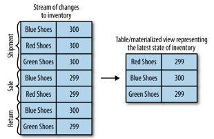

Time Windows

Most operations on streams are windowed operations—operating on slices of time:
moving averages, top products sold this week, 99th percentile load on the
system, etc. Join operations on two streams are also windowed—we join events
that occurred at the same slice of time. Very few people stop and think about
the type of window they want for their operations. For example, when calculating
moving averages, we want to know:

- Size of the window: do we want to calculate the average of all events in every
five- minute window? Every 15-minute window? Or the entire day? Larger windows
are smoother but they lag more—if price increases, it will take longer to notice
than with a smaller window.

- How often the window moves (advance interval): five-minute averages can update
every minute, second, or every time there is a new event. When the advance
interval is equal to the window size, this is sometimes called a tumbling
window. When the window moves on every record, this is sometimes called a
sliding window.

- How long the window remains updatable: our five-minute moving average calcu‐
lated the average for 00:00-00:05 window. Now an hour later, we are getting a
few more results with their event time showing 00:02. Do we update the result
for the 00:00-00:05 period? Or do we let bygones be bygones? Ideally, we’ll be
able to define a certain time period during which events will get added to their
respec‐ tive time-slice. For example, if the events were up to four hours late,
we should recalculate the results and update. If events arrive later than that,
we can ignore them.

Windows can be aligned to clock time—i.e., a five-minute window that moves every
minute will have the first slice as 00:00-00:05 and the second as 00:01-00:06.
Or it can be unaligned and simply start whenever the app started and then the
first slice can be 03:17-03:22. Sliding windows are never aligned because they
move whenever there is a new record. See Figure 11-2 for the difference between
two types of these windows.

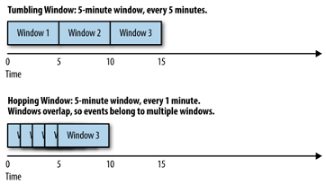

Stream-Processing Design Patterns

Every stream-processing system is different—from the basic combination of a con‐
sumer, processing logic, and producer to involved clusters like Spark Streaming
with its machine learning libraries, and much in between. But there are some
basic design patterns, which are known solutions to common requirements of
stream-processing architectures. We’ll review a few of those well-known patterns
and show how they are used with a few examples.

Single-Event Processing

The most basic pattern of stream processing is the processing of each event in
isola‐ tion. This is also known as a map/filter pattern because it is commonly
used to filter unnecessary events from the stream or transform each event. (The
term “map” is based on the map/reduce pattern in which the map stage transforms
events and the reduce stage aggregates them.)

In this pattern, the stream-processing app consumes events from the stream,
modifies each event, and then produces the events to another stream. An example
is an app that reads log messages from a stream and writes ERROR events into a
high-priority stream and the rest of the events into a low-priority stream.
Another example is an application that reads events from a stream and modifies
them from JSON to Avro. Such applications need to maintain state within the
application because each event can be handled independently. This means that
recovering from app failures or load- balancing is incredibly easy as there is
no need to recover state; you can simply hand off the events to another instance
of the app to process.

This pattern can be easily handled with a simple producer and consumer, as seen
in Figure 11-3.

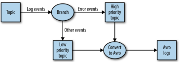

Processing with Local State

Most stream-processing applications are concerned with aggregating information,
especially time-window aggregation. An example of this is finding the minimum
and maximum stock prices for each day of trading and calculating a moving
average.

These aggregations require maintaining a state for the stream. In our example,
in order to calculate the minimum and average price each day, we need to store
the min‐ imum and maximum values we’ve seen up until the current time and
compare each new value in the stream to the stored minimum and maximum.

All these can be done using local state (rather than a shared state) because
each opera‐ tion in our example is a group by aggregate. That is, we perform the
aggregation per stock symbol, not on the entire stock market in general. We use
a Kafka partitioner to make sure that all events with the same stock symbol are
written to the same parti‐ tion. Then, each instance of the application will get
all the events from the partitions that are assigned to it (this is a Kafka
consumer guarantee). This means that each instance of the application can
maintain state for the subset of stock symbols that are written to the
partitions that are assigned to it. See Figure 11-4.

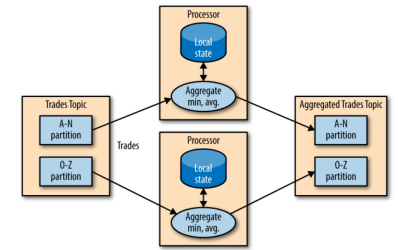

Stream-processing applications become significantly more complicated when the
application has local state and there are several issues a stream-processing
application must address:

- Memory usage: The local state must fit into the memory available to the
  application instance.

- Persistence: We need to make sure the state is not lost when an application
instance shuts down, and that the state can be recovered when the instance
starts again or is replaced by a different instance. This is something that
Kafka Streams handles very well—local state is stored in-memory using embedded
RocksDB, which also persists the data to disk for quick recovery after restarts.
But all the changes to the local state are also sent to a Kafka topic. If a
stream’s node goes down, the local state is not lost—it can be easily recreated
by rereading the events from the Kafka topic. For example, if the local state
contains “current minimum for IBM=167.19,” we store this in Kafka, so that later
we can repopulate the local cache from this data. Kafka uses log compaction for
these topics to make sure they don’t grow endlessly and that recreating the
state is always feasible.

- Rebalancing: Partitions sometimes get reassigned to a different consumer. When
this happens, the instance that loses the partition must store the last good
state, and the instance that receives the partition must know to recover the
correct state.

Stream-processing frameworks differ in how much they help the developer manage
the local state they need. If your application requires maintaining local state,
be sure to check the framework and its guarantees. We’ll include a short
comparison guide at the end of the chapter, but as we all know, software changes
quickly and stream- processing frameworks doubly so.

Multiphase Processing/Repartitioning

Local state is great if you need a group by type of aggregate. But what if you
need a result that uses all available information? For example, suppose we want
to publish the top 10 stocks each day—the 10 stocks that gained the most from
opening to clos‐ ing during each day of trading. Obviously, nothing we do
locally on each application instance is enough because all the top 10 stocks
could be in partitions assigned to other instances. What we need is a two-phase
approach. First, we calculate the daily gain/loss for each stock symbol. We can
do this on each instance with a local state. Then we write the results to a new
topic with a single partition. This partition will be read by a single
application instance that can then find the top 10 stocks for the day. The
second topic, which contains just the daily summary for each stock symbol, is
obviously much smaller with significantly less traffic than the topics that
contain the trades themselves, and therefore it can be processed by a single
instance of the appli‐ cation. Sometimes more steps are needed to produce the
result. See Figure 11-5.

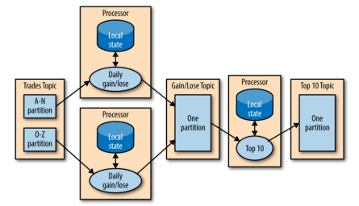

This type of multiphase processing is very familiar to those who write
map-reduce code, where you often have to resort to multiple reduce phases. If
you’ve ever written map-reduce code, you’ll remember that you needed a separate
app for each reduce step. Unlike MapReduce, most stream-processing frameworks
allow including all steps in a single app, with the framework handling the
details of which application instance (or worker) will run reach step.

Processing with External Lookup: Stream-Table Join

Sometimes stream processing requires integration with data external to the
stream— validating transactions against a set of rules stored in a database, or
enriching click‐ stream information with data about the users who clicked.

The obvious idea on how to perform an external lookup for data enrichment is
some‐ thing like this: for every click event in the stream, look up the user in
the profile data‐ base and write an event that includes the original click plus
the user age and gender to another topic. See Figure 11-6.

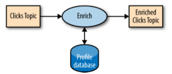

The problem with this obvious idea is that an external lookup adds significant
latency to the processing of every record—usually between 5-15 milliseconds. In
many cases, this is not feasible. Often the additional load this places on the
external datastore is also not acceptable—stream-processing systems can often
handle 100K-500K events per second, but the database can only handle perhaps 10K
events per second at rea‐ sonable performance. We want a solution that scales
better.

In order to get good performance and scale, we need to cache the information
from the database in our stream-processing application. Managing this cache can
be chal‐ lenging though—how do we prevent the information in the cache from
getting stale? If we refresh events too often, we are still hammering the
database and the cache isn’t helping much. If we wait too long to get new
events, we are doing stream processing with stale information.

But if we can capture all the changes that happen to the database table in a
stream of events, we can have our stream-processing job listen to this stream
and update the cache based on database change events. Capturing changes to the
database as events in a stream is known as CDC, and if you use Kafka Connect you
will find multiple connectors capable of performing CDC and converting database
tables to a stream of change events. This allows you to keep your own private
copy of the table, and you will be notified whenever there is a database change
event so you can update your own copy accordingly. See Figure 11-7.

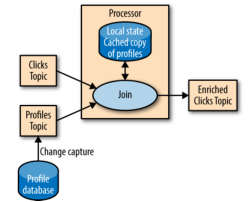

Then, when you get click events, you can look up the user_id at your local cache
and enrich the event. And because you are using a local cache, this scales a lot
better and will not affect the database and other apps using it. We refer to
this as a stream-table join because one of the streams represents changes to a
locally cached table.

Streaming Join

Sometimes you want to join two real event streams rather than a stream with a
table. What makes a stream “real”? If you recall the discussion at the beginning
of the chap‐ ter, streams are unbounded. When you use a stream to represent a
table, you can ignore most of the history in the stream because you only care
about the current state in the table. But when you join two streams, you are
joining the entire history, trying to match events in one stream with events in
the other stream that have the same key and happened in the same time-windows.
This is why a streaming-join is also called a windowed-join.

For example, let’s say that we have one stream with search queries that people
entered into our website and another stream with clicks, which include clicks on
search results. We want to match search queries with the results they clicked on
so that we will know which result is most popular for which query. Obviously we
want to match results based on the search term but only match them within a
certain time-window. We assume the result is clicked seconds after the query was
entered into our search engine. So we keep a small, few-seconds-long window on
each stream and match the results from each window. See Figure 11-8.

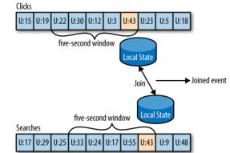

The way this works in Kafka Streams is that both streams, queries and clicks,
are par‐ titioned on the same keys, which are also the join keys. This way, all
the click events from user_id:42 end up in partition 5 of the clicks topic, and
all the search events for user_id:42 end up in partition 5 of the search topic.
Kafka Streams then makes sure that partition 5 of both topics is assigned to the
same task. So this task sees all the relevant events for user_id:42. It
maintains the join-window for both topics in its embedded RocksDB cache, and
this is how it can perform the join.

Out-of-Sequence Events

Handling events that arrive at the stream at the wrong time is a challenge not
just in stream processing but also in traditional ETL systems. Out-of-sequence
events hap‐ pen quite frequently and expectedly in IoT (Internet of Things)
scenarios (Figure 11-9). For example, a mobile device loses WiFi signal for a
few hours and sends a few hours’ worth of events when it reconnects. This also
happens when moni‐ toring network equipment (a faulty switch doesn’t send
diagnostics signals until it is repaired) or manufacturing (network connectivity
in plants is notoriously unreliable, especially in developing countries).

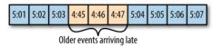

Our streams applications need to be able to handle those scenarios. This
typically means the application has to do the following:

- Recognize that an event is out of sequence—this requires that the application
examine the event time and discover that it is older than the current time.

- Define a time period during which it will attempt to reconcile out-of-sequence
events. Perhaps a three-hour delay should be reconciled and events over three
weeks old can be thrown away.

- Have an in-band capability to reconcile this event. This is the main
difference between streaming apps and batch jobs. If we have a daily batch job
and a few events arrived after the job completed, we can usually just rerun
yesterday’s job and update the events. With stream processing, there is no
“rerun yesterday’s job” —the same continuous process needs to handle both old
and new events at any given moment.

- Be able to update results. If the results of the stream processing are written
into a database, a put or update is enough to update the results. If the stream
app sends results by email, updates may be trickier.

Several stream-processing frameworks, including Google’s Dataflow and Kafka
Streams, have built-in support for the notion of event time independent of the
pro‐ cessing time and the ability to handle events with event times that are
older or newer than the current processing time. This is typically done by
maintaining multiple aggregation windows available for update in the local state
and giving developers the ability to configure how long to keep those window
aggregates available for updates. Of course, the longer the aggregation windows
are kept available for updates, the more memory is required to maintain the
local state.

The Kafka’s Streams API always writes aggregation results to result topics.
Those are usually compacted topics, which means that only the latest value for
each key is pre‐ served. In case the results of an aggregation window need to be
updated as a result of a late event, Kafka Streams will simply write a new
result for this aggregation window, which will overwrite the previous result.

Reprocessing

The last important pattern is processing events. There are two variants of this
pattern:

- We have an improved version of our stream-processing application. We want to
run the new version of the application on the same event stream as the old, pro‐
duce a new stream of results that does not replace the first version, compare
the results between the two versions, and at some point move clients to use the
new results instead of the existing ones.

- The existing stream-processing app is buggy. We fix the bug and we want to
reprocess the event stream and recalculate our results

The first use case is made simple by the fact that Apache Kafka stores the event
streams in their entirety for long periods of time in a scalable datastore. This
means that having two versions of a stream processing-application writing two
result streams only requires the following:

- Spinning up the new version of the application as a new consumer group

- Configuring the new version to start processing from the first offset of the
input topics (so it will get its own copy of all events in the input streams)

- Letting the new application continue processing and switching the client
applica‐ tions to the new result stream when the new version of the processing
job has caught up

The second use case is more challenging—it requires “resetting” an existing app
to start processing back at the beginning of the input streams, resetting the
local state (so we won’t mix results from the two versions of the app), and
possibly cleaning the previous output stream. While Kafka Streams has a tool for
resetting the state for a stream-processing app, our recommendation is to try to
use the first method when‐ ever sufficient capacity exists to run two copies of
the app and generate two result streams. The first method is much safer—it
allows switching back and forth between multiple versions and comparing results
between versions, and doesn’t risk losing critical data or introducing errors
during the cleanup process.

Kafka Streams by Example

In order to demonstrate how these patterns are implemented in practice, we’ll
show a few examples using Apache Kafka’s Streams API. We are using this specific
API because it is relatively simple to use and it ships with Apache Kafka, which
you already have access to. It is important to remember that the patterns can be
imple‐ mented in any stream-processing framework and library—the patterns are
universal but the examples are specific.

Apache Kafka has two streams APIs—a low-level Processor API and a high-level
Streams DSL. We will use Kafka Streams DSL in our examples. The DSL allows you
to define the stream-processing application by defining a chain of
transformations to events in the streams. Transformations can be as simple as a
filter or as complex as a stream-to-stream join. The lower level API allows you
to create your own transfor‐ mations, but as you’ll see, this is rarely
required.

An application that uses the DSL API always starts with using the StreamBuilder
to create a processing topology—a directed graph (DAG) of transformations that
are applied to the events in the streams. Then you create a KafkaStreams
execution object from the topology. Starting the KafkaStreams object will start
multiple threads, each applying the processing topology to events in the stream.
The processing will conclude when you close the KafkaStreams object.

We’ll look at few examples that use Kafka Streams to implement some of the
design patterns we just discussed. A simple word count example will be used to
demonstrate the map/filter pattern and simple aggregates. Then we’ll move to an
example where we calculate different statistics on stock market trades, which
will allow us to demon‐ strate window aggregations. Finally we’ll use
ClickStream Enrichment as an example to demonstrate streaming joins.

Word Count

Let’s walk through an abbreviated word count example for Kafka Streams. You can
find the full example on
[GitHub](https://github.com/gwenshap/kafka-streams-wordcount).

The first thing you do when creating a stream-processing app is configure Kafka
Streams. Kafka Streams has a large number of possible configurations, which we
won’t discuss here, but you can find them in the
[documentation](https://kafka.apache.org/documentation/#streamsconfigs). In
addition, you can also configure the producer and consumer embedded in Kafka
Streams by adding any producer or consumer config to the Properties object:

public class WordCountExample { public static void main(String[] args) throws
Exception{ Properties props = new Properties();
props.put(StreamsConfig.APPLICATION_ID_CONFIG, "wordcount"); 1
props.put(StreamsConfig.BOOTSTRAP_SERVERS_CONFIG, "localhost:9092"); 3
props.put(StreamsConfig.KEY_SERDE_CLASS_CONFIG,
Serdes.String().getClass().getName()); 3
props.put(StreamsConfig.VALUE_SERDE_CLASS_CONFIG,
Serdes.String().getClass().getName());

1 Every Kafka Streams application must have an application ID. This is used to
coordinate the instances of the application and also when naming the internal
local stores and the topics related to them. This name must be unique for each
Kafka Streams application working with the same Kafka cluster.

2 The Kafka Streams application always reads data from Kafka topics and writes
its output to Kafka topics. As we’ll discuss later, Kafka Streams applications
also use Kafka for coordination. So we had better tell our app where to find
Kafka.

3 When reading and writing data, our app will need to serialize and deserialize,
so we provide default Serde classes. If needed, we can override these defaults
later when building the streams topology.

Now that we have the configuration, let’s build our streams topology:

KStreamBuilder builder = new KStreamBuilder(); 1 KStream<String, String> source
= builder.stream("wordcount-input"); final Pattern pattern =
Pattern.compile("\\W+"); KStream counts = source.flatMapValues(value->
Arrays.asList(pattern.split(value.toLowerCase()))) 2 .map((key, value) -> new
KeyValue<Object, Object>(value, value)) .filter((key, value) ->
(!value.equals("the"))) 3 .groupByKey() 4 .count("CountStore").mapValues(value->
Long.toString(value)).toStream(); 5 counts.to("wordcount-output") 6

1 We create a KStreamBuilder object and start defining a stream by pointing at
the topic we’ll use as our input.

2 Each event we read from the source topic is a line of words; we split it up
using a regular expression into a series of individual words. Then we take each
word (currently a value of the event record) and put it in the event record key
so it can be used in a group-by operation.

3 We filter out the word “the,” just to show how easy filtering is.

4 And we group by key, so we now have a collection of events for each unique
word.

5 We count how many events we have in each collection. The result of counting is
a Long data type. We convert it to a String so it will be easier for humans to
read the results.

6 Only one thing left–write the results back to Kafka.

Now that we have defined the flow of transformations that our application will
run, we just need to… run it:

KafkaStreams streams = new KafkaStreams(builder, props); 1 streams.start(); 2 //
usually the stream application would be running forever, // in this example we
just let it run for some time and stop since the input data is finite.
Thread.sleep(5000L); streams.close(); 3 } }

1 Define a KafkaStreams object based on our topology and the properties we
defined.

2 Start Kafka Streams. 3 After a while, stop it.

Thats it! In just a few short lines, we demonstrated how easy it is to implement
a sin‐ gle event processing pattern (we applied a map and a filter on the
events). We reparti‐ tioned the data by adding a group-by operator and then
maintained simple local state when we counted the number of records that have
each word as a key. Then we main‐ tained simple local state when we counted the
number of times each word appeared.

At this point, we recommend running the full example. The [README in the GitHub
repository](https://github.com/gwenshap/kafka-streams-wordcount/blob/master/README.md)
contains instructions on how to run the example.

One thing you’ll notice is that you can run the entire example on your machine
without installing anything except Apache Kafka. This is similar to the
experience you may have seen when using Spark in something like Local Mode. The
main differ‐ ence is that if your input topic contains multiple partitions, you
can run multiple instances of the WordCount application (just run the app in
several different terminal tabs) and you have your first Kafka Streams
processing cluster. The instances of the WordCount application talk to each
other and coordinate the work. One of the biggest barriers to entry with Spark
is that local mode is very easy to use, but then to run a production cluster,
you need to install YARN or Mesos and then install Spark on all those machines,
and then learn how to submit your app to the cluster. With the Kaf‐ ka’s Streams
API, you just start multiple instances of your app—and you have a clus‐ ter. The
exact same app is running on your development machine and in production.

Stock Market Statistics

The next example is more involved—we will read a stream of stock market trading
events that include the stock ticker, ask price, and ask size. In stock market
trades, ask price is what a seller is asking for whereas bid price is what the
buyer is suggesting to pay. Ask size is the number of shares the seller is
willing to sell at that price. For sim‐ plicity of the example, we’ll ignore
bids completely. We also won’t include a time‐ stamp in our data; instead, we’ll
rely on event time populated by our Kafka producer.

We will then create output streams that contains a few windowed statistics:

- Best (i.e., minimum) ask price for every five-second window
- Number of trades for every five-second window
- Average ask price for every five-second window

All statistics will be updated every second.

For simplicity, we’ll assume our exchange only has 10 stock tickers trading in
it. The setup and configuration are very similar to those we used in the “Word
Count” on page 265:

Properties props = new Properties();
props.put(StreamsConfig.APPLICATION_ID_CONFIG, "stockstat");
props.put(StreamsConfig.BOOTSTRAP_SERVERS_CONFIG, Constants.BROKER);
props.put(StreamsConfig.KEY_SERDE_CLASS_CONFIG,
Serdes.String().getClass().getName());
props.put(StreamsConfig.VALUE_SERDE_CLASS_CONFIG, TradeSerde.class.getName());

The main difference is the Serde classes used. In the “Word Count” on page 265,
we used strings for both key and value and therefore used the Serdes.String()
class as a serializer and deserializer for both. In this example, the key is
still a string, but the value is a Trade object that contains the ticker symbol,
ask price, and ask size. In order to serialize and deserialize this object (and
a few other objects we used in this small app), we used the Gson library from
Google to generate a JSon serializer and deserializer from our Java object. Then
created a small wrapper that created a Serde object from those. Here is how we
created the Serde:

static public final class TradeSerde extends WrapperSerde<Trade> { public
TradeSerde() { super(new JsonSerializer<Trade>(), new
JsonDeserializer<Trade>(Trade.class)); } }

Nothing fancy, but you need to remember to provide a Serde object for every
object you want to store in Kafka—input, output, and in some cases, also
intermediate results. To make this easier, we recommend generating these Serdes
through projects like GSon, Avro, Protobufs, or similar.

Now that we have everything configured, it’s time to build our topology:

KStream<TickerWindow, TradeStats> stats = source.groupByKey() 1
.aggregate(TradeStats::new, 2 (k, v, tradestats) -> tradestats.add(v), 3
TimeWindows.of(5000).advanceBy(1000), 4 new TradeStatsSerde(), 5
"trade-stats-store") 6 .toStream((key, value) -> new TickerWindow(key.key(),
key.window().start())) 7 .mapValues((trade) -> trade.computeAvgPrice()); 8
stats.to(new TickerWindowSerde(), new TradeStatsSerde(), "stockstats-output"); 9

1 We start by reading events from the input topic and performing a groupByKey()
operation. Despite its name, this operation does not do any grouping. Rather, it
ensures that the stream of events is partitioned based on the record key. Since
we wrote the data into a topic with a key and didn’t modify the key before
calling groupByKey(), the data is still partitioned by its key—so this method
does noth‐ ing in this case.

2 After we ensure correct partitioning, we start the windowed aggregation. The
“aggregate” method will split the stream into overlapping windows (a five-second
window every second), and then apply an aggregate method on all the events in
the window. The first parameter this method takes is a new object that will con‐
tain the results of the aggregation—Tradestats in our case. This is an object we
created to contain all the statistics we are interested in for each time window—
minimum price, average price, and number of trades.

3 We then supply a method for actually aggregating the records—in this case, an
add method of the Tradestats object is used to update the minimum price, num‐
ber of trades, and total prices in the window with the new record.

4 We define the window—in this case, a window of five seconds (5,000 ms),
advancing every second.

5 Then we provide a Serde object for serializing and deserializing the results
of the aggregation (the Tradestats object).

6 As mentioned in “Stream-Processing Design Patterns” on page 256, windowing
aggregation requires maintaining a state and a local store in which the state
will be maintained. The last parameter of the aggregate method is the name of
the state store. This can be any unique name.

7 The results of the aggregation is a table with the ticker and the time window
as the primary key and the aggregation result as the value. We are turning the
table back into a stream of events and replacing the key that contains the
entire time window definition with our own key that contains just the ticker and
the start time of the window. This toStream method converts the table into a
stream and also converts the key into my TickerWindow object.

8 The last step is to update the average price—right now the aggregation results
include the sum of prices and number of trades. We go over these records and use
the existing statistics to calculate average price so we can include it in the
out‐ put stream.

9 And finally, we write the results back to the stockstats-output stream.

After we define the flow, we use it to generate a KafkaStreams object and run
it, just like we did in the “Word Count” on page 265.

This example shows how to perform windowed aggregation on a stream—probably the
most popular use case of stream processing. One thing to notice is how little
work was needed to maintain the local state of the aggregation—just provide a
Serde and name the state store. Yet this application will scale to multiple
instances and automat‐ ically recover from a failure of each instance by
shifting processing of some partitions to one of the surviving instances. We
will see more on how it is done in “Kafka Streams: Architecture Overview” on
page 272.

As usual, you can find the complete example including instructions for running
it on [GitHub](https://github.com/gwenshap/kafka-streams-stockstats).

Click Stream Enrichment

The last example will demonstrate streaming joins by enriching a stream of
clicks on a website. We will generate a stream of simulated clicks, a stream of
updates to a fic‐ tional profile database table, and a stream of web searches.
We will then join all three streams to get a 360-view into each user activity.
What did the users search for? What did they click as a result? Did they change
their “interests” in their user profile? These kinds of joins provide a rich
data collection for analytics. Product recommendations are often based on this
kind of information—user searched for bikes, clicked on links for “Trek,” and is
interested in travel, so we can advertise bikes from Trek, helmets, and bike
tours to exotic locations like Nebraska.

Since configuring the app is similar to the previous examples, let’s skip this
part and take a look at the topology for joining multiple streams:

KStream<Integer, PageView> views = builder.stream(Serdes.Integer(), new
PageViewSerde(), Constants.PAGE_VIEW_TOPIC); 1 KStream<Integer, Search> searches
= builder.stream(Serdes.Integer(), new SearchSerde(), Constants.SEARCH_TOPIC);
KTable<Integer, UserProfile> profiles = builder.table(Serdes.Integer(), new
ProfileSerde(), Constants.USER_PROFILE_TOPIC, "profile-store"); 2
KStream<Integer, UserActivity> viewsWithProfile = views.leftJoin(profiles, 3
(page, profile) -> new UserActivity(profile.getUserID(), profile.getUserName(),
profile.getZipcode(), profile.getInterests(), "", page.getPage())); 4
KStream<Integer, UserActivity> userActivityKStream =
viewsWithProfile.leftJoin(searches, 5 (userActivity, search) ->
userActivity.updateSearch(search.getSearchTerms()), 6 JoinWindows.of(1000),
Serdes.Integer(), new UserActivitySerde(), new SearchSerde()); 7

1 First, we create a streams objects for the two streams we want to join—clicks
and searches.

2 We also define a KTable for the user profiles. A KTable is a local cache that
is updated through a stream of changes.

3 Then we enrich the stream of clicks with user-profile information by joining
the stream of events with the profile table. In a stream-table join, each event
in the stream receives information from the cached copy of the profile table. We
are doing a left-join, so clicks without a known user will be preserved.

4 This is the join method—it takes two values, one from the stream and one from
the record, and returns a third value. Unlike in databases, you get to decide
how to combine the two values into one result. In this case, we created one
activity object that contains both the user details and the page viewed.

5 Next, we want to join the click information with searches performed by the
same user. This is still a left join, but now we are joining two streams, not
streaming to a table.

6 This is the join method—we simply add the search terms to all the matching
page views.

7 This is the interesting part—a stream-to-stream join is a join with a time
window. Joining all clicks and searches for each user doesn’t make much sense—we
want to join each search with clicks that are related to it—that is, click that
occurred a short period of time after the search. So we define a join window of
one second. Clicks that happen within one second of the search are considered
relevant, and the search terms will be included in the activity record that
contains the click and the user profile. This will allow a full analysis of
searches and their results.

After we define the flow, we use it to generate a KafkaStreams object and run
it, just like we did in the “Word Count” on page 265. This example shows two
different join patterns possible in stream processing. One joins a stream with a
table to enrich all streaming events with information in the table. This is
similar to joining a fact table with a dimension when running queries on a data
warehouse. The second example joins two streams based on a time window. This
operation is unique to stream processing. As usual, you can find the complete
example including instructions for running it on
[GitHub](https://github.com/gwenshap/kafka-clickstream-enrich/tree/master)

Kafka Streams: Architecture Overview

The examples in the previous section demonstrated how to use the Kafka Streams
API to implement a few well-known stream-processing design patterns. But to
understand better how Kafka’s Streams library actually works and scales, we need
to peek under the covers and understand some of the design principles behind the
API

Building a Topology

Every streams application implements and executes at least one topology.
Topology (also called DAG, or directed acyclic graph, in other stream-processing
frameworks) is a set of operations and transitions that every event moves
through from input to output. Figure 11-10 shows the topology in the “Word
Count” on page 265

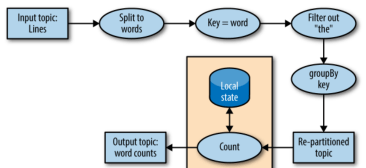

Even a simple app has a nontrivial topology. The topology is made up of
processors— those are the nodes in the topology graph (represented by circles in
our diagram). Most processors implement an operation of the data—filter, map,
aggregate, etc. There are also source processors, which consume data from a
topic and pass it on, and sink processors, which take data from earlier
processors and produce it to a topic. A topology always starts with one or more
source processors and finishes with one or more sink processors.

Scaling the Topology

Kafka Streams scales by allowing multiple threads of executions within one
instance of the application and by supporting load balancing between distributed
instances of the application. You can run the Streams application on one machine
with multiple threads or on multiple machines; in either case, all active
threads in the application will balance the work involved in data processing.
The Streams engine parallelizes execution of a topology by splitting it into
tasks. The number of tasks is determined by the Streams engine and depends on
the number of partitions in the topics that the application processes. Each task
is responsible for a subset of the partitions: the task will subscribe to those
partitions and consume events from them. For every event it consumes, the task
will execute all the processing steps that apply to this partition in order
before eventually writing the result to the sink. Those tasks are the basic unit
of parallelism in Kafka Streams, because each task can execute independently of
others. See Figure 11-11.

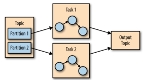

The developer of the application can choose the number of threads each
application instance will execute. If multiple threads are available, every
thread will execute a subset of the tasks that the application creates. If
multiple instances of the application are running on multiple servers, different
tasks will execute for each thread on each server. This is the way streaming
applications scale: you will have as many tasks as you have partitions in the
topics you are processing. If you want to process faster, add more threads. If
you run out of resources on the server, start another instance of the
application on another server. Kafka will automatically coordinate work—it will
assign each task its own subset of partitions and each task will independently
process events from those partitions and maintain its own local state with
relevant aggregates if the topology requires this. See Figure 11-12.

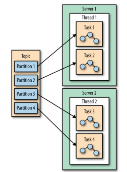

You may have noticed that sometimes a processing step may require results from
multiple partitions, which could create dependencies between tasks. For example,
if we join two streams, as we did in the ClickStream example in “Click Stream
Enrich‐ ment” on page 270, we need data from a partition in each stream before
we can emit a result. Kafka Streams handles this situation by assigning all the
partitions needed for one join to the same task so that the task can consume
from all the relevant partitions and perform the join independently. This is why
Kafka Streams currently requires that all topics that participate in a join
operation will have the same number of parti‐ tions and be partitioned based on
the join key.

Another example of dependencies between tasks is when our application requires
repartitioning. For instance, in the ClickStream example, all our events are
keyed by the user ID. But what if we want to generate statistics per page? Or
per zip code? We’ll need to repartition the data by the zip code and run an
aggregation of the data with the new partitions. If task 1 processes the data
from partition 1 and reaches a pro‐ cessor that repartitions the data (groupBy
operation), it will need to shuffle, which means sending them the events—send
events to other tasks to process them. Unlike other stream processor frameworks,
Kafka Streams repartitions by writing the events to a new topic with new keys
and partitions. Then another set of tasks reads events from the new topic and
continues processing. The repartitioning steps break our top‐ ology into two
subtopologies, each with its own tasks. The second set of tasks depends on the
first, because it processes the results of the first subtopology. How‐ ever, the
first and second sets of tasks can still run independently and in parallel
because the first set of tasks writes data into a topic at its own rate and the
second set consumes from the topic and processes the events on its own. There is
no communi‐ cation and no shared resources between the tasks and they don’t need
to run on the same threads or servers. This is one of the more useful things
Kafka does—reduce dependencies between different parts of a pipeline. See Figure
11-13.

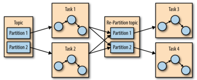

Surviving Failures

The same model that allows us to scale our application also allows us to
gracefully handle failures. First, Kafka is highly available, and therefore the
data we persist to Kafka is also highly available. So if the application fails
and needs to restart, it can look up its last position in the stream from Kafka
and continue its processing from the last offset it committed before failing.
Note that if the local state store is lost (e.g., because we needed to replace
the server it was stored on), the streams application can always re-create it
from the change log it stores in Kafka.

Kafka Streams also leverages Kafka’s consumer coordination to provide high
availa‐ bility for tasks. If a task failed but there are threads or other
instances of the streams application that are active, the task will restart on
one of the available threads. This is similar to how consumer groups handle the
failure of one of the consumers in the group by assigning partitions to one of
the remaining consumers.

Stream Processing Use Cases

Throughout this chapter we’ve learned how to do stream processing—from general
concepts and patterns to specific examples in Kafka Streams. At this point it
may be worth looking at the common stream processing use cases. As explained in
the begin‐ ning of the chapter, stream processing—or continuous processing—is
useful in cases where you want your events to be processed in quick order rather
than wait for hours until the next batch, but also where you are not expecting a
response to arrive in milliseconds. This is all true but also very abstract.
Let’s look at a few real scenarios that can be solved with stream processing:

- Customer Service: Suppose that you just reserved a room at a large hotel chain
and you expect an email confirmation and receipt. A few minutes after reserving,
when the confir‐ mation still hasn’t arrived, you call customer service to
confirm your reservation. Suppose the customer service desk tells you “I don’t
see the order in our system, but the batch job that loads the data from the
reservation system to the hotels and the customer service desk only runs once a
day, so please call back tomorrow. You should see the email within 2-3 business
days.” This doesn’t sound like very good service, yet I’ve had this conversation
more than once with a large hotel chain. What we really want is every system in
the hotel chain to get an update about a new reservations seconds or minutes
after the reservation is made, including the customer service center, the hotel,
the system that sends email con‐ firmations, the website, etc. You also want the
customer service center to be able to immediately pull up all the details about
any of your past visits to any of the hotels in the chain, and the reception
desk at the hotel to know that you are a loyal customer so they can give you an
upgrade. Building all those systems using stream-processing applications allows
them to receive and process updates in near real time, which makes for a better
customer experience. With such a sys‐ tem, I’d receive a confirmation email
within minutes, my credit card would be charged on time, the receipt would be
sent, and the service desk could immedi‐ ately answer my questions regarding the
reservation.

- Internet of Things: Internet of Things can mean many things—from a home device
for adjusting temperature and ordering refills of laundry detergent to real-time
quality control of pharmaceutical manufacturing. A very common use case when
applying stream processing to sensors and devices is to try to predict when
preventive maintenance is needed. This is similar to application monitoring but
applied to hardware and is common in many industries, including manufacturing,
telecom‐ munications (identifying faulty cellphone towers), cable TV
(identifying faulty box-top devices before users complain), and many more. Every
case has its own pattern, but the goal is similar: process events arriving from
devices at a large scale and identify patterns that signal that a device
requires maintenance. These patterns can be dropped packets for a switch, more
force required to tighten screws in manufacturing, or users restarting the box
more frequently for cable TV.

  - Fraud Detection: Also known as anomaly detection, is a very wide field that
  focuses on catching “cheaters” or bad actors in the system. Examples of
  fraud-detection applications include detecting credit card fraud, stock trad‐
  ing fraud, video-game cheaters, and cybersecurity risks. In all these fields,
  there are large benefits to catching fraud as early as possible, so a near
  real- time system that is capable of responding to events quickly—perhaps
  stop‐ ping a bad transaction before it is even approved—is much preferred to a
  batch job that detects fraud three days after the fact when cleanup is much
  more complicated. This is again a problem of identifying patterns in a large-
  scale stream of events.

In cyber security, there is a method known as beaconing. When the hacker plants
mal‐ ware inside the organization, it will occasionally reach outside to receive
commands. It can be difficult to detect this activity since it can happen at any
time and any fre‐ quency. Typically, networks are well defended against external
attacks but more vul‐ nerable to someone inside the organization reaching out.
By processing the large stream of network connection events and recognizing a
pattern of communication as abnormal (for example, detecting that this host
typically doesn’t access those specific IPs), the security organization can be
alerted early, before more harm is done.

How to Choose a Stream-Processing Framework

When choosing a stream-processing framework, it is important to consider the
type of application you are planning on writing. Different types of applications
call for dif‐ ferent stream-processing solutions:

- Ingest: Where the goal is to get data from one system to another, with some
modifica‐ tion to the data on how it will make it conform to the target system.

- Low milliseconds actions: Any application that requires almost immediate
response. Some fraud detection use cases fall within this bucket.

- Asynchronous microservices: These microservices perform a simple action on
behalf of a larger business pro‐ cess, such as updating the inventory of a
store. These applications may need to maintain a local state caching events as a
way to improve performance.

- Near real-time data analytics: These streaming applications perform complex
aggregations and joins in order to slice and dice the data and generate
interesting business-relevant insights.

The stream-processing system you will choose will depend a lot on the problem
you are solving.

- If you are trying to solve an ingest problem, you should reconsider whether
you want a stream processing system or a simpler ingest-focused system like
Kafka Connect. If you are sure you want a stream processing system, you need to
make sure it has both a good selection of connectors and high-quality connectors
for the systems you are targeting.

- If you are trying to solve a problem that requires low milliseconds actions,
you should also reconsider your choice of streams. Request-response patterns are
often better suited to this task. If you are sure you want a stream-processing
sys‐ tem, then you need to opt for one that supports an event-by-event
low-latency model rather than one that focuses on microbatches.

- If you are building asynchronous microservices, you need a stream processing
system that integrates well with your message bus of choice (Kafka, hopefully),
has change capture capabilities that easily deliver upstream changes to the
micro‐ service local caches, and has the good support of a local store that can
serve as a cache or materialized view of the microservice data.

- If you are building a complex analytics engine, you also need a
stream-processing system with great support for a local store—this time, not for
maintenance of local caches and materialized views but rather to support
advanced aggregations, windows, and joins that are otherwise difficult to
implement. The APIs should include support for custom aggregations, window
operations, and multiple join types.

In addition to use-case specific considerations, there are a few global
considerations you should take into account:

- Operability of the system: Is it easy to deploy to production? Is it easy to
monitor and troubleshoot? Is it easy to scale up and down when needed? Does it
integrate well with your existing infrastructure? What if there is a mistake and
you need to reprocess data?

- Usability of APIs and ease of debugging: I’ve seen orders of magnitude
differences in the time it takes to write a high- quality application among
different versions of the same framework. Develop‐ ment time and time-to-market
is important so you need to choose a system that makes you efficient.

- Makes hard things easy: Almost every system will claim they can do advanced
windowed aggregations and maintain local caches, but the question is: do they
make it easy for you? Do they handle gritty details around scale and recovery,
or do they supply leaky abstractions and make you handle most of the mess? The
more a system exposes clean APIs and abstractions and handles the gritty details
on its own, the more productive developers will be.

- Community: Most stream processing applications you consider are going to be
open source, and there’s no replacement for a vibrant and active community. Good
commu‐ nity means you get new and exciting features on a regular basis, the
quality is rel‐ atively good (no one wants to work on bad software), bugs get
fixed quickly, and user questions get answers in timely manner. It also means
that if you get a strange error and Google it, you will find information about
it because other peo‐ ple are using this system and seeing the same issues.

Summary

We started the chapter by explaining stream processing. We gave a formal
definition and discussed the common attributes of the stream-processing
paradigm. We also compared it to other programming paradigms. We then discussed
important stream-processing concepts. Those concepts were demonstrated with
three example applications written with Kafka Streams. After going over all the
details of these example applications, we gave an overview of the Kafka Streams
architecture and explained how it works under the covers. We conclude the
chapter, and the book, with several examples of stream-processing use cases and
advice on how to compare different stream-processing frameworks